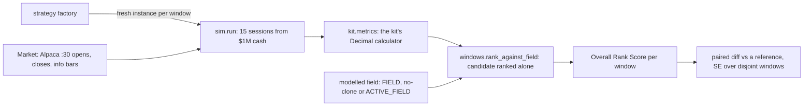
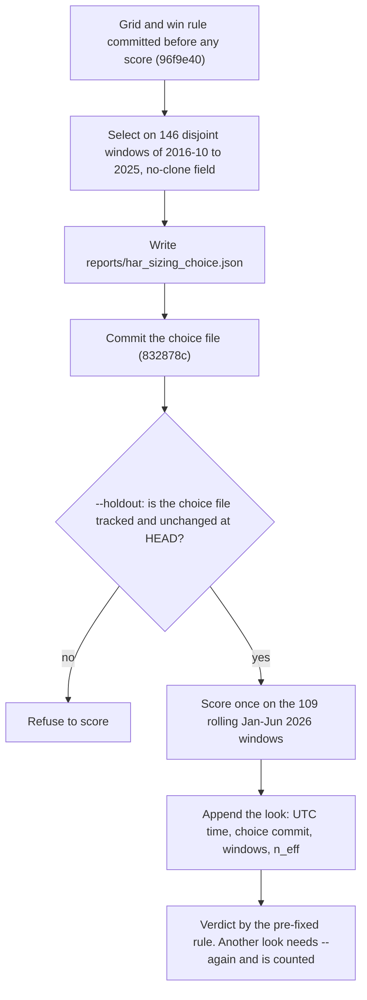

# The task, the score and how we evaluate

> Snapshot 2026-10-10, main @ 81dcfb5. The evaluation code last changed on 2026-10-06 (06ec297) and is stable for Official (Oct 12-30), but no receipt in the repo yet confirms the backend's fee sizing or its round-1 fill price.

The contest asks an agent for long-only target weights over 30 fixed US large caps at 7
deadlines a trading day, and ranks every team on the mean of four per-metric ranks
(cumulative return, Sharpe, max drawdown, turnover) over one 15-session window started
from $1M in cash. Two of those metrics reward doing nothing, and the rival field is
invisible, so this repo scores every idea the same way. Each idea gets a fresh $1M in many
15-session windows, filled at the organizers' own vendor's prices (Alpaca :30 opens),
scored by the kit's own Decimal calculator, ranked alone against a modelled field and
compared with a reference, paired by window. On that yardstick an inverse-vol hold at 75%
gross is the entrant to beat: a mean score of 2.71 (SE 0.05) over 170 windows of
2016-2026, against 2.84 for cash and 3.03 for the same hold at 100% (README "Baselines vs
the field"). Every rule tested that trades after entry lost to it (commit 43b9e75;
`v3_desk_plan.md`), and settings are chosen on 2016-2025 and committed by hash before one
recorded look at Jan-Jun 2026 (`reports/har_sizing_holdout.json`,
`reports/trim_holdout.json`). For the paper, most constants here are contest rules you can
drop, while the point-in-time simulator, kit-parity scoring, fresh-from-cash windows,
paired comparisons and commit-before-look discipline are worth keeping.

Related docs: data sources and vendor parity in [01_data_streams.md](01_data_streams.md),
the quant race and the rule desk in [04_ou_process_and_quant_signals.md](04_ou_process_and_quant_signals.md),
stage 1 in [09_stage1_doe.md](09_stage1_doe.md), and the scorer Space, leaderboard and
live runner in [11_systems_infrastructure.md](11_systems_infrastructure.md).

## 1. The contest as defined

Unless a line cites something else, this section comes from the organizers' starter kit,
vendored verbatim in [starter-kit/](../starter-kit/) from
DeepIntoStreams/2026ICAIF_Trading_Agent_Competition at upstream `ad237b0` (README, intro).
The kit is never edited here. Codabench competition 99. Our live runner uploads through the
kit's own client ([11_systems_infrastructure.md](11_systems_infrastructure.md)).

| Item | Rule | Source |
| --- | --- | --- |
| Universe | 30 US large caps, 5 in each of 6 groups. Every decision names all 30, zeros included | `starter-kit/universe.json`, `docs/rules.md` |
| Capital | $1,000,000 cash. Validation and Official are independent accounts | `docs/rules.md` |
| Rounds | 7 per trading day. Deadlines 09:10, 10:25, 11:25 ... 15:25 ET. Execution at the 09:30, 10:30 ... 15:30 opens | `competition.json`, `docs/rules.md` |
| Weights | Target weights, not orders. Each a finite JSON number in [0, 0.30]. Sum at most 1 (backend tolerance 1e-10). The rest is cash. Long-only, no leverage, fractional shares allowed | `docs/rules.md`, `kit/contracts.py`, `schemas/decision.schema.json` |
| Fee | 0.1% of buy-plus-sell notional on every rebalance, the initial buy from cash included | `docs/rules.md` |
| Missing or invalid | The round holds: no rebalance, no fee, existing holdings kept. A valid all-zero decision liquidates to cash | `docs/rules.md` |
| Slots | The earliest attributable in-window upload consumes the round, even if invalid. A later upload cannot replace it | `docs/rules.md`, `docs/guide.md` |
| Carry | The book carries between rounds and overnight. No forced liquidation at the end | `docs/rules.md` |
| Score | Mean of four per-metric ranks across teams, lower is better (section 2) | `docs/evaluation.md`, `kit/evaluation.py` |

**The 30 names** (`starter-kit/universe.json`; `data.load_universe` reads this file rather
than a copy). The rules say the groups organize the list and impose no quotas.

| Group | Tickers |
| --- | --- |
| Technology | AAPL, MSFT, NVDA, INTC, CRM |
| Finance | JPM, BAC, GS, V, PYPL |
| Healthcare | LLY, JNJ, UNH, PFE, TMO |
| Consumer | AMZN, TSLA, WMT, NKE, KO |
| Industrial & Energy | CAT, GE, BA, XOM, CVX |
| Communication & Utilities | GOOGL, META, DIS, T, NEE |

**The daily schedule** (`docs/rules.md`; IST from README "Dates", IST = ET + 9:30 while US
clocks are on EDT, which covers all of Official):

| Round | Window opens (ET) | Deadline (ET) | Executes at (ET) | Deadline (IST) |
| --- | --- | --- | --- | --- |
| 1 | prior trading day's last execution + 10 min, normally 15:40 | 09:10 | 09:30 open | 18:40 |
| 2 | 09:40 | 10:25 | 10:30 open | 19:55 |
| 3 | 10:40 | 11:25 | 11:30 open | 20:55 |
| 4 | 11:40 | 12:25 | 12:30 open | 21:55 |
| 5 | 12:40 | 13:25 | 13:30 open | 22:55 |
| 6 | 13:40 | 14:25 | 14:30 open | 23:55 |
| 7 | 14:40 | 15:25 | 15:30 open | 00:55, next day |

The 16:00 close is a valuation, with no submission or rebalance. On an early-close day,
rounds that would execute at or after the adjusted close are cancelled, so a 13:00
half-day runs rounds 1-4 only (`calendar.rounds_for`). Official contains no half-day
(`sim.market_from_public_60m` docstring).

**Phases** (`competition.json`, `docs/rules.md`; round counts checked for this doc by
parsing `starter-kit/schedule.json`: 14 Validation and 105 Official rounds, 7 a day):

| Phase | Dates (ET) | Rounds | Notes |
| --- | --- | --- | --- |
| Registration | Sep 20 00:00 to Oct 12 00:00, exclusive | | Before Oct 8 00:00 to enter Validation too. The team ("HAR Working Agents") registered 2026-10-08 02:34 UTC, i.e. Oct 7 ET (owner's notes) |
| Validation | Oct 8-9 | 14 | Its own $1M. Metrics provisional, no effect on Official |
| Official | Oct 12-30 | 105 | 15 sessions, one window. Its entry is round 1 on Oct 12. Metrics stay server-gated until publication |
| Final materials | Oct 30 16:00 to Nov 3 23:59:00 ET, inclusive | 1 slot | Required for Official rank eligibility |
| Winners announced | Nov 10 | | `starter-kit/README.md` |

**Registration and the team token.** Registration uploads `register.json`. Its first
private receipt carries a `team_id` and a one-time team token, which the kit saves to
`starter-kit/.icaif/credentials.json` with mode 0600 (`starter-kit/README.md`,
`docs/automatic_submission.md`). The token is never reset: if it is lost, the organizer
retrieves the original through an audited process (`docs/guide.md`). Every
`decision.json` and the final submission carry both fields, so a real decision file is a
secret too. Your personal `CODABENCH_TOKEN` is a different credential, for the platform.
This repo never commits, prints or logs either (CLAUDE.md "Credentials and network").

**The decision file.** `decision.json` has exactly `submission_type`, `team_id`,
`team_token`, `phase`, `round_id` (for example `official-2026-10-12-r1`) and `weights`
(`kit/contracts.py` `FIELDS`). `contracts._weights` parses each weight as
`Decimal(str(w))`, requires `0 <= w <= 0.30`, and a total of at most `1 + 1e-10`. NaN,
strings, booleans and duplicate JSON keys are rejected, and a local size cap of 120,000
bytes applies. The kit exposes only your own team's state: the schedule (public) and
`/api/v1/me/` portfolio, decisions, rounds, ledger and metrics (`kit/original_client.py`).
No endpoint shows other teams. Official metrics stay gated until organizer publication,
while your own cash, NAV and ledger stay readable (`starter-kit/README.md`).

**LLMs and external data** (`docs/llm_and_external_data.md`).

- LLM use is optional. An agent that uses one must use a listed model. Open-weight: Llama 4,
  Qwen3, DeepSeek-V3 / DeepSeek-R1, Gemma 3, Mistral Large. Hosted: OpenAI GPT-5 /
  GPT-5-mini, Anthropic Claude Opus 5 / Sonnet 5 / Haiku 4.5, Google Gemini 2.5 Pro /
  Flash, xAI Grok 4. Final materials must disclose model name, version, provider,
  prompts, inference settings and API configuration.
- **Rulings.** On 2026-10-06 the organizers ruled Grok 4.7 out. Read strictly, "Grok 4"
  excludes 4.6 too, so `brains.make` refuses every Grok model, and the Grok answers cached
  in `output/agent` are research only ([icaif/agents/brains.py](../icaif/agents/brains.py)
  docstring; README "Models since 2026-10-06"). The repo's `brains.ALLOWED_MODELS` is
  `claude-opus-5`, `claude-sonnet-5`, `claude-haiku-4-5`, `gemini-2.5-pro` and
  `gemini-2.5-flash`, and the default is `gemini-2.5-pro`. Claude through Bedrock is
  refused for the team's AWS account (README), so `ClaudeBrain` calls Anthropic's API
  directly and `GeminiBrain` calls the Gemini API. Gemini 2.5's knowledge cutoff is
  January 2025 (brains.py, citing Google's model pages). That cutoff decides which
  windows an LLM desk can be judged on (section 5).
- External data must be free and public, and must have been available at or before the
  deadline it informs. Private, paid or proprietary feeds are banned. Yahoo Finance and
  SEC EDGAR are suggested sources, not a whitelist. Every source and access method must be
  documented.
- **No hand-edited weights.** README "Dates" says submission must be automated and the rules
  forbid hand-editing agent weights. The vendored kit docs do not say this in those words.
  The final materials must, however, let organizers rerun the exact command that
  generates a `decision.json` (`examples/final/README.md`), which a hand-edited weight
  could not satisfy.

**Final materials** (`docs/guide.md`, `examples/final/`). One `final_submission.json` with an
HTTPS shared-folder link and an exact list of 1-200 filenames. The earliest in-window
attempt uses the only slot, even if invalid. The package holds a demo video, complete
source, a locked environment, setup and run commands, model artifacts or retrieval
instructions, data-source records with their licenses, and a completed `disclosures.md`.
Organizers review the selected materials, freeze ranks, rerun the same submission, verify
the stored scores and then publish. For the paper's timeline: Official ends Oct 30 and the
contest's results come after review (winners Nov 10). Until then you can report your own
NAV path, but not your rank.

## 2. The score

`docs/evaluation.md` defines it, and [starter-kit/kit/evaluation.py](../starter-kit/kit/evaluation.py)
computes it in 40-digit Decimal arithmetic (`CALCULATION_VERSION =
'decision-period-sharpe1764-turnover-mean-shared-ties-decimal40-v2'`). Order the
non-cancelled rounds k = 1..K (K = 105 in Official). B_k is NAV just before round k
executes, and E_k is NAV at the end of its period, just before the next rebalance. So
E_k = B_(k+1), B_1 = 1,000,000, and E_K is the phase's final official close.

```
r_k = E_k / B_k - 1                        the round's fee is inside its own r_k

M1  return     = E_K / B_1 - 1                               higher is better
M2  Sharpe     = sqrt(1764) * mean(r) / sd(r)                higher is better
                 sd with K - 1; zero if K = 1 or sd = 0; sqrt(1764) = 42 = sqrt(252 x 7),
                 kept even when rounds are cancelled
M3  max DD     = max over m of (P_m - V_m) / P_m,  P_m = max(V_0..V_m)   lower is better
                 V = initial NAV, every period endpoint and every official daily close,
                 de-duplicated by timestamp; never the post-fee NAV of a trade
M4  turnover   = (1/K) * sum_k N_k / B_k,  N_k = buy + sell notional of round k
                 (the entry from cash included)                          lower is better

rank per metric across teams: equal values share the average of their ranks
Overall Rank Score = mean of the four ranks                               lower is better
ties on it break by higher M1, higher M2, lower M3, lower M4;
exact four-metric ties share a position (1, 1, 3)
```

In the repo, [icaif/kit.py](../icaif/kit.py) imports the kit's `contracts` and `evaluation`
rather than reimplementing them: `kit.metrics` calls `evaluation.calculate_metrics`, and
`kit.validate_weights` calls `contracts._weights`. A local copy of the formula would agree
with the backend until the day it didn't (kit.py docstring). `test_sim.py`'s
`test_the_kit_calculator_reproduces_its_own_published_example` pins the calculator to the
kit's own example. [icaif/ranking.py](../icaif/ranking.py) `rank_window` applies the
ranking rules to one window's field. The board code rounds metrics to 12 places before
ranking, so float dust cannot split a tie the kit's Decimals would call (`leaderboard.standings`;
`test_float_dust_does_not_split_a_tie_the_kits_decimals_would_call`). The repo's objective is
a strategy's mean Overall Rank Score across windows. It is deliberately not Sharpe: a
high-Sharpe strategy that churns can lose two of the four ranks to a buy-and-hold
(ranking.py docstring).

### What this score rewards

- **Doing nothing.** Cash has return 0, Sharpe 0 (zero variance), drawdown 0 and turnover
  0. It ties for first on drawdown and turnover in any field (README "Scoring shapes the
  strategy"). In a falling window it also beats every losing book on return and Sharpe,
  and wins outright. In the 170-window baseline study, equal weight lost money in 53
  windows, and cash placed first in 44 of those 53 but in only 1 of the other 117. Its
  mean score was 1.23 in falling windows and 3.57 in rising ones (computed for this doc
  from `reports/baselines_windows.csv`, the 8-strategy field).
- **Turnover of a hold is its gross divided by K.** A book bought once from cash trades
  its gross once, so M4 = gross / K. A 75% book scores 0.75 / 105 = 0.714%, and 1/30 equal
  weight (0.99999 after the 1e-6 floor) scores 0.952% in every window (README "Holdout
  harness"). Among holds, the turnover rank is set by gross alone (`stage1_doe.md`, "Note
  on turnover"), and every trade after entry adds its notional / K on top.
- **Exposure is a dial that leaves Sharpe flat.** Scaling a hold's gross from 25% to 100%
  moves its mean Sharpe only from 1.82 to 1.86, while return, drawdown and turnover scale
  linearly (`reports/exposure_scan.csv`; `baselines.Scaled`). Gross therefore trades the
  return rank against the drawdown and turnover ranks (section 7).
- **Round 7 carries the overnight gap.** Its period runs from the 15:30 open to the next
  09:30 open. Take the average of the 30 names' period returns on Alpaca :30 opens, 2016-01
  to 2026-09 (2,677 full sessions, half-days excluded). Round 7's period return then has a
  standard deviation of 0.79%, against 0.28-0.43% for rounds 1-6. That is 49% of the summed
  per-round variance, from one period of seven. Its mean is 4.4 bp, against at most 1.6 bp
  for the others (computed for this doc from `data/public/alpaca_30m_2026-09-27.parquet`).
  So about half of the variance Sharpe sees comes from one overnight period that every
  invested book carries, and intraday timing works only on the other half (README "Scoring
  shapes the strategy" makes the same point).
- **A 16:00 dip counts for drawdown but not as a return.** A crash at the close that
  recovers by the open adds no period return, yet the close is a drawdown point
  (`test_an_overnight_dip_at_the_close_counts_for_drawdown_but_not_as_a_return`).

## 3. Our simulator: [icaif/sim.py](../icaif/sim.py)

The kit ships a metrics calculator, not a backtester (README "Traps in the data"). `sim.py`
is the one ledger every use shares: backtests, paper books in dry runs, and the live
shadow's book. A shadow's P&L can then differ from the submitted book's only through its
decisions, never through a second copy of the fee rule (`sim.rebalance` docstring).
Constants: `INITIAL_NAV = 1_000_000.0`, `FEE_RATE = 0.001`.

**`Market`** holds `exec_prices` (one row per round that runs, columns = tickers), `closes`
(one row per day at its official close), `info_bars` (any bar frame with an `end`
column), and `issues`. A strategy reaches prices only through three doors, all cut at
the decision's deadline:

- `history(as_of)` returns the bars whose `end <= as_of`. Filtering on `end`, not
  `start`, is the guard: a bar that starts before the deadline but ends after it
  contains later prices (`test_a_bar_that_ends_after_the_deadline_is_invisible_to_the_decision`).
- `recent_closes(as_of, n)` gives the last n closes on a wide panel built once, under the
  same cutoff.
- `fill_prices(execution, as_of)` raises for an execution at or after `as_of`, so a
  journal cannot mark a book at a fill that has not happened yet.

**The round loop** (`sim.run(strategy, market, start, n_days, sizing="pre_fee")`). It
runs one competition-shaped window from $1M:

```
for each of the n_days sessions from start, for each round in calendar.rounds_for(day):
    p = exec_prices[round.execution]               # the round's fill price
    B = cash + shares . p                          # nav_before
    the previous period ends at B; B is appended to the valuation points
    w = strategy(RoundContext(day, round, deadline, execution, shares, cash, market))
    w is None, or kit.validate_weights(w) raises  ->  hold: N = 0, the period still counts
    else: shares, cash, N = rebalance(shares, cash, w, p, sizing)
after each session: append cash + shares . close(16:00, or 13:00 on a half-day)
the last period ends at the final close (already the last valuation point)
```

**`rebalance` and fee sizing.** Under `pre_fee` (the default), `target = w * B / p`, the
traded notional is `N = |target - shares| . p`, and `cash -= (target - shares) . p + 0.001 * N`.
A fully invested target therefore leaves cash at minus 0.1% of N.
`post_fee` scales the targets by s, solving `s * invested + fee(s) = B` in at most three
iterations, and only when the fee would not fit in the cash the targets leave. **The
kit's rules state the charge, not the sizing.** Which one the backend uses is unconfirmed
until a receipt shows real share counts (README "Traps in the data"; `test_pre_fee_sizing_overdraws_cash_by_the_fee_and_post_fee_does_not`).
The leaderboard accepts only `pre_fee` (`leaderboard.BOARD_SIZING`). The difference is
0.1% of notional, but it is a systematic one.

**Validation through the kit's own contract.** Every decision passes `kit.validate_weights`
exactly where the backend's local contract would reject it. The backend checks
`Decimal(str(w)) <= 0.30`, so a computed `0.1 + 0.2 = 0.30000000000000004` is over the cap.
The whole decision is invalid, and the round silently holds at whatever the book was.
`sim.run` records such rounds in `Result.invalid_rounds` instead of hiding them
(`test_a_float_weight_just_over_the_cap_holds_the_round_instead_of_trading`). Strategy code
therefore passes its weights through [icaif/weights.py](../icaif/weights.py)
`safe(weights, tickers)` (`CAP = 0.30`, `GRID = 1e-6`). It names every ticker, raises on a
NaN (clamped, `min(0.30, nan)` is 0.30 in Python, so an unpriceable name would be bought to
the cap), clamps each weight to [0, CAP], scales the total down to 1 if it is over, and
then floors each weight to the 1e-6 grid. The floor comes last because a floor keeps
both the cap and the total, and a round-up keeps neither.

**Fills: Alpaca :30 opens, and the :00 trap.** The organizer's history panel (2021-01-04 to
2025-12-31) has bars starting 09:30, 10:00, 11:00 ... 15:00. Live rounds execute at 09:30,
10:30 ... 15:30. A backtest that fills at "the next bar's open" trades 30 minutes off the
live schedule and reports a plausible, wrong Sharpe (README "Traps in the data"). The
best guess of a :30 fill from the containing :00 bar is its OHLC/4, which errs by a
median 11 bp and 45 bp at p95 (README "Public feed vs organizer panel";
`reports/data_parity.json`). That is the size of the 10 bp fee on every round-2-7 trade.
Alpaca's free SIP 30m bars, paired into the live 60m grid, match the organizer panel
exactly: 0 bp on every 09:30 open, close, high and low over 37,644 ticker-days, with
identical volume (`reports/alpaca_parity.json`). So `markets.research_market("alpaca")`,
the default since b23780b, fills every round at Alpaca's :30 opens from 2016.
`fills="yahoo"` (Yahoo's :30 opens from Nov 2023) is kept for comparison. Yahoo against
Alpaca: median 0, p95 2.2 and p99 20.7 bp. [01_data_streams.md](01_data_streams.md)
covers the vendors in full.

**Holes are recorded, never smoothed.** `sim.market_from_public_60m` takes the open of the
60m bar that starts at each execution time, and each day's close is its last bar's
close. Where a bar is missing, the last close stands in so the ledger stays valued, and
the day is listed in `issues["degraded_days"]`. A stand-in is a zero return that never
happened, then a catch-up move, so a window touching a degraded day is skipped, not
scored (`windows.window_starts`). With Alpaca fills there are 11 degraded days, down from
22 (commit b23780b). Days before every ticker has a first bar are dropped, not
backfilled (`test_days_before_a_ticker_first_trades_are_dropped_not_backfilled`). A NaN
left in prices raises, since `0 x NaN` poisons NAV even for a name not held.

**Half-days.** [icaif/calendar.py](../icaif/calendar.py) `EARLY_CLOSES` lists the 23 NYSE
13:00 closes of 2016-2026, and a test checks them against the Alpaca data in both
directions. Without the list, a half-day reads as a full session, with rounds after 13:00
filled on thin after-close prints (CLAUDE.md "Invariants"; commit b23780b). All
timestamps are tz-aware `America/New_York`, so pandas refuses any naive/aware comparison
between a bar and a round (calendar.py docstring).

**Tests that pin the simulator** ([tests/test_sim.py](../tests/test_sim.py)):
`test_one_trade_then_holding_matches_the_ledger_worked_by_hand` (buy 30% AAPL at 100,
fee 300, close at 120: return 5.97%, turnover 0.3/7),
`test_the_fee_lands_in_the_trading_rounds_own_return`,
`test_a_half_day_window_runs_four_rounds_and_ends_at_the_early_close`,
`test_a_missing_public_bar_is_patched_but_its_day_is_marked_degraded`, and the others
named above.

## 4. The modelled field

The score is a rank, so a strategy is only good relative to its rivals, and the real
rivals are invisible. [icaif/baselines.py](../icaif/baselines.py) stands in plausible ones.
Each entry is a factory, so every window gets a fresh instance: a buy-once strategy that
kept its `done` flag would sit in cash from the second window on and rank as cash
(`test_every_window_starts_its_strategies_fresh`).

**`baselines.FIELD`** (8 strategies), with each one's result over the 170 non-overlapping
15-session windows of Jan 2016 - Sep 2026, all 8 ranked together
(`reports/baselines_summary.csv`, 2026-09-27, `tools/baselines_report.py`; untracked CSVs live
in the main checkout and in `s3://shaanil/icaif2026/reports/`). "Wins" counts the windows
placed first.

| Name | What it does | Mean score (SE) | Wins | Mean return | Mean Sharpe | Mean MDD | Mean turnover |
| --- | --- | --- | --- | --- | --- | --- | --- |
| `cash` | Never trades | 2.84 (0.09) | 45 | 0 | 0 | 0 | 0 |
| `inv_vol_hold` | Weights proportional to 1/vol of ~20 sessions of hourly log returns (140 bars), bought once at 100%, then held | 3.03 (0.06) | 34 | 0.91% | 1.86 | 3.40% | 0.96% |
| `ew_hold` | 1/30 each at the first round, then held | 3.39 (0.05) | 27 | 1.02% | 1.92 | 3.73% | 0.96% |
| `ew_daily` | Back to 1/30 at every round 1 | 3.62 (0.05) | 19 | 1.01% | 1.92 | 3.73% | 1.11% |
| `concentrated_hold` | 30% in each of the 3 strongest names over ~5 days, bought once (90% gross) | 3.80 (0.11) | 41 | 1.24% | 1.00 | 5.55% | 0.86% |
| `random_churn` | Seeded Dirichlet target, moving 20% toward a fresh one every round; a stand-in for a noisy hourly LLM agent | 5.66 (0.04) | 0 | -0.57% | -0.29 | 4.34% | 16.2% |
| `momentum_daily` | Top 5 by prior-session return, 20% each, at round 1 only | 6.26 (0.10) | 3 | -1.82% | -1.54 | 6.51% | 22.6% |
| `kit_momentum_hourly` | The kit's example agent every round: top 5 positive 5-bar momentum names at 20% each, none means all cash | 7.41 (0.07) | 1 | -4.39% | -4.36 | 7.87% | 61.0% |

**`baselines.ACTIVE_FIELD`** (10) is the field we expected instead: mostly agents trading
daily or hourly. It holds `cash`, `ew_hold`, `ew_daily`, `kit_momentum_hourly`,
`momentum_daily`, `momentum_weekly` (top 10 by ~20-day return, every 5 sessions),
`random_churn`, `random_churn_slow` (seed 1, step 0.05), `noisy_tilt_daily` (inverse-vol
times lognormal noise, sigma 0.3, 95% gross, every round 1) and `noisy_tilt_daily_b`
(seed 2, noise 0.5). Against `FIELD`, which the code calls "five of nine barely trade",
any trade after entry costs several turnover ranks. Here a daily trader can still rank
near the top on turnover (baselines.py comment; commit 4685e8a).

**The no-clone field** is `FIELD` without `inv_vol_hold`. It is the primary field for every
choice since 2026-09-29 (see "The near-clone artefact" below).

**Each candidate is ranked alone against the field.** `windows.rank_against_field(candidate, field)`
adds one entrant to a precomputed field in each window. Per metric, the candidate's rank
is `1 + (field members strictly better) + 0.5 x (field members tied)`. Each field member
moves down one rank where the candidate beats it and half a rank where they tie. The
position follows the official tie-break order. A window missing from the field is
dropped, never scored against an empty field, where every candidate would place first.
Candidates from one sweep are never ranked against each other: near-copies would crowd
each other's ranks, and the best setting would be the one least like its neighbours, not
the one that beats the field (`windows.rank_against_field` docstring; `stage1_doe.md`
"Responses").

**The near-clone artefact** (TODO.md "Correction (2026-09-29)"; commit 086e963). The
reference entry is `inv_vol_hold_75`, which is `baselines.scaled(baselines.InverseVolHold, 0.75)`.
The default field holds the same book at 100%. Holding 25% cash shaves the reference's
Sharpe by ~0.4% relative, so it loses that near-tie in 89% of windows. The whole
default-field edge of the alternatives was that one metric: their Sharpe rank was ~0.4
better than the reference's, ~0.1 of overall score, which any book that is not a copy
collects for free. That artefact was the whole of risk parity's
apparent edge over the hold ("-0.100, SE 0.039", 89828a0 and d21d5f5, now retracted). On
the no-clone field, every risk-parity shape and blend is within +-0.02 of the hold in
2016-22 and 0.01-0.06 behind it in 2023-26. The same artefact flatters every reweighted
HAR variant by about -0.13 against the hold (README "Day-1 HAR sizing"). Lesson for any
rank-based score: a near-duplicate of the reference in the field biases every
comparison with it.

**Paired-by-window differences, with an honest SE.** A candidate's score is never read
alone. In each window w, `d_w = score(candidate, w) - score(reference, w)`. The report
gives mean(d) and SE = sd(d) / sqrt(n_ind), the counts of windows better, worse and
equal, and each metric's rank difference (`tools/har_sizing_report.py` `summarise`,
`tools/entry_replay.py` `paired`, `boardrank.compare`). The window's own market swing
cancels in d. `n_ind` is the number of windows that share no day (`leaderboard.disjoint_windows`,
a greedy tiling from the first window). It equals n for non-overlapping sets, and is 8
for the 109 rolling holdout windows. Rolling windows share 14 of 15 days, so dividing by
109 would claim about 3.7x more precision than the data holds (`leaderboard.standings`
comment; `test_the_gate_se_counts_windows_that_share_days_once`).



**How much the field matters** (three measurements):

- `tools/field_sensitivity.py` ranks 13 candidates against both fields on the 61 windows
  from 2023-01-13, where the model scores are out of sample (`reports/field_sensitivity.csv`,
  summarised for this doc; commit 4685e8a). On `FIELD` (9 entrants with the candidate),
  `rp_entry_regime` and `rp_hold_90` lead at 3.09 (SE 0.10-0.11) and `inv_vol_hold_75`
  is next at 3.19 (0.09). These default-field numbers still carry the clone effect. On
  `ACTIVE_FIELD` (11 entrants), `inv_vol_hold_75` leads at 3.14 (0.11). The model-driven
  books (the tilts and the compiler's default) are last on both fields (3.98-4.58). On
  the default field the holds at 90% gross or less take turnover rank 2.0 (only cash
  trades less) and the 100% holds 3.5-4.5. On the active field every hold takes 2.0-2.5,
  while the model-driven books take 4-6 on either field.
- The rank-playing planner (`icaif/rankplay.py`, commit d21d5f5) was planned against the
  active field and scored on the default one. It was the worst of the planners, +0.13 and
  +0.11 against the rule, because a planner fitted to the wrong rivals over-buys exposure.
- **The holdout board, a field of real submissions.** Computed for this doc with the
  board's own code (`leaderboard.boards`) over the 63 entry files in the main checkout's
  `output/board_entries/`, a local copy dated 2026-10-05. It ranks 38 entrants (3
  references, 35 submitted strategies) in 109 windows (8 independent). Mostly-cash books
  lead: `blend_10pct` 10.40 (SE 0.53, mean turnover 0.087%), `blend_15pct` 11.43, then
  `cash` 11.65 (2.18). Cash was first in 29 of the 109 windows. `inv_vol_hold_75` is 22nd
  at 21.46 (1.61), `q_riskparity_entry_regime` 27th, `model_tilt_0.5` 28th, and `ew_hold`
  33rd. Of the 38 entrants, 13 have mean turnover under 0.5%, 16 between 0.5% and 1%, and
  9 above 1%. Read this with care. Many of these entries were tuned on this same span (for
  example four `blend_<n>pct` variants submitted within an hour of each other on Oct 4),
  and Jan-Jun 2026 was a weak span for holds (equal weight's median window return was
  -0.11%; section 7). It still shows that "the 75% hold is the entrant to beat" is a
  statement about the modelled field.

## 5. Windows and suites

**Why windows.** Official is one 15-session window that every team starts from $1M in
cash. So the honest unit of evaluation is the distribution over many such windows, each
run from cash, not one multi-year equity curve: "A 2.8-year Sharpe says little about a
15-day rank" ([icaif/windows.py](../icaif/windows.py) docstring; `WINDOW_DAYS = 15`). The
harness has no continuous six-month run, on purpose. The old format replayed one run into
every window, which bought an equal-weight book in March at weights drifted since Jan 2.
An agent that decides from its own book then saw a book it never had, and both scored as
strategies that never existed (README "Holdout harness"; [icaif/holdout.py](../icaif/holdout.py)
docstring; `test_the_old_one_run_file_is_rejected_by_name_not_replayed`).

**The evaluation sets in use:**

| Set | Defined by | Windows | Span (window starts unless stated) | Independent | Used for |
| --- | --- | --- | --- | --- | --- |
| Baseline study | `windows.window_starts`, stride 15, degraded skipped (`tools/baselines_report.py`) | 170 | 2016-01-04 to 2026-08-18 | 170 | The field, the exposure scan |
| Quant and replay set | Same tiling from the 61st session (`tools/quant_report.py`, `tools/agent_replay.py`) | 167 | 2016 to Sep 2026 | 167 | Quant race, desk replays, rule-equals-candidate checks |
| Selection 2016-25 | `har_sizing_report.selection_starts` | 146 | 2016-10-11 to 2025-11-26 | 146 | HAR sizing and trim choices |
| Out-of-sample model windows | `tools/field_sensitivity.py` | 61 | 2023-01-13 to 2026-08-18 | 61 | Field sensitivity, model tilts |
| `holdout` suite | `suites.SUITES["holdout"]`, stride 1 | 109 | Sessions 2026-01-02 to 2026-06-30 (123 sessions, 861 rounds) | 8 | The board; one-look scoring |
| `official4` suite ("Earnings season") | `suites.SUITES["official4"]` | 4 fixed | 2025-04-11..05-02, 2025-10-13..10-31, 2026-04-13..05-01, 2026-07-13..07-31 | 4 | The Official-like board; agent replays |
| Stage-1 selection | `v3.STAGE1["select"]` | 13 fixed | 2025-02-03 to 2025-12-16 (last ends 2026-01-07) | 13 | Choosing v3's entry settings |
| Stage-1 confirmation | `v3.STAGE1["confirm"]` | 9 fixed | 2026-01-08 to 2026-08-24 (last ends 2026-09-14) | 9 | The committed stage-1 choice, run once |
| Official | the contest | 1 | 2026-10-12 to 2026-10-30 | 1 | The real thing |

Sources: the README sections named, commit ec588c0 (the holdout's 123 sessions, 861
rounds and 109 windows), `reports/har_sizing_choice.json` (146 windows), and
[icaif/agents/v3.py](../icaif/agents/v3.py) `STAGE1`.

**[icaif/suites.py](../icaif/suites.py)** is the one definition that the harness
(`holdout`), the ranking (`leaderboard`) and both web pages import. Each used to carry its
own idea of "the board's windows". A suite defined one way in the scorer and another on
the board would score windows the agent never ran, with nothing wrong on either page
(suites.py docstring). Properties that prevent silent failures:

- A fixed suite states each window's first **and** last session. A price file missing a
  session would otherwise let "15 sessions from the start" run on into later data, so
  the load raises instead (`test_a_fixed_window_the_market_lacks_a_session_of_raises_rather_than_running_on`).
- A rolling suite skips and names a window that touches a degraded day. A fixed suite
  raises instead: dropping one of four windows would rank a different suite under the same
  name (`test_a_fixed_window_on_a_degraded_day_raises_rather_than_being_skipped`).
- A decisions file names its suite (none means `holdout`), and a file scored as another
  suite is rejected by name. `Suite.narrowed` gives a scoreable sub-span that is never
  canonical and so never submittable (`suites.is_canonical`).
- The module imports nothing from the repo, because the public board ships it
  (`test_the_suite_module_imports_nothing_the_public_board_cannot_ship`).
- `official4`'s windows each open as a quarter's reporting season starts. They were chosen
  as the most like Official (suites.py), and 2025-10-13..10-31 sits on the same calendar
  weeks a year earlier. Only 2026-04-13 lies inside the holdout span (README "Holdout
  harness").

**The decisions-file contract** (`holdout.load_decisions`). The file holds one run per
window, each from cash at that window's first round:

```
{"strategy": "my_agent", "suite": "holdout",
 "windows": {"2026-01-02": [{"round_id": "holdout-2026-01-02-r1", "cash": 0.25,
                             "weights": {"AAPL": 0.03, "...": "all 30 symbols"}}, ...],
             "2026-01-05": [...], ...}}
```

Structural errors reject the whole file before anything runs. These are a missing window
or a key that starts none, a malformed, duplicate or out-of-window round, a wrong symbol
set, and a cash weight more than `CASH_TOLERANCE = 1e-9` from `1 - sum(w)`. They mean the
agent and the harness disagree about what a window is, and scoring anyway would give a
clean number for a run that never happened. Weight-rule failures and missing rounds
hold, as the backend would hold them, and are listed; `--strict` makes them fatal.
Weights are parsed as Decimals and never snapped to a grid, so the harness scores the
float dust the backend would reject. `holdout.template` and `tools/holdout_template.py`
write a valid equal-weight file. Its `once` mode scores exactly as the `ew_hold` reference
(`test_an_equal_weight_hold_file_scores_exactly_as_the_ew_hold_reference`).

**The stage-1 split is not a suite.** `v3.STAGE1` holds 22 non-overlapping 15-session
windows after Gemini 2.5's January 2025 cutoff, tiled from 2025-02-03 and stepping past
the four `official4` windows, which stage 2 uses. They are split by date into 13
selection and 9 confirmation windows. `tests/test_v3.py` checks the counts, that the
first window starts on or after 2025-02-01, that no two windows overlap, that none
touches an `official4` window, and that every selection window ends before any
confirmation window starts. They live in
`v3.py`, not `suites.py`, because a suite is built into the scorer Space and the public
board with prices shipped for its windows, and this is a research split (v3.py docstring;
`v3_desk_plan.md` "Stage 1"). `tools/entry_replay.py` checks that each window runs exactly
its stated 15 sessions. Details are in [09_stage1_doe.md](09_stage1_doe.md).

**Overlaps you must know about.** The HAR and trim selection span (windows starting
2016-10-11 to 2025-11-26) covers the dates of `official4`'s two 2025 windows and of all
but the last stage-1 selection window. The holdout span (Jan 2 - Jun 30 2026) contains
`official4`'s 2026-04-13 window, 6 of the 9 stage-1 confirmation windows, and part of a
seventh (2026-06-16..07-08).

## 6. Holdout discipline

Picking the best of many settings on the windows that also judge it finds the luckiest
setting, and a gate checked there passes on luck while reading as evidence (v3.py
comment on `STAGE1`). The repo's answer is mechanical, and two experiments have used it
end to end.



- **The grid and the win rule are fixed before anything is scored**, in a commit of their
  own (96f9e40 for HAR sizing). The rule is written into the choice file: "against both
  references: paired diff < 0 on both fields in both splits, and > 2 SE below 0 on the
  no_clone field in the selection windows". The holdout's ~8 independent windows cannot
  carry a 2-SE bar, so there the sign alone counts (`tools/har_sizing_report.py` docstring).
- **The choice is made on selection windows only**: the lowest mean score on the no-clone
  field over the 146 windows. It is written to `reports/*_choice.json` with the grid,
  the settings and the selection results.
- **`--holdout` refuses unless the choice file is committed and unchanged.** It runs
  `git ls-files --error-unmatch` and `git diff --quiet HEAD` on the file. It also refuses a
  second look without `--again`, and appends every look (UTC time, the choice commit's
  full hash, windows, `n_eff`) to `reports/*_holdout.json` (`score_holdout`).
- **Extra looks are disclosed, not hidden.** The trim record lists a smoke test that scored
  three untuned settings on the first 4 holdout windows before the choice existed
  (`reports/trim_holdout.json`, `looks_outside_this_record`).
- **Every board version is a look.** The leaderboard ranks only a name's newest version but
  lists and counts all of them, old formats included, so the number of looks at the
  holdout stays visible (`leaderboard` docstring; `test_every_official4_version_counts_as_a_look_agents_included`).
- **Stage 1's version**: `entry_replay.py arm --split confirm` refuses without
  `--confirm-choice <commit>`. The confirmation run happens once, beside the runner-up of
  the closest call, as a check rather than a gate, since "v3 ships either way"
  (`stage1_doe.md` "Hold-out check").
- **A rebase hazard.** The holdout record cites the choice commit's hash, so rebasing after
  the citation orphans it. The trim choice is `8e59c1e`, `51127ed` before the rebase onto
  main, and the record names both (`reports/trim_holdout.json`; owner's notes, "choice
  commit before rebase").

**The two completed examples:**

| Experiment | Choice commit | Selection (2016-25, no-clone, vs hold) | Holdout (Jan-Jun 2026, no-clone, vs hold) | Verdict |
| --- | --- | --- | --- | --- |
| Day-1 HAR sizing, variant 1 (weights on HAR 15-session vol) | 832878c | -0.029 (SE 0.021) | +0.018 (0.080): 17 windows better, 18 worse, 74 equal | No win. No variant was 2 SE below zero in selection, so none could win |
| Day-1 HAR sizing, variant 2 (HAR entry exposure) | 832878c | +0.027 (0.011) | 0.000 (0.034) | Lost to a fixed 75% at all 18 settings |
| Trim, `trailing a0.5 b2 f0.25` | 8e59c1e | -0.017 (0.008) vs the rule, 2.25 SE; -0.009 (0.029) vs the hold | 0.000 (0.027) vs the rule; +0.101 (0.224) vs the hold | No win: it cleared 2 SE against the rule but not against the hold |

Sources: README "Day-1 HAR sizing" and "News and profit booking"; commits f5dccea and
209728a; the JSON records. On the holdout both references score 2.842 (hold) and 2.943
(rule) on the no-clone field. So nothing was wired into the desk.

## 7. Reference results and the lessons they taught

**The exposure scan** (`tools/baselines_report.py --exposure-scan`; `reports/exposure_scan.csv`).
`inv_vol_hold` at four grosses, each ranked against `FIELD` without `inv_vol_hold`, i.e.
the no-clone field, over the 170 windows:

| Gross | Mean score (SE) | Wins | Mean return | Mean Sharpe | Mean MDD | Mean turnover |
| --- | --- | --- | --- | --- | --- | --- |
| 25% | 2.85 (0.04) | 36 | 0.23% | 1.82 | 0.86% | 0.24% |
| 50% | 2.78 (0.04) | 40 | 0.45% | 1.84 | 1.71% | 0.48% |
| 75% | **2.71** (0.05) | 44 | 0.68% | 1.85 | 2.56% | 0.72% |
| 100% | 3.03 (0.06) | 34 | 0.91% | 1.86 | 3.40% | 0.96% |

Most of the jump from 75% to 100% is one turnover rank. At 100% the hold's 0.956%
turnover sits above `concentrated_hold`'s 0.86%, so it ranks third on turnover, behind cash
and `concentrated_hold`: its mean turnover rank in the 170-window study is exactly 3.0
(`reports/baselines_windows.csv`). At 75% (0.717%) it sits below `concentrated_hold` and
ranks second. One rank on one metric is 0.25 of overall score, out of the 0.31 between the
two rows. Rank metrics have cliffs wherever a candidate's number crosses a rival's. On the
earlier 40-window Yahoo run (Nov 2023 on), cash was first at 2.69 and 75% second at 2.74,
too close to call. With 4x the windows, 75% gross beats cash (README; commit b23780b).

**Other reference numbers:**

- **Equal weight on the holdout** (`ew_hold`, one buy at each window's first round):
  mean window return 0.67%, median -0.11%, median MDD 2.40%, turnover 0.952% in every
  window (README "Holdout harness"; `output/holdout/equal_weight_once_eval/`).
- **The 75% hold on the holdout**, default field: mean score 3.21, top 3 in 94% of the
  109 windows, behind cash at 2.99, "because cash wins every falling window" (TODO.md
  "Where we stand (2026-09-29)"; 3.209 and 93.6% in `reports/har_sizing_holdout.json`).
  On the no-clone field it scores 2.842.
- **The model tilt's board result.** The first submitted entry, `model_tilt_0.5` (the 75%
  inverse-vol book tilted weekly by the daily model's score), ranked 3rd of 4 at 2.74
  (+-0.14), behind cash and `inv_vol_hold_75`, despite the best six-month Sharpe (1.67)
  (README "Holdout harness"). In the 38-entrant snapshot above it is 28th. The compiler
  sweep had found the tilt adds nothing over the hold after fees (commit 0993c27).
- **Rules that trade after entry.** In the quant race over 167 windows (vol targeting,
  Grossman-Zhou drawdown control, a 2-state HMM, minimum variance, an OU tilt, a no-trade
  band), every policy that trades after entry lost to the inverse-vol hold in both eras,
  by 0.3-1.2 score points (commit 43b9e75; [04_ou_process_and_quant_signals.md](04_ou_process_and_quant_signals.md)).
- **Stage 1, round 0** (13 selection windows, `v3_desk_plan.md`). On the no-clone field:
  cash 2.65 (SE 0.30); inverse-vol at 25/50/75/100% gross 2.90 / 2.88 / 2.81 / 3.06;
  risk parity 2.90 / 2.85 / 2.79 / 2.98. 75% is the best invested gross. 25% and 50% lose
  to it by 0.10 (SE 0.05) and 0.08 (0.03). Cash leads on the mean by much less than its
  own spread.
- **LLM desks on `official4`** (`v3_desk_plan.md` "Why a third desk"). The v1 free desk beat
  the hold's return once in four windows, spent 1.9-5.4% turnover against the hold's
  0.71%, and placed 25th of 29 on 2026-04-13. The v2 firm placed 24th-29th of 28-29 on
  2026-04-13, the only window it ran, at $3-7 a window. On 2026-04-13 the rule spent 0.08%
  more turnover than the hold and fell 4 turnover ranks, a full point of overall score.

**The lessons that shaped every later design:**

1. **A 75% inverse-vol hold is the hardest entrant we have found** on the modelled field
   (README; `v3_desk_plan.md`). Nothing tested beats it after fees: not the model tilt,
   risk parity (once the clone is removed), HAR sizing or trims.
2. **Cash wins falling windows.** It takes the drawdown and turnover ranks outright and,
   when books lose money, the return and Sharpe ranks too. Its mean score is a mixture
   of near-1 in falling windows and middling in rising ones (section 2).
3. **Any trade after entry costs turnover rank, because the field crowds just above a pure
   hold.** The first intervention is the expensive one (`v3_desk_plan.md` "Why a third
   desk"). This is why desk v3 spends its thinking on the entry and makes every later trade
   climb an escalation chain ([07_three_level_hierarchy.md](07_three_level_hierarchy.md)).
4. **Gross exposure is the main dial,** and it leaves Sharpe flat. Composition changes move
   few ranks: "a few percent of reweighting rarely changes a rank" (README "Day-1 HAR
   sizing").
5. **Every conclusion is conditional on the field.** The near-clone artefact, the
   active-field reorder, and the real board's mostly-cash leaders all move the answer
   (section 4).
6. **Precision is scarce.** SE is 0.04-0.11 on 170 disjoint windows, but paired differences
   on the 8-independent-window holdout carry SEs up to 0.24 (README "Day-1 HAR sizing" and
   "News and profit booking" tables). Differences under ~0.1 of score are established only
   on the long study, if at all.

**Where the machinery lives.** The private scorer Space (Pyodide, browser-native scoring,
parity with the CLI to 1e-13), the public leaderboard with one board per suite, the
agentic panel, `tools/submit_strategy.py`, `tools/submit_agentic.py`, `icaif/replay_entry.py`
and `boardrank`'s anchor check (`inv_vol_hold_75` must match the board to `ANCHOR_TOL = 1e-9`)
are described in [11_systems_infrastructure.md](11_systems_infrastructure.md) and README
"Holdout harness".

## Contest-specific vs general

| Piece | In the contest | General? | Where it lives |
| --- | --- | --- | --- |
| 30 fixed names, all named in every decision | Rule | No. `kit.config.load_symbols` raises unless exactly 30 unique symbols, so `kit.validate_weights` is bound to them | `starter-kit/universe.json`, `icaif/kit.py`, `data.load_universe` |
| $1M start from cash per window | Rule | Partly. Window studies from cash generalize; the amount does not matter | `sim.INITIAL_NAV` |
| 7 rounds a day, :30 execution, deadline 20 or 5 min before | Rule | No. It is a rebalancing schedule | `calendar.ROUNDS`, `baselines.ROUNDS_PER_DAY` |
| 0.1% fee on notional, nothing else | Rule | No. A practical cost model needs spread and impact | `sim.FEE_RATE`, `sim.rebalance` |
| Long-only, 30% cap, 100% gross | Rule | No. These are constraint choices | `weights.CAP`, kit contract |
| Decimal cap check, the 1e-6 grid | Backend quirk | No, though harmless elsewhere | `weights.safe`, `weights.GRID` |
| Invalid or missing decision holds | Rule | Yes, as an explicit execution-failure policy | `sim.run`, `holdout.load_decisions` |
| Sharpe on round returns times sqrt(1764) | Rule | No. Annualise per frequency | `kit/evaluation.py` (hard-coded) |
| Rank-of-four against a field | Rule | No. It is field-relative and defined only with a stated population | `ranking.py`, `windows.rank_against_field` |
| 15-session windows | Rule (Official's length) | The method is general; the length is not | `windows.WINDOW_DAYS`, `suites.WINDOW_DAYS` |
| Kit-parity scoring (imported, never copied) | Good practice | Yes, as "score with the venue's own code" | `icaif/kit.py` |
| Point-in-time doors (`history`, `recent_closes`, `fill_prices`) | Good practice | Yes | `sim.Market` |
| Fresh instance per window | Good practice | Yes | `baselines`, `windows.run_field` |
| Rank alone against the field; no-clone field | Good practice for rank scores | Yes, wherever a score is relative | `windows.rank_against_field` |
| Paired-by-window diffs, SE over disjoint windows | Good practice | Yes | `leaderboard.disjoint_windows`, `boardrank.compare` |
| Commit-before-look holdout, recorded looks | Good practice | Yes | `tools/har_sizing_report.py`, `tools/trim_report.py`, `reports/*_holdout.json` |
| Allowed-LLM list | Rule | No. It is a contest restriction, not a technical one | `brains.ALLOWED_MODELS` |
| Organizer vendor (Alpaca) fills | Contest parity | The idea (fill on the venue's vendor, and measure parity) is general | `markets.research_market` |

## Generalizing for the paper

The paper can drop the contest's limits on models, data, universe, markets and
strategy. What follows is what the evaluation layer must change, file by file, and the
traps that come with each change.

**1. Make the objective explicit.**

- Report absolute metrics (return, annualised Sharpe, max drawdown, turnover, costs paid)
  with paired CIs as the primary results. Keep the rank-of-four as one lens, since it is
  what the contest scored.
- If you keep a rank score, publish the field as code and report at least two fields
  (`baselines.FIELD`, the same without `inv_vol_hold`, and `baselines.ACTIVE_FIELD` are
  ready-made). Rank each candidate alone. The overall score's scale is 1..N for N
  entrants, so compare scores only within one field.
- Better still, make the field a population of agents you define (other LLM desks, the
  quant race's rules, published baselines). The real board snapshot shows how far a
  submitted field can sit from a modelled one.

**2. Unbind the validator and the metrics from the kit.**

- `kit.validate_weights` calls `contracts._weights`, which requires the kit's exact 30
  symbols. Write a universe-parameterised validator (finite, 0 <= w <= cap, sum <= max
  gross, optional sector and short limits), and keep the kit path only for contest-parity
  runs.
- `kit/evaluation.py` hard-codes `Decimal(1764).sqrt()`. Add a metrics function that
  takes periods per year, and test that it reproduces the kit's calculator at 1764, as
  `test_the_kit_calculator_reproduces_its_own_published_example` does.
- `weights.safe` already takes any ticker list. Only `CAP` is contest-bound.

**3. Calendar, schedule and costs for other markets.**

- `calendar.ROUNDS`, `SESSION_OPEN/CLOSE`, `EARLY_CLOSES` and `TZ` are NYSE and contest
  constants. Another market needs its own holidays, half-days, lunch breaks and auction
  times. Keep tz-aware timestamps throughout: cross-market "as of" stamps are where
  look-ahead hides.
- `sim.rebalance` is the single place every book trades through, so a richer cost model
  (commission, half-spread, impact on participation, market-specific taxes) goes there and
  reaches backtests and paper books alike.
- Fractional shares are a contest allowance. Most real venues trade whole shares or board
  lots, which matters for a small book spread over a large universe. `rebalance` would
  need a rounding step and a residual-cash rule.

**4. Universe and data.**

- A larger universe exists already for the daily model: the point-in-time top 100 S&P 500
  members by dollar volume, plus the 30, from 1999 ([icaif/universe.py](../icaif/universe.py);
  [01_data_streams.md](01_data_streams.md)).
- Intraday fills exist only for the 30. `tools/alpaca_report.py` fetched Alpaca bars for
  them alone, so a larger intraday study needs a new fetch and a parity check in the
  style of `reports/alpaca_parity.json`.
- Suites generalize as they are: a `Suite` already carries its own `n_days`. Define new
  ones in a `suites.py`-like module that states each window's first and last session.
- If your agents run outside this repo, have them write the decisions-file format (one
  run per window, section 5). `tools/holdout_eval.py --decisions F --suite S` then scores
  them exactly as the board scores its references, with structural errors rejected and
  invalid rounds held.

**5. LLMs.**

- `brains.ALLOWED_MODELS` encodes a contest rule. Widen it for the paper, but keep
  `CachedBrain`'s keying (a hash of model, role, prompt and observation), so every replay
  is reproducible offline ([08_agent_runtime_and_lineage.md](08_agent_runtime_and_lineage.md)).

**Pitfalls, each of which reads as a plausible number:**

- **Look-ahead.** Decisions may read only bars that ended by the deadline (`Market.history`).
  A fill read before it happened raises (`Market.fill_prices`). Filling at a :00 grid's
  "next open" is 30 minutes off the live schedule. Keep the repo's pattern of a test that
  rewrites the future and requires past decisions unchanged (CLAUDE.md "Invariants").
- **Survivorship and hindsight in the universe.** The 30 names are the organizers' 2026
  choice, and our 2016-2026 studies apply them backwards. That selection bias is not
  measured anywhere in the repo. The point-in-time universe is the remedy, with its own gap:
  Yahoo prices only survivors, 45% of S&P 500 members in 1999, 74% in 2015, 95% in 2023
  and 99% in 2026 (README "Daily data for the broad model").
- **Vendor differences.** Organizer vs Alpaca: 0 bp. Yahoo vs Alpaca :30 opens: median 0,
  p99 21 bp. A :30 fill guessed from a :00 bar: median 11, p95 45 bp. The 09:30 open is
  vendor-dependent: 11% of organizer-vs-Yahoo opens differ by more than 10 bp. Against a
  10 bp fee these are not noise, so state the fill source beside every number.
- **LLM knowledge-cutoff contamination.** A model that has read a window's news and prices
  can "predict" it. Gemini 2.5's cutoff is January 2025, so stage 1's windows start
  2025-02-03 and real-names news replays are run only past the cutoff (README "News and
  profit booking": asked about 22 post-cutoff earnings moves, Grok 4.7 got 10 directions
  right). Stronger models have later cutoffs and leave fewer clean historical windows. A
  model trained into mid-2026 leaves almost none, and forward paper trading becomes the only
  clean test. Run `tools/memory_probe.py` per model and window (a window is flagged
  remembered when guesses beat their chance rate at 5% one-sided; a pure guesser is flagged
  in 11% of windows; README "Desk v2"), and anonymise (codes, day numbers) where a
  pre-cutoff window cannot be avoided.
- **Holdout reuse.** Jan-Jun 2026 is spent. It has had recorded looks, board entries with
  many versions, and exposure sweeps tuned on it. Fix the paper's test span now (forward
  windows from Oct 2026, or another market) and record every look the way
  `reports/*_holdout.json` does.
- **Overlapping windows.** Never divide by the count of rolling windows. Use the disjoint
  count, or a block bootstrap if you want something more principled.

## Open questions and gaps

- **Fee sizing.** `pre_fee` vs `post_fee` is unconfirmed (README "Traps in the data";
  `tests/test_sim.py`). The leaderboard and every report use `pre_fee`.
- **Validation's outcome is not in the repo.** On 2026-10-09 the runner on a new GCP VM
  started 70 s after Validation's last round-1 cutoff. `--late-entry` was added, for
  Validation only, so the rule could enter at a later round (81dcfb5). Whether an upload,
  receipt and book read-back followed is not recorded at main @ 81dcfb5. The server's
  book was read once, empty (cash 1,000,000, nothing held; commit 1b20e57). No record on
  main shows `portfolio.parse` reading a book with holdings. The round-1 fill print (which
  09:30 trade the backend uses) is likewise unconfirmed (README "Public feed vs organizer
  panel").
- **The real field is unknown**, and the kit offers no endpoint for it. Official's ranks
  appear only after review (winners Nov 10). The board snapshot used in section 4 is a
  local copy of 2026-10-05; the live board may have changed.
- **No-clone re-scoring is unfinished.** TODO.md lists `quant_report`, `agent_replay` and
  `rankplay_report` as still to be re-scored on the no-clone field (086e963, "Left out").
  Their conclusions compare against the clone.
- **One report's SE is too small.** `tools/quant_report.py` `summarise` divides its H1-2026
  rolling-window SE by all 109 windows, not the ~8 disjoint ones that `leaderboard` uses.
- **A stale README sentence.** "Alpaca is the organizer's vendor" still says "The simulator
  still fills on Yahoo from Nov 2023". The code fills on Alpaca from 2016 by default since
  b23780b (`markets.research_market`).
- **The no-hand-editing rule** is stated in our README, not in the vendored kit docs. Its
  original wording is unverified here.
- **`official4` caveat removed.** The suite used to warn that its 2025 windows may be
  in-sample for methods trained on 2025, and that four known windows are easy to overfit.
  The owner had the caveat removed (06ec297), but the risk is real for any model trained
  through 2025, such as the frozen daily model, whose test year is 2026 (`icaif/live.py`
  docstring).
- **The stage-1 confirmation set overlaps the holdout.** Six of its 9 windows lie inside
  Jan-Jun 2026 (section 5). No stage-1 arm has been run on them, but results on that span
  (board entries, the HAR and trim looks) were seen while the desk was being designed.
- **Universe survivorship** of the fixed 30 over 2016-2026 is unmeasured (see Pitfalls).
- **The 11 degraded days** under Alpaca fills are counted in the README but not listed in
  any tracked report.
