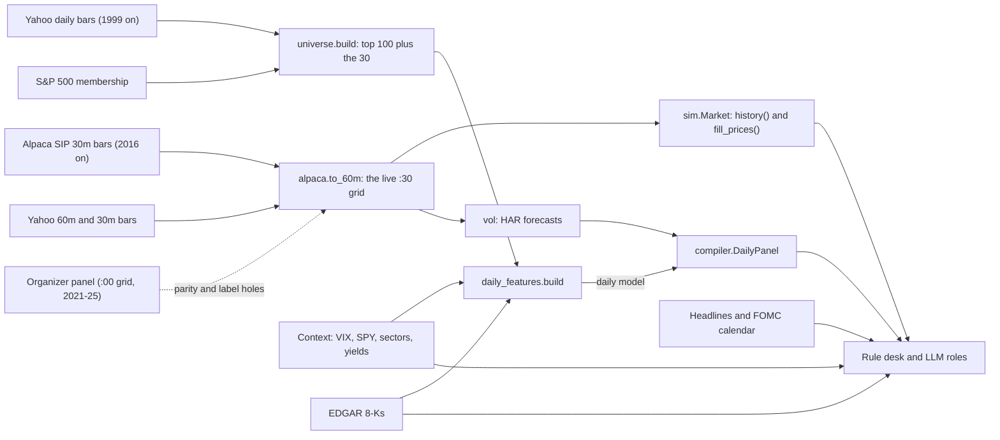

# Data streams: sources, point-in-time rules and where everything lives

> Snapshot 2026-10-10, main @ 81dcfb5. All 21 streams below are built and wired in. The newest research price snapshots end 2026-09-25, the headline archive is 11 days deep, and this review found two unadjusted 2016-20 distributions in the Alpaca history (section 5).

The system reads about twenty data streams. There are intraday bars for the 30 contest names from three vendors (the organizers' panel, Alpaca and Yahoo), Yahoo daily bars for a point-in-time S&P 500 universe since 1999, market context, earnings and 8-K events from SEC EDGAR, the Fed's FOMC calendar, two headline feeds, and the artefacts derived from them (HAR forecasts, walk-forward scores, trained models). Each stream is kept as a dated snapshot. It reaches a model or an LLM role only through a "door" that serves what had ended, or been published, by the decision's deadline. Tests guard the doors, most of them by rewriting the future and requiring the past unchanged. The anchor fact is that Alpaca's free SIP 30-minute bars, paired onto the contest's :30 grid, reproduce the organizer panel to 0 bps over 37,644 ticker-days ([reports/alpaca_parity.json](../reports/alpaca_parity.json)). So Alpaca's :30 opens from 2016 are the fills, the labels and the information bars, and the licensed panel is only a cross-check. For a paper, the limits that matter are survivorship before about 2015 (Yahoo prices 45% of 1999's S&P 500 members), a headline archive that starts on 2026-09-29, and the 30-name, US-only assumptions threaded through dozens of modules.

"Measured" means read on 2026-10-10 with read-only snippets against the main checkout's `data/` and `output/`. This worktree's `data/` is a symlink to the main checkout's.

## 1. Master table

Paths are relative to the repo root. The S3 copy of record mirrors each one under `s3://shaanil/icaif2026/<same path>` ([README.md](../README.md) "Setup"; [CLAUDE.md](../CLAUDE.md)). Its contents were not listed from this session.

| # | Stream | Source / vendor | Coverage on disk (measured) | Granularity | Point-in-time stamp | Loader | Builder | Path | Access / licence | Consumers |
|---|---|---|---|---|---|---|---|---|---|---|
| 1 | Organizer hourly panel | Codabench Files tab, built from Alpaca SIP (section 10) | 2021-01-04 to 2025-12-31; 30 names; 263,001 raw bars; 1,255 sessions | 1h on the :00 grid (first bar 30 min) | bar `end` from `data._organizer_end` | `data.load_organizer_bars` | manual download | `data/hourly_market_data_2021_2026.parquet` | licensed to registered participants | `markets.label_exec_prices` (last-resort fill guess), parity tools, 8 tests |
| 2 | Alpaca 30m SIP bars and their 60m pairs | Alpaca Market Data v2, free plan, `feed=sip`, `adjustment=split` | 2016-01-04 to 2026-09-25; 30 names; 1,048,691 bars; 2,698 sessions | 30m; 60m pairs on the :30 grid | `end` = start + 30 min, clipped to the close | `markets.latest_alpaca_60m` (`alpaca.to_60m`) | [tools/alpaca_report.py](../tools/alpaca_report.py) | `data/public/alpaca_30m_2026-09-27.parquet` (+ `alpaca_30m_parts_2026-09-27/`) | free account; `ALPACA_API_KEY_ID`, `ALPACA_API_SECRET_KEY` in `.env` | simulator fills, label fills, intraday information bars, HAR |
| 3 | Yahoo 60m | yfinance 1.7.0 | 2023-10-26 to 2026-09-24 (TMO from 2023-11-06); 152,121 bars; 730 sessions | 60m on the :30 grid | `end` = start + 60 min, clipped; in-progress bar dropped | `markets.latest_public("60m")` | [tools/data_report.py](../tools/data_report.py) (`public_bars.cached`) | `data/public/yahoo_60m_2026-09-25.parquet` | no key; Yahoo's terms | label-fill holes, `research_market(fills="yahoo")`, parity |
| 4 | Yahoo 30m snapshot | yfinance | 2026-07-01 to 2026-09-24; 23,387 bars; 60 sessions | 30m | as row 3 | `public_bars.cached` | [tools/data_report.py](../tools/data_report.py) | `data/public/yahoo_30m_2026-09-25.parquet` | as row 3 | parity only |
| 5 | Yahoo 30m, live | yfinance | period `5d` each round; period `60d` once a day for HAR | 30m, paired to 60m | bars not ended at the fetch dropped | `live.fetch_intraday`, `live.vol_bars` | live runner | `output/live/<phase>/` (HAR: `vol/<day>/`) | as row 3 | today's bars for the desks (`live.today_60m`), paper fills (`live.fills`), live HAR |
| 6 | Yahoo daily, the 30, live | yfinance `1d` | about 1,200 calendar days per fetch; at least 751 sessions required | daily | bars after the last completed session (close + 30 min) dropped; per-name freshness check | `live.fetch_closes` | live runner | `output/live/<phase>/` | as row 3 | rule desk (shape, regime, trigger sigma), observations |
| 7 | Yahoo daily, broad universe | yfinance `1d`, `auto_adjust=False` | 1999-01-04 to 2026-09-25; 758 of 1,209 symbols priced; 4,126,081 rows | daily OHLCV and `adj_close` | a value dated d is usable from d+1 (`shift(1)`) | `external.load("yahoo_daily_universe")` | [tools/enrich_data.py](../tools/enrich_data.py) | `data/external/yahoo_daily_universe_2026-09-27.parquet` | as row 3 | `universe.build`, `daily_features.build` and its labels, `compiler.trailing_daily_vol`; live via `live.fetch_inputs` |
| 8 | S&P 500 membership | github.com/fja05680/sp500 | 1,262 spells, 1,209 tickers, 1996-01-02 to a last change on 2026-08-18, plus `universe.LATE_CHANGES` | membership spells | start inclusive, end exclusive | `universe.load_membership` | `tools/enrich_data.py --refresh-membership` (curl) | `data/external/sp500_ticker_start_end_2026-09-27.csv` | MIT | `universe.build`, `live.live_symbols` |
| 9 | Training universe (derived) | rows 7 and 8 | about 104 names a day (README); 101 on 2026-10-09 | daily mask | dollar volume over the 63 sessions before d | `universe.build` | computed | in memory | n/a | daily-model rows, `universe_context` |
| 10 | Context series | Yahoo: ^VIX, SPY, 11 SPDR sector ETFs, Cboe ^IRX, ^FVX, ^TNX | 16 series, 1999-01-04 to 2026-09-25 (XLRE from 2015-10-08, XLC from 2018-06-19); 102,464 rows | daily close | close of d-1, on SPY's sessions only | `external.load("yahoo_daily_context")`, `macro.wide` | [tools/enrich_data.py](../tools/enrich_data.py); live, each scoring run | `data/external/yahoo_daily_context_2026-09-27.parquet`; live `scores/<day>/prices_context.parquet` | as row 3 | 13 `ctx_*` features; the observation's `macro` block |
| 11 | FOMC calendar | federalreserve.gov FOMC calendars page | 56 decisions, 2021-2027 | decision dates and a projections flag | scheduled in advance; a year not covered reads null | `macro.FomcCalendar.load` | [tools/macro_calendar.py](../tools/macro_calendar.py) | `data/external/fomc_decisions_2026-09-29.json` | public page | observation `fomc_*` fields |
| 12 | Earnings release times | SEC EDGAR submissions JSON, 8-K item 2.02 | 30,284 filings, 27,758 releases after clustering, 353 symbols, 2004-08-25 to 2026-09-24 | event time | acceptance time (UTC in the JSON); since 2026-10-06 every read is checked against the filing pages | `live.load_events`, `agent_replay.load_earnings_events`, `train` via `external.load("earnings")` (section 11) | [tools/enrich_data.py](../tools/enrich_data.py) | `data/external/earnings_2026-09-27.parquet` | public; `SEC_USER_AGENT` | `e_*` features, replay `earnings_in_sessions`, earnings trigger, memory probe |
| 13 | Scheduled earnings dates | Yahoo `get_earnings_dates` | one snapshot: 134 names, dates 2026-09-30 to 2026-12-10 | date and session side | `fetched_at`; one file per ET day, never overwritten | `live.CalendarEarnings` | [tools/earnings_calendar.py](../tools/earnings_calendar.py) | `data/external/earnings_calendar_2026-09-28.parquet` | as row 3 | live `earnings_in_sessions` only |
| 14 | Headlines, Yahoo RSS | feeds.finance.yahoo.com RSS | 48 files, 23,179 rows, 5,218 (ticker, guid) pairs, fetched 2026-09-29 to 2026-10-09 | headline and 400-character summary | `first_seen`, the earliest fetch that carried it | `news.known_at`, `news.recent` | [tools/news_archive.py](../tools/news_archive.py) (launchd); live rounds | `data/external/news/` | public, unauthenticated; Yahoo's terms | review and analyst `headlines`, live only ([05](05_news_feeds.md)) |
| 15 | Headlines, Alpaca (Benzinga) | Alpaca news API v1beta1 | 30 replay windows, 74,337 rows, 2025-01-31 to 2026-09-14 | headline and summary | `max(created_at, updated_at)` | `news.known_at` on its own directory; `alpaca_news.uncovered` | [tools/replay_sources.py](../tools/replay_sources.py) | `data/external/news_alpaca/` (+ `coverage.json`) | Benzinga's content via a free Alpaca account; replays only | real-names replays ([05](05_news_feeds.md)) |
| 16 | 8-K events | SEC EDGAR submissions JSON | 10,411 event 8-Ks (190 amendments), 30 names, 1994-01-21 to 2026-09-29 | event and item codes | acceptance time | `filings.recent`, `filings.new`, `live.load_filings` | [tools/filings_events.py](../tools/filings_events.py); live adds EDGAR's newest | `data/external/edgar_8k_2026-10-01.parquet` | public; `SEC_USER_AGENT` | `recent_8k_filings`, the `new_8k` trigger ([06](06_sec_filings.md)) |
| 17 | 8-K texts | EDGAR filing documents (the press-release exhibit for 2.02 and 7.01) | 30 replay-window files, 4.5 MB; live: up to 6 newest of the last 24 h | text | acceptance time | `filings.filing_text` | [tools/replay_sources.py](../tools/replay_sources.py); live runner | `data/external/edgar_texts/`; `output/live/<phase>/filings/text/` | public | the Event analyst's `source_text` ([06](06_sec_filings.md)) |
| 18 | HAR forecasts (derived) | `vol.walk_forward` on rows 2 and 3 | 2017-01-03 to 2026-09-25; 30 names and `_MKT`; 75,826 rows | per session, 1- and 3-session horizons | made before session D from sessions closed before D; quarterly refit on ended targets | the file: `tools/har_sizing_report.py`; replays rebuild it (`signals.VolForecasts.from_bars`) | `tools/vol_report.py --save-forecasts`; live `live.vol_forecasts` | `data/derived/vol_forecasts.parquet`; live `vol/<day>/` | own | `vol_ann_har_1d`, `_3d`; HAR sizing ([03](03_har_vol_forecaster.md)) |
| 19 | Walk-forward predictions (derived) | AutoGluon folds 2023-2026 | `daily_d5_pct`: 93,421 rows, 185 symbols, 2023-01-03 to 2026-09-18; also `daily_d5_up_pct`, `intraday_h35_*`, `gnn_d5_pct` | per day | row d from features as of d-1; each fold trained on labels that ended before its year | `compiler.load_daily_scores` | [tools/train_walkforward.py](../tools/train_walkforward.py) | `output/preds/` | own | replay `model_score_rank` and `universe_context`; compiler strategies ([02](02_daily_ensemble_model.md)) |
| 20 | Trained models (derived) | AutoGluon 1.5 | daily `d5_pct` and `d5_up_pct` folds 2023-2026 (2.3 GB); intraday (1.6 GB) | n/a | as row 19 | `live.load_predictor` (the 2026 `d5_pct` fold, 308 MB) | [tools/train_walkforward.py](../tools/train_walkforward.py) | `output/ag/` | own | live scorer ([02](02_daily_ensemble_model.md)) |
| 21 | Contest schedule and book | Codabench, through the kit | per round | n/a | the server's clock | `portfolio.parse`, runner | live runner | `output/live/<phase>/` | team credentials under `starter-kit/` (never read for this doc) | entry guard, journal reconciliation ([11](11_systems_infrastructure.md)) |

## 2. How the streams connect



Three things the picture compresses. Labels for the intraday model come from `markets.label_exec_prices` (Alpaca, then Yahoo, then the organizer guess). Labels for the daily model come from Yahoo daily opens (`daily_features.build_labels`). And live, the desks' `sim.Market` is built by `live.market` from Yahoo bars (rows 5 and 6), not from the research snapshots.

## 3. Two clocks: information bars and execution prices

A decision reads **information bars**: any bar whose `end` is at or before its deadline (`sim.Market.history`). It trades at an **execution price**: the open of the 60m bar that starts at its execution time (`sim.Market.exec_prices`). No strategy can read an execution price. `RoundContext` exposes only `history()` and `recent_closes()`, and `Market.fill_prices` raises for any execution at or after the time it is asked at.

### 3.1 Two grids

The organizers' historical panel sits on a **:00 grid**: 09:30-10:00, then 10:00-11:00 through 15:00-16:00. The contest executes on a **:30 grid**: the opens of 09:30, 10:30 through 15:30 (`calendar.ROUNDS`; [starter-kit/competition.json](../starter-kit/competition.json)). Each grid has one 30-minute bar, in a different place. That is why every bar carries an explicit tz-aware `end` ([icaif/data.py](../icaif/data.py)): inferring `end` as start + 1h gets the organizer's first bar and the public grid's last bar wrong, and each error hands a decision half an hour of the future.

| Round | Deadline (ET) | Execution (ET) | Newest :30-grid 60m bar ended by the deadline | Newest :00-grid organizer bar ended by the deadline |
|---|---|---|---|---|
| 1 | 09:10 | 09:30 | yesterday's 15:30-16:00 | yesterday's 15:00-16:00 |
| 2 | 10:25 | 10:30 | yesterday's 15:30-16:00 | 09:30-10:00 |
| 3 | 11:25 | 11:30 | 09:30-10:30 | 10:00-11:00 |
| 4 | 12:25 | 12:30 | 10:30-11:30 | 11:00-12:00 |
| 5 | 13:25 | 13:30 | 11:30-12:30 | 12:00-13:00 |
| 6 | 14:25 | 14:30 | 12:30-13:30 | 13:00-14:00 |
| 7 | 15:25 | 15:30 | 13:30-14:30 | 14:00-15:00 |

From round 2 on, a :30-grid bar is 30 minutes staler at a given deadline than a :00-grid bar. On a half-day only rounds 1-4 run (`calendar.rounds_for` drops executions at or after the 13:00 close), and the :30 grid ends with a 12:30-13:00 bar.

### 3.2 Why fills and labels use Alpaca's :30 opens

- The :00 grid cannot observe a :30 open. For rounds 2-7, the best guess from the containing :00 bar is its OHLC/4, which misses the true :30 open by a median 11.35 bps and a p95 of 44.57 bps (unbiased, mean 0.30 bps). That is noise the size of the 10 bp fee on every trade ([reports/data_parity.json](../reports/data_parity.json), 10,794 Yahoo 30m bars, 2026-07-01 to 2026-09-24).
- Yahoo's 60m bars sit on the :30 grid but reach back only about 730 sessions (from 2023-10-26 in the 2026-09-25 snapshot).
- Alpaca's 30m SIP bars from January 2016, paired into 60m, match the organizer panel at 0 bps on every 09:30 open, close, high and low (37,644 ticker-days, 2021-25). So the organizers built their panel from Alpaca. That makes Alpaca's :30 opens the best estimate of the contest's fill prices, including round 1's 09:30 open, the print that differs by vendor ([README.md](../README.md) "Alpaca is the organizer's vendor"; commit 902978c).
- So `markets.research_market` fills on Alpaca from 2016 (commit b23780b), and `markets.label_exec_prices` labels on Alpaca from 2016. Yahoo, then the organizer guess, fill only Alpaca's holes, and 0.19% of label cells stay empty (commit 902978c). The baseline field went from 40 to 170 windows, and the standard errors roughly halved.
- **Unconfirmed:** which 09:30 print the backend fills at. Validation receipts were meant to show it ([README.md](../README.md) "Public feed vs organizer panel"). Main records none as of 81dcfb5.

### 3.3 The 2026-01-01 information-grid change

The organizer panel ends on 2025-12-31 (measured). Everything after it, including the Official phase and every public feed, is on the :30 grid. A model trained on the :00 grid and run live would see bars of a different span, so [icaif/features.py](../icaif/features.py) defines every intraday feature in sessions or clock time, never in bars. Since 902978c the training information bars are Alpaca's :30 grid throughout (`markets.intraday_info_bars`), so the switch is out of the training path. Across the two grids, session features agree at r >= 0.97. Same-day ones agree less: `ret_1s` 0.96 and `volume_today` 0.94 at round 4 ([README.md](../README.md) "Features and labels"). Anyone who goes back to the organizer panel inherits the switch.

### 3.4 The same clocks live

A live round reads Yahoo 30m bars over yfinance's `5d` period (`live.INTRADAY_PERIOD`) and keeps only bars ended by now (`public_bars.completed`). It pairs complete halves into 60m bars (`live.today_60m` calls `alpaca.to_60m`), so at each deadline it sees exactly the 60m bars a backtest would. Paper books fill at the 30m bars' opens (`live.fills`), which the journal reads through `Market.fill_prices`. Past sessions are one daily bar each, ending at the close (`live.market`). The rule desk's daily closes are cut so that a session still trading is never read as a close (`quant_strategies.daily_closes`).

## 4. Intraday price streams

### 4.1 The organizer panel

The file has 10 columns: `timestamp_et`, `trading_date`, `ticker`, `open`, `high`, `low`, `close`, `adj_close`, `volume` (int64), `sector_group`. Raw bars start at 09:30, 10:00, 11:00 through 15:00, plus odd 14:30 (23 rows) and 15:30 (33 rows) prints (measured). `data.load_organizer_bars` does the following.

- It raises if the tickers differ from [starter-kit/universe.json](../starter-kit/universe.json), if a (timestamp, ticker) is duplicated, or if `adj_close` differs from `close` on any row. The panel is already split-adjusted (no jump at NVDA 2024-06-10), so if a refresh ever makes the two columns differ, someone must choose between them on purpose.
- It sets `end` with `_organizer_end`, keeps the regular session (`data.regular_session`: start at or after 09:30, start before the close, end at or before the close), back-adjusts spin-offs, and records short sessions in `DataIssues`.
- Result: 820 extended-hours bars dropped, 11,392 bars spin-off-adjusted, and 85 ticker-days short across 5 days ([reports/data_parity.json](../reports/data_parity.json) `organizer_issues`).

Today the panel is a cross-check and the last-resort fill guess in `markets.organizer_exec_prices`. Round 1 uses the exact 09:30 open; rounds 2-7 use OHLC/4 of the containing :00 bar. Without the panel, the intraday-model path (`markets.label_exec_prices`, `train.intraday_dataset`), [tools/data_report.py](../tools/data_report.py), [tools/alpaca_report.py](../tools/alpaca_report.py), [tools/feature_report.py](../tools/feature_report.py) and 8 tests (3 in [tests/test_data.py](../tests/test_data.py), 5 in [tests/test_features_labels.py](../tests/test_features_labels.py)) cannot run. The daily model, the simulator, HAR and the replays do not need it.

### 4.2 Alpaca 30m bars and the 60m pairing

[icaif/alpaca.py](../icaif/alpaca.py) does the following.

- **Fetch.** `GET https://data.alpaca.markets/v2/stocks/bars` with `timeframe=30Min`, `feed=sip`, `adjustment=split`, `limit=10000`, `sort=asc`, from `alpaca.START = "2016-01-01"`. A page holds about three weeks (extended hours included), so ten years is about 180 requests a symbol. `_RateLimiter(per_minute=180)` stays under the free plan's 200 a minute. `fetch_30m` runs 4 threads and saves each symbol to a parts directory as it completes, so an interrupted fetch resumes. The 30-name set takes about 30 minutes. The free plan refuses SIP data from the last 15 minutes, so only history is fetched.
- **Canonical frame** (`_canonical`): UTC to ET, `end` = start + 30 min clipped to the close, the regular session only, then `data.adjust_spin_offs` (Alpaca's split adjustment leaves out spin-offs).
- **Why not Alpaca's own hourly bars.** They sit on UTC clock hours, so they are on the :00 grid in winter and the :30 grid in summer, and they include pre-market prints.
- **Pairing** (`to_60m`): buckets start at 09:30 and step by an hour. A 60m bar is kept only if every 30m half is present, with the expected halves counted from the nominal hour clipped to the close (not from the bucket's last bar). With one half missing, its open or close would silently be the other half's: a fill 30 minutes off. `markets.latest_alpaca_60m` re-runs the session filter on every load, because a snapshot saved before a calendar fix still holds that day's after-close bars.
- **Measured:** 1,048,691 30m bars, 2,698 sessions, all 30 names from 2016-01-04 (META and PYPL included). [reports/alpaca_parity.json](../reports/alpaca_parity.json) counts 564,553 complete 60m hours.

### 4.3 Yahoo intraday

`public_bars.fetch` calls `yf.download(..., auto_adjust=False, prepost=False)`, sets `end`, drops the bar still in progress (`completed`: Yahoo serves it with the latest trade as its close) and keeps the regular session. `public_bars.cached` writes one dated file per day, because the windows roll forward and cannot be refetched: 60m reaches about 730 sessions back, 30m and 5m about 60. Known Yahoo holes (`sim.market_from_public_60m` docstring): no 12:30-13:00 bar on any half-day, outages on 2026-01-30 (after 10:30) and 2026-02-02 (the morning), and TMO starting 2023-11-06.

### 4.4 How `markets` merges the three ([icaif/markets.py](../icaif/markets.py))

- `public_exec_opens`: exact opens at each execution time. Holes stay NaN, and rows start once every name has been seen.
- `merge_fills(exact, guessed)`: exact where present, the guess only in holes, and never a forward fill. A round with neither stays NaN, so every label whose path crosses it is dropped.
- `label_exec_prices`: Alpaca exact, then Yahoo exact, then the organizer guess.
- `intraday_info_bars`: Alpaca 60m, then Yahoo 60m from Alpaca's last bar end. With today's snapshots Yahoo adds nothing: its file ends 2026-09-24 and Alpaca's ends 2026-09-25 (measured).
- `research_market(fills="alpaca" | "yahoo")`: `sim.market_from_public_60m(fills, info)`. Where a price is missing, it stands in the last completed close only so the ledger stays valued, lists the day in `issues["degraded_days"]`, and drops leading days before every name has a first bar. Rolling windows touching a degraded day are skipped (`windows.window_starts`), and a fixed suite raises (`holdout.suite_spans`). This is the one sanctioned stand-in: it never reaches a label or a feature.

## 5. Calendar, holes and corporate actions

- **Sessions.** Everything is US Eastern (`calendar.TZ = "America/New_York"`; `SESSION_OPEN` 09:30, `SESSION_CLOSE` 16:00, `EARLY_CLOSE` 13:00). Research sessions are the days the bar data has (`Market.days`). Live, `live._NYSEHolidays` lists full-day closures (New Year on a Saturday is not observed on the Friday; Juneteenth from 2022). An unscheduled closure is not in that list, so the freshness check raises rather than guessing.
- **Half-days.** `calendar.EARLY_CLOSES` lists 23 dates, 2016-11-25 to 2026-12-24 (21 inside the Alpaca span). The 2016-2020 dates were added only when Alpaca extended history (b23780b). Until then those days read as full sessions, with rounds after 13:00 filled on thin after-close prints. `test_alpaca.py::test_the_calendar_knows_every_half_day_in_the_data_and_no_others` checks the list against the data both ways: a day is a half-day exactly when less than 5% of its volume trades at or after 13:30.
- **Extended-hours bars on half-days.** The organizer panel carries 13:00-15:00 bars and odd 14:30/15:30 prints on all 10 of its half-days. Kept, the 16:00 "close" of a half-day becomes a thin post-market trade. `data.regular_session` drops them (`test_data.py::test_no_extended_hours_bar_survives_on_a_half_day`).
- **Missing bars and degraded days.** The organizer panel is short 85 ticker-days on 5 days, recorded in `DataIssues.short_sessions` and never filled. Counting 30m bars per ticker-day in the Alpaca snapshot reproduces the README's 11 degraded days (measured). The last five are the organizer's five, with identical name counts:

| Day | Names missing a bar | Note |
|---|---|---|
| 2016-02-22 | 9 | AAPL, AMZN, GOOGL, INTC, META, MSFT, NVDA, PYPL, TSLA: the 30's Nasdaq listings |
| 2018-05-02, 2018-05-03 | 9 each | the same nine |
| 2018-08-07 | 1 | TSLA |
| 2019-08-12 | 12 | |
| 2019-10-09 | 3 | KO, NEE, PFE |
| 2021-04-19, 2021-10-25, 2022-01-24, 2022-01-26, 2022-03-08 | 21, 20, 17, 6, 21 | the organizer panel's 85 ticker-days |

- **Spin-offs.** Prices are split-adjusted but not spin-off-adjusted. On an ex-date the raw price drops by the distributed value, a loss no holder suffered. `data.CORPORATE_ACTIONS` back-adjusts three, multiplying prices before the ex-date by the permanent step against Yahoo's daily close (volume untouched): T 2022-04-11 (0.755287, Warner Bros. Discovery), GE 2023-01-04 (0.780640, GE HealthCare), GE 2024-04-02 (0.798268, GE Vernova). The original scan covered 2021-25 and found no other step (`test_data.py::test_spin_off_ex_dates_no_longer_read_as_twenty_percent_crashes`).
- **Two distributions the table does not have (found for this doc).** Alpaca's last 30m close of each day was compared with Yahoo's daily close (which Yahoo adjusts for distributions) for the 30 names, 2016-01-04 to 2026-09-25. A permanent step was the median of the 10 sessions after minus the 10 before, above 0.3%. With the three listed adjustments applied, exactly two remain, both before the span the original scan covered:

| Name | First session after the step | Alpaca close-to-close | Yahoo close-to-close | Alpaca/Yahoo ratio before, after |
|---|---|---|---|---|
| GE | 2019-02-26 | -1.4% | +2.5% | 1.040, 1.000 |
| PFE | 2020-11-17 | -3.5% | +1.8% | 1.054, 1.000 |

  The dates fit GE's Wabtec transaction and Pfizer's Upjohn/Viatris spin-off (unverified against filings). Factors near 0.96 and 0.95 would remove them, estimated from the ratios. Until they are added, the simulator's fills, the intraday labels and HAR's realised variance carry a fake one-day loss of about 4% and 5% on those names.

## 6. Daily data and the point-in-time universe

### 6.1 Yahoo daily bars

`external.fetch_daily(symbols, start="1999-01-01")` calls `yf.download(..., interval="1d", auto_adjust=False, actions=False)` and returns a long frame (`date, ticker, open, high, low, close, adj_close, volume`) plus the symbols Yahoo had nothing for. Prices are split-adjusted but not dividend-adjusted, the organizer panel's basis, and `adj_close` is kept for anyone who wants total return ([icaif/external.py](../icaif/external.py)). Yahoo's `close` does carry spin-off adjustments: for T and GE in 2022-24 (the `data.CORPORATE_ACTIONS` comment), and for GE 2019 and PFE 2020 (section 5). A zero-volume row is a Yahoo placeholder with a stale price, and `daily_features.panels` reads it as missing: a stale price is a zero return that never happened, followed by a catch-up jump. The 2026-09-27 snapshot asked for 1,209 symbols, every symbol ever a member plus the 30. Yahoo had nothing for 451 of them ([reports/enrich_missing.json](../reports/enrich_missing.json)), because it drops a delisted symbol's history silently. That is why every fetch is a dated snapshot.

Live, `live.fetch_inputs` asks for `live.live_symbols`: members whose spell touches the last 730 days (`MEMBERSHIP_DAYS`), plus the 30. It fetches 480 calendar days (`HISTORY_DAYS`) and drops bars dated after the last completed session (`completed_only`, close + 30 min `SETTLE`). It raises if the feed is stale (`check_fresh`, per series for context), if fewer than 260 sessions came back (`MIN_SESSIONS`), or if more than 5% of current members are unpriced (`MAX_MISSING_MEMBERS`). Then it appends a placeholder decision row dated d (`with_decision_row`: last price, zero volume), because the features shift along the dates they are given and d's row would otherwise not exist. On the 2026-10-09 dry run it asked for 544 symbols over 331 sessions, found 12 ended spells unpriced and no current member unpriced, and ranked a universe of 101 (`output/live/dryrun-20261009T042712/scores/2026-10-09/scores_meta.json`, measured).

### 6.2 Membership and the universe pipeline ([icaif/universe.py](../icaif/universe.py))

```text
dv[d, s]     = mean of close[t, s] * volume[t, s] over the 63 sessions t before d   (min 31; dollar_volume)
member[d, s] = spell.start <= d < spell.end                                        (member_mask)
universe[d]  = members ranked 1..100 by dv[d, .]  plus  each of the 30 whose dv[d, s] exists   (build)
```

Dollar volume excludes day d: with d included, a name that spikes on d joins on the day it became interesting (`test_enrich.py::test_a_name_ranks_on_dollar_volume_before_the_day_never_including_it`). The 30 are forced in because the daily model flags and upweights them, and a flag on a name that fell out of the universe marks nothing.

**Survivorship, measured as the share of S&P 500 members Yahoo prices** (`universe.coverage`; `reports/universe_coverage.csv`, regenerated by [tools/enrich_data.py](../tools/enrich_data.py), not in git):

| 1999 | 2002 | 2005 | 2008 | 2010 | 2013 | 2015 | 2016 | 2018 | 2020 | 2022 | 2023 | 2024 | 2025 | 2026 |
|---|---|---|---|---|---|---|---|---|---|---|---|---|---|---|
| 45.4% | 50.3% | 53.3% | 60.9% | 65.5% | 70.7% | 73.6% | 76.8% | 81.5% | 87.4% | 92.1% | 94.6% | 96.1% | 97.3% | 99.1% |

The top 100 by dollar volume is probably covered better than the whole index, but the missing names cannot be ranked, so that cannot be measured. The daily model therefore treats its training start year as a setting and judges it only on 2023+ test years ([README.md](../README.md) "Daily data for the broad model").

**Renames** (`universe.RENAMES`). The membership file uses the ticker in force on each date, while Yahoo keys a renamed company's whole history under its new ticker. A spell under the old ticker therefore priced nothing, and the company dropped out of the universe for that spell (Fiserv as FI, 2023-06 to 2025-11). Four renames are mapped: BK to BNY, FI to FISV, MMC to MRSH, SATS to ECHO. `test_universe.py::test_each_rename_is_one_company_whose_old_spell_ends_the_day_its_new_one_starts` ties each to the file. A takeover is not a rename: the target's prices are gone, and the acquirer is its own spell.

**Late index changes** (`universe.LATE_CHANGES`). The membership source last updated on 2026-09-07, before the S&P rebalance effective 2026-09-21 (BE, ILMN and P in; TAP, TTD and BLDR out). Each row applies only while the snapshot lacks it. Without BE (about $3.7bn a day against a top-100 cut near $0.9bn), NXPI kept its place on 2026-10-05 and 8 of the 30's within-30 ranks moved by up to 2 places (Spearman 0.997; commit ebf5ec8). Nothing looks wrong when this happens: the universe keeps its size and every rank below the missing name shifts. So a live score now warns when the membership records no change since the last quarterly rebalance (`universe.last_rebalance`: the Monday after the third Friday of March, June, September and December).

**Ended spells.** The live fetch always asks for spells that ended in the last two years, so the missing list always holds takeovers Yahoo no longer serves (ANSS, CTLT, CTRA, DAY, DFS, HES, HOLX, IPG, JNPR, K, MRO, WBA on 2026-10-05). `scores_meta.json` keeps them as `ended_spells_unpriced`, apart from `current_members_unpriced`, the list that can cost the universe a name.

**Known and unfixed.** GOOG and GOOGL are both in the universe, as near-duplicate rows in a cross-section. A reused ticker would carry the later company's prices, and nothing detects it. Class shares map BRK.B to BRK-B (`universe.yahoo_symbol`). The frozen daily model and `output/preds` were built before the rename and late-change fixes, which take effect at the next retrain (commit ebf5ec8).

### 6.3 Context series and the macro block

The 16 series are `external.CONTEXT_SYMBOLS`: ^VIX, SPY, XLK, XLF, XLE, XLV, XLI, XLY, XLP, XLU, XLB, XLRE, XLC, and the Cboe Treasury yield indices ^IRX, ^FVX, ^TNX (13-week, 5-year, 10-year, quoted in percent). Rates come from Yahoo rather than FRED because Python's strict TLS fails against FRED on the office network, and loosening certificate checks was not worth it ([icaif/external.py](../icaif/external.py)). XLRE and XLC are NaN before they list, never zero.

- **Daily-model features** (`daily_features.context`, shifted one session): `ctx_vix`, `ctx_vix_chg_5d`, `ctx_spy_ret_1d`, `_5d`, `_20d`, `ctx_spy_vol_20d`, `ctx_rate_10y`, `ctx_curve_10y_3m`, `ctx_rate_10y_chg_20d`, `ctx_sector_dispersion_5d`, plus `ctx_breadth_1d`, `ctx_dispersion_1d` and `ctx_weekday` from the universe: 13 columns.
- **The agents' `macro` block** (`macro.readings(w, day, anonymize)`) reads only rows dated strictly before the day and needs at least 30 sessions. It reports SPY returns (1, 5, 20 days), 20-day vol, drawdown from the 1-year high, VIX z-score over a year and its 5-day change, 10-year and 3-month yield changes over 20 days, the 10-year z-score, the curve's 20-day change, and each sector's 20-day return against SPY. Levels (VIX, the yields, the curve) are added only when not anonymised, because a 4.9% ten-year with VIX at 13 dates a window as surely as a date does.
- **Equity-holiday prints.** Yahoo's ^VIX printed on Memorial Day and Labor Day 2026. On a union of dates, that NaN SPY row blanked `ctx_spy_ret_20d` and `ctx_spy_vol_20d` for 20 sessions. `daily_features.context` and `macro.wide` keep SPY's sessions, and live `fetch_inputs` drops off-session context dates (2026-05-25 and 2026-09-07 on the 2026-10-09 dry run, measured).

### 6.4 FOMC calendar

`macro.parse_fomc` reads the Fed's calendars page. The decision is the meeting's last day. "30-1" under "Apr/May" ends in May. A trailing "*" marks a Summary of Economic Projections. Notation votes and unscheduled meetings are skipped, since flagging them would tell an agent the market knew of a decision it did not. The snapshot stores the years the page covers, and `FomcCalendar.block` returns null for a day outside them: absence of a record is not absence of an event. The 2026-09-29 snapshot holds 56 decisions, 8 a year for 2021-2027 (measured). The next is 2026-10-28, inside the Official phase, with the statement at 14:00 ET, between rounds 5 and 6. Not built: decisions before 2021 (a different page layout) and CPI or jobs-report dates ([TODO.md](../TODO.md)).

### 6.5 Earnings timing (short; [06](06_sec_filings.md) has the detail)

- **History.** Item 2.02 8-K acceptance times come from EDGAR. Its JSON stamps UTC; read as Eastern wall-clock, 55% of releases first landed mid-session (commit 521cc46). `earnings.quarterly` keeps the last filing of each cluster under 30 days apart (`CLUSTER_DAYS`), which drops pre-announcements such as Tesla's delivery numbers. `reaction_session` maps a release to the first open that reflects it. `proximity` gives sessions since the last release, and sessions to the next only within 10 sessions (`NEXT_KNOWN_SESSIONS`): further ahead, its date would not have been announced. `FORMER_CIKS` recovers history filed under re-registered companies (XOM, DIS, GOOGL, GOOG). On the snapshot, 50.7% of releases are before the open, 41.5% after the close and 7.9% in session (measured).
- **The acceptance-time fault.** Since about 2026-10-06, EDGAR's submissions JSON has served older filings late by exactly Eastern's UTC offset. `earnings.checked_times` checks every read's 8-Ks against the filing index pages, corrects a late block, and raises on any other gap. The 2026-09-27 and 2026-10-01 snapshots predate the fault ([README.md](../README.md) "Daily data for the broad model").
- **Live.** EDGAR records a release only after it happens, so the daily model's `e_sessions_to_next` is NaN for every name live. On the 2026 test year that alone takes universe IC from 0.053 to 0.043 and IC among the 30 from 0.021 to 0.012 ([icaif/live.py](../icaif/live.py) docstring). Yahoo's scheduled dates (row 13) feed only the desk's `earnings_in_sessions`. They keep the side of the session (`bmo`, `amc`, `unknown`) and never a clock time: Yahoo's upcoming times are placeholders.

## 7. Text streams (summaries; [05](05_news_feeds.md) and [06](06_sec_filings.md) have the detail)

**Headlines.** Yahoo's RSS feed (yfinance's news endpoint returns HTTP 500 on the office network and turns it into an empty list). [tools/news_archive.py](../tools/news_archive.py) runs under launchd 5 minutes before each deadline and at 08:00 ET, and a live round within 30 minutes of its deadline archives the feeds itself (40 s budget). A file is named by its run's start, every row is stamped when its own feed came back, and nothing is overwritten. `news.known_at(deadline)` counts a headline from `first_seen`, not its pubDate: the pubDate runs after the first fetch for 108 of the first 2,070 headlines, by up to 2.2 h ([README.md](../README.md) "News and profit booking"). The archive is thin. `output/news_archive.log` records 47 successful runs and 20 where every feed failed (connection errors, one of them an untrusted certificate). The five snapshots of 2026-10-08 and 10-09 carry headlines for only 5 to 24 of the 30 names (measured). Replays before 2026-09-29 read Alpaca's Benzinga stories instead, counted from their last edit. `alpaca_news.uncovered` stops a replay whose window was never fetched, rather than replaying it as a quiet news week.

**8-K filings.** Every event 8-K is dated by its EDGAR acceptance time, with item codes named in `filings.ITEMS`; exhibit-only and procedural items (`IGNORED`) are not events. Live, `live.load_filings` joins EDGAR's newest filings (10 s a request, 45 s in all) to the dated snapshot and reads up to 6 texts from the last 24 h, each once, kept by accession. For 2.02 and 7.01 the text is the press-release exhibit (EX-99.1, or plain EX-99 for GE, NextEra and Pfizer), since the main document only says one is attached. External text reaches a role only inside `source_text`, cleaned and capped (`agents/untrusted.py`).

## 8. Derived artefacts

| Artefact | Built by | From | Measured | Point-in-time rule |
|---|---|---|---|---|
| `data/derived/vol_forecasts.parquet` | `tools/vol_report.py --save-forecasts` | `markets.intraday_info_bars()` | 75,826 rows; 2017-01-03 to 2026-09-25; 30 names and `_MKT` | refit each quarter on rows whose target window had ended ([03](03_har_vol_forecaster.md)) |
| `output/preds/daily_d5_pct.parquet` (and `daily_d5_up_pct`, `intraday_h35_pct`, `intraday_h35_up_pct`, `gnn_d5_pct`, smoke files) | [tools/train_walkforward.py](../tools/train_walkforward.py) | rows 7-12 | 93,421 rows; 185 symbols; 2023-01-03 to 2026-09-18; columns `pred, target, year, date, ticker` | test years 2023-2026; each trained on labels that ended before its year (`train.fold_split`) ([02](02_daily_ensemble_model.md)) |
| `output/ag/` | [tools/train_walkforward.py](../tools/train_walkforward.py) | as above | 3.9 GB: `daily/d5_pct`, `daily/d5_up_pct` (2023-2026), `intraday/h35_pct`, `intraday/h35_up_pct` | live loads only `daily/d5_pct/2026` |
| live scores, `output/live/<phase>/scores/<day>/` | `live.archive_scores` | rows 6-12, live | `scores.parquet`, `scores_universe.parquet`, `features.parquet`, `prices_daily_universe.parquet`, `prices_context.parquet`, `earnings_events.parquet`, `scores_meta.json` | the evidence that a score was built from data fetched before the deadline |
| `output/share/hourly_2026_alpaca_live_grid.{csv,parquet}` | no builder in git | Alpaca 60m | 38,640 rows (184 sessions x 30 x 7) in the organizer panel's schema | treat it as vendor data |

Replay and live parity for these artefacts is in section 10.3.

## 9. Point-in-time machinery and the tests that guard it

The repo's standing rule: a decision sees only bars ended by its deadline, daily values are as of the prior close, labels and folds are purged on each label's end, and nothing is forward-filled ([CLAUDE.md](../CLAUDE.md)). Each door below has a test that fails loudly when the rule breaks. Tests are under [tests/](../tests/).

| Door or rule | What it does | Silent failure it prevents | Tests |
|---|---|---|---|
| Explicit bar `end` (`data.COLUMNS`) | every bar carries a tz-aware end: `_organizer_end`, `public_bars._end`, `alpaca._canonical` | start + 1h hands round 2 the 10:00-10:30 prices | `test_data.py::test_organizer_bar_ends_follow_its_own_grid_not_a_fixed_hour`, `test_data.py::test_the_last_public_hourly_bar_ends_at_the_close_not_an_hour_later` |
| `Market.history(as_of)` | bars with `end <= as_of`, by binary search on end times | a bar that started before the deadline but ends after it | `test_sim.py::test_a_bar_that_ends_after_the_deadline_is_invisible_to_the_decision` |
| `public_bars.completed`, `live.completed_only` | drop the bar or session still in progress | a partial bar read as complete | `test_data.py::test_a_bar_still_in_progress_is_not_treated_as_complete`, `test_live.py::test_todays_in_progress_bar_is_dropped_so_the_decision_row_reads_only_the_prior_close` |
| `Market.fill_prices(execution, as_of)` | raises `ValueError` when `execution >= as_of` | a journal marking its own order at a price it had not traded at yet | `test_journal.py::test_a_rounds_own_order_has_no_fill_until_a_later_round_sees_it_in_the_book`, `test_journal.py::test_the_journal_a_round_sees_is_unchanged_when_every_later_bar_and_fill_is_rewritten` |
| `compiler.DailyPanel.for_day`, `.trailing` | serve a date's row only to a deadline on that date; else `LookAheadError` | tomorrow's score read by an off-by-one, which looks like a brilliant model | `test_compiler.py::test_a_strategy_asking_for_another_days_scores_fails_loudly`, `test_har_sizing.py::test_the_typical_level_reads_no_forecast_dated_after_the_entry_day`, `test_signals.py::test_the_score_ranks_the_entry_sees_are_unchanged_when_every_later_score_is_rewritten` |
| Daily values as of the prior close | panels `.shift(1)`; `trailing_daily_vol` shifted; dollar volume shifted; macro reads rows before the day | a feature or vol that already knows day d's close | `test_daily_features.py::test_no_feature_on_day_d_reads_day_d_or_later`, `test_compiler.py::test_trailing_vol_for_a_day_excludes_that_days_own_close`, `test_enrich.py::test_a_name_ranks_on_dollar_volume_before_the_day_never_including_it`, `test_features_labels.py::test_daily_context_on_day_d_is_the_close_of_d_minus_1`, `test_context_feeds.py::test_macro_readings_for_a_day_ignore_that_day_and_every_later_one` |
| Intraday features and labels | features from bars ended by the deadline; a label reads exactly its horizon | a rolling window or cross-sectional rank over a peer's future | `test_features_labels.py::test_no_feature_changes_when_everything_after_its_deadline_is_rewritten`, `::test_a_round_one_decision_sees_yesterday_and_nothing_of_today`, `::test_a_label_reads_its_own_horizon_and_not_one_round_beyond` |
| Earnings by acceptance | UTC stamps, first reacting open, next release only within 10 sessions | an after-close release mapped to the wrong open; a release date nobody had announced | `test_enrich.py::test_edgar_times_are_utc_so_an_after_close_release_stays_after_the_close`, `test_enrich.py::test_a_release_is_reflected_at_the_first_open_after_it`, `test_daily_features.py::test_the_next_release_is_only_seen_once_its_date_would_be_announced`, `test_daily_features.py::test_a_release_after_the_deadline_is_not_yet_in_the_past`, `test_signals.py::test_a_release_further_ahead_than_dates_are_announced_is_invisible_to_the_entry`, `test_edgar_times.py` (6 tests) |
| Filings and headlines | 8-Ks from acceptance; Yahoo headlines from first fetch; Alpaca stories from last edit | text read before we had it | `test_context_feeds.py::test_an_8k_accepted_after_the_deadline_is_not_yet_an_event`, `test_news_events.py::test_what_each_round_sees_is_unchanged_when_filings_accepted_after_its_deadline_are_added`, `test_news_events.py::test_the_headlines_a_round_sees_are_unchanged_when_every_later_snapshot_is_rewritten`, `test_replay_sources.py::test_a_story_counts_from_its_last_edit_so_edited_text_is_never_read_before_it_existed`, `test_replay_sources.py::test_an_alpaca_archive_shows_a_round_only_the_stories_known_by_its_deadline` |
| HAR and universe ranks | forecasts from closed sessions; ranks from that day's universe | a forecast or rank that moves when the future does | `test_vol.py::test_a_forecast_does_not_move_when_the_future_is_rewritten`, `test_vol.py::test_the_live_forecast_is_the_walk_forward_forecast_and_reads_no_later_bar`, `test_signals.py::test_the_har_vols_the_entry_sees_are_unchanged_when_every_later_bar_is_rewritten`, `test_universe_ranks.py::test_the_universe_ranks_through_day_2_are_unchanged_when_later_scores_and_members_are_rewritten` |
| Whole observations | every role's payload | any leak the per-stream tests miss | `test_agents.py::test_the_entry_observation_is_unchanged_when_every_later_bar_is_rewritten`, `test_v2.py::test_no_morning_payload_changes_when_every_later_bar_is_rewritten`, `test_v3.py::test_no_entry_payload_or_self_check_changes_when_every_later_bar_is_rewritten`, `test_v3.py::test_the_self_check_reads_only_closes_before_the_deadline`, `test_quant.py::test_the_regime_call_for_a_day_ignores_every_later_return`, `test_quant.py::test_a_quant_book_decision_is_unchanged_when_every_later_bar_is_rewritten`, `test_triggers.py::test_no_tag_changes_when_every_price_and_release_after_the_deadline_is_rewritten`, `test_rankplay.py::test_a_morning_decision_is_unchanged_when_every_later_price_is_rewritten` |
| Never forward-fill a price | holes stay NaN; an incomplete hour is dropped; zero volume is missing; leading days are dropped, not backfilled | a stand-in price is a zero return that never happened, then a catch-up jump inside every label that spans it | `test_features_labels.py::test_a_missing_public_open_is_filled_by_the_organizer_guess_never_by_the_last_close`, `test_features_labels.py::test_a_missing_price_on_the_path_gives_no_label_rather_than_a_label_on_a_hole`, `test_alpaca.py::test_an_hour_missing_either_half_is_dropped_not_filled_from_the_other`, `test_live.py::test_an_hour_missing_a_half_is_dropped_not_closed_on_the_other_half`, `test_daily_features.py::test_a_zero_volume_placeholder_is_missing_not_a_flat_day`, `test_sim.py::test_days_before_a_ticker_first_trades_are_dropped_not_backfilled`, `test_sim.py::test_a_missing_public_bar_is_patched_but_its_day_is_marked_degraded` |
| Live freshness | the latest bar must be the last completed session | a stale feed looks like a quiet market | `test_live.py::test_a_stale_feed_raises_rather_than_scoring_old_prices`, `test_vol.py::test_a_stale_feed_raises_rather_than_passing_last_week_off_as_yesterday` |

The pattern to copy: build the input twice, once on the real data and once with every bar, score, filing or headline after a cutoff rewritten (prices x1.5, volume x3 in several tests), and require everything at or before the cutoff to be identical. Also require that something after it changed, so the test cannot pass vacuously.

## 10. Parity checks

### 10.1 Organizer panel vs Yahoo ([reports/data_parity.json](../reports/data_parity.json); measured 2026-09-25 per the README, after spin-off adjustment)

| Check (2023-10-26 to 2025-12-31) | n | median abs bps | p95 | p99 | share over 10 bps |
|---|---|---|---|---|---|
| 09:30 open, organizer vs Yahoo 60m | 16,403 | 0.0 | 25.73 | 67.18 | 10.98% |
| Session close | 16,403 | 0.0 | 3.73 | 10.81 | 1.09% |
| Day high / day low | 16,403 | 0.0 / 0.0 | 1.31 / 1.25 | 22.85 / 20.86 | 1.74% / 1.63% |
| Yahoo 60m open vs its own 30m open at :30 | 12,593 | 0.0 | 0.0 | 0.0 | 0.06% |

Yahoo/organizer volume ratio: median 1.0082 (p05 0.8753, p95 1.0795). Four of the five worst opens are TMO's (worst: 2024-03-07, organizer 595.00 against Yahoo 561.00, -571 bps). Guessing a :30 fill from the containing :00 bar (n 10,794): bar open 18.25 bps median (p95 79.36), bar close 17.47 (70.81), mid of open and close 13.29 (53.07), OHLC/4 11.35 (44.57).

### 10.2 Alpaca ([reports/alpaca_parity.json](../reports/alpaca_parity.json), written 2026-09-27)

- **Against the organizer panel** (37,644 ticker-days, 2021-01-04 to 2025-12-31): 0.0 bps median, p95 and p99 on the 09:30 open, close, high and low; volume ratio median 1.0. That the 11 Alpaca degraded days contain the panel's 5 short days with the same name counts (section 5) fits the same conclusion.
- **Against Yahoo 60m opens** (152,121): median 0.0, p95 2.16, p99 20.7 bps, 1.81% over 10 bps, mean 0.004 bps; a median of 0 at each of the 7 round starts.
- **Against Yahoo daily closes, 2016-26** (this doc, section 5): two permanent steps (GE 2019-02-26, PFE 2020-11-17).

### 10.3 Live against research

- **Rule desk entry.** On 7 past entry days (Oct 2025 to Sep 2026), the live rule on Yahoo closes and the research desk on Alpaca bars differ in gross by at most 0.0011, in a single name by at most 0.0016, and in summed weights by at most 0.015. The turbulent 2025-10-13 agreed too ([README.md](../README.md) "Live runner").
- **Daily features and scores.** Replayed on the 2026-09-27 snapshots for 2026-08-20, the live feature frame equals `daily_features.build`'s row for row except `e_sessions_to_next`, and scoring the training frame reproduces `output/preds/daily_d5_pct.parquet` exactly ([icaif/live.py](../icaif/live.py) docstring).
- **HAR.** The live forecast equals the walk-forward forecast (`test_vol.py::test_the_live_forecast_is_the_walk_forward_forecast_and_reads_no_later_bar`).
- **Books.** The journal flags a server book more than 5 bps of NAV from its expectation. Vendor noise, Yahoo's opens against Alpaca's (p99 21 bps on a 3% name, about 0.6 bps of NAV), sits far below that line ([README.md](../README.md) "Portfolio memory").

## 11. Storage and lifecycle

Nothing under `data/` or `output/` is in git ([.gitignore](../.gitignore); `reports/*.csv` is ignored too, and `reports/*.json` is tracked). Loaders read the latest dated snapshot by sorting file names (`universe.latest`, `markets.latest_public`, `markets.latest_alpaca_60m`), so a rerun of an experiment sees the same data, and a new snapshot takes over by being newer.

| Path | Size (measured) | Can it be rebuilt? |
|---|---|---|
| `data/hourly_market_data_2021_2026.parquet` | 7.2 MB | download again from Codabench (participants only) |
| `data/public/alpaca_30m_2026-09-27.parquet` | 22.8 MB | yes: about 30 minutes, with keys |
| `data/public/alpaca_30m_parts_2026-09-27/` | 44 MB | redundant: the per-symbol fetch cache |
| `data/public/yahoo_60m_2026-09-25.parquet`, `yahoo_30m_2026-09-25.parquet` | 4.4 MB, 0.8 MB | **no**: the windows have rolled |
| `data/public/yahoo_1d_close_2021_2025.parquet` | 0.3 MB | yes. Wide daily closes for the 30, 2020-12-01 to 2025-12-31; no code reads it (probably the spin-off scan's input) |
| `data/external/yahoo_daily_universe_2026-09-27.parquet` | 111 MB | partly: Yahoo keeps dropping delisted symbols |
| `data/external/yahoo_daily_context_2026-09-27.parquet`, `sp500_ticker_start_end_2026-09-27.csv`, `fomc_decisions_2026-09-29.json` | 2.7 MB, 28 KB, 3 KB | yes |
| `data/external/earnings_2026-09-27.parquet`, `edgar_8k_2026-10-01.parquet`, `edgar_texts/` | 0.3 MB, 0.1 MB, 4.5 MB | yes, through `earnings.checked_times` now |
| `data/external/earnings_calendar_2026-09-28.parquet` | 5 KB | **no**: Yahoo later returns realised dates, not what was announced |
| `data/external/news/` | 6.2 MB | **no**: the only record of what was on the wire |
| `data/external/news_alpaca/` | 10 MB | yes, with keys (stories as they read at the refetch) |
| `data/derived/vol_forecasts.parquet` | 9.2 MB | yes |
| `output/ag/`, `output/preds/` | 3.9 GB, 4.6 MB | yes, by retraining (ask the owner first) |
| `output/live/` | 31 MB | **no**: live evidence |

All of `data/` is 217 MB. The README puts the S3 copy at about 4 GB, mostly `output/ag/`.

**S3 rules** ([CLAUDE.md](../CLAUDE.md), [README.md](../README.md) "Setup"). `s3://shaanil/icaif2026/` mirrors the repo's `data/`, `output/` and `reports/*.csv`. Pull with `for d in data output reports; do aws s3 sync s3://shaanil/icaif2026/$d $d; done` and push the same way reversed. The bucket also holds alphaBT production prefixes (`dashboards/`, `live_books/`, `alpha_strategies/`), which feed client-facing numbers. So write only under `icaif2026/`, never sync with `--delete` (a mirrored deletion lets a wiped folder empty the only other copy), and never sync `.env`, `.icaif/` or `.venv`.

**Backups are not happening.** The daily S3 sync of `data/external/news/` (`tools/install_news_backup_launchd.py`) is installed, and every logged run has failed. On 2026-10-06 it was an access-denied on listing the bucket. From 10-07 to 10-09 the SSO token had expired, and on 10-10 there was no network (`output/news_backup.log`, measured). Whether S3 holds a manual copy is unverified. The live runner moved to a GCP VM on 2026-10-09 (commit 81dcfb5), and a live round archives headlines itself, so the archive may now be split across the owner's Mac and the VM (unverified).

**Rebuild commands** (from each tool's docstring; network and keys needed; ask the owner before a run measured in minutes):

```bash
.venv/bin/python tools/alpaca_report.py                    # Alpaca 30m for the 30 (~30 min) + reports/alpaca_parity.json
.venv/bin/python tools/data_report.py --refresh            # today's Yahoo 60m/30m snapshots + reports/data_parity.json
.venv/bin/python tools/enrich_data.py --refresh-membership # membership, Yahoo daily universe + context, EDGAR earnings (SEC_USER_AGENT)
.venv/bin/python tools/earnings_calendar.py                # one Yahoo calendar snapshot per ET day, before 09:10 ET
.venv/bin/python tools/macro_calendar.py                   # FOMC decisions
.venv/bin/python tools/filings_events.py                   # 8-K events for the 30 (SEC_USER_AGENT)
.venv/bin/python tools/news_archive.py                     # one Yahoo RSS snapshot
.venv/bin/python tools/replay_sources.py --on 2026-01-21   # Alpaca news + 8-K texts for one window (Alpaca keys, SEC_USER_AGENT)
.venv/bin/python tools/vol_report.py --save-forecasts      # HAR walk-forward -> data/derived/
```

**A loader trap to fix before any retrain.** `external.load("earnings")` globs `earnings_*.parquet`, and `earnings_calendar_2026-09-28.parquet` now sorts after `earnings_2026-09-27.parquet` (checked 2026-10-10). [icaif/train.py](../icaif/train.py) (both datasets), [tools/daily_feature_report.py](../tools/daily_feature_report.py) and [tools/feature_report.py](../tools/feature_report.py) would therefore load the Yahoo calendar, which has no `accepted` column, and `earnings.quarterly` would raise a `KeyError` (inferred from the code; not run). `live.load_events` and `tools/agent_replay.py` already glob `earnings_2*` for this reason, and `test_live.py::test_the_earnings_snapshot_fallback_never_reads_the_calendar_file` guards the live path only.

## 12. Licensing and redistribution

None of the terms below were read for this doc (no web access). The "check" column is a to-do list, not a finding.

| Source | What the repo records | Suggested paper use | Check |
|---|---|---|---|
| Organizer panel | "licensed to registered participants; it is not ours to commit" ([.gitignore](../.gitignore)). The kit asks entrants not to send competition data to third-party services where a licence forbids it ([starter-kit/docs/llm_and_external_data.md](../starter-kit/docs/llm_and_external_data.md)) | not needed, since Alpaca reproduces it; never publish it or paste it into an LLM | the competition's data terms; whether results computed on it may be published |
| Alpaca bars | free account. The private scorer Space is "designed private, because it carries Alpaca prices", and the public board refuses any price file ([README.md](../README.md) "Holdout harness") | publish code and derived statistics; each reader refetches | Alpaca's market-data terms (redistribution, research use, SIP-derived data) |
| Benzinga via Alpaca | "Benzinga's content reaches us through a free Alpaca account but is Benzinga's"; kept out of live rounds ([icaif/alpaca_news.py](../icaif/alpaca_news.py)) | aggregate results; no verbatim corpus | Benzinga's and Alpaca's terms for research and publication |
| Yahoo (prices, RSS, calendar) | the organizers' suggested public source; yfinance is an unofficial client | as for Alpaca | Yahoo's terms of service |
| SEC EDGAR | public. The SEC requires a declared contact in the User-Agent (`SEC_USER_AGENT`, no default) and limits request rates; the code sleeps 0.12 s ("the SEC allows 10 requests a second") | usable; cite | the SEC's fair-access policy text |
| Fed FOMC page | public page | usable | none |
| fja05680/sp500 | MIT ([icaif/universe.py](../icaif/universe.py)) | usable with attribution | whether S&P Dow Jones Indices restricts constituent histories |
| Cboe indices (^VIX, ^IRX, ^FVX, ^TNX) | read through Yahoo | as for Yahoo | Cboe's terms |

The contest's own rule is that external data must be free, public and available by each deadline, with no paid or proprietary feeds ([starter-kit/docs/llm_and_external_data.md](../starter-kit/docs/llm_and_external_data.md)). That rule is why live news is Yahoo and Benzinga is used in replays only. The paper is not bound by it, but each licensed source brings its own terms.

## 13. Where the code assumes 30 names or the US market

Counts are from grep on 2026-10-10.

| Assumption | Where | What a wider or non-US setup must change |
|---|---|---|
| The 30 tradeable names and 6 sector groups | `data.load_universe` reads [starter-kit/universe.json](../starter-kit/universe.json): 33 call sites in 23 files (11 modules in `icaif/`, among them features, daily_features, compiler, live, runner, signals, portfolio and train, and 12 tools) | a dated universe provider; `features.py`'s sector-relative returns need sectors for every name (the broad universe has none) |
| The organizer panel holds exactly the 30 | `data.load_organizer_bars` raises otherwise | drop the panel |
| NYSE session clock and the contest's 7 rounds | `calendar.TZ`, `SESSION_OPEN`, `SESSION_CLOSE`, `EARLY_CLOSE`, `EARLY_CLOSES`, `ROUNDS`, `rounds_for`: referenced from 38 modules in `icaif/` and `tools/` | a per-exchange calendar and a decision schedule as parameters |
| NYSE holidays live | `live._NYSEHolidays`, `live.sessions` | an exchange calendar |
| The kit's weight contract | `weights.CAP = 0.30`, `weights.GRID = 1e-6`, `kit.validate_weights` inside `sim.run` | constraints as configuration; your own validator |
| Contest economics | `sim.INITIAL_NAV = 1_000_000`, `sim.FEE_RATE = 0.001`, `sizing="pre_fee"` | a cost model (fees, spread, impact) as configuration |
| 7 rounds a session, 30-name sets | `labels.ROUNDS_PER_SESSION = 7`; `gnn.SET_SIZE = 30`; `holdout` requires exactly the 30 symbols; `portfolio.parse` raises on any other symbol; `quant_strategies`' equal-weight basket of the 30 | parameters |
| Hand-kept per-name tables | `data.CORPORATE_ACTIONS` (3 rows), `earnings.FORMER_CIKS` (4), `news.ALIASES` (30), `universe.RENAMES` (4), `universe.LATE_CHANGES` (6) | data sources: a corporate-actions feed, an identifier history, an entity-matching step |
| US index, context and Fed | S&P 500 spells, `universe.last_rebalance` (S&P's quarterly schedule), `external.CONTEXT_SYMBOLS`, `macro.SECTORS`, `daily_features.SECTOR_ETFS`, `macro.FOMC_URL` | each market's index history, context series and central-bank calendar |
| US filings | `earnings` and `filings`: EDGAR CIKs, 8-K item codes | each market's disclosure feed, with acceptance stamps |
| Vendor windows | `alpaca.START = "2016-01-01"`; Yahoo periods `730d`, `60d`, `5d` | per-vendor history limits |

## Contest-specific vs general

| Piece | Contest-specific? | What generalizes |
|---|---|---|
| 30 names, `universe.json` sectors | yes | `universe.build` already ranks about 100 names a day from point-in-time membership |
| The :30 execution grid, 7 rounds, 09:10-15:25 deadlines | yes | the split between information bars (`Market.history`) and execution prices (`Market.fill_prices`) holds for any decision clock |
| The organizer panel | yes (licensed, ends 2025-12-31) | nothing: Alpaca reproduces it |
| 0.30 cap, 1e-6 weight grid, Decimal check, $1M, 10 bp fee, pre-fee sizing | yes | portfolio constraints and costs as parameters |
| Free, public data only; Yahoo live and Benzinga for replays | yes (contest rule) | the paper may use licensed data |
| Bar schema with an explicit tz-aware `end` | no | any bars at any frequency |
| Dated snapshots read through `latest()`, never overwritten | no | reproducibility for any vendor that revises or forgets |
| Never forward-fill; `DataIssues`; degraded days skipped | no | any price data |
| Point-in-time universe from spells and trailing dollar volume | no (the source is US) | any index with a spell history |
| Acceptance-time events, the `checked_times` cross-check | US source, general method | any regulator feed with stamps |
| `known_at` for text (first fetch, or last edit) | no | any text feed |
| Anonymised replays (codes, day numbers, macro z-scores) | no | any LLM backtest |
| Half-day calendar checked against the data both ways | no | any exchange |
| Vendor parity reports | no | any pair of vendors |

## Generalizing for the paper

1. **Choose the decision clock first.** The contest decides 7 times a day on the :30 grid. A generic portfolio-management paper probably wants daily or weekly decisions at the open, with fills at that open. The daily stack already works that way for about 100 names (`daily_features.build` as of d-1, labels on day-d opens). Keep `sim.Market` and its two doors, and make `calendar.ROUNDS` a schedule parameter rather than a constant.
2. **Widen the universe in one place.** Replace the 33 `data.load_universe()` call sites with a dated universe provider. Replace `kit.validate_weights` with your own constraint check, and make `weights.CAP`, `sim.FEE_RATE` and `sim.INITIAL_NAV` configuration. Keep the 30-name contest path behind it, so the contest results stay reproducible.
3. **US prices at scale.** `alpaca.fetch_30m(symbols, parts_dir)` takes any list and resumes. At about 180 requests per symbol-decade and the 180-a-minute limiter, budget about a minute a symbol: about 8 hours for 500 (estimated from the docstring's numbers). Whether Alpaca serves delisted symbols is unverified; test a known delisting before relying on it. For survivorship-free daily history, the usual answer is a licensed database (CRSP, for example). Otherwise evaluate only on years with at least 95% coverage (2023 on) and publish the coverage table, as `universe.coverage` does.
4. **Identifiers, not tickers.** Renames (`universe.RENAMES`), class shares, reused tickers (undetected) and EDGAR re-registrations (`earnings.FORMER_CIKS`) are all ticker problems. Join prices, filings and news on a permanent identifier with history (a CIK history, FIGI, ISIN, or a vendor's ID).
5. **Corporate actions systematically.** `data.CORPORATE_ACTIONS` has 3 hand-entered rows, and section 5 found 2 more in 2016-20 for the 30 names alone. A wide universe needs an actions feed, or the section-5 scan automated against a distribution-adjusted series. Decide between price return and total return (`adj_close` is already in the daily snapshots).
6. **Other markets.** Each needs an exchange calendar (sessions, half-days, holidays; the half-day test in `test_alpaca.py` generalizes as a volume-share check), its own time zone (`calendar.TZ` is global today), point-in-time index membership, local context series and central-bank dates, and a disclosure feed with acceptance stamps (EDGAR is US-only). Run `parity.source_parity` against a second vendor in each market before trusting either. The contest's final materials are to use no alphaBT or client data ([TODO.md](../TODO.md) "Final materials"), so ask the owner before bringing alphaBT's Indian-equity data into the paper.
7. **Text history.** The Yahoo archive starts 2026-09-29 and has gaps, and Alpaca/Benzinga is fetched per replay window. A paper needs years of news with honest first-availability stamps. Keep `known_at`'s rule (first fetch, or last edit, never the publisher's date), and measure the gap between the two as the README does (108 of 2,070 headlines). Keep `untrusted.py`'s cleaning and caps for any external text.
8. **LLM knowledge-cutoff contamination.** A real-names replay of a window before a model's training cutoff can score memory as skill, and nothing in its stated reasons would show it. Asked for the 22 post-earnings moves of 21 Jan to 10 Feb 2026, Grok 4.7 got 10 directions right, every guess under 1.5% against moves up to 21% ([README.md](../README.md) "News and profit booking"): the probe's job is to tell that apart from memory. The repo's defences:
   - anonymised replays (`observe.Anonymizer`: S01-S30 codes, "day k of 15", no price levels; `macro.readings(anonymize=True)`; universe codes U01-U99; headlines dropped);
   - the memory probe ([icaif/memprobe.py](../icaif/memprobe.py));
   - real-names windows only after the cutoff (stage 1 starts 2025-02-03 because Gemini 2.5's cutoff is January 2025; `agents/v3.STAGE1`).

   Stronger, newer models have later cutoffs, which shrinks the clean real-names span to the months after each one. Record every model's stated cutoff, re-run the probe per model and window, and plan forward paper-trading as the clean test. Headlines cannot be anonymised (they name companies), so news can be judged only after the cutoff or live.
9. **Look-ahead tests travel with the data.** Give every new stream and feature a rewrite-the-future test (section 9). Port the 8 tests that need the licensed panel to Alpaca or synthetic bars, so everyone can run them.
10. **Vendor differences are fill noise; report them.** Name the fill vendor and print. The 09:30 open differs most across vendors (organizer vs Yahoo p95 26 bps); a fill guessed on the wrong grid costs a median 11 bps. Score each headline result on two vendors' fills.
11. **Refresh before any rerun.** Research snapshots end 2026-09-25 and membership 2026-09-07 (patched by `LATE_CHANGES`). Fix the `earnings_*` glob (section 11), then retrain: the frozen model predates the rename, late-change and VIX-holiday fixes ([TODO.md](../TODO.md) "Refit the 2026 folds").

## Open questions and gaps

- **Round 1's fill print.** The 09:30 open is vendor-dependent, and Alpaca's is the best estimate. Receipts were to settle it; main records none as of 81dcfb5. This machine's `output/live/validation/` holds one portfolio read, and live records may now be on the GCP VM (unverified).
- **Pre-fee or post-fee sizing.** Unconfirmed against the backend; `sim.run` defaults to `pre_fee` ([README.md](../README.md) "Traps in the data").
- **GE 2019-02-26 and PFE 2020-11-17.** Unadjusted in the Alpaca history and not yet in `data.CORPORATE_ACTIONS`. The scan covered the 30 names only, at steps of 0.3% or more. The events' identities are unverified against filings, and their effect on scored results is unmeasured.
- **The `earnings_*` glob trap** in `train.py` and two report tools (section 11).
- **Earnings calendar.** One snapshot exists (2026-09-28), the daily job is not running ([TODO.md](../TODO.md)), and the live desk reads that snapshot. The live daily model's `e_sessions_to_next` stays NaN (IC among the 30: 0.021 to 0.012).
- **Headline archive.** 11 days deep, with 20 failed runs and late snapshots covering 5-24 of 30 names. Every automated backup has failed; S3's copy is unverified.
- **Stale research data.** Price and daily snapshots end 2026-09-25. The frozen model and predictions predate the universe fixes.
- **Licences.** None of the terms in section 12 have been checked.
- **Survivorship.** The top-100's coverage before 2015 cannot be measured with Yahoo data, and symbol reuse is undetected.
- **Macro calendar.** No FOMC dates before 2021, and no CPI or jobs-report dates.
- **Panel-dependent tests.** 8 tests need the licensed panel and skip without it.
- **Stale prose.** README "Alpaca is the organizer's vendor" still says the simulator fills on Yahoo; the code (`markets.research_market`, default `fills="alpaca"`, b23780b) fills on Alpaca. The [icaif/labels.py](../icaif/labels.py) docstring still describes the organizer guess before Nov 2023; `label_exec_prices` uses Alpaca from 2016.
- **Unmeasured depths.** How far back Alpaca's news API and bar history reach for symbols outside the 30 and for delisted names.
