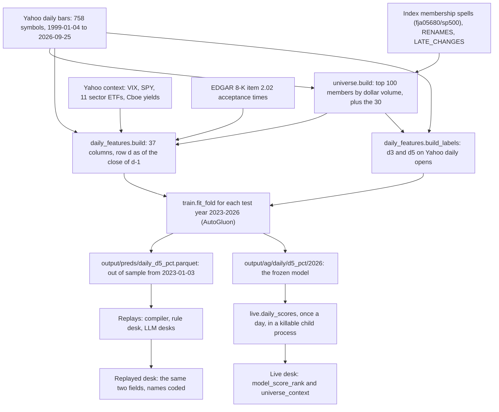

# The daily ensemble model

> Snapshot 2026-10-10, main @ 81dcfb5. Trained once (pass 1, 2026-09-27) and frozen. It is scored live once a day as an input to the LLM desks. Its IC is small but real, and no rule that trades on it has beaten the plain hold.

The daily model is an AutoGluon regression ensemble. Once a day, before the open, it ranks
about 100 US large caps by a score of the path through their next five opens. It is
trained walk-forward by calendar year on point-in-time S&P 500 data since 1999, and every
label is purged on the day its path ends, both between folds and inside them. Out of
sample, from 2023-01-03 to 2026-09-18 (931 days), its mean per-day rank IC is 0.047
(t 3.75) across the universe and 0.051 (t 2.99) when re-ranked among the 30 competition
names (`reports/pass1_summary.csv`). That edge does not survive the contest's fee and
turnover rank. No book built mechanically from the scores has beaten the 75% inverse-vol
hold out of sample (commits 556b088, 0993c27, f49ca2c). So the model now reaches the desks as
information: two fields an LLM may weigh (`model_score_rank` among the 30, and
`universe_context` for the whole universe). Both are factors in the stage-1 experiment
that is running now. Its side branches (an intraday model, a cross-sectional attention
"GNN", and vol-divided upside scores) failed their tests and are not deployed.

## At a glance

| Item | Value | Source |
| --- | --- | --- |
| Decision | One a day, for round 1: deadline 09:10 ET, fill at the 09:30 open | `daily_features.DEADLINE` and module docstring |
| Information | Daily bars through the close of d-1, nothing of d | `daily_features.build` (every panel shifted one session) |
| Cross-section | The day's universe: top 100 S&P 500 members by trailing dollar volume, plus the 30 | `universe.build` |
| Size | 718k rows 1999-2026, median 104 names a day; 100-101 a day in the 2023-26 test rows; 101 live on 2026-10-09 | README "Daily-model features"; `output/preds/daily_d5_pct.parquet`; live `scores_meta.json` |
| Target | `d5_pct`: percentile in [0, 1] of a 5-open composite path score, within the day's universe | `labels.build` via `daily_features.build_labels` |
| Features | 37: 20 ranked per-name, 3 raw earnings-timing, 13 raw `ctx_*`, `is_competition` | `daily_features.build` |
| Learner | AutoGluon 1.5.0 `TabularPredictor`, regression, `eval_metric="spearmanr"`; 6 model families bagged over 8 contiguous time blocks, then `WeightedEnsemble_L2` | `train.fit_fold`; `output/ag` listing |
| Folds | Test years 2023, 2024, 2025, 2026; train on every row whose label ended before 1 January of the test year | `train.TEST_YEARS`, `train.fold_split` |
| Out-of-sample IC | 0.047 universe, 0.051 among the 30 (2023-01-03 to 2026-09-18) | `reports/pass1_summary.csv` |
| Live model | `output/ag/daily/d5_pct/2026`: the 2026 fold, labels ending by 2025-12-31 | `live.MODEL` |
| Live cost | About 1 s to predict; 13-89 s a day with the fetch and EDGAR; 240 s limit | `live.load_predictor`; commit 7a45c06; README "Live runner"; `runner.Config.scoring_timeout_s` |

`reports/*.csv` and everything under `output/` are untracked, because the tools regenerate
them. Read them in the main checkout (`/Users/shaanilpunglia/Projects/alphaBT/icaif2026/`)
or from `s3://shaanil/icaif2026/` (CLAUDE.md). Only `reports/*.json` are in git.

## 1. The task

On each day d, for every name in d's universe (section 2), predict `d5_pct` (section 4)
from what was known at the close of d-1 (section 3). The score serves round 1 (deadline
09:10 ET, fill at the 09:30 open, `daily_features.DEADLINE`). Rounds 2-7 reuse it, because
the live scorer caches it per day (`runner.score_in_child`). The output is a regression
score near 0.5, and only its order is used. The stored out-of-sample scores have mean
0.502, standard deviation 0.014 and range 0.42-0.57 (`output/preds/daily_d5_pct.parquet`,
read for this doc). Consumers re-rank the scores among the 30, or show them as a rank and
a percentile.

Why this shape (from the commits):

- **A broad daily cross-section.** "Thirty names is too thin a cross-section to learn from,
  and daily bars go back decades" (1618eea). The daily model learns from ~100 names a day
  from 1999; the intraday model had only the 30, from 2016.
- **3- and 5-day horizons**, because "the fee needs a signal to last 4-5 days before a
  trade pays" (715e955).
- **One decision a day.** The 7-rounds-a-day intraday model failed, and "the daily score
  drives every round" (6733b7e; section 9.1).



Snapshot sizes are from parquet metadata read for this doc: `yahoo_daily_universe_2026-09-27.parquet`
has 4,126,081 rows over 758 symbols, and the context snapshot has 16 symbols. Sources and
storage: [01_data_streams.md](01_data_streams.md).

## 2. The universe (`universe.build`)

[icaif/universe.py](../icaif/universe.py) returns a date x symbol mask of the names that
are in the training universe on each day.

- **Members.** The point-in-time S&P 500 history comes from
  [fja05680/sp500](https://github.com/fja05680/sp500) (MIT), snapshotted as
  `data/external/sp500_ticker_start_end_2026-09-27.csv`. `member_mask` treats each spell
  as start-inclusive and end-exclusive.
- **Ranking.** `dollar_volume` is the mean of close x volume over the prior
  `LOOKBACK_SESSIONS` = 63 sessions (minimum 31), shifted one session. The top `TOP_N` =
  100 members by that number are in the universe. The shift exists because, with the date
  included, "a name would join on the day of its spike, and the model would learn to pick
  names on the day they became interesting" (commit 1618eea).
- **The 30.** The competition names are forced in whenever their dollar volume is
  defined, member or not. "A flag on a name that fell out of the universe marks nothing"
  (commit 1618eea).
- **Renames** (`universe.RENAMES`). These map BK to BNY, FI to FISV, MMC to MRSH and SATS
  to ECHO. Yahoo moves a renamed company's whole history to the new ticker, so a spell
  under the old ticker priced nothing and the company dropped out of the universe for
  that spell (Fiserv as FI, 2023-06 to 2025-11; commit ebf5ec8).
- **Late changes** (`universe.LATE_CHANGES`). These add the S&P rebalance effective
  2026-09-21 (BE, ILMN, P in; TAP, TTD, BLDR out), because the membership snapshot's
  source last updated on 2026-09-07. Without BE, "8 of the 30's within-30 ranks moved, by
  up to 2 places" on 2026-10-05 (README "Daily data for the broad model").
- **Size.** See "At a glance". The 2026-10-09 live figure is from
  `output/live/dryrun-20261009T042712/scores/2026-10-09/scores_meta.json`.

**Survivorship is large before about 2015.** Yahoo serves only symbols still trading, so
delisted members have no prices and cannot be ranked. The share of S&P 500 members
priced, by year (README; `reports/universe_coverage.csv`):

| 1999 | 2005 | 2010 | 2015 | 2020 | 2023 | 2026 |
| --- | --- | --- | --- | --- | --- | --- |
| 45% | 53% | 66% | 74% | 87% | 95% | 99% |

At enrichment, 451 membership symbols had no Yahoo daily data at all
(`reports/enrich_missing.json`). The README's response is that "the daily model therefore
treats its training start year as a setting to test, judged only on 2023+ test years".
That test has not been run (section 5).

Other known issues (README): GOOG and GOOGL are both in the universe, which puts
near-duplicate rows in each cross-section. A reused symbol would carry the later company's
prices, and nothing detects it.

**Price basis.** Prices are Yahoo daily bars, split-adjusted but not dividend-adjusted
(`auto_adjust=False` in `external.fetch_daily`), the organizer panel's basis. Labels are
therefore price returns, without dividends. Unlike the organizer and Alpaca bars, these
bars do not pass through `data.adjust_spin_offs`. A spot check for this doc found no ~20%
step on the three known spin-off days (T 2022-04-11, GE 2023-01-04 and 2024-04-02: closes
moved +7.7%, +5.8% and -2.5%). So Yahoo's daily series already absorbs those three; other
corporate actions are unchecked.

## 3. Features (`daily_features.build`)

### Mechanics

[icaif/daily_features.py](../icaif/daily_features.py), in order:

1. `panels(daily)` pivots OHLCV to date x ticker. A row with volume <= 0 is set to NaN,
   because it is a Yahoo placeholder carrying a stale price: "a stale price is a zero
   return that never happened, followed by a catch-up jump".
2. `_as_of_close(p)` computes each per-name feature as of the close of t.
3. Every panel is shifted one session, so row d is as of the close of d-1. The module
   docstring calls getting this wrong "the classic silent leak: a feature that includes
   day d's close reads as a strong signal in backtests and doesn't exist live".
4. Each per-name feature is set to NaN outside the day's universe mask and then ranked
   with `features.centred_rank`: `(rank - 1) / (n - 1) - 0.5`, average ranks for ties, in
   [-0.5, 0.5]. A fully tied row maps to exactly 0, which avoids pandas' `pct=True` giving
   it a small constant "signal" (commit 2853f52).
5. `context(ctx_daily)` builds market columns on SPY's sessions only, then shifts them one
   session. The universe's own breadth and dispersion and the weekday are added after.
6. `is_competition` is 1.0 for the 30 (`data.load_universe()`, read from the organizers'
   `starter-kit/universe.json`) and 0.0 otherwise.
7. `_earnings_columns` joins `earnings.proximity` at the 09:10 deadline.

Columns stay in this order: the 20 ranked features, the 13 `ctx_*`, `is_competition`,
then the 3 `e_*`. The live scorer requires that exact order (`live.check_features`), as
the archived live frame shows
(`output/live/dryrun-20261009T042712/scores/2026-10-09/features.parquet`).

### The 20 ranked per-name features

Each is computed as of the close of t, then moved to row t+1 and ranked within the
universe. Volatility (`vol_*`) is the standard deviation of daily log close-to-close
returns.

| Feature | Definition at the close of t | Min periods |
| --- | --- | --- |
| `ret_1d`, `ret_2d`, `ret_5d`, `ret_10d`, `ret_20d`, `ret_60d`, `ret_120d` | `close[t] / close[t-k] - 1`, k in `RETURN_SESSIONS` = (1, 2, 5, 10, 20, 60, 120) | none |
| `mom_12_1` | `close[t-20] / close[t-250] - 1` | none |
| `vol_5d`, `vol_20d`, `vol_60d` | rolling std of log returns over 5, 20, 60 sessions | 4, 15, 45 |
| `vol_ratio` | `vol_5d / vol_20d` | none |
| `parkinson_20d` | 20-session mean of `sqrt(ln(high/low)^2 / (4 ln 2))` | 15 |
| `gap_last` | `ln(open[t] / close[t-1])` | none |
| `overnight_share_20d` | sum of `gap^2` over sum of `logret^2`, 20 sessions | 15 |
| `volume_1d_ratio` | `volume[t]` / 20-session mean volume | 15 |
| `dist_high_20d` | `(close[t] / max(high, 20) - 1) / vol_20d` | 15 |
| `dist_low_20d` | `(close[t] / min(low, 20) - 1) / vol_20d` | 15 |
| `dist_high_250d` | `(close[t] / max(high, 250) - 1) / vol_20d` | 200 |
| `z_5d` | `(close[t] / mean(close, 5) - 1) / vol_20d` | 5 |

The daily model has no sector-relative returns: "The organizer file gives sectors for the
30, but not for the broad universe" (module docstring). The intraday model has them
(section 9.1).

### The 3 earnings-timing columns (raw)

Events are EDGAR 8-K item 2.02 acceptance times (`earnings.py`;
`data/external/earnings_2026-09-27.parquet`, 30,284 rows). `earnings.quarterly` collapses
them to one per quarter: filings less than `CLUSTER_DAYS` = 30 days apart form one
cluster, and the last one is kept, because item 2.02 also carries pre-announcements.
`earnings.reaction_session` maps each release to the first open that reflects it. A
release accepted before 09:30 belongs to that day's session; one at or after 09:30 belongs
to the next session; weekends and holidays roll forward. The acceptance-time fault and its
correction are covered in [06_sec_filings.md](06_sec_filings.md).

| Column | Definition | NaN when |
| --- | --- | --- |
| `e_sessions_since` | Sessions from the last release's reaction session to d. A release counts only if accepted before d's 09:10 deadline; the value is 0 when d's own open is the reaction | Before the name's first recorded release |
| `e_sessions_to_next` | Sessions from d to the next release's reaction session | More than `earnings.NEXT_KNOWN_SESSIONS` = 10 sessions away ("companies publish the date roughly two to four weeks ahead"), or no release recorded |
| `e_last_reaction` | The last release's reaction-day close-to-close return divided by `vol_20d` as of the prior close | Outside 1 to `REACTION_WINDOW` = 60 sessions after the reaction |

These columns stay raw because "sessions are comparable across names, so ranking would
throw away the scale" (module docstring).

### The 13 context columns and the flag (raw; identical across a day's rows)

| Column | Definition (as of the close of d-1 unless noted) |
| --- | --- |
| `ctx_vix` | ^VIX close |
| `ctx_vix_chg_5d` | 5-session change in ln(VIX) |
| `ctx_spy_ret_1d`, `ctx_spy_ret_5d`, `ctx_spy_ret_20d` | SPY log return over 1, 5, 20 sessions |
| `ctx_spy_vol_20d` | 20-session std of SPY daily log returns |
| `ctx_rate_10y` | ^TNX (Cboe 10-year yield index, in percent) |
| `ctx_curve_10y_3m` | ^TNX minus ^IRX |
| `ctx_rate_10y_chg_20d` | 20-session change in ^TNX |
| `ctx_sector_dispersion_5d` | Cross-sectional std of the sector ETFs' 5-session returns (XLRE joins in 2015 and XLC in 2018; before that it covers fewer sectors) |
| `ctx_breadth_1d` | Share of the day's universe whose d-1 return was positive |
| `ctx_dispersion_1d` | Cross-sectional std of the universe's d-1 returns |
| `ctx_weekday` | Weekday of d (0 = Monday), known in advance |
| `is_competition` | 1.0 for the 30, else 0.0 (also used for the training weight) |

Context is built on SPY's sessions because Yahoo's ^VIX printed on Memorial Day and Labor
Day 2026, when equities were shut. A union of dates put a NaN SPY row on those days and
blanked `ctx_spy_ret_20d` and `ctx_spy_vol_20d` for the next 20 sessions (commit e7e1dc8;
the stored 2026 predictions still carry this, see section 7).

### Univariate IC by era

IC is measured against `d5_pct`: the per-day rank correlation within the day's universe,
averaged over the era. The t-stat uses n_days / 5 because consecutive 5-day labels share
most of their path. Source: `reports/daily_feature_ic.csv` (`tools/daily_feature_report.py`).
The README table carries five of these rows. When the label is shuffled within each day,
the maximum absolute IC is 0.007 (README "Daily-model features").

| Feature | 2001-10 | 2011-19 | 2020-22 | 2023+ | t, 2023+ | Coverage, 2023+ |
| --- | --- | --- | --- | --- | --- | --- |
| `ret_1d` | -0.021 | -0.012 | -0.016 | -0.009 | -0.6 | 1.00 |
| `ret_2d` | -0.026 | -0.011 | -0.021 | -0.013 | -1.0 | 1.00 |
| `ret_5d` | -0.027 | -0.005 | -0.017 | -0.015 | -1.1 | 1.00 |
| `ret_10d` | -0.024 | -0.000 | +0.005 | -0.017 | -1.3 | 1.00 |
| `ret_20d` | -0.007 | +0.005 | +0.007 | -0.004 | -0.3 | 1.00 |
| `ret_60d` | -0.004 | +0.014 | -0.006 | +0.011 | +0.7 | 1.00 |
| `ret_120d` | +0.002 | +0.016 | +0.009 | +0.016 | +1.0 | 1.00 |
| `mom_12_1` | +0.016 | +0.026 | +0.006 | +0.030 | +1.7 | 1.00 |
| `vol_5d` | +0.002 | -0.014 | -0.016 | +0.010 | +0.7 | 1.00 |
| `vol_20d` | +0.004 | -0.018 | -0.021 | +0.023 | +1.4 | 1.00 |
| `vol_60d` | +0.004 | -0.016 | -0.021 | +0.024 | +1.4 | 1.00 |
| `parkinson_20d` | +0.006 | -0.018 | -0.022 | +0.022 | +1.2 | 1.00 |
| `gap_last` | -0.005 | -0.005 | -0.012 | -0.003 | -0.2 | 1.00 |
| `overnight_share_20d` | -0.004 | -0.002 | -0.006 | +0.016 | +1.5 | 1.00 |
| `volume_1d_ratio` | +0.001 | -0.006 | -0.009 | -0.015 | -1.6 | 1.00 |
| `dist_high_20d` | -0.016 | +0.007 | +0.007 | -0.003 | -0.3 | 1.00 |
| `dist_low_20d` | -0.021 | -0.002 | +0.013 | -0.001 | -0.1 | 1.00 |
| `dist_high_250d` | +0.001 | +0.018 | +0.009 | +0.017 | +1.2 | 1.00 |
| `z_5d` | -0.026 | -0.005 | -0.012 | -0.011 | -0.8 | 1.00 |
| `vol_ratio` | -0.001 | -0.000 | +0.004 | -0.011 | -1.1 | 1.00 |
| `e_sessions_since` | +0.017 | +0.011 | +0.004 | +0.009 | +1.0 | 1.00 |
| `e_sessions_to_next` | +0.021 | +0.030 | +0.017 | +0.062 | +1.8 | 0.16 |
| `e_last_reaction` | +0.017 | +0.019 | -0.004 | +0.000 | +0.0 | 0.94 |

No single feature reaches t 2 since 2023. The model's job is to combine weak, unstable
signals. The caveats the README attaches:

- **The earnings row is measured on a subset, so its size is overstated.**
  `e_sessions_to_next` is filled on only 16% of 2023+ rows, so its IC counts only names
  with a release coming: about 16 of ~104 a day. The README's "~5 names a day" is 16% of
  the 30. With "no release" filled as a value, its IC across the full cross-section is
  about 0 (commit 6733b7e). A nearer release scores worse on the drawdown-aware composite
  and better on upside (IC -0.066 against `d5_up_pct` in 2023+). It is a risk flag, not a
  ranking signal, and it is NaN in every live row (section 7).
- **Volatility changes sign by era.** Low volatility won in 2011-22 and high volatility
  has won since 2023. A model trained on all eras averages that away, "one more reason the
  training start year is a tested setting".
- **Post-earnings drift has faded** since 2020 (`e_last_reaction`).
- **The upside target is again mostly volatility.** `parkinson_20d` ranks `d5_up_pct` at
  IC 0.16-0.20 in every era (`reports/daily_feature_ic.csv`).

## 4. Labels (`labels.build`, called by `daily_features.build_labels`)

`build_labels(daily, universe_mask)` calls
`labels.build(opens, labels.DAILY_HORIZONS, upside_horizons=("d3", "d5"), per_session=1,
universe=mask)` on `panels(daily)["open"]`. Those are **Yahoo daily opens**, used as the
proxy for the round-1 fill: organizer vs Yahoo 09:30 open, median 0 bps and p95 26 bps,
with 11% differing by more than 10 bps (README "Public feed vs organizer panel"; the
`build_labels` docstring).

Do not confuse this with the intraday labels. `labels.build(markets.label_exec_prices())`
reads Alpaca's :30 opens from 2016, which are the organizer's own vendor's prices. Yahoo's
:30 opens fill Alpaca's holes after Oct 2023, then the organizer-grid guess (exact 09:30
open, OHLC/4 of the containing :00 bar for rounds 2-7) fills what is left, and nothing is
ever forward-filled (`markets.label_exec_prices`; commit 902978c). The daily model does
not use that path.

For a decision on day d with horizon h (`DAILY_HORIZONS = {"d3": 3, "d5": 5}`), the entry
is p0 = open of d and the path is p1..ph = opens of d+1..d+h:

```text
rel_j          = p_j / p_0                        j = 1..h
upside         = max_j rel_j - 1
drawdown       = 1 - min_j rel_j
floor          = 0.01 * sqrt((h / per_session) / 63)      # 0.0028 at h=5, 0.0022 at h=3
reward_to_risk = upside / (drawdown + floor)
terminal       = rel_h - 1
k              = max(1, round(0.08 * h))                  # 1 at h=3 and h=5
top_k          = mean of the k largest rel_j, minus 1     # = upside when k = 1
path_sharpe    = top_k / (std of the h log steps ln(p_j / p_(j-1)) + 1e-10)
score          = 0.4 * pct(reward_to_risk) + 0.3 * pct(terminal) + 0.3 * pct(path_sharpe)
```

Here `pct` is the cross-sectional percentile among the day's valid names
(`WEIGHTS = {"reward_to_risk": 0.4, "terminal": 0.3, "path_sharpe": 0.3}`). The columns
written per horizon are:

- `d5_pct = unit_rank(score)`: `(rank - 1) / (n - 1)`, exactly [0, 1]. This is the
  regression target.
- `d5_label = top_label(score)`: 1 for exactly round(0.4 n) names (`TOP_FRAC`), with ties
  broken by ticker order. This was meant for an ablation and was never trained.
- `d5_terminal`: the plain forward open-to-open return, kept as a reference.
- `d5_end`: the date of p_h, for purging.
- `d5_up_pct`, `d5_up_label`: the same treatment applied to `top_k` ("upside on fills",
  alphaBT's Target 2 rescaled).

The composite mirrors `alphabt-features/src/targets.py::_compute_raw_metrics` (labels
docstring). That docstring's "ranked across the 30 names" describes the intraday use: with
`universe` passed, the daily labels are ranked within the day's universe.

Design choices, each tied to a silent failure (quotes from `labels.py` unless noted):

- **Path sampled at fills only**, because "a peak between rounds cannot be captured".
  Target 1 (upside on bar highs) is left out: it needs a resting limit order.
- **The floor scales with the horizon.** The quarterly +0.01 floor is larger than a
  typical 1-day move, and unscaled it "flattens every short-horizon reward_to_risk towards
  upside / 1%".
- **Percentile, not raw value**: "bounded, so no single outlier dominates". `unit_rank`
  spans exactly [0, 1], because "a plain pct rank bottoms out at 1/n, so its mean drifts
  with how many names have a label that day" (commit 715e955).
- **No label on a hole.** A path with any NaN, including a zero-volume placeholder, gets
  no label "rather than a label computed on a hole".
- **Only day d's universe is ranked**, but paths read every price, "so a name that leaves
  the universe mid-path keeps its label".

Trained targets: only `d5_pct` and `d5_up_pct` (`output/ag/daily/`). The `d3` horizon and
the top-40% binaries exist as columns but were never fitted.

## 5. Training (`icaif/train.py`, `tools/train_walkforward.py`)

**Dataset.** `train.daily_dataset(train_start=None)` loads the latest snapshots (daily
universe, membership, earnings, context), builds features and labels, and inner-joins
them: 718k rows and 37 features (README). The optional `train_start` drops rows before a
date.

**Folds** (`train.fold_split`). For each test year in `TEST_YEARS = (2023, 2024, 2025,
2026)`, keep the rows with a target. Train on rows whose `d5_end` is before 1 January of
the test year, and test on rows dated in that year. The purge is on the label, not the
row: "Cutting on the decision date alone would keep December rows whose 5-day paths run
into January" (train docstring; `tests/test_train.py`).

**Inner folds.** AutoGluon's bagging folds would be random rows by default. "Neighbouring
decisions share most of a 3-5 day label, so a random fold's held-out rows have near-copies
in training", and the stacker would learn from leaked out-of-fold scores. Instead:

- `inner_groups(times, k=INNER_BLOCKS)` with `INNER_BLOCKS = 8` assigns contiguous time
  blocks, with every row of a decision in one block, and AutoGluon splits
  leave-one-block-out. Each block spans about three years in the 2023 fold.
- `within_block(times, ends)` drops every row whose label ends in a different block from
  its decision: the same purge as between folds, applied inside them. If that would drop
  more than `MAX_PURGED` = 20% of rows, the fit raises, because "what survives is a fit on
  scraps".
- The first smoke run, before this purge, showed validation Spearman 0.53 against a test
  IC of -0.01 (commit bde9b66).

**Weights.** Rows with `is_competition` get `COMPETITION_WEIGHT` = 3.0, and other rows
1.0. This is the design doc's "loss intervention": "the broad universe teaches patterns
and the 30 decide which ones fit them" (`train.fit_fold`).

**The learner** (`train.fit_fold`):

```python
PASS1_FAMILIES = {"GBM": {}, "CAT": {}, "XGB": {}, "NN_TORCH": {}, "FASTAI": {}, "LR": {}}
predictor = TabularPredictor(label=target, problem_type="regression", eval_metric="spearmanr",
                             path=str(path), groups="_group", sample_weight=weight, verbosity=1)
predictor.fit(frame, presets=presets, time_limit=time_limit,  # tool defaults: "medium_quality", 900 s per fold
              hyperparameters=families or PASS1_FAMILIES,
              num_bag_folds=INNER_BLOCKS, num_bag_sets=1, num_stack_levels=0,
              dynamic_stacking=False)
```

`weight` is `"_weight"` when `is_competition` is a feature, which it is for the daily model.

Each family runs at AutoGluon's default hyperparameters. AutoGluon's `spearmanr` is pooled
across rows, not per decision, so `train.evaluate` computes the per-decision IC itself
(commit bde9b66). The pass-1 command line is not recorded. The 317-403 s fit times sit
inside the tool's 900 s default, but that the defaults were used is unverified. The
`train.py` comment "Tabular foundation models join in the GPU pass" describes a pass that
has not run.

**On disk** (directory listing of `/Users/shaanilpunglia/Projects/alphaBT/icaif2026/output/ag`;
no model was loaded). There are 16 fold directories: `daily/{d5_pct,d5_up_pct}` and
`intraday/{h35_pct,h35_up_pct}`, each for 2023-2026. Every one holds the same 7 models:
`CatBoost_BAG_L1`, `LightGBM_BAG_L1`, `LinearModel_BAG_L1`, `NeuralNetFastAI_BAG_L1`,
`NeuralNetTorch_BAG_L1`, `XGBoost_BAG_L1` and `WeightedEnsemble_L2`. Each bagged model has
8 fold children (`S1F1` to `S1F8`).

The frozen fold's `metadata.json` records AutoGluon 1.5.0, Python 3.13.12 on Darwin,
lightgbm 4.6.0, catboost 1.2.10, xgboost 3.1.3, torch 2.9.1 and fastai 2.8.12. Sizes:
`output/ag` is 3.9 GB, of which `daily` is 2.3 GB. The 2026 daily fold is 308 MB: 109 MB
of models plus 194 MB of AutoGluon's cached training frame (`utils/data/X.pkl`), as `du`
counts them.

**Outputs of `tools/train_walkforward.py`**:

- `output/ag/<model>/<target>/<year>/`: the predictor.
- `output/preds/<model>_<target>.parquet`: out-of-sample predictions with index (date,
  ticker) and columns `pred`, `target`, `year`. The daily file has 93,421 rows.
- `reports/walkforward_<model>.csv`: one row per (target, year).

`--smoke` keeps the last 2,000 decision days, fits only `GBM` and `LR`, and caps the fit
at 60 s. It "checks the plumbing, not the signal".

**Training start year.** `--train-start` exists, but no run with a later start is on
record. `reports/walkforward_daily.csv` holds one run per fold, and the 2023 fold's
623,746 training rows fit the full 1999 start. The README calls the start year "a setting
to test"; it has not been tested.

**The frozen model.** The live scorer loads the 2026 walk-forward fold as it stands
(`live.MODEL`). It was trained on every row whose label ended before 2026-01-01 (699,041
rows, 357 s; `reports/walkforward_daily.csv`). There is no separate final fit on all data.

## 6. Results

### 6.1 Out-of-sample IC (`d5_pct`)

IC is the per-decision Spearman, averaged over days. The t-stat is
`mean / (std / sqrt(n_days / 5))` (`train.evaluate`). "Among the 30" re-ranks the
predictions within the 30 names; the README quotes it as "mean daily rank IC 0.051 over
2023 to Sep 2026" ("Agent signals"). A single year's IC on 30 names has a standard error
near 0.025 (`tools/intraday_diagnosis.py` docstring).

| Test year | Days | IC, universe (t) | IC, among the 30 (t) | Train rows | AutoGluon validation Spearman | Fit s |
| --- | --- | --- | --- | --- | --- | --- |
| 2023 | 250 | 0.033 (1.38) | 0.049 (1.54) | 623,746 | 0.059 | 317 |
| 2024 | 252 | 0.065 (2.81) | 0.091 (2.75) | 648,755 | 0.060 | 370 |
| 2025 | 250 | 0.038 (1.55) | 0.033 (0.93) | 673,955 | 0.063 | 403 |
| 2026, to 09-18 | 179 | 0.053 (1.79) | 0.021 (0.64) | 699,041 | 0.056 | 357 |
| 2023-26 pooled | 931 | 0.047 (3.75), positive on 63% of days | 0.051 (2.99), positive on 57% of days | | | |

Sources: `reports/walkforward_daily.csv` (per fold) and `reports/pass1_summary.csv`
(pooled). The best model was `WeightedEnsemble_L2` in every fold. The validation Spearman
is AutoGluon's pooled out-of-fold score, so it does not compare with the test IC.

- **It is declining among the 30**: 0.091, 0.033, 0.021 from 2024 to 2026. So the
  Black-Litterman views are sized at `signals.VIEW_IC` = 0.03, "the two latest years, the
  ones nearest the frozen 2026 model, average 0.027; the four average 0.048. Views sized
  on the four-year mean would trust the model about twice as much as its recent record
  supports" (`icaif/agents/signals.py`).
- **Upside target** (`d5_up_pct`). Pooled IC is 0.227 (t 11.2) across the universe and
  0.194 (t 9.8) among the 30; among the 30 it falls from 0.261 in 2023 to 0.109 in 2026
  (`reports/pass1_summary.csv`). Most of that is the volatility bet (section 3).
- **Smoke run** (last 2,000 days, LightGBM and linear only): 2023 IC 0.023, and 0.044
  among the 30 (`reports/walkforward_daily_smoke.csv`).
- **The 2026 row** carries the VIX-holiday context bug on 30 of its 179 days (section 7).

### 6.2 What the IC is worth in the contest

Score is the mean of four per-metric ranks against the modelled field, so lower is better
([00_contest_and_evaluation.md](00_contest_and_evaluation.md)). Each test below scores a
book built from the out-of-sample predictions, with fills at Alpaca's :30 opens.

| Test | Setup | Result | Source |
| --- | --- | --- | --- |
| Compiled top-10 book at default levers | 61 windows, 2023-01 to 2026-08; each candidate ranked alone against the field | 4.32 against the 75% inverse-vol hold's 3.19: worse by 1.13 (SE 0.17). Turnover 3.85% against 0.72% | commit 556b088; `reports/compiler_summary.csv` |
| Lever sweep | 152 candidates; chosen on 2023-24 (33 windows), confirmed on 2025-26 (28) | The best tilt (0.5, bought once) beat the hold by 0.16 (SE 0.08) when choosing, then lost by 0.04 (SE 0.09) when confirming. The splits rank candidates alike (Spearman 0.71), and "what it finds stable is 'trade less'" | commit 0993c27; `reports/compiler_sweep.csv` |
| `model_tilt_0.5` on the holdout board | Jan-Jun 2026, 109 rolling windows, run fresh in each window; inverse-vol at 75% tilted by the score (tilt 0.5, weekly, 5% band, gamma 0) | 3rd of 4 (2.74 +- 0.14), behind cash (1.76) and `inv_vol_hold_75` (2.29), despite the best full-span return and Sharpe of the non-cash books (7.6%, 1.67, MDD 5.7%). It won 8 windows to the hold's 39 | commit f49ca2c; README "Holdout harness" |
| Black-Litterman views taken by rule | The rule desk always takes `views`, on the 61 windows with scores, against the plain rule book | `light`: -0.020 (SE 0.059) on the default field, -0.016 (0.049) on the no-clone field. `strong`: +0.008 (0.113) and -0.008 (0.088) | README "Agent signals"; `tools/views_report.py` |

Why it fails: "The daily scores reshuffle (day-to-day rank correlation 0.79 among the
30), so a 5-day prediction is re-traded every morning" (commit 556b088). And "a
daily-model IC of ~0.05 over 5 days doesn't survive the fee and the turnover rank in
15-day windows against this field" (commit 0993c27). These are verdicts on the contest's
rank-of-four objective. A general portfolio objective without a turnover rank is untested.

## 7. Live scoring (`live.daily_scores`)

### Where and when

- **A killable child.** `runner.score_in_child` runs `tools/live_runner.py score` as a
  child process under `watchdog.run`, with `OMP_NUM_THREADS=1`. Its timeout is
  `min(scoring_timeout_s, seconds_left - 30)` with `scoring_timeout_s` = 240. The child is
  killed together with its process group (README "Live runner"). It runs once a day; later
  rounds find `scores.parquet` and reuse it. A timed-out first attempt is retried once in a
  fresh process, because "the deadlock was a property of a process, not of the data".
- **Why.** "Predicting LightGBM and then the FastAI net in one process deadlocks: torch's
  batch_norm waits forever in an OpenMP barrier (two OpenMP runtimes, 0% CPU, no error)"
  (`live.load_predictor`). A thread timeout cannot interrupt that, and live it would be a
  round that silently misses its deadline. The fix is `torch.set_num_threads(1)` plus the
  child process.
- **Ordering.** Under `--submit rule` (Validation's default), scoring runs in the shadow
  step after the upload, so a hang never touches the submitted book (README). Under
  `--submit agent`, it runs inside `runner._agent` before the agent decides, on the
  submitted book's path; the agent must finish `upload_margin_s + 60` s (45 + 60) before
  the deadline. If scoring fails, the desk decides without the model's fields: "a missing
  input is recorded and left out" (`runner.agent_inputs`).

### What one scoring run does

1. `fetch_inputs(now)` finds the last completed NYSE session (`live._NYSEHolidays`); the
   decision date is the next session. It asks Yahoo for `live_symbols`: members whose
   spell touches the last `MEMBERSHIP_DAYS` = 730 days, plus the 30 (544 symbols on
   2026-10-09). It also fetches the 16 context symbols, from `HISTORY_DAYS` = 480 calendar
   days back (331 sessions on 2026-10-09). The long features need about 330 sessions:
   `mom_12_1` reads 250 back, `dist_high_250d` needs 200 and dollar volume 63.
2. Bars dated after the last completed session are dropped, since Yahoo serves today's bar
   before it is complete. Context rows off the NYSE grid are dropped too: 2026-05-25 and
   2026-09-07 were dropped on 2026-10-09.
3. `with_decision_row` appends a placeholder bar dated d (last price, zero volume), so
   that the one-session shift has a row to write into. Without it, "d's row would be
   silently missing and the latest row would be d-1's".
4. `universe.build` runs on the live bars; `load_events` reads EDGAR's recent filings
   joined to the latest snapshot, or the snapshot alone, flagged stale, when
   `SEC_USER_AGENT` is unset; `daily_features.build` builds the frame and keeps the row
   for d.
5. `load_predictor()`, `check_features`, predict, then the NaN rules below and
   `check_prediction`.
6. `live.archive_scores` writes `scores.parquet` (the 30), `scores_universe.parquet`
   (every universe name, with its date), `features.parquet`, the price and event inputs,
   and `scores_meta.json` (inputs, unpriced lists, `membership_as_of`, `universe_size`,
   warnings) under `output/live/<phase>/scores/<day>/`. The archive is the evidence that
   the row was built from data fetched before the deadline.

### Failure handling

| Condition | Behaviour | Code |
| --- | --- | --- |
| Latest bar older than the last completed session (per symbol for context) | Raise `StaleDataError`: "a stale feed looks like a quiet market" | `check_fresh` |
| A context symbol missing | Raise | `fetch_inputs` |
| Fewer than `MIN_SESSIONS` = 260 sessions | Raise | `fetch_inputs` |
| More than `MAX_MISSING_MEMBERS` = 5% of current members unpriced | Raise: "the top 100 is refilled from whoever is left ... every rank shifts quietly" | `fetch_inputs` |
| No universe row or feature row for d | Raise | `daily_scores` |
| Columns differ from `predictor.features()` in name or order | Raise `FeatureMismatchError`: AutoGluon would fill a missing column with NaN and still return a number | `check_features` |
| Any `ctx_*` column all NaN on d | Raise | `check_features` |
| More than `MAX_NAN_SHARE` = 5% NaN in the 30's per-name features | Raise | `check_features` |
| Prediction among the 30 constant | Raise: a model fed NaN "likes every name equally" | `check_prediction` |
| One of the 30, or a universe name, without a bar on the latest session | Score set to NaN with a warning; never a guess from mixed dates | `daily_scores` |
| Membership records no change since the last quarterly rebalance (`universe.last_rebalance`: the Monday after the third Friday of Mar, Jun, Sep, Dec) | Warning, not raise: "the scores still mean something" | `daily_scores` |
| Earnings from a stale snapshot | Warning | `daily_scores` |
| Always | Warning that `e_sessions_to_next` is NaN live | `daily_scores` |

Takeovers that Yahoo no longer serves are kept apart from members that should be priced,
in `ended_spells_unpriced` and `current_members_unpriced`. On 2026-10-09 the first list
held 12 names and the second none; WBD was scored NaN for lacking a 2026-10-08 bar; 53
EDGAR times were corrected; and the 100 scored universe names had predictions with mean
0.502 and std 0.012 (that day's archive, read for this doc).

### Timing and parity

- **Timing.** A real round 1 for 2026-09-28 took 13.4 s, 11 s of it the fetch (commit
  7a45c06). With scoring, a dry round 1 took 21 s on the stale earnings snapshot and 89 s
  live in the Oct 1 rehearsal, 76 s of it EDGAR; rounds 2-7 reuse the scores and took
  1.4-3.1 s (README "Live runner"). Predicting the ensemble on ~104 rows takes about a
  second (`live.load_predictor`). EDGAR's full history took 4m43s to fetch, which is why
  the live path asks only for recent filings and joins them to the snapshot (commit
  7943340).
- **Parity.** "Replayed on the 2026-09-27 snapshots for 2026-08-20, the live feature frame
  equals `daily_features.build`'s row for row except `e_sessions_to_next`, and scoring the
  training frame reproduces output/preds/daily_d5_pct.parquet exactly" (`icaif/live.py`
  docstring).
- **Train/serve skew.** Training read the actual next release within 10 sessions. EDGAR
  records only past releases, so live `e_sessions_to_next` is NaN for every name. On the
  2026 test year with the frozen model, that alone takes the universe IC from 0.053 to
  0.043 and the IC among the 30 from 0.021 to 0.012 (`icaif/live.py` docstring). The
  desks get earnings timing from Yahoo's calendar (`live.CalendarEarnings`), but nothing
  feeds that calendar into the model.

### Pending

- **Refit after the VIX-holiday fix** (TODO.md, "About 15 min"; commit e7e1dc8: "Pass 1's
  stored 2026 predictions were made with the bug"). The frozen model's training rows are
  clean: the context snapshot has only two off-grid dates, 2026-05-25 and 2026-09-07
  (checked for this doc), so live scores are unaffected. The stored 2026 out-of-sample
  predictions are affected. Replicating the old `context` for this doc gives NaN
  `ctx_spy_ret_20d` on 35 equity dates (2026-05-26 to 06-24 and 09-08 to 09-25). Thirty
  of them fall inside `output/preds/daily_d5_pct.parquet`, which ends 2026-09-18. Those
  are the scores that replays, the board and stage 1 read for 2026.
- **Renames and the September 2026 rebalance** reach the walk-forward predictions and the
  frozen model only at the next retrain (README; commit ebf5ec8). The training snapshot
  already holds the renamed tickers' histories but has no BE or P.
- **An earnings calendar** to feed `e_sessions_to_next` (the warning text).

## 8. How the agents see it

The model reaches the desks only as observation fields. The rule desk
(`q_riskparity_entry_regime`) reads them and ignores them: it "still equals
`q_riskparity_entry_regime` trade for trade in all 167 windows" (README "Agent signals").
For Official, v3 is the submitted desk (`stage1_doe.md`). The model therefore affects the
submitted book only through what the v3 PM does with these fields, and only if stage 1
keeps them.

**Sources.** Replays read `output/preds/daily_d5_pct.parquet` through
`compiler.load_daily_scores()` (the 30) and `signals.UniverseScores.load()` (every name).
Those scores start on 2023-01-03, so earlier windows show none; 61 window entry days have
them (`tools/bl_calibration.py`). Live reads the scorer's archive (`runner.agent_inputs`,
`live.universe_scores`). Both go through `compiler.DailyPanel.for_day(day, deadline)`,
which serves only the deadline's own day and otherwise raises `LookAheadError`, because
"an off-by-one in a date lookup reads as a very good model".

| Field | What | Built by |
| --- | --- | --- |
| `model_score_rank` (per name) | Rank among the 30 names that have a score, 1 = best, ties at the minimum rank; null for a name without a score. The raw score is never shown: "only its order among the 30 is what the backtests measured" | `signals.score_ranks`, `desk.Desk._signals` |
| `model_score_rank_at_entry` | The rank on the entry day, shown in later rounds; v3's `model_rank` ablation strips it too | `Desk._snapshot`, `observe.observation` |
| `universe_context` | `{note, names_ranked, columns: [name, rank, percentile, tradeable], rows}`, best first. The 30 appear under their own codes; other names are context only | `signals.UniverseScores.for_day`, `observe.universe_block` |

**Anonymised in replays.** The 30 get codes S01-S30 per window. Other universe names get
codes from `observe.UniverseCodes`: a shuffled pool of 99 (U01-U99), drawn when a name is
first shown in the window and kept for the window, with the most names seen in one window
being 80. Codes are not assigned up front, because "the number of codes would say how many
names join before it ends". No ticker, sector, index membership or entry date is shown.
Live uses real tickers.

**Context, not a menu.** The block adds about 2,800 characters to every observation
(median 2,791, at most 2,973 over the 931 scored days; 2,947 live on 2026-10-01), about
17% of the rule desk's median observation of 16,600 (README "Agent signals"). v1's prompt
says what the ranking adds "has not been measured: weigh it as unproven, and prefer
`model_score_rank` where they disagree" (`icaif/agents/prompts.py`). Every answer passes
one check first: an `avoid`, exit, trim, event call or free book that names anything
outside the 30 is refused whole, and the rule's answer stands (commit 705c0a4).

**Black-Litterman views** (v1's Strategist lever `views`, `signals.views_book`). The
risk-parity book is the prior, and the views are sized with Grinold's rule:

```text
alpha_i = VIEW_IC * sd_i * z_i / sqrt(VIEW_HORIZON)     VIEW_IC = 0.03, VIEW_HORIZON = 5
z_i     = normal score of name i's rank among the scored names, standardised
sd_i    = daily vol from the same shrunk covariance as the prior
```

The Idzorek confidences are `VIEW_LEVELS = {"none": 0.0, "light": 0.07, "strong": 0.2}`.
`light` moves a median 10% of the book (IQR 9-13%) and `strong` 27% (24-31%)
(`signals.VIEW_LEVELS` comment; `tools/bl_calibration.py`). Neither pays as a rule
(section 6.2). Risk parity and the covariance are covered in
[04_ou_process_and_quant_signals.md](04_ou_process_and_quant_signals.md).

**Which roles read it.** In v1, the Strategist, Risk review and Event analyst
(`DeskConfig.universe_roles`; the free desk's arms do not get the universe block). In v2,
its roles (`V2Config.universe_roles`). In v3, the PM and its analysts. In v3's
`reports_only` architecture the PM's own view keeps only `v3.BASIC_NAME` fields, so the
model's fields reach the PM only through the quant analyst's report (`V3Desk._pm_view`,
`_entry_analysts`; [07_three_level_hierarchy.md](07_three_level_hierarchy.md)).

**What the prompt claims.** v3's field list calls `model_score_rank` "the daily model's
rank of the name's next 5-session return among the 30". The target is in fact the 5-open
composite path score. The measured IC (0.051) reaches a role only through the evidence
text (`prompts_v2.EVIDENCE`, v3 `SYSTEM_EVIDENCE`), and stage 1 holds evidence off.

**Stage-1 streams.** `v3.STREAMS` includes `"model_rank"`, which strips `model_score_rank`
and its `_at_entry` copy from every name, and `"universe"`, which strips
`universe_context` (`v3.strip`). Round 2 of the design (`stage1_doe.md`) is a 2^(7-3)
fractional factorial in which each stream is in 8 of 16 arms. A stream is kept only if its
effect is better than zero by more than one SE; ties drop it, since it "costs prompt
length, latency and money". On 2026-10-10 round 2 was still running in the owner's v3
worktree (`output/entry/v3_reports_only_free_s16rNN_select_13w`), so there is no estimate
yet. Stage-1 windows run from February 2025, so they read the 2025 and 2026 folds' scores.
Results go in [09_stage1_doe.md](09_stage1_doe.md).

## 9. Side branches

### 9.1 The intraday model (not deployed)

- **Features** (`features.build`, [icaif/features.py](../icaif/features.py)). One row per
  (execution, ticker), for the 30 only, at each of 7 rounds a day, from bars ended by the
  round's deadline (`markets.intraday_info_bars`: Alpaca's :30 grid from 2016, then Yahoo
  60m). The 21 ranked features are `ret_{1,2,5,10,20}s` and their sector-relative
  versions `ret_{k}s_sec` (the organizer's six sector groups), `vol_5d`, `vol_20d`,
  `vol_ratio`, `parkinson_5d`, `gap_prev`, `overnight_share_20d`, `volume_1d_ratio`,
  `volume_today_ratio` (volume so far today against the same clock time's 20-session
  mean), `dist_high_20d`, `dist_low_20d` and `z_5d`. There are 7 raw context columns:
  `ctx_round`, `ctx_weekday`, `ctx_mkt_ret_1s`, `ctx_dispersion_1s`, `ctx_breadth_1s`,
  `ctx_mkt_vol_20d`, `ctx_mkt_ret_5d`. `train.intraday_dataset` adds the daily model's 10
  market `ctx_*` columns as of the prior close, plus `e_sessions_since` and
  `e_sessions_to_next` per decision. Everything is defined in sessions or clock time,
  "because the information grid changes on 2026-01-01".
- **Labels.** The same composite over `HORIZONS = {"h7": 7, "h21": 21, "h35": 35}` rounds
  (1, 3 and 5 sessions), with upside on h21 and h35, on Alpaca's :30 fills (section 4).
  The trained targets are `h35_pct` and `h35_up_pct`, with the same four folds and six
  families (train rows 363,147 in 2023 to 520,347 in 2026; `reports/walkforward_intraday.csv`).
- **Result.** `h35_pct` has a pooled IC of -0.013 (t -0.87), by year -0.043, 0.001,
  0.019, -0.035; `h35_up_pct` 0.210 (t 12.3), mostly volatility
  (`reports/pass1_summary.csv`). At round 1 its scores correlate 0.25 with the daily
  model's, and a 50/50 blend lowers the IC from 0.045 to 0.022 (commit e9605b7).
- **Diagnosis** (commit 6733b7e, `tools/intraday_diagnosis.py`). It "can't see what the
  daily edge is made of": the long-horizon columns (`mom_12_1`, 60/120-day returns,
  `dist_high_250d`, `e_last_reaction`) are missing from its frame. An unfitted composite
  of four of them scores +0.03 in both 2016-22 and 2023+. It trained on about 12x less
  independent history ("round-1 vs round-4 scores correlate 0.91"). The daily model
  scores the intraday target at 0.045, which rules out the target as the cause. Verdict:
  "dropped or later rebuilt as a residual on it".

### 9.2 The cross-sectional attention model ("GNN"; failed its gate)

- **Data** (`gnn_data`, [icaif/gnn_data.py](../icaif/gnn_data.py)). Tensors of 6,975
  sessions x 353 names x 24 features (the 20 ranked features, three bounded earnings
  columns and `present`) plus 13 context columns (`output/gnn/run_refit.log`). Each
  decision reads every name's last `HISTORY` = 20 rows, a market token, and pairwise
  return correlations over the `CORR_WINDOW` = 60 sessions strictly before d (overlap at
  least 20). "The returns axis is not shifted, and that is the one place a slip leaks."
  Missing returns are skipped pairwise rather than set to 0.
- **Model** ([icaif/gnn.py](../icaif/gnn.py)). A GRU shared across names reads each
  name's history. Two pre-LN attention layers then run across the names plus the market
  token, with correlation added to the attention logits at a learned per-head scale that
  starts at zero. It has 56,409 parameters (log). Training uses a ListNet loss on random
  30-name subsets of the universe, a quarter of them the 30 themselves. `gnn.Config`
  defaults: `d_model` 48, `heads` 4, `layers` 2, `dropout` 0.1, `lr` 1e-3,
  `weight_decay` 1e-2, `batch` 64, `sets_per_day` 2, `competition_share` 0.25,
  `max_epochs` 40, `patience` 6. Early stopping uses the year before the test year,
  purged both ways; `--refit` retrains on train plus validation for the chosen number of
  epochs; 3 seeds are averaged as within-day ranks (`tools/train_gnn.py`). It ran on MPS
  in 1,109 s in all.
- **Gate result** (`reports/gnn_gate.csv`, among the 30, 2023-26). GNN IC 0.031 (t 1.74)
  against the ensemble's 0.051 (t 2.99). By year: 0.052 against 0.049, 0.079 against
  0.091, -0.005 against 0.033, -0.016 against 0.021. Rank correlation with the ensemble
  0.69. A 50/50 rank blend scores 0.045, a gain of -0.006 (t -0.94). The 2026 folds chose
  epoch 1 for every seed (`reports/walkforward_gnn.csv`).
- **Status.** TODO.md says "the GNN failed its stage-1 gate" and recommends dropping stage
  2 (a weights head trained on a fee-aware replay), "since stage 1's blend lowered IC by
  0.006"; the owner has not decided. Its tests guard permutation equivariance, invisible
  padding, look-ahead and a planted signal (`tests/test_gnn.py`).

### 9.3 The compiler and the tilt strategies

[icaif/compiler.py](../icaif/compiler.py) turns scores, volatility and levers into one
round's legal weights, so "the agent never writes a weight, so it can never write an
illegal one".

- **`Levers`** (defaults): `exposure` 0.75, `top_k` 10, `gamma` 0.5, `weighting`
  "inverse_vol" (or "equal", "tilt"), `buffer` 3, `band` 0.02, `rebalance_rounds` (1,),
  `stop_sigma` None, `avoid` empty, `rebalance_every` 1, `tilt` 0. An out-of-range lever
  raises rather than being clamped.
- **Selection.** The selection score is the score's percentile among selectable names
  divided by vol^gamma. It divides the rank, not the raw prediction. Dividing the raw
  output, "which barely varies (~0.45-0.55)", by vol "just ranks on low vol (correlation
  +0.77 with vol20)" (commit 6733b7e). A held name stays while it ranks within
  `top_k + buffer`.
- **Tilt mode.** Every selectable name gets inverse-vol weight times
  `max(0, 1 + tilt * (2 pct - 1))`.
- **Sizing and safety.** Weights are capped at 0.30 with the excess water-filled to
  uncapped names, then held as cash; `band` suppresses small resizes; gross lands on
  `exposure` at a rebalance; `weights.safe` runs last. A NaN score or vol never sells a
  held name.
- **Inputs.** Scores come from `load_daily_scores()` and vol from `trailing_daily_vol()`
  (20-session std through the close before d), both `DailyPanel`s. The rebalance cadence
  counts sessions the strategy has seen, so a holiday never shifts it.

`tools/compiler_report.py` and `tools/compiler_sweep.py` produced the results in section
6.2. `compiler_report.py` "predates the gross fix and hasn't been rerun" (commit 0993c27).
`tools/submit_strategy.py` put `model_tilt_0.5` on the board.

### 9.4 Upside divided by volatility (not used)

`tools/upside_residual_report.py` (`reports/upside_residual.csv`) asks whether the upside
model says anything once its volatility bet is removed. The upside rank residualised on
the vol rank scores a pooled IC of 0.024 (t 2.05) against the composite across the
universe and 0.027 (t 1.74) among the 30. That fades to 0.002 and -0.023 in 2026. Blends
with the composite don't reliably beat the composite alone (commit 6733b7e).

## 10. Tests that guard it

| Test file | What breaks silently without it |
| --- | --- |
| `tests/test_daily_features.py` | `test_no_feature_on_day_d_reads_day_d_or_later` (the one-session shift); `test_a_name_outside_the_universe_never_moves_anyone_elses_rank`; `test_a_zero_volume_placeholder_is_missing_not_a_flat_day`; `test_labels_rank_only_within_the_days_universe`; `test_the_next_release_is_only_seen_once_its_date_would_be_announced`; `test_a_release_after_the_deadline_is_not_yet_in_the_past`; `test_a_holiday_print_in_one_context_series_does_not_blank_spy_features` |
| `tests/test_train.py` | `test_a_december_row_whose_label_runs_into_january_is_purged_from_training`; `test_inner_folds_are_contiguous_blocks_with_every_decision_in_one_block`; `test_a_row_whose_label_crosses_into_the_next_block_is_purged_inside_the_fold` |
| `tests/test_features_labels.py` | Label horizon, no label on a hole, the exact top 40%, top-k upside, the [0, 1] span, organizer guess never last close, no duplicate features, earnings seen from the first decision after release |
| `tests/test_universe.py`, `tests/test_enrich.py` | Renames tied to the membership file, late changes giving way to a snapshot that has them, the rebalance warning; `test_a_name_ranks_on_dollar_volume_before_the_day_never_including_it` |
| `tests/test_live.py` | Stale feed, today's in-progress bar, exact columns, constant prediction, holiday print, archived scores equal what the agent reads |
| `tests/test_universe_ranks.py`, `tests/test_signals.py` | Ranks unchanged when later scores and members are rewritten; codes carry no ticker; a lever naming a universe name is refused; NaN for a name without the latest bar |
| `tests/test_compiler.py` | Every decision passes the organizers' validator; a NaN never sells; another day's scores raise; trailing vol excludes the day's own close |
| `tests/test_v3.py` | `test_a_dropped_stream_reaches_no_role_and_every_other_stream_still_does`; the factorial is balanced and orthogonal |

## Contest-specific vs general

| Piece | Contest-specific | General |
| --- | --- | --- |
| Universe | The 30 forced in, flagged (`is_competition`), weighted 3x (`COMPETITION_WEIGHT`), and evaluated re-ranked among themselves (`ic_30`) | A point-in-time large-cap universe ranked by trailing dollar volume (`universe.build`, `TOP_N`, `LOOKBACK_SESSIONS`) |
| Timing | Round 1's 09:10 ET deadline and 09:30 fill; scores reused for rounds 2-7 | Decide before the open on the prior close, fill at the open |
| Horizon and target | 5 sessions, so that a signal outlasts a 0.1% fee inside 15-session windows; composite weights inherited from alphaBT | Percentile regression target, path sampled at tradable prices, purge on label end |
| Prices | Yahoo daily opens as a proxy for the organizer's (Alpaca's) fill | Any vendor's official open, stated with its measured gap |
| Features | US-only context (VIX, SPY, SPDR sector ETFs, Cboe yields) and EDGAR item 2.02 timing | Per-name price and volume features, market context, event timing |
| Training | The 3x weight on the 30 | Walk-forward by year, purged between and inside folds, blocked bagging |
| Evaluation | The contest's rank-of-four score for books built on the scores | Per-decision rank IC with an overlap-adjusted t |
| Serving | One frozen fold, scored once a day under a 240 s watchdog, before the round's deadline | A point-in-time rebuild of the training frame, guarded and archived |
| Consumption | Rank among the 30, a coded universe ranking, BL views at IC 0.03, and v3's stream ablation | Model scores as one observation an LLM PM reads, measured by ablation |

## Generalizing for the paper

What to change, and where:

1. **The tradeable set becomes a parameter.** Today it is `data.load_universe()`, read by
   `universe.build` (forced in), `daily_features.build` (`is_competition`),
   `train.fit_fold` (the weight), `train.evaluate` (`ic_30`),
   `compiler.load_daily_scores` and `signals.UniverseScores`. If the tradeable set equals
   the universe, drop the flag and the weight. Raising `universe.TOP_N` (100) toward the
   whole index, or a 1,000-name universe, needs no other change: every rank is taken
   within the mask.
2. **Data.** Replace Yahoo, which prices only survivors (45% of 1999's members), with a
   survivorship-free daily source that carries delisting returns. Make labels total
   return, since today they exclude dividends (`auto_adjust=False`). Keep dated snapshots
   (`external.save`) and point-in-time membership. Add a point-in-time sector map, so the
   sector-relative returns that the daily model left out can return.
3. **Several markets.** Each market needs its own pieces. Today: the exchange calendar
   (`live._NYSEHolidays`, [icaif/calendar.py](../icaif/calendar.py)), the deadline
   (`daily_features.DEADLINE`), a context set replacing VIX, SPY, the sector ETFs and Cboe
   yields (`daily_features.context`, which keys its sessions on SPY), a membership
   history, and an event-time source, since EDGAR item 2.02 is US-only
   ([06_sec_filings.md](06_sec_filings.md)). Decide whether to train per market or pooled
   with a market column, and report IC per market either way.
4. **Labels.** Test the composite against plain forward return (`d5_terminal` already
   exists), market- or sector-residual return, and longer horizons (10-21 sessions) of the
   kind a practical book trades at. Keep an `<h>_end` column for every label and purge on
   it.
5. **Models.** Pass 1 is AutoGluon's default single configuration of six families, fitted
   on the owner's Mac. Untried so far: the planned GPU pass with tabular foundation models, a
   start-year sweep, larger presets, and a ranking loss on a larger cross-section (the
   GNN's ListNet saw 30-name subsets). Record per-family out-of-fold scores, ensemble
   weights and feature importance; pass 1 recorded none of them.
6. **Earnings timing.** Feed `e_sessions_to_next` from a point-in-time calendar of
   announced dates, the same in training and live, or drop it. As it stands it is a
   train/serve skew worth about 0.01 IC.
7. **Objective.** Keep per-decision IC with t over n_days / 5 for the model. Score books
   on objectives a general manager uses: net return, information ratio, turnover and
   capacity. The compiler is a ready harness with costs. The contest's rank score rewards
   doing little, and that is the main reason the model's IC "doesn't pay" here.

For an MLSys framing, the systems facts to keep are these: live features rebuilt through
the training code, equal row for row except one column; deadline-bounded inference in a
killable process, because of a native-library deadlock that no in-process timeout can
catch; one guarded door (`DailyPanel`) through which every consumer reads; and a cost
profile in which data fetch and EDGAR dominate, while prediction takes about a second.

Pitfalls:

- **Look-ahead.** Leaks hide in five places here, each covered by a test (section 10):
  the one-session feature shift; the dollar-volume shift that defines the universe; label
  paths that end inside the test year or inside a held-out bagging block (validation 0.53
  against test -0.01 before the inner purge); context computed on a union of dates; and,
  in the GNN, a correlation window that must end at d-1. Any new feature needs a test that
  rewrites everything from d on and requires rows through d to be unchanged (CLAUDE.md
  "No look-ahead").
- **Survivorship.** The universe on an old date is the survivors among that date's large
  caps, "which flatters momentum" (`universe.py` docstring). Old data that teaches survivor
  behaviour shows up only as worse test IC in later years, so judge start years on
  well-covered test years, or remove the bias at the source.
- **Vendor differences.** Daily labels use Yahoo opens, while the contest fills at
  Alpaca's (the organizer's): p95 26 bps on the 09:30 open. Yahoo-specific traps:
  zero-volume placeholders, a renamed company's history moving to its new ticker,
  takeovers vanishing from the feed, ^VIX printing on equity holidays, and silent
  revisions (which is why every fetch is a dated snapshot).
- **LLM knowledge-cutoff contamination.** The AutoGluon model is clean by construction,
  since each fold trains only on labels that ended before its test year. Contamination
  enters where an LLM reads the scores. An LLM that remembers how a window ended can use
  the rank as cover for its memory. Gemini 2.5's cutoff is January 2025 (README "Live
  runner"), which is why stage-1 windows start in February 2025 (`v3.STAGE1`). A newer
  model with a later cutoff leaves only months of post-cutoff windows, even though the
  daily model has out-of-sample scores from 2023. The options are to anonymise, as replays
  do (S01-S30, U01-U99, day numbers, macro z-scores); to probe memory
  (`tools/memory_probe.py`); or to evaluate forward, as a live shadow. If an LLM replaces
  AutoGluon as the ranker, every test year before its cutoff is contaminated.

## Open questions and gaps

- **Training start year.** It has never been tested, though the README treats it as the
  main defence against survivorship and against the era flip in volatility.
- **The 2026 fold's stored predictions** carry NaN SPY 20-session context on 30 dates
  (section 7). That covers two stage-1 confirmation entries, 2026-05-26 and 2026-06-16
  (`v3.STAGE1`), and the 2026 scores that any replay or board entry reads. The size of
  the effect is unmeasured, and the refit (TODO.md) has not run.
- **The frozen model predates the renames and the September rebalance.** Fiserv, for
  example, is absent from its training data from 2023-06 to 2025-11 (README, commit
  ebf5ec8).
- **`e_sessions_to_next` is NaN live**, a skew measured at 0.021 to 0.012 IC among the 30
  on 2026.
- **Nothing records what the ensemble learned.** No per-family scores, ensemble weights or
  feature importances are on file. Getting them needs loading the predictors
  (`leaderboard`, `feature_importance`), which this doc did not do.
- **Untrained targets.** `d3_*` and the top-40% binary ablation (`*_label`) were never
  fitted. The pass-1 presets and time limit are the tool's defaults, but the command line
  is not recorded.
- **The IC among the 30 is falling** (0.091, 0.033, 0.021 for 2024-26), and one year's
  standard error is about 0.025. Whether that is decay or noise is open.
- **The universe ranking's value to an LLM is unmeasured.** Stage 1 round 2 estimates it
  together with `model_rank`; the results were pending on 2026-10-10.
- **Pending decisions.** GNN stage 2 awaits a drop decision (TODO.md), and
  `tools/compiler_report.py` has not been rerun since the gross fix (commit 0993c27).
- **Doc inconsistencies to fix at the source.** The README's "~5 names a day" for the
  earnings feature against 16% coverage of ~104 names. The `labels.py` docstring's "ranked
  across the 30" for the daily model. v3's prompt calling the target "next 5-session
  return".
- **Data caveats that stay.** Labels are price-only, without dividends. GOOG and GOOGL
  are near-duplicate rows. Symbol reuse is undetected.
- **Ad hoc artefacts.** `output/pred_vs_actual/` holds `live_2026-09-25.csv` and
  `walkforward_2026.csv`, which compare predicted and realised ranks among the 30. No tool
  on main writes them, so treat them as unreproducible.
