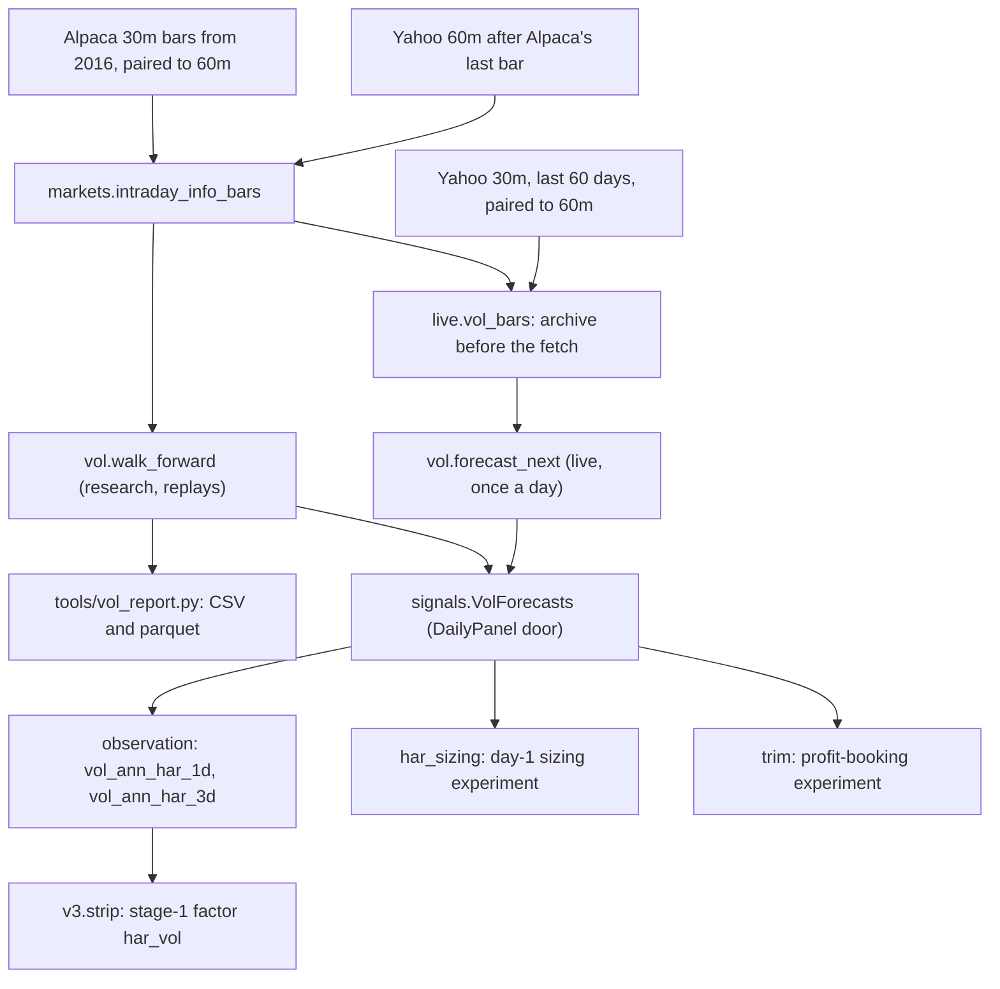

# The HAR volatility forecaster

> Snapshot 2026-10-10, main @ 81dcfb5. Built, tested and scored 2017-26; it feeds every LLM desk's observation and stage 1's `har_vol` factor (still running), but no rule built on it passed its gate, so the submitted book doesn't use it.

[icaif/vol.py](../icaif/vol.py) forecasts mean daily realised variance (RV) over the next 1 and 3
sessions for each of the 30 names and their equal-weight basket, with a log-HAR regression
(Corsi 2009) on RV from 60-minute bars, refit each quarter on rows whose target had ended. Out
of sample from 2017 to 2026-09-25 it cuts QLIKE against trailing 20-session RV by 12.3% at one
session and 16.0% at three for the 30 names pooled (t 14.8 and 10.6), and by 17.4% and 20.2%
for the basket; the names win in all 10 years (reports/vol_forecast.csv). The design bet that
volatility is more forecastable than direction here, so sizing, the exposure dial and exit bands
could lean on it (module docstring). Three such uses were scored on the contest score: entry
weights, entry exposure and profit booking. None passed the win rule fixed before scoring,
against the 75% inverse-vol hold and the rule desk (README "Day-1 HAR sizing", "News and profit
booking"). Today it reaches decisions only as two numbers per name and for the basket in the LLM
roles' observations, made live once a day by `vol.forecast_next`, and as the `har_vol` factor of
v3's stage-1 design.

## At a glance

| Item | Value | Source |
| --- | --- | --- |
| Code | `realised_variance`, `walk_forward`, `forecast_next`, `close_to_close_variance`, `qlike`, `oos_r2` | [icaif/vol.py](../icaif/vol.py) |
| Bars | 60-minute bars on the live :30 grid: Alpaca from 2016-01-04, then Yahoo | `markets.intraday_info_bars` |
| Target | log of mean daily RV over sessions D .. D+H-1; `HORIZONS = (1, 3)`, and 15 in the day-1 sizing experiment | `_har_frame`; `tools/har_sizing_report.py` |
| Regressors | log RV at lag 1, mean over 5 sessions, mean over 22 sessions | `HAR_COLUMNS` |
| Pools | the 30 names pooled (one coefficient set); the basket `_MKT` fit alone | `_pools` |
| Fit | OLS in logs, then a smearing factor (Duan 1983) | `_fit` |
| Refit | each calendar quarter start, expanding window, trained only on rows whose target ended before the refit | `walk_forward`, `forecast_next` |
| Live | once a day, cached per day under `output/live/<phase>/vol/<day>/` | `live.vol_forecasts` |
| Saved history | `data/derived/vol_forecasts.parquet`: 2017-01-03 to 2026-09-25, 31 tickers | `tools/vol_report.py --save-forecasts` |
| Evaluation | QLIKE and log R^2 against rv20, rw5, cc20 | `tools/vol_report.py`; reports/vol_forecast.csv |
| History | e79f4b2 (log-HAR), 82c9518 (smearing, gap tolerance), 96f9e40 (`horizons` argument) | git log |

## 1. Where it sits



Both `walk_forward` and `forecast_next` call `realised_variance` and then the same `_predict`.
The walk-forward that was scored and the live call that trades therefore can't drift apart
(the `_predict` docstring), and a test pins them equal (section 11).

## 2. Input: the information bars

`markets.intraday_info_bars()` returns Alpaca's free SIP 30-minute bars paired into the live
60-minute grid by `alpaca.to_60m`, followed by Yahoo 60m bars from Alpaca's last bar on. The
grid is 09:30-10:30 through 14:30-15:30, then 15:30-16:00. `to_60m` keeps a 60m bar only if both
of its 30-minute halves exist. With one half missing, the bar's open or close would silently be
the other half's, a price 30 minutes off (its docstring). A full session therefore has 7 bars:
six of 60 minutes and one of 30. A half-day (13:00 close) has 4.

- **Why Alpaca.** It is the organizer's own vendor. Paired the same way, its bars match the
  organizer panel to 0 bps on every open, close, high and low over 37.6k ticker-days (README
  "Alpaca is the organizer's vendor"). Yahoo's :30 opens differ from Alpaca's by a median of 0
  and a p99 of 21 bps.
- **Why this grid.** Live decisions execute at the :30 opens, and the live feed (Yahoo) is on
  the same grid. The RV the model trains on is therefore the RV the live feed produces.
- **Today's research snapshot.** `data/public/alpaca_30m_2026-09-27.parquet` runs from
  2016-01-04 to 2026-09-25, and `yahoo_60m_2026-09-25.parquet` from 2023-10-26 to 2026-09-24.
  Yahoo adds nothing past Alpaca's end. Both were inspected 2026-10-10. Where these come from and
  how to get them is in [01_data_streams.md](01_data_streams.md).

## 3. Realised variance (`vol.realised_variance`)

For name i and session D, with b = 1 .. B the session's bars (B = 7, or 4 on a half-day):

```
r[i,D,1] = log(close[i,D,1] / open[i,D,1])          first bar: from its own open
r[i,D,b] = log(close[i,D,b] / close[i,D,b-1])       b = 2 .. B
g[i,D]   = log(open[i,D,1] / close[i,D-1,B])        overnight gap from the prior session's close
RV[i,D]  = sum over b of r[i,D,b]^2  +  g[i,D]^2
```

"D-1" is the previous row of the session index, meaning the previous date that has any bars.
Holidays are not rows. The output is a session x ticker frame, plus a `_MKT` column for the
basket.

The design is close to grid-invariant. The organizer's :00 grid and the public :30 grid cut a
session into different bars, but their squared returns add up to about the same total (module
docstring). The overnight move is counted exactly once, as the gap. A test checks a +1% gap
followed by a +2% bar gives log(1.01)^2 + log(1.02)^2 on both grids.

**What becomes NaN, and why.** Each rule stops a hole from reading as a calm day:

| Case | Result | Silent failure prevented |
| --- | --- | --- |
| A name has fewer bars than the most any name has that day | NaN | One squared return fewer reads as a calmer session |
| A name's bars don't span the calendar session: the summed bar lengths differ from close minus open (`_spans_session`) | NaN | Yahoo has no 12:30-13:00 bar on half-days, for every name at once, so the peer check above can't see it |
| No prior close: the first session, or the day after a name lacked its last bar or the whole day | NaN | A gap counted as zero reads calm, and a gap from two sessions back counts two sessions' move as one night's |
| A session's close is the day's last bar row, NaN where a name lacks it (`_session_closes`, not `groupby().last()`) | NaN close | `last()` skips NaN, so a name missing its 15:30 bar would lend its 14:30 close, and the next gap would carry the last hour's move |
| The basket on a session where any member's RV is NaN | NaN | An average over whichever names are present is a different, noisier basket. This hit 19 sessions in 10 years (commit e79f4b2). |

**What is not caught.** A session missing for every name has no row, exactly like a holiday.
The next session's gap is then measured from the last session present, so it spans two sessions.
That conclusion comes from reading the code: `forecast_next`'s docstring says a missing weekday
"is not caught here (there is no holiday calendar)", and no test covers the all-names case.

**The basket.** `_MKT` uses the per-bar cross-sectional mean of the 30 names' bar log returns.
These are squared and summed over the session, and the squared mean gap is added. It is an
equal-weight basket, effectively rebalanced every bar. It is the contest's "market", and no
index is involved.

**Half-days stay in as ordinary sessions, on evidence** (module docstring; commit 82c9518).
Their RV is low (3.5 hours of trading), which looks as if it would drag the next forecast down.
In fact the sessions after a half-day are quiet holiday weeks. With half-days kept, the forecast
for the session after already runs high: realised/forecast is 0.86 over 21 half-days, 2017-26.
Treating half-days as gaps made the next day's 1-session QLIKE worse: 0.473 against 0.427 for the
names, and 0.510 against 0.442 for the basket. What does run high is the forecast of a half-day
itself (realised/forecast 0.62), because nothing in the model knows the session is short. No
half-day falls in the Official window (`calendar.EARLY_CLOSES`: the next is 2026-11-27).

**The close-to-close alternative** (`close_to_close_variance`) is a baseline only. It is the
20-session sample variance of daily close-to-close log returns, `min_periods=20`, shifted one
session so the row for D uses returns through D-1. The basket's return is the mean of the names'
returns on days when every name is present. It is named `cc20` in the evaluation.

**Units.** Everything is in daily variance of log returns, overnight included. Daily vol is
sqrt(var), and the annualised vol shown to the LLM roles is sqrt(252 x var)
(`signals.TRADING_DAYS`, `signals.annualised`). Note that `har_h3` is the *mean* daily variance
over the next three sessions, not the three-session total: the total is 3 x `har_h3`.

## 4. The regression (`_har_frame`, `_mean_available`, `_fit`, `_predict`, `_pools`)

For a forecast made before session D opens, for horizon H sessions:

```
y[i,D]   = log( mean of RV[i,D .. D+H-1] )        target: all H sessions required
x_d[i,D] = log( RV[i,D-1] )                       falls back to RV[i,D-2], then RV[i,D-3]
x_w[i,D] = log( mean of RV[i,D-5 .. D-1] )        over the sessions present; at least 3 of 5
x_m[i,D] = log( mean of RV[i,D-22 .. D-1] )       over the sessions present; at least 14 of 22

y[i,D]   = b0 + b1 x_d[i,D] + b2 x_w[i,D] + b3 x_m[i,D] + e[i,D]        OLS (numpy lstsq)

har_hH[i,D]   = exp(b0 + b1 x_d + b2 x_w + b3 x_m) * S
S             = mean of exp(e) over the fit's training rows                (smearing factor)
harlog_hH[i,D] = b0 + b1 x_d + b2 x_w + b3 x_m                             (the log fit, kept)
```

Windows count rows of the session index, not calendar days. `_har_frame` also builds
`x_20`: the log of the mean over D-20 .. D-1, needing at least 12 of 20 sessions. It is used only
as the rv20 baseline. Each row also records `target_end`, the session D+H-1, which the
walk-forward purges on.

| Constant | Value | What it prevents (code comments) |
| --- | --- | --- |
| `HORIZONS` | (1, 3) | the defaults; callers pass others (15 in `har_sizing_report`) |
| `MARKET` | `"_MKT"` | the basket's ticker |
| `HAR_COLUMNS` | `x_d`, `x_w`, `x_m` | |
| `MIN_WINDOW_SHARE` | 0.6 | "a 22-session mean over 8 sessions is a 2-week mean labelled a monthly one" |
| `LAG_FALLBACK` | 3 | one missing session blanks two RV sessions (its own and the next gap), so the lag reaches three back; further, "yesterday" is last week |
| `MIN_TRAIN_ROWS` | 100 | below it a refit is "a few points' noise presented as a coefficient"; `_fit` raises `ValueError` rather than fitting |

**Pooling.** `_pools` returns two masks: the 30 names, and `_MKT`. The 30 names share one
intercept and one set of slopes. A name's level reaches its forecast only through its own lagged
RV. The basket gets its own fit. Pooled in with the 30 names, it would carry 1/31 of the fit
and take on their level and persistence instead of its own (module docstring; a test rewrites
every stock and requires the basket's forecasts unchanged).

**Bias correction** (module docstring; commit 82c9518). exp(fit) is a median and runs low. The
lognormal correction exp(s^2/2) assumes normal residuals, but earnings jumps give the residuals
a right tail. Under that correction, stock forecasts ran 20% low out of sample (realised/forecast
1.20), so a vol target built on them would run 20% hot. Smearing brought the ratio to 1.07 and
improved 1-session stock QLIKE from 0.600 to 0.584. The remaining 7% (4% for the basket) all
comes from the top 1% of surprises. Drop those and the rest run 13% high. The docstring calls
this unforecast jumps, which "a smearing factor cannot fix and an earnings calendar might".

**Gaps in the regressors.** One missing session costs a name two RV sessions: its own, and the
next day's unknown gap. With strict windows, that blanked the name's forecasts for 22 sessions.
Live, one feed hole would have blanked a name for a month (commit 82c9518). Hence the lag
fallback and the 60%-share windows. **Targets stay strict**, because a target with a hole in
it is not the quantity being forecast.

## 5. Walk-forward (`vol.walk_forward`)

```python
def walk_forward(rv, first_test="2022-01-01", horizons=HORIZONS) -> pd.DataFrame
```

- **Refits** fall on calendar quarter starts (`pd.date_range(first_test, last session,
  freq="QS")`). For each horizon, each pool and each quarter, `_predict` fits on the pool's rows
  whose `target_end` is before the refit date and that have all of x_d, x_w, x_m and y. The
  window is expanding: every such row from the first session on. The fit then forecasts every
  row of the quarter. "A row whose 3-session target straddles the refit would train on the
  first days being forecast" (module docstring), so the cut is on the target's end, not its start.
- **Output.** Rows are (session, ticker). For each H: `har_hH` (the forecast), `harlog_hH` (the
  log fit before smearing), `rw5_hH` and `rv20_hH` (trailing means over 5 and 20 sessions),
  and `y_hH` (realised), all in mean daily variance. The trailing baselines are the same for
  every H.
- **First test date, by caller.** `tools/vol_report.py` uses `FIRST_TEST = "2017-01-01"`.
  `VolForecasts.from_bars` tries each quarter start from the first session and keeps the first
  where every pool and horizon has 100 training rows. That is 2016-07 for (1, 3) (README "Agent
  signals"; commit 50613d4) and 2016-10 for (1, 3, 15) (`har_sizing_report` docstring). With an
  expanding window, a session's forecast does not depend on `first_test`. That is why the 2016-10
  run in `har_sizing_report` matches the saved 2017 file to a maximum relative difference of 0
  (commit 96f9e40).
- **Failure.** A quarter with fewer than 100 complete training rows raises. The test
  `test_a_test_year_the_history_cannot_fit_raises_rather_than_forecasting_nan` explains why:
  an empty training set fits beta = 0 with a NaN variance, every forecast of the quarter comes
  out NaN and is dropped downstream, and the year's verdict is drawn from what survived.

## 6. Evaluation (`tools/vol_report.py`, reports/vol_forecast.csv)

**Method** (the tool's docstring and code):

- The walk-forward runs from 2017 on `markets.intraday_info_bars()`, at H = 1 and 3, for the 30
  names pooled, for the basket, and for each name alone.
- There are four forecasters of mean daily variance. `har` is the model. `rv20` is the mean RV
  of the last 20 sessions, the headline baseline. `rw5` is the mean RV of the last 5 sessions.
  `cc20` is the 20-session variance of daily close-to-close returns.
- **One common sample per horizon.** Only rows where every forecaster and the target exist are
  scored. "A forecaster excused from the rows it has no value on would be scored on easier days
  than the rest."
- **QLIKE** (Patton 2011): with r = realised / forecast, the loss is r - log(r) - 1, averaged.
  It is robust to noise in the realised proxy and is 0 for a perfect forecast. It punishes a
  forecast that runs low harder than one that runs high, which is what a vol-scaled position pays
  for.
- **Log R^2** (`oos_r2`) is 1 - SSE/SST around the sample's own mean, on log RV. HAR enters with
  `harlog`, not the bias-corrected variance, which would charge it s^2/2 of bias it does not
  have. The trailing baselines enter as they are: the log of a mean runs above the mean of logs,
  and that bias is part of what trailing vol costs. `corr2` (squared correlation, bias forgiven)
  shows how much of an R^2 gap is level offset alone. `ratio` is mean(realised / forecast): above
  1, a vol target sized on the forecast runs hot.
- **t-statistic.** The daily cross-sectional mean of the QLIKE difference (baseline minus HAR),
  divided by its sd / sqrt(n_days / H). Overlapping H-session targets are not independent.

**Pooled results, 2017-01-03 to 2026-09-25** (reports/vol_forecast.csv, rows `year = all`).
QLIKE is lower-better and log R^2 higher-better:

| H | Scope | Rows | QLIKE har | rv20 | rw5 | cc20 | QLIKE cut vs rv20 (t) | log R^2 har | rv20 | rw5 | cc20 |
| --- | --- | ---: | ---: | ---: | ---: | ---: | --- | ---: | ---: | ---: | ---: |
| 1 | 30 names | 71,155 | 0.5841 | 0.6661 | 0.7244 | 0.7458 | 12.3% (14.8) | 0.397 | 0.188 | 0.247 | 0.171 |
| 1 | basket | 2,309 | 0.4352 | 0.5271 | 0.5083 | 0.5740 | 17.4% (7.1) | 0.470 | 0.287 | 0.378 | 0.277 |
| 3 | 30 names | 70,887 | 0.3983 | 0.4742 | 0.5607 | 0.5575 | 16.0% (10.6) | 0.470 | 0.334 | 0.319 | 0.279 |
| 3 | basket | 2,291 | 0.3010 | 0.3770 | 0.3912 | 0.4421 | 20.2% (4.4) | 0.547 | 0.425 | 0.459 | 0.378 |

| H | Scope | realised/forecast har | rv20 | rw5 | cc20 | corr^2 har | corr^2 rv20 | QLIKE cut vs rw5 (t) | vs cc20 (t) |
| --- | --- | ---: | ---: | ---: | ---: | ---: | ---: | --- | --- |
| 1 | 30 names | 1.075 | 1.231 | 1.440 | 1.381 | 0.399 | 0.337 | 19.4% (15.7) | 21.7% (17.6) |
| 1 | basket | 1.036 | 1.147 | 1.256 | 1.259 | 0.471 | 0.386 | 14.4% (5.1) | 24.2% (8.4) |
| 3 | 30 names | 1.079 | 1.255 | 1.492 | 1.408 | 0.474 | 0.418 | 29.0% (11.6) | 28.6% (14.5) |
| 3 | basket | 1.056 | 1.189 | 1.332 | 1.321 | 0.548 | 0.479 | 23.1% (3.7) | 31.9% (5.8) |

**By year, H = 1** (same file):

| Year | names QLIKE har | rv20 | basket QLIKE har | rv20 | names log R^2 har | rv20 |
| --- | ---: | ---: | ---: | ---: | ---: | ---: |
| 2017 | 0.5825 | 0.6605 | 0.4194 | 0.4356 | 0.2103 | -0.0681 |
| 2018 | 0.5310 | 0.6445 | 0.4180 | 0.5612 | 0.3722 | 0.2226 |
| 2019 | 0.5751 | 0.6361 | 0.4660 | 0.5861 | 0.2481 | -0.0539 |
| 2020 | 0.5963 | 0.7436 | 0.6061 | 0.7700 | 0.4644 | 0.2564 |
| 2021 | 0.5149 | 0.5697 | 0.4287 | 0.5523 | 0.3093 | 0.0641 |
| 2022 | 0.4738 | 0.5186 | 0.3548 | 0.3510 | 0.2853 | 0.1382 |
| 2023 | 0.5956 | 0.6766 | 0.2922 | 0.3266 | 0.2682 | -0.0003 |
| 2024 | 0.7076 | 0.7984 | 0.4821 | 0.6356 | 0.2252 | -0.0892 |
| 2025 | 0.6454 | 0.7333 | 0.4560 | 0.5850 | 0.3068 | 0.0116 |
| 2026 (to 09-25) | 0.6007 | 0.6440 | 0.4034 | 0.4157 | 0.1908 | -0.0107 |

**Reading the numbers:**

- **Wins by year.** HAR beats rv20 on QLIKE in 10 of 10 years for the names at both horizons.
  The basket wins 9 of 10 at each horizon: it loses in 2022 at H = 1 (0.3548 against 0.3510)
  and in 2017 at H = 3 (0.2360 against 0.2308). On log R^2, HAR wins 10 of 10 everywhere except
  the basket at H = 3, which loses 2022 (all from the CSV). The prompts' line "It beat trailing
  20-day volatility out of sample in each of 10 years tested" (`prompts.py`) is exact for the
  names, not for the basket.
- **Wins by name.** HAR has lower QLIKE than rv20 for 29 of 30 names at both horizons. The
  exception is TSLA: 0.596 against 0.576 at H = 1, and 0.406 against 0.365 at H = 3. It has
  higher log R^2 for 30 of 30 at H = 1 and 29 of 30 at H = 3 (TSLA again, 0.160 against 0.199).
- **Most of rv20's R^2 deficit is level bias, but not all.** Forgive the bias and squared
  correlation still favours HAR: 0.399 against 0.337 for the names at H = 1.
- **The pooled R^2 overstates time-series skill.** Pooled over names and years, the total sum
  of squares includes the stable gap between a calm name and a wild one. At H = 1, per year it
  is 0.19 to 0.46 for the names, and per name over all years it is 0.17 (NKE) to 0.43 (XOM).
- **The residual bias differs by name.** HAR's realised/forecast at H = 1 runs from 0.855 (KO)
  to 1.354 (META), with a median of 1.049. Realised runs 31-35% above the forecast for META,
  NKE, INTC and TSLA, and 12-15% below it for KO and JNJ. The repo doesn't explain this spread.
  One shared intercept for all 30 names is a plausible cause, but that is unverified.

**History of the forecaster** (git log):

| Commit | Date | Change | Effect on the score |
| --- | --- | --- | --- |
| e79f4b2 | 2026-09-27 | log-HAR, exp(s^2/2) correction; RV holes fixed (session closes, span check, basket NaN, own basket fit, raise on an empty refit) | 1-session names: log R^2 0.397 against 0.187, QLIKE -10% (t 13.4); 29 of 30 names |
| 82c9518 | 2026-09-27 | smearing; lag fallback and 60% windows; half-days kept; `forecast_next` | realised/forecast 1.20 to 1.07; QLIKE cut 12.3% (t 14.8) |
| 96f9e40 | 2026-10-01 | `horizons` argument (no-op for the defaults); parquet re-saved | none |

Smearing and the half-day treatment were chosen by comparing QLIKE on this same 2017-26
walk-forward (82c9518). The numbers above are therefore out of sample for the coefficients,
but not entirely for those two choices.

## 7. Saved history (`data/derived/vol_forecasts.parquet`)

Written by `tools/vol_report.py --save-forecasts`, last on 2026-10-01 (file date; commit 96f9e40),
from the snapshots in section 2. It is not in git. The copy of record is at
`s3://shaanil/icaif2026/data/derived/` (commit f5dccea). Inspected 2026-10-10:

- **Shape.** 75,826 rows = 2,446 sessions (2017-01-03 to 2026-09-25) x 31 tickers (the 30 names
  plus `_MKT`). The index is (`session` date, `ticker`).
- **Columns.** `har_h1`, `harlog_h1`, `rw5_h1`, `rv20_h1`, `y_h1`, the same five for `_h3`,
  and `cc20_h1`, `cc20_h3`. The two cc20 columns are the same series.
- **Holes.** `har_h1` is missing in 58 rows (0.08%). These are 7 sessions: 2018-05-07 to 05-09
  (9 names and `_MKT` each day) and 2022-01-27 to 2022-02-01 (T, TMO, UNH, V, WMT, XOM and `_MKT`).
  Each follows a cluster of RV holes. `y_h1` is missing in 242 rows, on known data-hole days that
  include 2021-04-19, 2021-10-25, 2022-01-24, 2022-01-26 and 2022-03-08, the days the README lists
  under "Traps in the data".
- **Who reads it.** `har_sizing_report.forecasts` cross-checks its own forecasts against this
  file. Replays don't read it: `tools/agent_replay.py` and `tools/entry_replay.py` recompute with
  `VolForecasts.from_bars(market.info_bars, market.tickers)`.

reports/vol_forecast.csv (104 rows: 2 horizons x (2 scopes x 11 year rows + 30 names)) is not in
git either. CLAUDE.md: "reports/*.csv is regenerated by the tools". It sits in the main checkout's
`reports/`, written 2026-09-27, and in S3 under `reports/`. Its pooled QLIKE and ratios were
recomputed from the parquet on 2026-10-10 and match exactly.

## 8. Live path (`vol.forecast_next`, `live.vol_bars`, `live.vol_forecasts`)

1. **Who asks.** `runner.agent_inputs` loads each agent input on its own. The `"vol"` loader is
   `live.vol_forecasts(r.deadline, cfg.out / "vol" / str(r.day), tickers)`.
2. **Once a day.** If `har.parquet` and `har_meta.json` exist in the day's directory, they are
   read and nothing is fetched. "Once a day is exact, not an approximation": `forecast_next`
   reads only sessions that had closed, so every deadline of a session gets the same forecast.
   A test checks 09:10 and 12:25. Because later rounds read the file, a fetch failing at round 5
   can't blank the forecast.
3. **Bars** (`live.vol_bars`). Yahoo 30m bars for the 30 names over `VOL_PERIOD = "60d"` ("the
   regressors need 22 sessions and the lag"). `public_bars.completed` keeps only bars that had
   ended, because Yahoo serves the bar in progress as if it were complete. The bars are paired
   into the 60m grid by `alpaca.to_60m`, so the regressors come from the grid the fit was made
   on. The archive (`live.vol_archive`, which is `markets.intraday_info_bars`) supplies every
   session before the fetch's first. **The fetch wins every session it covers**: an archive
   taken during a session holds a partial day.
4. **Archive required.** "Without it the quarter's refit would train on the fetch's two months
   alone, a different model from the one the walk-forward measured." No archive means
   `vol_archive` raises. The runner records the error in the round's `inputs` and loads the other
   inputs anyway (a test). The desk then sees no HAR fields at all.
5. **Forecast** (`vol.forecast_next(info_bars, as_of)`):
   - `as_of` must be tz-aware (America/New_York), or it raises.
   - Bars of any session whose close is after `as_of` are dropped. "A half-finished session
     would otherwise read as a hole, or its first hours as a whole day."
   - The session to forecast is `as_of`'s own date if it is a weekday before that day's close,
     and otherwise the next business day (`pd.offsets.BDay`, which doesn't know holidays).
   - It raises if the last closed session is more than 4 days before the session forecast: "a
     feed that stopped would otherwise pass off a week-old lag as yesterday".
   - An empty row for the session is appended. The refit is that session's calendar quarter
     start, trained exactly as in the walk-forward.
   - It returns one row per name plus `_MKT`, with `har_h1` and `har_h3`. `attrs` carry
     `session` and `refit`.
6. **Cache.** `har.parquet` (attrs stripped, because pandas writes attrs as JSON and a date in
   them fails the write) and `har_meta.json`, with `archive_through`, `fetched_from`,
   `fetched_to`, `session`, `refit` and `made_at`.
   `signals.VolForecasts.from_live` serves it for that session only.

**An example.** The dry run of 2026-10-09
(`output/live/dryrun-20261009T042712/vol/2026-10-09/`) was made at 09:10 ET with refit 2026-10-01.
It used the archive through 2026-07-15 16:00, and the fetch from 2026-07-16 09:30 to 2026-10-08
16:00. Annualised, the basket was at 9.5% (H = 1) and 10.0% (H = 3). The names ran from 20.1%
(KO) to 65.3% (INTC), with a median of 29.7% at H = 1. That is the only live HAR file in the main
checkout's `output/live/`. The 2026-10-01 rehearsal's rounds have no `vol` entry in their
recorded inputs: they ran without the loader, which commit 50613d4 added.

**Vendor seam.** In that example, the newest ~60 sessions of the live fit (Jul 16 to Oct 8) came
from Yahoo 30m pairs. The walk-forward that was scored used Alpaca for every session it covers
(to 2026-09-25). The effect on RV, and so on the forecast, has not been measured (unverified).
The live = walk-forward test holds the bars fixed.

## 9. Serving and point in time (`signals.VolForecasts`)

`VolForecasts(frame, tickers)` wraps one `compiler.DailyPanel` per horizon found in the frame's
`har_hH` columns.

- `for_day(day, deadline)` returns the row for `day`, and raises `compiler.LookAheadError` unless
  the deadline falls on `day`. A day with no row is all NaN, which the observation shows as
  null.
- `trailing(day, deadline, n)` returns the last n rows dated on or before `day`, through the same
  door. "A cut one row late would put tomorrow's value into today's median, where no single
  lookup would show it."

Why a door and not care at each call site (the `signals.py` docstring): "The forecast for D+1
already contains D's realised variance, so an off-by-one that handed a round-1 decision
tomorrow's row would read as a forecaster that sees the day coming." A forecast for D is made
before D opens. It is served for all 7 rounds of D and never updated during the session.

## 10. Uses

### 10.1 Agent signals: in every LLM role's observation (Roadmap step 2, commit 50613d4)

`Desk._signals` puts `vol_ann_har_1d` and `vol_ann_har_3d` (sqrt(252 x `har_h1`) and
sqrt(252 x `har_h3`)) on each name's row and in `market` for the basket. They are rounded to 4
decimals (`observe._signal`). After entry, `vol_ann_har_3d_at_entry` shows the entry day's value
(`Desk._snapshot`), so a change since entry is a comparison in the payload rather than
something the model must remember.

| Desk | What reads it | Source |
| --- | --- | --- |
| v1 (the live shadow; `agents/desk.py`) | every role; replays use the walk-forward, live uses `forecast_next` | README "Agent signals" |
| v2 (`agents/v2.py`) | in the `CORE` per-name fields; the quant analyst also gets the market's vol fields | `v2.CORE` |
| v3 (`agents/v3.py`) | the PM when it reads raw data; the quant analyst (per name and market) and the market analyst (market) in the reports arms | `V3Desk._entry_analysts`, `BASIC_NAME` |

The rule desk is handed the same observation and ignores it. It still equals
`q_riskparity_entry_regime` trade for trade in all 167 windows (README "Agent signals"). The
prompts describe the fields as "the HAR model's forecast of annualised volatility over the next
1 and 3 sessions" (`prompts.py`, `prompts_v2.py`, `prompts_v3.py`). What an LLM does with them
is unmeasured until the stage-1 factor reports (10.5).

### 10.2 The self-check: HAR is not used (a correction to the plan)

`v3_desk_plan.md` specified "expected book vol from the HAR forecast and the shrunk covariance".
The code as built ([icaif/agents/selfcheck.py](../icaif/agents/selfcheck.py), commit d7224b7,
identical in the owner's v3 worktree) does not do that. `expected_vol_ann` is
sqrt(w' C w) x sqrt(252), where C is the Ledoit-Wolf covariance (`quant.shrunk_cov`) of the last
60 sessions' daily log returns (`qs.SHAPE_DAYS`). The module says why: "It reads no HAR forecast
and no model score: an ablation that drops one of those streams must not get it back here." A
test checks that a dropped stream reaches no role, the check included. If you want HAR in the
check for the paper, make it conditional on the `har_vol` stream.

### 10.3 The trim rule: HAR is its unit (Roadmap step 5; [icaif/trim.py](../icaif/trim.py))

The rule measures in HAR units. `sigma` is the name's daily HAR vol for the decision's day,
sqrt(`har_h3`) (`trim.HORIZON = 3`, `trim.sigma_today`). At a morning review from day 2, it
trims `fraction` of a held name when three things hold. The name is still a winner: gain
g >= a x sigma x sqrt(n sessions held). It has turned: give-back from its high dd >= b x sigma.
And the expected give-back over the h sessions left beats `COST` (0.002 round trip) plus
`rank_hit`. It trims a name at most once per window, at most `MAX_TRIMS = 3` times a window,
and never sells under `MIN_TRIM = 0.005` of NAV. The `expanding` and `rolling3y` estimators
(`trim.GiveBack`) normalise every past state by the same sigma: zg = g/(sigma sqrt n),
zdd = dd/sigma, and y = forward return/(sigma sqrt h). They read only windows that ended before
the asking window began.

The settings were chosen on the 146 windows of 2016-25, committed in 8e59c1e (51127ed before a
rebase), and scored once on Jan-Jun 2026. Paired score differences on the no-clone field, SE in
brackets, negative is better (README "News and profit booking"):

| Setting | 2016-25 vs rule | vs hold | Jan-Jun 2026 vs rule | vs hold |
| --- | --- | --- | --- | --- |
| trailing a0.5 b2 f0.25 | -0.017 (0.008) | -0.009 (0.029) | 0.000 (0.027) | +0.101 (0.224) |
| expanding a0.5 b1 f0.25 | 0.000 (0.000) | +0.009 (0.031) | 0.000 (0.000) | +0.101 (0.226) |
| rolling3y a0.5 b2 f0.5 | -0.003 (0.003) | +0.005 (0.030) | +0.018 (0.039) | +0.119 (0.221) |

Nothing won, and the rule desk does not trim. The finding is stated in HAR units. Over
2016-25, a name still up after giving back at least one daily HAR sigma from its high went on
to gain, on average, 15 to 340 bps by the window's end. That held in every vol tercile, so the
estimated give-back is negative almost everywhere (README).

### 10.4 Day-1 HAR sizing (Roadmap step 3; [icaif/har_sizing.py](../icaif/har_sizing.py))

**The question.** Does HAR improve the one decision that costs no extra turnover, the entry?
Every rule that trades after entry had already lost to the hold (`har_sizing.py` docstring).
Each variant is bought once and held. With HAR switched off, each equals its reference trade for
trade (a test), so a score difference is HAR's doing alone.

- **1. Weights.** `HarInverseVolHold(weights_h=H)`: w proportional to 1/sqrt(`har_hH`), at
  gross `E_REF = 0.75`. This replaces `InverseVolHold`'s vol over the last 20 x 7 hourly bars.
- **2. Exposure.** `HarExposure(horizon, typical_days, lo, hi)`: e = clip(0.75 x typical /
  forecast, lo, hi), in vol. Typical is sqrt of the median of the basket's last `typical_days`
  forecasts at that horizon, read through `trailing` and including the entry day's. It needs at
  least 60% of them, or there is none. A forecast is compared with forecasts, not with realised
  RV: RV is right-skewed, so its median sits below any forecast of its mean, and every entry
  would lean low. Worked example from the test: a basket forecast at 4x its typical variance (2x
  the vol) halves 0.75 to 0.375.
- **3. Both.**
- **4a.** `HarRiskParity(vol_h=H)`: risk parity on `har_covariance(C, HAR vols)`, the
  60-session shrunk covariance with its vols replaced by HAR's and its correlations kept.
  Without the kept correlations, risk parity becomes inverse-vol under another name (a test).
- **4b.** The HAR exposure instead of (`har`), averaged with (`mean`) or capping (`min`) the HMM's.
- **4c.** 4a and 4b together.
- **Fallbacks.** A name or basket without a forecast takes the reference's own shape or exposure,
  and each fallback is logged in `fallbacks`. "A book that quietly ran on the reference would
  score as a HAR book that happened to tie."

**Discipline** ([tools/har_sizing_report.py](../tools/har_sizing_report.py)):

- **Grid, fixed before any scoring (96f9e40).** Horizons {1, 3, 15}; typical {250, 750}
  sessions; clips {[0.5, 0.95], [0.25, 0.95], [0.6, 0.9]}; modes {har, mean, min}.
- **Selection.** 146 non-overlapping 15-session windows (starts 2016-10-11 to 2025-11-26). The
  choice is the lowest mean score on the no-clone field: the modelled field without
  `inv_vol_hold`, a near-clone that hands any non-copy about 0.1 of score. See
  [00_contest_and_evaluation.md](00_contest_and_evaluation.md).
- **Win rule (96f9e40).** Negative against both references on both fields in both splits, and
  more than 2 SE below zero on the no-clone selection windows.
- **Order of events.** The choice was committed in 832878c, and `--holdout` refuses to run until
  it is. The holdout was then scored once on the 109 rolling Jan-Jun 2026 windows (8
  independent), commit f5dccea. `reports/har_sizing_holdout.json` records the look: 2026-10-01
  13:11 UTC, `choice_commit` 832878c, 1 look.

Chosen settings and results, paired score difference on the no-clone field, SE in brackets,
negative better ([reports/har_sizing_choice.json](../reports/har_sizing_choice.json),
[reports/har_sizing_holdout.json](../reports/har_sizing_holdout.json)):

| Variant, chosen setting | 2016-25 vs hold | vs rule | Jan-Jun 2026 vs hold | vs rule |
| --- | --- | --- | --- | --- |
| 1. Weights on HAR, h15 | -0.029 (0.021) | -0.038 (0.034) | +0.018 (0.080) | -0.083 (0.241) |
| 2. Exposure: h15, median of 250 sessions, clip [0.6, 0.9] | +0.027 (0.011) | +0.019 (0.032) | 0.000 (0.034) | -0.101 (0.225) |
| 3. Both | -0.022 (0.022) | -0.031 (0.033) | +0.023 (0.078) | -0.078 (0.237) |
| 4a. Rule desk, HAR h15 vols in risk parity | -0.007 (0.030) | -0.015 (0.021) | +0.085 (0.214) | -0.016 (0.057) |
| 4b. Rule desk, HAR exposure instead of the HMM | +0.002 (0.030) | -0.007 (0.013) | +0.110 (0.230) | +0.009 (0.036) |
| 4c. Both inside the rule desk | +0.005 (0.030) | -0.003 (0.024) | +0.092 (0.210) | -0.009 (0.051) |

The references score 2.719 (hold) and 2.728 (rule) on 2016-25, and 2.842 and 2.943 on the
holdout. **Nothing beat the hold, and nothing is wired into the desk** (README "Day-1 HAR
sizing"; f5dccea):

- **No variant could have won.** None was 2 SE below zero in selection.
- **HAR exposure lost at every one of its 18 settings**, in both eras and on both fields, and
  the more a setting could lean, the more it lost. The chosen setting lost rank on return
  (+0.06), Sharpe (+0.02) and drawdown (+0.03).
- **HAR weights were the one consistent sign in selection.** They were -0.018 in 2016-22 and
  -0.051 in 2023-25, but only 1.4 SE overall. On the holdout they came to +0.018: 17 windows
  better, 18 worse, 74 the same. A few percent of reweighting rarely moves a rank. h15 and h3
  tied exactly, and the tie-break by name took h15.
- **Fallbacks.** The 2022-01-31 window lacked forecasts for 6 names (the Jan 2022 hole in
  section 7). The 250-session typical level needs 150 forecasts, so the 10 windows before 2017-06
  took the reference's exposure. No holdout window fell back.

### 10.5 Stage 1: the `har_vol` stream (v3; see [09_stage1_doe.md](09_stage1_doe.md))

- **What the stream is.** `v3.STREAMS` includes `har_vol`, the fields `vol_ann_har_1d` and
  `vol_ann_har_3d` on names and market, plus their `_at_entry` copies. `v3.strip` removes all of
  them when the stream is out, before any role or analyst slice is built. A test drops each
  stream in turn and requires it absent from every payload while every kept stream is present.
- **Its place in the design.** It is factor A of the 2^(7-3) resolution IV design
  (`v3.FACTORIAL_ORDER`, `v3.STREAMS16`). HAR is out in runs 1-8 and in for runs 9-16. Its
  effect is the per-window mean score of the 8 arms with it minus the 8 without, averaged over
  the 13 selection windows. It is kept only if it helps by more than one SE
  (`tools/doe_report.py streams`; `stage1_doe.md`).
- **Round 1 chose `reports_only`** (6ae9ed6). In that architecture the PM's own view
  (`BASIC_NAME`, `BASIC_MARKET`) has no HAR field. HAR reaches the PM only through the quant and
  market analysts' reports, so the factor measures HAR as digested by Gemini 2.5 Flash (medium),
  not as read by the PM.
- **Status.** At 15:04 IST on 2026-10-10, the owner's v3 worktree held complete runs 1-12 and 16
  (each with its `windows.csv`) under `output/entry/v3_reports_only_free_s16rNN_select_13w/`.
  Runs 13-15, all with HAR in, were still to come, so the HAR main effect can't be computed
  yet. Don't read it off a partial, unbalanced set of runs.

### 10.6 Planned: plan conditions in HAR sigmas (stage 2)

`schemas.Condition` has the kind `move_from_entry_sigma`, whose threshold is "in daily HAR
sigmas, signed". v3's PM may write such a condition at entry, and code validates it then
(`tests/test_v3.py`). Evaluating it is stage 2's escalation chain, which isn't built at 81dcfb5.
Nothing yet says which horizon's sigma, or which day's (entry or today), a "sigma" is. See
[10_stage2_escalation_chain.md](10_stage2_escalation_chain.md).

### 10.7 Where HAR is not used

| Place | Its volatility | Source |
| --- | --- | --- |
| The submitted rule desk (`q_riskparity_entry_regime`) | the 60-session shrunk covariance's own vols; HMM exposure | [04_ou_process_and_quant_signals.md](04_ou_process_and_quant_signals.md) |
| The 3-sigma event trigger | std of the last 20 daily log returns (inline in v1's `Desk`; `triggers.SIGMA_DAYS = 20` in v2) | `agents/desk.py`, `agents/triggers.py` |
| The score compiler | `compiler.trailing_daily_vol` (20-session std, shifted one session) | `compiler.py` |
| The self-check | shrunk covariance only | 10.2 |
| `vol_ann_20d`, `basket_vol_ann_ewma`, `vol_vs_3y_median` in the observation | trailing and EWMA vols | `agents/observe.py` |

## 11. Tests that pin it

| Test | The silent failure it prevents |
| --- | --- |
| `test_vol::test_realised_variance_is_intraday_squared_returns_plus_the_squared_gap` | the overnight move counted twice or not at all, on either grid |
| `test_vol::test_a_session_with_no_prior_close_gets_no_variance_rather_than_a_gapless_one` | an unknown gap read as zero; a 14:30 close lent to the next gap |
| `test_vol::test_a_session_missing_bars_gets_no_variance_rather_than_a_calm_one` | a hole read as calm; a 29-name basket passed off as the 30 |
| `test_vol::test_a_half_day_missing_its_last_half_hour_for_every_name_is_not_a_calm_session` | Yahoo's missing 12:30 half-day bar, invisible to the peer check |
| `test_vol::test_a_forecast_does_not_move_when_the_future_is_rewritten` | look-ahead through the regressors or the refit (RV x10 from a date on) |
| `test_vol::test_the_market_forecast_is_not_fit_on_the_stocks` | the basket fit on the names' persistence |
| `test_vol::test_a_test_year_the_history_cannot_fit_raises_rather_than_forecasting_nan` | a NaN quarter silently dropped from a verdict |
| `test_vol::test_one_missing_session_does_not_blank_a_name_for_weeks` | a name blanked for 22 sessions by one hole |
| `test_vol::test_the_live_forecast_is_the_walk_forward_forecast_and_reads_no_later_bar` | trading a forecast nobody scored; reading a bar after the deadline |
| `test_vol::test_a_stale_feed_raises_rather_than_passing_last_week_off_as_yesterday` | a stopped feed passing off a week-old lag |
| `test_live::test_the_live_har_forecast_reads_no_later_bar_prefers_the_fetch_and_is_made_once_a_day` | a stale archive copy of a recent day; a round-5 fetch failure blanking the day |
| `test_runner::test_a_har_forecast_that_cannot_be_made_is_recorded_and_the_other_inputs_still_load` | one failed signal taking the round's other inputs with it |
| `test_signals::test_the_har_vols_the_entry_sees_are_unchanged_when_every_later_bar_is_rewritten` and `test_a_signal_asked_for_on_another_day_raises_rather_than_serving_it` | an off-by-one row in the observation |
| `test_har_sizing` (10 functions, 27 cases with parameters) | the wrapper moving trades itself; later trades; a leaking typical-level median; a variant wired to the wrong number; a missing forecast scored as a tie |
| `test_trim::test_the_give_back_history_reads_no_window_that_had_not_ended_by_the_asking_window` | the HAR-normalised give-back table handing a window its own future |
| `test_v3::test_a_dropped_stream_reaches_no_role_and_every_other_stream_still_does` | an ablation that still carries HAR somewhere |

Run them with `.venv/bin/python -m pytest -q tests/test_vol.py tests/test_har_sizing.py`. The
whole suite takes about 85 s (CLAUDE.md).

## Contest-specific vs general

| Piece | Contest-specific today | General as built |
| --- | --- | --- |
| Universe | the organizers' fixed 30 US large caps | any panel; the pooled fit has no per-name parameters |
| "Market" | equal-weight basket of the 30, NaN if any member is missing | a separately fit aggregate series |
| Bars | 60-minute bars on the :30 grid the contest executes on (7 a session) | RV is a sum of squared bar returns plus the gap, close to grid-invariant |
| Calendar | NYSE hours and `calendar.EARLY_CLOSES`, US Eastern timestamps; `BDay` with no holidays | the completeness rules (peer count, span, prior close) |
| Horizons | 1 and 3 sessions for the roles; 15 = the window, for sizing | any `horizons=` |
| Fit | log-HAR, two pools, smearing, quarterly expanding refit purged on target end | all of it |
| Live | Yahoo 30m (60 days) on top of an Alpaca archive; once a day; cached per phase | archive plus fresh feed, the fresh feed winning its sessions |
| Point in time | forecast for D made before D's 09:30 open, served for D's 7 rounds | the `DailyPanel` door |
| Forecaster evaluation | 30 names and their basket, 2017-26 | QLIKE, log R^2, common sample, overlap-corrected t |
| Evaluation of uses | rank-based contest score against a modelled field, 15-session windows, turnover ranked | the selection, commit, single-look discipline |

The forecaster itself is general. Its verdicts on use (sizing, exposure, trims) are
contest-specific. They were won or lost on a score that ranks turnover and drawdown against
rivals over 15 sessions, with a field that crowds just above a pure hold.

## Generalizing for the paper

**What to change in [icaif/vol.py](../icaif/vol.py)**

1. **Calendars.** `_spans_session`, `forecast_next`'s closed-session filter and
   `_session_to_forecast` all read the single US calendar in `icaif/calendar.py`. For other
   markets, pass an exchange calendar in. Three things to watch:
   - **Lunch breaks.** `_spans_session` compares summed bar lengths with close minus open, so a
     market with a midday break (Tokyo, Hong Kong) would fail every session. Compare against the
     scheduled trading minutes instead.
   - **Holidays and weekends.** `_session_to_forecast` uses `BDay`, which assumes Monday-Friday
     and no holidays. Replace it with the exchange's session list.
   - **Whole-market holes.** A day missing for every name passes as a holiday (section 3). An
     exchange calendar can catch it.
2. **The basket.** `_MKT` needs every member present. At several hundred names, a session
   without some member missing will be rare, and the basket will be mostly NaN. Use an index's
   or an ETF's own RV, or a coverage threshold, with one basket and one pool per market.
3. **Pools.** One intercept and one set of slopes serve all 30 names. Per-name realised/forecast
   already spans 0.86 to 1.35. A broader universe (small caps, other sectors, other asset classes)
   argues for pooling by group, adding per-name intercepts, or per-name fits shrunk to the pool.
   Extend `_pools` and keep the basket test.
4. **Horizons.** A generic PM rebalancing weekly or monthly wants H = 5, 22 or 66. `walk_forward`,
   `forecast_next` and `VolForecasts` already take `horizons`. Check that the basket still has
   100 training rows with ended targets at the first refit (`MIN_TRAIN_ROWS`).
5. **Regressors.**
   - **Earnings.** The residual bias is in the top 1% of surprises (section 4). An earnings-day
     flag is the module's own suggestion. It must be known before the open. EDGAR records a
     release only after it happens (README "Daily-model features"). Replays therefore show a
     future release only within `earnings.NEXT_KNOWN_SESSIONS = 10` sessions, because "companies
     publish the date roughly two to four weeks ahead". Live uses a dated Yahoo calendar
     (`live.CalendarEarnings`). Reuse these, and see [06_sec_filings.md](06_sec_filings.md).
   - **Standard HAR extensions.** Jumps and semivariances (HAR-J, HAR-RS) and a measurement-error
     term (HARQ) are suggestions; none has been tried here.
   - **Implied vol.** VIX is already in the daily context series (README "Daily data"). Single-name
     option IV is not in the repo.
6. **Finer RV.** Seven bars a session make a noisy RV, so QLIKE (robust to proxy noise) is the
   metric to trust and R^2 is not. Five-minute bars would mean a new Alpaca fetch:
   `tools/alpaca_report.py` fetches 30m bars, and needs the Alpaca keys the repo keeps in `.env`.
   Re-run the parity checks of [01_data_streams.md](01_data_streams.md) on any new grid.
7. **Record the fit.** Coefficients and smearing factors per refit are not saved anywhere. A paper
   table needs them. Return them from `_predict` beside the forecasts.

**What to keep.** Keep `_predict` as the single place a forecast is made, the purge on
`target_end`, the strict targets, the `DailyPanel` door, the logged fallbacks, and the test that
pins live to walk-forward. `tools/vol_report.py` already evaluates any panel per scope, year and
name. Add per-market and per-sector scopes.

**Uses worth testing outside the contest**

- **Risk model.** `har_sizing.har_covariance` (HAR vols on shrunk correlations) as the covariance
  for risk parity or minimum variance, rebalanced on a schedule with linear costs. Score the
  book's realised/forecast vol and its net Sharpe, not ranks.
- **Vol targeting.** The contest tested one read at entry, scored by rank over 15 sessions. A
  continuous target over months, with costs charged and no turnover rank, is a different question.
  The repo's motivating citation is Moreira & Muir 2017 (`quant.vol_target_exposure`).
- **An LLM input with no text.** HAR is made by code from prices, so it is a clean control in a
  stream ablation. Rerun factor A with a stronger model, more names and several markets, and with
  the PM reading raw HAR rather than an analyst's report of it.

**Pitfalls**

- **Look-ahead.** Keep the target-end purge when you lengthen horizons, because more rows fall
  inside the purge before each refit. Any intraday update needs its own definition of a partial
  session's RV: today `forecast_next` drops the session in progress entirely. A median or z-score
  of forecasts must go through `trailing`, as `HarExposure` does. Every new regressor needs a
  test that rewrites the future and requires past forecasts unchanged, like
  `test_a_forecast_does_not_move_when_the_future_is_rewritten`.
- **Survivorship.** The 30 names were chosen for the 2026 contest, so the 2017-26 evaluation is
  conditional on survival to 2026. For a larger universe, use point-in-time membership (`universe.build`,
  fja05680/sp500). Yahoo has no prices for delisted names: 45% of S&P 500 members are priced in
  1999 against 99% in 2026 (README "Daily data for the broad model"). Alpaca's coverage of
  delisted symbols is unverified.
- **Vendor differences.** Research RV is Alpaca and live RV's newest ~60 sessions are Yahoo, and
  their effect on RV is unmeasured (section 8). Yahoo also lacks the 12:30 half-day bar (handled)
  and serves bars in progress (handled by `public_bars.completed`). A new market or vendor needs
  the same audits.
- **LLM knowledge-cutoff contamination.**
  - **The forecast itself** can't be contaminated: it is code over prices.
  - **A model reading it** can be, if it remembers the period the numbers come from. Stage 1's
    windows are tiled after Gemini 2.5's January 2025 cutoff (`v3.STAGE1`). A stronger model with
    a later cutoff makes them in-sample, so re-tile per model and probe with
    `tools/memory_probe.py`.
  - **Anonymised replays** hide tickers and dates but not vol levels. A basket at crisis-level vol
    may date a window by itself. That is a hypothesis, not measured.

## Open questions and gaps

- **HAR's value to an LLM is unmeasured.** Stage-1 factor A awaits runs 13-15 (10.5). No replay
  has counted how roles cite or use `vol_ann_har_*`.
- **No rule built on HAR has passed its gate.** Day-1 sizing and trims both failed. A generic PM
  objective is untested.
- **The self-check doesn't use HAR, although the plan says it should.** The plan says HAR plus
  shrunk covariance; the code says shrunk covariance only, deliberately (10.2). If the paper
  describes the self-check, follow the code.
- **`move_from_entry_sigma` is undefined in code.** Its horizon, and whether the sigma is the
  entry day's or today's, are open, and so is its evaluator (10.6).
- **Name-level bias.** Per-name realised/forecast runs 0.86-1.35, and the cause (pooled intercept,
  earnings jumps or both) is not established.
- **The live-vs-research vendor seam is unmeasured** (section 8).
- **Half-days.** A half-day's own forecast runs high (realised/forecast 0.62). It is not adjusted,
  and none falls in Official.
- **Whole-market missing days aren't detected** (section 3).
- **Per-refit coefficients and smearing factors aren't saved**, so the model can't be described
  in a table without rerunning.
- **Neither result file is in git.** reports/vol_forecast.csv and
  data/derived/vol_forecasts.parquet are only on local disk and in S3. Regenerating them needs
  the dated `data/public/` snapshots, which Yahoo can't refetch.
- **Two design choices are not fully out of sample.** Smearing and the half-day treatment were
  chosen on the 2017-26 walk-forward that also reports the score (section 6).
- **No variants or alternatives have been compared.** No per-name or rolling-window fits, no
  HAR-J, HAR-RS or HARQ, and no implied-vol regressor.
