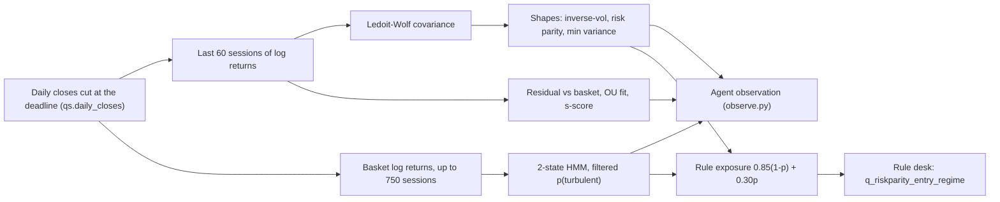

# The OU process and the quant signal layer

> Snapshot 2026-10-10, main @ 81dcfb5. Models built 2026-09-29 to 2026-10-01 and unchanged since: no quant rule beat the 75% inverse-vol hold, and the risk-parity rule desk lives on as Validation's submitted book, v1's fallback and a reference column.

This layer is the repo's classical quant code, built on daily closes: an
Ornstein-Uhlenbeck (OU) fit to each name's cumulative residual against the 30-name
basket, read as an s-score; a two-state Gaussian HMM on the basket that reads the
regime; a Ledoit-Wolf covariance under inverse-vol, risk-parity and minimum-variance
books; exposure dials; Black-Litterman views; and a Monte Carlo controller that plays
for rank. Each piece either feeds the agents' observation (`ou_s_score`, the two regime
fields, `weight_if_inverse_vol`, `weight_if_risk_parity`) or is the rule an LLM desk must
beat. The race over 167 fifteen-session windows (2016-2026) found that every rule that
trades after entry lost to the hold by 0.3 to 1.2 score points, and that the one apparent
win, risk parity bought once (about 0.1 better in both eras; -0.10, SE 0.04, over all 167
windows at the regime's exposure), was an artefact of a near-copy of the reference in the
modelled field (commits 43b9e75, 086e963). One warning was measured for this hand-off,
not in the repo: the s-score the agents read is null on 92% of name-days, and the scores
that do appear come at the rate and size its filter passes on pure noise (section 2.4).

| Piece | Code | Who reads it | Verdict |
| --- | --- | --- | --- |
| OU s-score | `quant.fit_ou`, `quant.s_scores` | `ou_s_score` in every desk's observation (all v1 roles; v2's quant analyst; v3's PM and quant analyst), never ablated; `q_ou_tilt` | tilt lost: +0.31 / +0.40 |
| Regime read | `quant.HMM2`, `fit_hmm2`, `hmm_filtered`, `hmm_next_turbulent` | the rule's entry exposure; roles as two `market` fields (v1 shown, v2 hidden, v3 an ablatable stream) | daily dial lost; entry dial ties a fixed 75% |
| Shapes | `quant.shrunk_cov`, `risk_parity`, `min_variance`; `quant_strategies.SHAPES` | roles as `weight_if_*`; v3's self-check; the rule desk | no shape beats the hold without the clone |
| Exposure dials | `quant.drawdown_exposure`, `vol_target_exposure`; `quant_strategies.QuantBook` policies | race only | all lost |
| Rule desk | `quant_strategies.CANDIDATES["q_riskparity_entry_regime"]`; `agents/desk.py` with `RuleBrain` | live runner (`--submit rule`), v1 fallback, every report's reference column | ties the hold on the no-clone field in 2016-25; trails it by 0.10 on H1 2026 |
| Black-Litterman views | `quant.black_litterman`, `agents/signals.py` | v1 Strategist's `views` lever only | does not pay as a rule |
| Rank-play controller | [icaif/rankplay.py](../icaif/rankplay.py) | research only | ties the rule |
| Blends | `quant_strategies.shape_blend` | research only | no edge on the no-clone field |

Not here: [icaif/parity.py](../icaif/parity.py) is data-source parity (organizer panel
against Yahoo), not risk parity; see [01_data_streams.md](01_data_streams.md). The HAR
forecaster, and the day-1 HAR sizing that reused these shapes, are in
[03_har_vol_forecaster.md](03_har_vol_forecaster.md). The score, the fields and the
windows are defined in [00_contest_and_evaluation.md](00_contest_and_evaluation.md).

## 1. Inputs: daily closes, cut at the deadline



- **One door.** Every model here reads its closes through
  `quant_strategies.daily_closes(ctx, n)` ([icaif/quant_strategies.py](../icaif/quant_strategies.py);
  rank-play also reads past fills for its scenarios, section 9): the last bar of each
  session from the market's information bars, built once per market and cut at the
  decision's deadline by each day's last bar. A row dated on or after the deadline's own
  day is dropped (a714fd7). Without that, a live market, which holds only the bars
  fetched so far, would pass today's latest bar as today's close: every daily return and
  the regime fit would carry a partial day, and the 3-sigma trigger would compare today's
  price with itself and never fire. Round-1 decisions could not change, since no bar of
  their own day has ended by 09:10. Test: `test_a_session_still_trading_is_not_a_daily_close`.
- **Windows.** `HISTORY_DAYS = 750` sessions (about three years) for the HMM and the
  vol-target reference; `SHAPE_DAYS = 60` for the covariance, the shapes and the OU fit.
  Returns are log returns of closes.
- **The basket.** `quant_strategies._basket` is the mean of the 30 names' daily log
  returns, NaN on any day a member is missing, "since a mean over whoever happens to be
  present is a different basket". `quant.s_scores` does not use it (section 2.1).
- **Backtests** read the research market (`markets.research_market()`: Alpaca :30 opens
  from 2016 as fills, information bars from Alpaca then Yahoo 60m). **Live** reads Yahoo
  daily closes, 1,200 calendar days fetched; fewer than 751 sessions raises
  `LiveDataError` rather than fit the regime on less
  (`test_too_short_a_history_raises_rather_than_fitting_the_regime_on_less`). On 7 past
  entry days the live rule on Yahoo closes and the research desk on Alpaca bars agreed:
  gross within 0.0011, the largest single-name gap 0.0016, the summed gap at most 0.015
  (README "Live runner").

## 2. The OU residual model and its s-score

### 2.1 Construction, as coded

`quant.s_scores(returns, max_half_life=None)` ([icaif/quant.py](../icaif/quant.py))
follows Avellaneda and Lee (2010), per the docstring, with one factor: the basket.

```
r_{i,t}   daily log return of name i, t = 1..n (n = 60 sessions before the decision)
M_t       = mean over the names present on day t of r_{i,t}     (pandas skips NaN)
r_{i,t}   = alpha_i + beta_i * M_t + e_{i,t}       OLS with intercept, on days both exist (>= 20)
X_{i,k}   = e_{i,1} + ... + e_{i,k}                 cumulative residual
X_{k+1}   = a + b * X_k + eps                       OLS AR(1)  (quant.fit_ou)
b in (0,1) is the exact discretisation of an OU with b = exp(-kappa), so
kappa     = -ln b                                   per session
m         = a / (1 - b)                             long-run level
sigma_eq  = sd(eps, ddof=2) / sqrt(1 - b^2)         stationary sd
half_life = ln 2 / kappa                            sessions
df_t      = (b - 1) / se(b),  se(b) = sd(eps, ddof=2) / sqrt(sum_k (X_k - mean X)^2)
s_i       = (X_{i,n} - m) / sigma_eq   if df_t < -2.86 and half_life <= n/2, else NaN
```

| Rule | Constant or code | Effect, and the reason the code gives |
| --- | --- | --- |
| Days where every name is NaN are dropped first | `returns.dropna(axis=0, how="all")` | such a day counts neither toward n (and so the half-life cap) nor in any fit |
| A name needs 20 days aligned with the basket | `ok.sum() < 20` | otherwise it gets no row, so NaN |
| `fit_ou` needs 10 finite points | `len(x) < 10` | otherwise an all-NaN fit |
| b outside (0, 1) | `OUFit(nan, ..., df_t)` | "not a mean-reverting process at all (a random walk or an oscillation)", so no huge or negative kappa is returned |
| Dickey-Fuller rejection at 5% | `DF_CRITICAL_5PCT = -2.86` (MacKinnon, regression with a constant) | keeps noise from scoring as a stretched residual (2.2) |
| Half-life at most `max_half_life` | default `n / 2` = 30 sessions | "Avellaneda and Lee's filter", which "on its own passes random walks" |

**Sign.** s < 0 is "a name stretched below its residual mean" (docstring), and `OUTilt`
buys more of it. Since X ends at zero (2.3) and m is close to the path's average level
over the window (the fixed point of the AR(1) fit), s < 0 reads as: the name has lagged
the basket, beta-adjusted, late in the window. v2's prompt says "large and positive is
stretched above it". One inconsistency to know: the factor here is the mean over whoever
is present on a day, while `_basket` refuses such days.

### 2.2 Why the Dickey-Fuller test is there

Least squares on a random walk's AR(1) is biased below b = 1, so a 1,000-day random walk
fits half-lives of 30 to 750 days, and a 60-day one often fits under 30: the half-life
filter alone passed noise as stretched residuals (`OUFit.reverts` docstring). Adding the
test moved the OU tilt from +0.91 to +0.31 against the hold (43b9e75). Tests:
`test_a_random_walk_is_not_scored_as_mean_reverting` (400 random walks of 60 steps, more
than 92% rejected), `test_a_genuine_ou_residual_passes_the_reversion_test`, and
`test_an_ou_fit_recovers_the_speed_of_a_simulated_ou_path` (kappa within 15% on 4,000
steps).

### 2.3 Two properties the code does not state

1. **X_n is zero by construction, so s = -m / sigma_eq.** The regression has an
   intercept, so its residuals sum to zero over the fit, and the cumulative residual ends
   at zero. Measured for this doc: |X_n| at most 8.6e-16 over 875 name-fits. So s is set
   by m alone: how far the residual path's long-run level sits from the zero the path must
   end at, in stationary standard deviations.
2. **The 5% test passes about 8% of noise here.** The cumulative OLS residual is pinned
   at zero at its end, like a bridge, and that looks more mean-reverting than the free
   random walk the unit test uses. Measured for this doc with `fit_ou(...).reverts` on
   4,000 draws of 60 steps each: 5.4% of free random walks pass, and 8.4% of walks built
   from demeaned increments. On a one-factor simulation with no reversion at all (factor
   sd 1% a day, betas uniform on 0.6-1.4, i.i.d. residuals with sd 1.2%, normal or
   Student-t with 4 degrees of freedom, 30 names, 60 sessions, 300-400 draws per run),
   `s_scores` scored 7.8%, 8.1% and 8.4% of name-days in three runs.

### 2.4 Measured on the 30 names (for this hand-off, not in the repo)

Daily closes rebuilt from the Alpaca snapshot
(`data/public/alpaca_30m_2026-09-27.parquet`, already spin-off adjusted at fetch), at 175
window entry days (every 15th session from 2016-04-01 to 2026-08-19, degraded days not
skipped, so not exactly the race's 167):

| | Real names | Pure noise (three runs) |
| --- | --- | --- |
| Name-days with a score | 7.7% (7.9% over all 2,637 sessions) | 7.8% to 8.4% |
| Names scored per day | mean 2.3, median 2, max 8; none on 16 of 175 days | mean 2.35 to 2.53 |
| abs(s), 10th / 50th / 90th percentile | 0.155 / 0.685 / 1.553 | 0.13-0.15 / 0.66-0.70 / 1.53-1.63 |
| Half-life of the scored names | 1.4 / 2.0 / 2.4 sessions (10th / 50th / 90th) | |
| Share of scores below zero | 52% | |

The half-life cap never bound: no name passed the test and then failed the cap. The same
closes reproduce the README's regime read on 2025-10-13 (section 3.4), so they match the
research market closely, but they are not `markets.research_market()` itself. The
recipe, from the repo root:

```python
import numpy as np, pandas as pd
from icaif import calendar, quant
b = pd.read_parquet("data/public/alpaca_30m_2026-09-27.parquet", columns=["ticker", "start", "end", "close"])
day = b.start.dt.date
close = day.map({d: calendar.at(d, calendar.session_close(d)) for d in pd.unique(day)})
b = b[(b.start.dt.time >= calendar.SESSION_OPEN) & (b.start < close) & (b.end <= close)]
c = b.assign(day=day).sort_values("start").groupby(["day", "ticker"])["close"].last().unstack()
n = [quant.s_scores(np.log(c.iloc[i - 61:i]).diff().iloc[1:])["s"].notna().sum()
     for i in range(61, len(c) - 14, 15)]
print(len(n), np.mean(n), np.sum(n) / (30 * len(n)))   # 175 2.31 0.077
```

**Reading.** As a population, the scores the roles see are indistinguishable in count
and size from what the filter passes on noise. That does not prove any one score is
noise, and nobody has measured the score's information coefficient against forward
residual returns (gap 1 below). Until someone does, treat `ou_s_score` as unvalidated.

### 2.5 How the roles see it

- **The field.** `observe.observation` ([icaif/agents/observe.py](../icaif/agents/observe.py))
  computes `quant.s_scores(tail)` on the last 60 sessions, only when there are at least 20,
  and shows each name's `ou_s_score` rounded to 2 decimals, null when NaN. Every desk
  builds its observation here (`Desk._payload`), and each slices it for its roles: every
  v1 role (levered and free desks) reads the whole observation; in v2 only the quant
  analyst does, since the other roles read the `v2.CORE` fields, which leave it out; in
  v3 the PM reads it in every arm but `reports_only`
  (`test_a_pm_reading_reports_only_sees_no_raw_signal_beside_them`), and the quant
  analyst reads it in every arm that has analysts.
- **Never ablated.** v3's `STREAMS` exclude it on purpose, so no arm can drop it:
  "Earnings timing, returns, 20-day vol, the OU score and the two shapes' weights always
  stay: they are the bare minimum a book is chosen from"
  ([icaif/agents/v3.py](../icaif/agents/v3.py); `stage1_doe.md`, "Always in, never
  tested"). Stage 1's round 2 runs on the `reports_only` arm (its output directories in
  the owner's v3 worktree are named `v3_reports_only_free_s16rNN_select_13w`), so there
  the OU score reaches the PM only through the quant analyst's report, while the shape
  weights reach it raw.
- **Point in time.** `test_the_har_vols_the_entry_sees_are_unchanged_when_every_later_bar_is_rewritten`
  compares the whole entry payload as JSON, so the OU score, the regime fields and the
  shape weights are covered by it.

| Prompt | What it says about `ou_s_score` |
| --- | --- |
| v1, `agents/prompts.py` (levered and free desks) | nothing: the field arrives as a bare key |
| v2, `prompts_v2.QUANT` (quant analyst) | "distance from the name's recent mean in its own standard deviations: large and positive is stretched above it" |
| v3, `prompts_v3.FIELDS` (in every v3 prompt) | "distance from the name's recent mean in its own standard deviations" |
| v3, `prompts_v3.QUANT` | lists it among the signals the quant analyst reads |

No prompt says that the mean is the cumulative residual's against the basket, that null
means the residual failed the reversion test (true for 92% of name-days), or that the
names that pass revert with a half-life of one to two sessions while the PM plans a
15-session hold.

### 2.6 `OUTilt` (`q_ou_tilt`) and its result

`quant_strategies.OUTilt(exposure=0.75, k=0.5, every=5, lookback=60, band=0.01)`: at
round 1 of sessions 0, 5 and 10 of the window, it reads the last 60 sessions, takes the
inverse-vol shape (20-session vol) and the s-scores, multiplies each name's weight by
`clip(1 - k * s, 0, 2)` (a NaN score counts as 0, so a multiplier of 1; at k = 0.5,
s = -2 doubles a name and s = +2 drops it), water-fills the result to 75% under the 30%
cap, and trades only if some name would move by more than 0.01. Against
`inv_vol_hold_75` on the default field (`reports/quant_summary.csv`):

| Split | Windows | Score difference (SE) | Return rank | Sharpe rank | MDD rank | Turnover rank |
| --- | --- | --- | --- | --- | --- | --- |
| 2016-22 | 106 | +0.307 (0.045) | -0.01 | -0.43 | +0.01 | +1.65 |
| 2023-26 | 61 | +0.398 (0.057) | 0.00 | -0.33 | +0.02 | +1.90 |
| H1 2026 rolling | 109 | +0.303 (0.057) | | | | |

Rank columns are mean differences per metric (`reports/quant_windows.csv`, computed for
this doc). The Sharpe-rank gain is the size every non-copy of the hold collects from the
near-clone (7.3), so it says nothing for the tilt. The loss is turnover: the re-tilts
cost 1.7 to 1.9 turnover ranks and buy nothing back. Against the active field the gap
narrows but stays (2023-26, 61 windows: 3.348 against the hold's 3.139;
`reports/field_sensitivity.csv`).

## 3. The regime read: a two-state Gaussian HMM

### 3.1 Model and fit

```
B_t       basket log return (quant_strategies._basket); days with a missing member dropped
S_t       in {0 calm, 1 turbulent};  P(S_t = j | S_{t-1} = i) = A_ij
B_t | S_t = j  ~  Normal(mu_j, sigma_j^2)
fit       Baum-Welch on the basket returns before the window's first round (<= 750; >= 250
          or no model; fit_hmm2 itself refuses fewer than 60)
start     mu_0 = mu_1 = mean(B); sigma = (median |B|, 90th pct |B|) + 0.05 sd(B);
          A = [[0.97, 0.03], [0.08, 0.92]]; P(S_1) = (0.7, 0.3)
floor     sigma_j >= 0.05 sd(B); at most 200 iterations; stop when the log-likelihood
          gains less than 1e-7; relabel so that sigma_1 > sigma_0
p_filt    = P(S_T = 1 | B_1..B_T), forward pass over the last 250 returns
p_next    = [1 - p_filt, p_filt] . A[:, 1]
persist_j = 1 / (1 - A_jj) sessions
```

Starting the states at the 50th and 90th percentiles of |r| stops EM landing both on one
regime; the floor stops one state collapsing onto a few days, "a degenerate likelihood
that reads as a certain regime call" (`fit_hmm2` docstring). Test:
`test_the_hmm_finds_a_calm_and_a_turbulent_regime_and_labels_the_turbulent_one_state_1`.

### 3.2 Filtered, never smoothed

Smoothed state probabilities use the whole sample: "a regime call that knows the crash
is coming reads as a very good exposure rule". `hmm_filtered` returns only the forward
probability at its last observation (`test_the_regime_call_for_a_day_ignores_every_later_return`).
The model is fit once per window on the history before it, never refit inside it, so a
window's calls use parameters that could have existed at its start (`Regime`
docstring). Live, each round is a new process, so the fitted `HMM2` is saved in
`Desk.state()` and restored; otherwise the desk would "read the regime with a model fit
on a later window than the one it entered on".

### 3.3 What it produces

`observe.readings(closes, hmm)` returns the basket's EWMA vol (`(B^2).ewm(alpha=0.06)`,
that is lambda 0.94), its ratio to the median of that EWMA series (when it has more than
60 points), and `p_turbulent_next`. The observation's `market` block then carries:

| Field | Definition | Stream in v3 |
| --- | --- | --- |
| `p_turbulent_next_session` | `p_next`, 6 decimals | `regime` |
| `regime_persistence_days` | `{"calm": persist_0, "turbulent": persist_1}`, 1 decimal | `regime` |
| `basket_ret_1d`, `_5d`, `_20d` | sums of basket log returns | always |
| `basket_vol_ann_ewma` | EWMA vol times sqrt(252) | always |
| `vol_vs_3y_median` | EWMA vol over its own median, 3 decimals | always |
| `avg_pairwise_corr_60d` | mean off-diagonal correlation of the shrunk covariance (4.6) | always |

`observe.REGIME_FIELDS = ("p_turbulent_next_session", "regime_persistence_days")` is
what `regime=False` (v1's flag, v2's fixed setting) and v3's `regime` stream remove; the
raw readings stay, so the run tests a desk without the label, not a blinder one
(`test_without_the_regime_model_no_role_sees_its_read_and_every_raw_reading_stays`). v3's
plan conditions can also watch the raw ratio: `vol_ratio_above` with `review` or
`set_gross` ([07_three_level_hierarchy.md](07_three_level_hierarchy.md)).

### 3.4 The rule's exposure

```
e = E_CALM * (1 - p_next) + E_TURBULENT * p_next,   E_CALM = 0.85, E_TURBULENT = 0.30
e = 0.575 (the midpoint) when there is no fit (fewer than 250 basket returns)
```

The constants are `quant_strategies.Regime`'s defaults, repeated as `desk.E_CALM,
E_TURBULENT`, and were set a priori, not tuned (`tools/quant_report.py` docstring). The
README's live check: on the turbulent 2025-10-13, p = 0.78 and gross 0.42. The same fit on
the rebuilt closes of 2.4, for decisions on these sessions:

| Decision session | sigma calm / turbulent (daily) | Persistence calm / turbulent | p_next | Exposure |
| --- | --- | --- | --- | --- |
| 2020-03-02 | 0.53% / 1.57% | 37.5 / 14.6 | 0.797 | 0.412 |
| 2020-03-16 | 0.57% / 2.29% | 40.4 / 11.2 | 0.911 | 0.349 |
| 2022-06-13 | 0.82% / 2.83% | 53.2 / 19.3 | 0.948 | 0.329 |
| 2025-04-07 | 0.72% / 1.61% | 189.8 / 113.8 | 0.991 | 0.305 |
| 2025-10-13 | 0.68% / 1.61% | 73.4 / 25.3 | 0.783 | 0.419 |
| after 2026-09-25 | 0.69% / 2.38% | 63.5 / 4.6 | 0.020 | 0.839 |

How often the dial leans, implied from the ratio of the rule's entry turnover to that of
risk parity at a fixed 75% (`reports/quant_windows.csv`, computed for this doc): median
entry gross 0.79 in 2016-22 (at most 0.50 in 20% of windows), 0.84 in 2023-26 (11%), and
0.84 over the 109 rolling H1 2026 windows (1%). Mostly it sits at the calm end.

### 3.5 In front of an LLM

- **v1** showed both fields to every role and described neither. In the Feb 26 - Mar 18,
  2026 sell-off the free desk "cited 'calm regime, turbulence odds 1.7%' every morning
  while its book fell 3%, and stayed 93% invested" (`observe.py` comment; 21cdadc, which
  added `DeskConfig(regime=False)`).
- **v2** hides them: "No regime label, anywhere", and the module asserts that no v2 prompt
  contains `p_turbulent`, "turbulence odds" or `regime_persistence`
  (`test_no_role_sees_a_regime_label_or_the_rules_answer_and_only_risk_hears_the_evidence`).
- **v3** shows them again and measures them: `prompts_v3.FIELDS` names "a regime model's
  odds of a turbulent next session and the persistence of each state", and `regime` is one
  of the seven streams of stage 1's 2^(7-3) factorial (factor G, generated as ACD:
  `v3.FACTORIAL_ORDER`, `STREAMS16`). In that design G is also aliased with
  `har_vol` x `model_rank` x `universe` (checked on `STREAMS16` for this doc), the three
  streams the quant analyst reads together, so a three-way effect running through the
  quant report would read as a regime effect ([09_stage1_doe.md](09_stage1_doe.md) makes
  the same point). Round 2 was running when this was written; its estimate of the regime
  stream's effect belongs in 09.
- Nothing in `tools/` evaluates the HMM as a forecaster (calibration of `p_next`, or
  out-of-sample likelihood). It has only been judged through the strategies that use it.

## 4. Shapes and the covariance

### 4.1 `quant.shrunk_cov(returns, min_obs=20)`

Ledoit-Wolf (`sklearn.covariance.LedoitWolf`, shrinkage toward a scaled identity) on the
days every name has a return. A hole drops the **day**, never the name. Dropping names
meant one missing close anywhere in 60 days removed a name, the shape then refused a
partial book, and a risk-parity strategy sat in cash for whole windows, 15 of 167, which
"ranks respectably, so nothing looked broken" (docstring; 43b9e75). A name with no return
at all still drops out, and `shape_risk_parity` / `shape_min_variance` then return None
(`len(cov) < len(returns.columns)`): the book stays in cash rather than buy a book
missing a name. None also below 20 shared days or 2 names. Test:
`test_one_missing_close_drops_that_day_not_the_name_so_the_book_still_enters`.

### 4.2 Inverse-vol: two definitions under one name

| | `quant_strategies.shape_inverse_vol` | `baselines.InverseVolHold` |
| --- | --- | --- |
| Vol from | sd of the last 20 daily log returns | sd of the log returns of the last 141 hourly closes (20 sessions x 7 bars) |
| Weights | (1/sd_i) / sum_j (1/sd_j), fully invested, no cap of its own | the same formula, then `weights.safe` |
| Used by | `weight_if_inverse_vol`, v3's self-check, `q_invvol_*`, `OUTilt`, blends | the reference `inv_vol_hold_75`, and the fallback of the free desk, v2 and v3 |
| Refuses | any sd NaN or <= 0: None | NaN vol or under 70 bars: no trade yet |

So the inverse-vol book a v3 PM is shown is not the book its fallback buys. When the free
desk's fallback was first rebuilt from daily closes, that lookalike scored 0.13 to 0.20
worse over the same 2025-26 windows (952019e; `FreeDesk._rule` docstring).

### 4.3 Risk parity: `quant.risk_parity(cov, exposure, cap=0.30, iters=500)`

Equal risk contribution by Spinu's convex form, solved by damped Newton steps, "robust
where the fixed-point iteration oscillates for correlated names":

```
minimise  f(x) = x' S x / 2 - (1/n) sum_i ln x_i,   x > 0      (S = shrunk covariance)
g = S x - 1 / (n x);   H = S + diag(1 / (n x^2));   x <- x - t H^-1 g,  t halved until x > 0
start x = 1 / sqrt(mean(diag S) * n); stop when max |step| < 1e-12 or after 500 steps
w = x / sum x, so that w_i (S w)_i is the same for every i; then water-fill w * exposure under the cap
```

Test: `test_risk_parity_gives_every_name_the_same_share_of_variance` (10 names, each
contribution 0.1 to 1e-6, via `quant.risk_contributions`).

### 4.4 Minimum variance: `quant.min_variance(cov, exposure, cap=0.30)`

SLSQP on unit exposure (minimise w'Sw, sum w = 1, 0 <= w_i <= min(1, cap / exposure),
`maxiter` 500, `ftol` 1e-12), then scaled to the exposure and water-filled. It raises if n
names cannot hold the exposure under the cap, or if the solver fails, rather than return
an unconverged book. Tests: `test_minimum_variance_sums_to_its_exposure_under_the_cap_and_beats_equal_weight`,
and the two-name closed form (weights inverse to variance).

### 4.5 The 30% cap: `compiler._water_fill(raw, budget, cap)`

Split the budget in proportion to `raw`, cap each name, spread each capped name's excess
over the uncapped names in proportion to their raw weight, and repeat. Clipping alone
would leave the book under its exposure; spreading without the check would push a second
name over. Since 82648ff a zero in `raw` takes none of the excess: once every name with a
weight is at the cap, the rest is cash. Before, three or fewer names (3 x 0.30 < 1) or
every name kept out divided 0 by 0 and put NaN on exactly the excluded names; the preview
reached the agent with null weights, a role that picked it crashed the round in
`weights.safe`, and pandas summed the NaN turnover to 0, so the rebalance was offered at
no fee and, when chosen, quietly held. A NaN in `raw` still propagates, so a name nobody
can price fails loudly. Test:
`test_a_book_with_fewer_names_than_the_cap_can_fill_keeps_the_rest_in_cash_rather_than_nan`.
For the 30-name risk-parity and inverse-vol books the cap never came near binding;
minimum variance does reach it (4.7).

### 4.6 What the roles see

- `weight_if_inverse_vol` and `weight_if_risk_parity`: the two shapes on the last 60
  sessions, fully invested (summing to 1), rounded to 4 decimals, null for every name
  when the shape cannot be built. The prompts call them "the books those shapes would
  hold today at full exposure". They are in v3's `BASIC_NAME`, so even the `reports_only`
  PM reads them. In v2 only the quant analyst sees them.
- `avg_pairwise_corr_60d`: the mean upper-triangle correlation of the **shrunk**
  covariance, which shrinkage pulls toward zero (4.7).
- v3's self-check ([icaif/agents/selfcheck.py](../icaif/agents/selfcheck.py)) puts the
  inverse-vol and risk-parity books at the draft's own gross beside the PM's draft:
  names, largest weights, effective names, expected vol and diversification ratio from
  the 60-session shrunk covariance, beta to the basket, weight reporting within 10
  sessions, entry cost, and the drawdown the weights would have taken over the last 15
  sessions. It reads no HAR forecast and no model score, so a dropped stream cannot come
  back through the report, and it shows no trailing return (a PM once confirmed an 11-name
  book "citing the backtested performance", which was that line).
- v1's Strategist chooses `shape` ("risk_parity" or "inverse_vol") and is told "Neither
  has beaten the other in the backtests" (2aa2202).

### 4.7 Measured on the 30 names (for this hand-off)

On the same 175 entry days as 2.4 (10th / 50th / 90th percentiles):

| Quantity | Value |
| --- | --- |
| Ledoit-Wolf shrinkage intensity | 0.10 / 0.21 / 0.38 |
| Mean pairwise correlation, sample vs shrunk | 0.12 / 0.22 / 0.49 vs 0.07 / 0.15 / 0.40 |
| Largest weight, risk parity vs inverse-vol | 5.8% / 7.5% / 10.1% vs 5.4% / 6.4% / 7.8% |
| Effective names (1 / sum w^2), risk parity vs minimum variance | 23.1 / 25.4 / 27.6 vs 5.7 / 12.0 / 18.0 |
| Minimum variance: names held, largest weight | 10 / 19 / 25 names; 10% / 15% / 30% |
| Share of the book that differs, risk parity vs inverse-vol (half the L1 distance) | 9.3% / 12.9% / 17.6% |

So `avg_pairwise_corr_60d` reads about 0.06 below the sample's at the median, risk
parity and inverse-vol differ by about an eighth of the book, and minimum variance is the
concentrated one, reaching the cap on at least one entry day in ten.

## 5. Exposure dials: `quant_strategies.QuantBook`

A `QuantBook(shape, policy, band=0.03)` fixes its shape on the window's first day (60
sessions) and sets the exposure every round 1 from a policy, clipped to [0, 1]. From
cash it buys `shape x e`. Once invested, an exposure change within the band is a hold,
and one that trades rescales the drifted book (`current x e / gross`) rather than reset
it to day one's shape, so the dial costs |change in exposure| of turnover and nothing
more. `ENTRY_ONLY = 2.0` is a band no change can cross: decide at entry, then hold.

| Policy | Rule | Defaults |
| --- | --- | --- |
| `Fixed` | e constant | 0.75 |
| `VolTarget` (Moreira and Muir 2017) | e = clip(e_ref x median(v) / v_T), v the basket's EWMA vol over its history; e_ref if fewer than 60 returns | e_ref 0.75, clip [0.25, 0.95], lambda 0.94 |
| `Drawdown` (Grossman and Zhou 1993) | floor = (1 - d) x peak NAV; cushion = max(0, (W - floor) / W); e = e_max x min(1, cushion / d) | e_max 0.75, d 0.04 |
| `Regime` | e = 0.85 (1 - p_next) + 0.30 p_next, HMM fit once per window | 3.4 |
| `Cautious` | the lowest of `VolTarget`, `Drawdown`, `Regime` | |

The 3-point band is the Merton no-trade band under proportional cost (Janecek and Shreve
2004) read as a floor: `quant.no_trade_half_width(0.001, 2.0, 0.75)` = 0.0298, and it
grows with the cube root of the cost (`test_the_no_trade_band_grows_with_the_cube_root_of_the_cost`).
`QuantBook` passes the constant, not the function. `quant.ewma_vol` (a RiskMetrics
recursion) and `quant.risk_contributions` are likewise unused by any strategy; `VolTarget`
uses pandas' `ewm`. Tests: `test_a_quant_book_decision_is_unchanged_when_every_later_bar_is_rewritten`,
`test_an_entry_only_book_trades_once_and_every_decision_is_legal`,
`test_a_book_without_enough_history_holds_cash_rather_than_guessing_a_shape`.

## 6. The rule desk: `q_riskparity_entry_regime`

**Definition.** `book("risk_parity", Regime, ENTRY_ONLY)`: at the window's first round 1
from cash, risk parity on the last 60 sessions, bought at e = 0.85 (1 - p) + 0.30 p from
an HMM fit on up to 750 sessions before the window; then hold through every review and
every event. The holdout board describes it as "risk-parity weights at 85% gross in calm
markets and 30% in turbulent ones" (`tools/submit_strategy.py`).

**Why it is the fallback.** It was "the best entry-only candidate of
`tools/quant_report.py`" ([icaif/agents/desk.py](../icaif/agents/desk.py) docstring).
The v1 desk answers every role with it when an LLM is late, invalid or refused, and a
`RuleBrain` desk reproduces it, "so whatever an LLM desk scores differently is the LLM's
doing". The edge that made it the choice was the near-clone artefact (7.3). On the
no-clone field it scores 2.728 against the hold's 2.719 over the 146 windows of 2016-25,
and 2.943 against 2.842 over the 109 rolling Jan-Jun 2026 windows (README "Day-1 HAR
sizing"). The free desk, v2 and v3 fall back to the 75% inverse-vol hold instead, "the
book we would submit" (`FreeDesk._rule`, `v2.HOLD_GROSS`, `v3.FALLBACK_GROSS`).

| Where it is still used | How |
| --- | --- |
| Live runner, `--submit rule` (the default, and Validation's) | `Desk(RuleBrain())`: the submitted book; the agent shadows it (README "Live runner") |
| v1 desk (`agents/desk.py`) | every role's fallback, and `rule_proposal` in the anchored arm |
| Reports | reference column in `doe_report.py`, `har_sizing_report.py`, `trim_report.py`, `views_report.py`, `rankplay_report.py`, `entry_replay.py`, `board_rank.py` |
| Holdout board | an in-repo entry (`tools/submit_strategy.py`) |
| Validation only | `DeskConfig.enter_any_round` (81dcfb5): the rule may enter from cash after round 1; Official refuses the switch, since the rule would then buy at a time it was never scored at |

**The 167-window equivalence check.** `tools/agent_replay.py --ledgers-only` runs the rule
desk, reading every input an LLM desk reads, against `sim.run` of the candidate in all
167 windows and stops if any ledger differs, or if the journal disagrees with the ledger.
It was rerun after every change that touched the observation:

| Change | Result |
| --- | --- |
| The desk (89828a0) | 167 of 167 windows, 4,495 decisions, none different |
| Signals and levers (50613d4) | 167 of 167, 99 s |
| The cap fix (82648ff) | 167 of 167, 103 s |
| Journal (step 4) | 167 of 167, journal agrees in 167, 142 s |
| News, 8-Ks, trims (step 5) | 167 of 167, 173 s |
| Universe ranking (705c0a4) | 167 of 167, 185 s |
| Real-names news, and the rule-answer, evidence and regime flags (21cdadc) | 167 of 167 |
| Macro passed to replays (README "Desk v2") | still 167 of 167 |

The unit-level guard is `test_a_rule_desk_reading_every_signal_trades_exactly_as_the_backtested_quant_candidate`.
v2 and v3 have the same kind of check against `inv_vol_hold_75`, on code-answered brains
(`v2.HoldBrain`, `v3.HoldBrain`): v2 in all 167 windows (`agent_replay.py --desk v2
--ledgers-only`), v3 on the 22 stage-1 windows at 75% and at a 30% sleeve
(`entry_replay.py ledgers`). Any LLM-versus-rule difference is therefore the LLM's, never
the plumbing's.

## 7. The exposure-timing race (`tools/quant_report.py`)

### 7.1 Setup

167 non-overlapping 15-session windows of the research market from its 61st session
(2016-03-31 to 2026-08-18), skipping windows that touch a degraded day; "choose" is
2016-22 (106 windows) and "confirm" 2023-26 (61); plus the 109 stride-1 windows inside
H1 2026. Each candidate is ranked alone against `baselines.FIELD` in each window
(`windows.rank_against_field`), so near-copies from one sweep cannot crowd each other.
None of these models reads the ML scores, so every window is out of sample, and the
constants were set a priori: "a candidate that only wins the first split is a candidate
that fit 2020". Results are in `reports/quant_summary.csv` and `quant_windows.csv`
(main checkout, untracked, written 2026-09-29; CLAUDE.md names
`s3://shaanil/icaif2026/reports/` as the copy of record for report CSVs).

### 7.2 Result

Score difference from `inv_vol_hold_75` (mean overall rank score; negative is better; SE
in brackets). Reference scores: 3.068, 3.189 and 3.209.

| Candidate | What it is | 2016-22 | 2023-26 | H1 2026 rolling |
| --- | --- | --- | --- | --- |
| `q_riskparity_fixed90` | risk parity, 90%, bought once | -0.127 (0.051) | -0.098 (0.082) | +0.007 (0.087) |
| `q_riskparity_fixed75` | risk parity, 75%, bought once | -0.120 (0.042) | -0.098 (0.075) | +0.005 (0.078) |
| `q_invvol_fixed75` | daily inverse-vol, 75%, bought once | -0.113 (0.032) | -0.049 (0.037) | +0.009 (0.035) |
| `q_invvol_entry_regime` | daily inverse-vol, HMM exposure at entry | -0.113 (0.034) | -0.045 (0.039) | +0.032 (0.035) |
| `q_riskparity_entry_regime` | the rule | -0.099 (0.044) | -0.102 (0.076) | +0.005 (0.084) |
| `q_riskparity_entry_voltarget` | risk parity, vol-target exposure at entry | -0.009 (0.049) | +0.037 (0.081) | +0.078 (0.086) |
| `q_minvar_fixed75` | minimum variance, 75%, bought once | +0.116 (0.088) | +0.205 (0.126) | +0.241 (0.104) |
| `cash` | | +0.241 (0.110) | +0.258 (0.153) | -0.216 (0.094) |
| `q_ou_tilt` | OU tilt (2.6) | +0.307 (0.045) | +0.398 (0.057) | +0.303 (0.057) |
| `q_invvol_voltarget` | vol target, daily | +0.325 (0.067) | +0.451 (0.074) | +0.628 (0.066) |
| `q_invvol_regime` | HMM dial, daily | +0.542 (0.083) | +0.303 (0.089) | +0.280 (0.051) |
| `q_invvol_cautious` | lowest of three dials, daily | +0.545 (0.077) | +1.029 (0.086) | +1.131 (0.077) |
| `q_minvar_cautious` | the same on minimum variance | +0.630 (0.099) | +1.070 (0.122) | +0.897 (0.104) |
| `q_invvol_drawdown` | Grossman-Zhou, daily | +1.158 (0.079) | +1.168 (0.085) | +1.351 (0.058) |

**Why the dials lose.** Per metric (computed for this doc from `quant_windows.csv`), the
daily dials give up 1.0 to 3.5 turnover ranks against the hold, and their drawdown rank
barely moves. In absolute terms they do what they say, which matters for a practical
setting: over 2016-22 the hold's mean 15-session drawdown is 2.81% and its worst 18.98%,
against 1.70% and 4.36% for `q_invvol_cautious`, 2.08% and 6.10% for `q_invvol_drawdown`,
and 2.12% and 7.34% for `q_invvol_voltarget`. They pay with mean return (0.68% for the
hold; 0.42% to 0.57% for these) and mean window Sharpe (1.83; 1.08 to 1.70). The ranked
score pays for neither.

### 7.3 The correction: a near-clone artefact (TODO, 2026-09-29; 086e963)

The default field holds `inv_vol_hold` at 100%, a near-copy of the reference at 75%.
Holding 25% cash shaves the reference's Sharpe by about 0.4% relative, so it loses that
near-tie in 89% of windows, about 0.1 of score that any book which is not a copy collects
for free. The whole default-field edge of the entry-only books is the Sharpe rank (-0.36
to -0.59 against the hold, from `quant_windows.csv`); on the active field the Sharpe
ranks are nearly identical (0.00 to +0.08 for the books below over all 167 windows,
`blend_windows.csv`). `tools/blend_report.py` rescored every shape and blend, bought
once, on three fields (`reports/blend_windows.csv`, summarised for this doc):

| Book (bought once) | Default 2016-22 | Default 2023-26 | No clone 2016-22 | No clone 2023-26 | Active 2016-22 | Active 2023-26 |
| --- | --- | --- | --- | --- | --- | --- |
| inverse-vol (daily), 75% | -0.113 (0.032) | -0.049 (0.037) | -0.017 (0.020) | +0.029 (0.026) | +0.005 (0.025) | +0.074 (0.040) |
| blend 50/50, 75% | -0.130 (0.029) | -0.090 (0.053) | -0.009 (0.020) | +0.008 (0.037) | +0.007 (0.026) | +0.057 (0.066) |
| risk parity, 75% | -0.120 (0.042) | -0.098 (0.075) | -0.009 (0.031) | +0.029 (0.058) | +0.045 (0.048) | +0.094 (0.104) |
| risk parity, regime (the rule) | -0.099 (0.044) | -0.102 (0.076) | +0.007 (0.033) | +0.041 (0.058) | +0.083 (0.055) | +0.090 (0.102) |

Over all ten mixes (`blend25`, `blend50`, `blend75` are alpha x risk parity + (1 - alpha)
x inverse-vol, each at 75% or the regime exposure), the no-clone field puts every one
within 0.02 of the hold in 2016-22 and 0.008 to 0.057 behind it in 2023-26. "So nothing
tested beats the plain inverse-vol hold at 75%" (086e963). The prompts stopped claiming
the edge on 2026-10-01 (2aa2202). Still open: rescoring `quant_report`, `agent_replay` and
`rankplay_report` on the no-clone field, so the table in 7.2 and the rank-play numbers
below still compare against the clone.

**A stale file to ignore.** `reports/quant_entry_windows.csv` (main checkout, written
18:32 on 2026-09-29, by no committed tool) is an entry-exposure scan run before the
hole fix of 4.1: its risk-parity books sat in cash in 15 of 167 windows, the exact
silent failure the fix describes.

### 7.4 Against the active field (`tools/field_sensitivity.py`; 4685e8a)

`baselines.ACTIVE_FIELD` is what we expect instead: hourly and daily churners, weekly and
daily momentum, two noisy daily rebalancers, cash and one hold. On the 61 windows of
2023-26 (`reports/field_sensitivity.csv`): `inv_vol_hold_75` 3.139, `rp_hold_90` 3.209, the
rule 3.230, `ou_tilt` 3.348, `invvol_voltarget` 3.508; on the default field the rule leads
(3.086) and the hold is third (3.189). The order barely moves. The weekly model tilt at
90-100% climbs from turnover rank 6.0 to 4.0, but "nothing we have adds Sharpe": its Sharpe
(1.77) stays below the hold's (1.89), and the highest, the equal-weight hold at 100%
(2.08), loses on drawdown (4685e8a).

## 8. Black-Litterman views (`quant.black_litterman`, `agents/signals.py`)

**What it is.** The v1 Strategist's `views` lever (Roadmap step 2, 50613d4): the daily
model's score ranks ([02_daily_ensemble_model.md](02_daily_ensemble_model.md)) as views on
the risk-parity prior, at a level the Strategist picks after seeing both books exactly
(`weight_if_risk_parity_views_light`, `_strong`). Risk parity only; a level with no book
(no scores, or a covariance that misses a name) is never offered, and an answer choosing
it is refused rather than bought as the prior. v2 and v3 have no such lever.

```
prior w0   risk parity, sums to 1;  S the same 60-session shrunk covariance
z_i        = Phi^-1((rank_i - 0.5) / n), rescaled to unit sd over the scored names
alpha_i    = VIEW_IC * sigma_i * z_i / sqrt(VIEW_HORIZON)      (daily; Grinold's IC x vol x z)
delta      = PRIOR_SHARPE / sqrt(252) / sqrt(w0' S w0)         (PRIOR_SHARPE = 0.5)
k          = (1 - c) / c                                        (Idzorek; tau cancels)
tilt_v     = (S_vv + k diag(S_vv))^-1 alpha_v / delta          (viewed names only; others 0)
w          = max(w0 + tilt, 0), renormalised to 1, water-filled under 0.30
```

`VIEW_IC = 0.03` rounds the model's rank IC among the 30 in its two latest test years
(0.033 and 0.021 for 2025-26, mean 0.027; `reports/walkforward_daily.csv`, target
`d5_pct`, per the `signals.py` comment); the four-year mean, 0.048, "would trust the model
about twice as much as its recent record supports". `VIEW_HORIZON = 5` sessions.
`VIEW_LEVELS = {"none": 0.0, "light": 0.07, "strong": 0.2}`, chosen from
`tools/bl_calibration.py` on the 61 entry days with scores: light moves a median 10% of
the book (IQR 9-13%) and keeps at least 28 names;
strong 27% (24-31%) and at least 21; full confidence 53% and 13 names. A name without a
view moves only with the renormalisation, not through its covariance with viewed names.
Tests: `test_black_litterman_with_no_confidence_is_the_prior_exactly`,
`test_views_tilt_toward_the_better_names_and_further_with_confidence`,
`test_a_name_without_a_view_moves_only_with_the_renormalisation`,
`test_a_views_entry_buys_exactly_the_book_it_was_shown`.

**Result as a rule** (`tools/views_report.py`, b26e212; 61 windows from 2023-01-13 to
2026-08-18; difference from the plain rule, negative better):

| Views | Default field | No-clone field | Better / worse windows (default) |
| --- | --- | --- | --- |
| light | -0.020 (SE 0.059) | -0.016 (SE 0.049) | 25% / 25% |
| strong | +0.008 (SE 0.113) | -0.008 (SE 0.088) | 34% / 46% |

Strong buys return rank (-0.30) with drawdown rank (+0.43), and they cancel. Since
ae39fa1 the prompt says a views tilt at every entry measured no gain and is for
selective use with a window-specific reason, so that a replay does not credit an LLM
for a tilt the rule could take mechanically.

## 9. The rank-playing controller (`icaif/rankplay.py`; d21d5f5)

The score is a mean of four ranks at the window's end, so the right exposure depends on
where the book stands: a tournament (Brown, Harlow and Starks 1996, per the docstring).
`RankPlayer` plans it each round 1:

1. **Where everyone stands.** Each entrant of a stand-in field (`plan_field`, default
   `baselines.FIELD`) and the book itself: completed period returns, turnover, peak and
   drawdown so far, read from full-window simulator runs cut at the deadline
   (`state_at`). Before anyone has traded, each entrant's book and turnover rate come
   from its run on the 15 sessions before the window (`profile`).
2. **What could happen.** The rest of the window is bootstrapped in blocks of 5
   consecutive past days from the last 250 (`bootstrap`), 300 paths. A day is the seven
   period relatives the kit scores: the overnight from the previous 15:30 fill to 09:30,
   then six intraday rounds (`day_units`, full seven-round days only; a hole is a
   relative of 1).
3. **How each choice finishes.** Every entrant rides the same paths (common random
   numbers). A hold is carried exactly; an active entrant as its current book charged
   its own to-date turnover rate as fee drag and turnover. Each path is ranked on the
   kit's four formulas, ties sharing the average rank (`finish`, `expected_scores`).
   Candidates are exposures (0, 0.3, 0.5, 0.75, 0.9, 1.0) of the current book's shape
   (risk parity at entry), plus `hold` once the book is invested. The lowest expected
   score wins, but the book holds unless that beats holding by `hysteresis = 0.05`.

It raises when fewer than 125 past days exist, rather than sit in cash, which "would
read as a cautious choice in the ranks". Tests include the planner reproducing the kit's
metrics exactly on the realised path for a hold, a re-target and a first-morning entry
(that test found the fee belonging to the period the trade opens, which the first
version dropped from every return), rank parity with `ranking.rank_window` including
ties, and an unchanged decision when every later price is rewritten.

**Result** (`reports/rankplay_windows.csv`; difference from the rule, negative better):

| Planner | Default 2016-22 | Default 2023-26 | Active 2016-22 | Active 2023-26 |
| --- | --- | --- | --- | --- |
| planned on default, entry only | +0.017 (0.031) | -0.020 (0.051) | +0.009 (0.048) | -0.029 (0.073) |
| planned on default, every morning | +0.050 (0.036) | +0.020 (0.045) | -0.061 (0.059) | -0.029 (0.070) |
| planned on active | +0.127 (0.041) | +0.107 (0.058) | -0.026 (0.058) | +0.033 (0.059) |
| `inv_vol_hold_75`, for reference | +0.099 (0.044) | +0.102 (0.076) | -0.083 (0.055) | -0.090 (0.102) |

Entry-only planning ties the rule; re-planning costs turnover ranks; a planner fitted to
the wrong rivals over-buys (0.90 to 1.00 at entry in 86% of windows, d21d5f5). The CSV
predates the thin-history guard: the planners sat in cash in four 2016 windows, inside
the 2016-22 numbers. Both default planners also held nothing in three more windows
(2018-12-26, 2023-11-14, 2025-04-24; zero turnover in the CSV), which nobody has
examined. Not rerun, and there is no live adapter.

## Contest-specific vs general

| Element | Contest-specific here | Generalizes | What would have to change |
| --- | --- | --- | --- |
| Residual model | one factor: the equal-weight basket of the fixed 30 | the OU fit, the DF filter, the s-score | multi-factor residuals per market; a measured IC before any agent reads it |
| Regime | 2-state HMM on the 30-name basket, fit once per 15-session window | filtered-only HMM, persisted per decision | a per-market index, rolling refits, a calibration report |
| Shapes | 30 names, 60 sessions, 30% cap, 1e-6 grid | Ledoit-Wolf, risk parity, min variance, water-fill | covariance for N far above the window length; other constraints, shorting |
| Exposure dials | judged by a rank score where turnover is a quarter of the objective | the policies and the no-trade band | re-judged on absolute, cost-aware objectives |
| Rule desk | the fallback chosen for the contest's score | a fixed rule plus a ledger-equality test as the LLM's baseline | any baseline the paper picks, with the same equality check |
| BL views | the daily model's ranks, IC 0.03, three levels | Grinold alpha, Idzorek confidence, shown-books lever | views from any source, the IC estimated point in time |
| Rank-play | pure tournament logic for this score and a modelled field | block bootstrap with common random numbers, the kit metric replicas | a benchmark-relative objective instead of a field |
| Evaluation | rank against a synthetic field; the near-clone artefact | paired windows, era split, constants set a priori | absolute metrics, or fields audited for clones |
| Clock | NYSE sessions, 7 rounds, round 1 at 09:30 ET (`icaif/calendar.py`) | the deadline cut in `daily_closes` | a calendar per market |

## Generalizing for the paper

What to change, in order of value:

1. **Measure the OU score before shipping it to any model.** Compute its rank IC
   against forward residual returns over 1 to 5 sessions, on the paper's universe and in
   point-in-time windows. In [icaif/quant.py](../icaif/quant.py), give `s_scores` a
   `factors` argument (sector ETFs or principal components, as Avellaneda and Lee did,
   instead of one basket), estimate betas on a different window from the OU fit, or adopt
   the `-m / sigma_eq` form openly. Calibrate the reversion filter by simulation on
   cumulated OLS residuals (2.3), not on free random walks, and add that null as a test.
   In [icaif/agents/observe.py](../icaif/agents/observe.py) and the prompts, say what null
   means and show the half-life. If it shows no IC, drop it: v3 never let stage 1 test it.
2. **Regime per market.** Fit the HMM on each market's index or basket, keep the filtered
   probability and the fit-before-the-window rule, persist the model as `Desk.state()`
   does, and add the missing evaluation: calibration of `p_next` against realised next-day
   variance. More states or exogenous inputs (VIX is already in `macro`) are options.
3. **Covariance at scale.** `shrunk_cov` drops any day on which any name is missing. With
   hundreds of names and staggered histories (listings, delistings, halts), the shared
   days can fall under 20, the shapes return None, and the book sits in cash, the silent
   failure of 4.1 at a larger scale. Use a factor or pairwise covariance, or nonlinear
   shrinkage, and keep the rule that a missing name is reported, not dropped. SLSQP
   minimum variance will be slow at N = 500; a QP solver is the usual fix.
4. **Re-judge the dials on a practical objective.** The race's verdict is a verdict on a
   score where turnover is a quarter of the weight and the field crowds just above a pure
   hold. In absolute terms the dials cut the worst 15-session drawdown from 19% to 4-10%
   in 2016-22 (7.2). A paper about practical portfolio management should score them on
   Sharpe, drawdown and costs net of a realistic cost model (spread and impact, not a flat
   10 bps), per market.
5. **Use Black-Litterman as the LLM-to-portfolio bridge.** The repo already turns ranked
   views plus a confidence into a long-only capped book, shows the agent the books before
   it chooses, and tests that the bought book is the shown one. An LLM that states views
   and confidences can plug into `quant.black_litterman` directly; `VIEW_LEVELS` would
   become a calibrated confidence per view source.
6. **Keep the baseline discipline.** Whatever rule the paper's agents must beat, give it
   the ledger-equality check of section 6, so that every difference is the model's.
   Rank-play only makes sense for a tournament; drop it or recast it as a
   benchmark-relative planner.

Pitfalls, each one a silent failure this layer has already met or would meet:

- **Look-ahead.** Read closes only through the deadline cut (`daily_closes`), and never a
  session still trading as a close (a714fd7). Read the HMM filtered, never smoothed, and
  fit it on history before the window. Serve scores through `compiler.DailyPanel`'s door.
  Two hyperparameters here were set with later data: `VIEW_IC = 0.03` averages the 2025-26
  test years yet sizes views on windows from 2023, and the 75% gross was chosen on windows
  that run to Sep 2026 (README "Holdout harness" discloses it). The first changed no
  conclusion, since the views did not pay; a paper result must estimate both point in
  time.
- **Survivorship.** The 30 names are the organizers' list, all trading in 2026, run back to
  2016. Comparisons between books on the same names partly cancel the bias, but absolute
  returns, the basket the HMM reads and the residuals the OU fits are all of survivors.
  A wider universe should use point-in-time membership (the daily model already does:
  [01_data_streams.md](01_data_streams.md)).
- **Vendor differences.** Research reads Alpaca, live reads Yahoo; the shapes and the
  regime agreed within 0.0011 of gross on 7 entry days. Alpaca's split adjustment misses
  spin-offs, which `data.CORPORATE_ACTIONS` fixes for T and GE only, at fetch time
  (`alpaca._canonical`): adjust again and you double-count them (an early draft of this
  doc did, and its regime reads drifted by about 0.01). A new market needs its own
  corporate-action audit.
- **LLM knowledge-cutoff contamination.** The quant rules read no text and cannot
  remember, so their backtests are clean. An LLM reading these signals is not: with real
  names and dates before its cutoff it can recall what followed. Replays anonymise names
  and dates (`observe.Anonymizer`), but a strong model might still recognise a famous
  episode, such as March 2020, from the regime fields and basket returns alone; that is
  unmeasured (`tools/memory_probe.py` probes recall of moves by name and date, not of
  market shapes). A stronger model with a later cutoff also shrinks the clean window:
  v3's stage-1 windows start after Gemini 2.5's January 2025 cutoff
  ([09_stage1_doe.md](09_stage1_doe.md)).

## Open questions and gaps

1. **The OU score is unvalidated.** No report in the repo measures its IC, and by count
   and size it matches the filter's pass rate on noise (2.4). It is in every desk's
   observation and in no stage-1 factor. Whether the paper keeps, fixes or drops it is open.
2. **The regime stream's effect** is stage 1 round 2's to estimate (factor G of the
   factorial); it was not available at the snapshot. The HMM itself has never been
   evaluated as a forecaster.
3. **No-clone rescoring is unfinished.** `quant_report`, `agent_replay` and
   `rankplay_report` still score against the field with the near-clone (TODO's correction
   item; 086e963 and 2aa2202 left it out). The 7.2 and 9 tables compare against it.
4. **Two inverse-vol books.** The book the roles and the self-check show (daily closes)
   is not the reference or fallback book (hourly bars); the gap was 0.13 to 0.20 of score
   on 2025-26 windows (952019e). A paper should pick one definition.
5. **Rank-play** was not rerun after its thin-history guard, has no live adapter, and was
   never scored on the no-clone field.
6. **Unused or inconsistent code.** `quant.no_trade_half_width`, `ewma_vol` and
   `risk_contributions` are used by no strategy; `s_scores` builds its basket from the
   names present while `_basket` refuses such days; `shape_inverse_vol` has no cap of its
   own and relies on later clipping (its largest weight was under 8% on nine entry days in
   ten, so it has not mattered).
7. **Untuned by design.** Every constant here (0.85 and 0.30, the 60- and 750-session
   windows, k = 0.5, the 0.05 hysteresis, IC 0.03) was set a priori so that the race could
   not choose on noise. None is known to be good; any tuning for the paper needs its own
   selection and confirmation split.
8. **Provenance of the numbers marked "computed for this doc".** They come from the
   Alpaca snapshot's closes and from the CSVs named beside them, not from a committed
   tool, and the 175 entry days are not exactly the race's 167. Rerun them with the
   recipe in 2.4 before quoting them in the paper.
