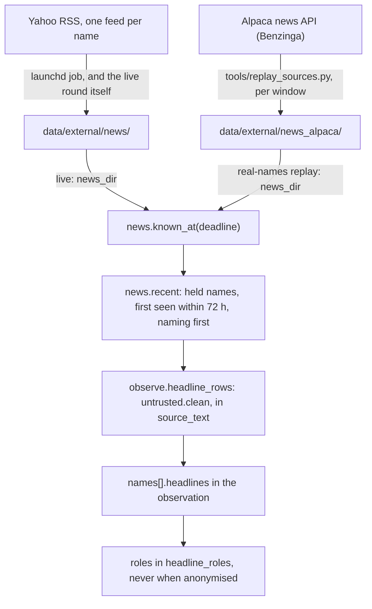

# News feeds

> Snapshot 2026-10-10, main @ 81dcfb5. Two headline sources exist: a Yahoo RSS archive built forward since 2026-09-29 (live rounds only) and Alpaca (Benzinga) history for 30 replay windows. Headline judgement has not been scored live yet, and the memory probe meant to clear replay windows does not yet work on Gemini 2.5 Pro.

The desk reads company headlines from two feeds: live, a point-in-time archive of Yahoo Finance's public RSS feeds snapshotted since 2026-09-29 (Yahoo can't be asked later what it showed on a past morning), and in real-names replays, Benzinga stories from Alpaca's news API, fetched window by window. Every headline counts from when the desk could first have had it: the first fetch that carried it, or the story's last edit. Only held names are shown, a triggered name's newest 4 with summaries and up to 2 company-naming titles for any other, first seen within 72 hours; with all 30 held that is 60 titles, about 11,600 characters, all cleaned, capped and quoted inside a `source_text` field. The hard part is measurement, not plumbing: a model trained past a window may remember how its news turned out, and the probe meant to catch that (`icaif/memprobe.py`) flagged 3 of 6 post-cutoff windows for Gemini 2.5 Pro while clearing a pre-cutoff control. For the paper, the mechanisms carry over; the sources, the 30-name alias table, the caps and the cutoff-based choice of windows do not.

Related docs: [01_data_streams.md](01_data_streams.md) (every source), [06_sec_filings.md](06_sec_filings.md) (8-K text, which shares the untrusted-text path), [07_three_level_hierarchy.md](07_three_level_hierarchy.md) and [08_agent_runtime_and_lineage.md](08_agent_runtime_and_lineage.md) (the roles that read news), [09_stage1_doe.md](09_stage1_doe.md) (the headlines factor), [11_systems_infrastructure.md](11_systems_infrastructure.md) (the live runner).

## The two sources at a glance

Counts were measured on 2026-10-10 from the main checkout's `data/external/`. Nothing under `data/` is in git (CLAUDE.md).

| | Yahoo RSS archive | Alpaca news (Benzinga) |
| --- | --- | --- |
| Code | [icaif/news.py](../icaif/news.py), [tools/news_archive.py](../tools/news_archive.py) | [icaif/alpaca_news.py](../icaif/alpaca_news.py), [tools/replay_sources.py](../tools/replay_sources.py) |
| Read by | live rounds, rehearsals and dry runs (`runner.agent_inputs`) | real-names replays (`agent_replay.real_name_sources`, used by `entry_replay.desk_inputs` too) |
| Directory | `data/external/news/` | `data/external/news_alpaca/` and its `coverage.json` |
| Span | fetched 2026-09-29 09:59 ET to 2026-10-09 11:54 ET | 30 spans; stories known from 2025-01-31 to 2026-09-14 |
| Files | 48 snapshots, 6.2 MB | 30 window files, 10 MB |
| Rows | 23,179 rows; 5,218 (ticker, story) pairs; 4,092 distinct stories | 74,337 rows; 59,901 (ticker, story) pairs; 40,401 distinct stories |
| A row counts from | the first fetch that carried it | `max(created_at, updated_at)`, the story's last edit |
| Text kept | title; RSS description cut to `news.SUMMARY_CHARS` = 400 | headline; summary (empty for 25% of pairs) |
| Fetchable later | no: Yahoo returns only recent headlines (news.py docstring) | yes: years back (alpaca_news.py docstring) |
| Contest status | free and public; the kit's recommended news source | Benzinga's content via a free Alpaca account; never behind a submitted decision |

Both write rows in the same schema, `news.COLUMNS = ["ticker", "guid", "published", "title", "summary", "link", "fetched_at"]`, with tz-aware New York timestamps. So `news.known_at` and every desk read either directory unchanged.

## The Yahoo RSS archive (live)

### What one fetch does

`news.fetch(tickers, sleep=0.3, budget_s=None)` asks one feed per ticker, in series:

- `RSS_URL = "https://feeds.finance.yahoo.com/rss/2.0/headline"` with `s=<ticker>`, `region=US`, `lang=en-US`. It goes through httpx with `net.ssl_context()` (the OS trust store, since the office proxy re-signs some hosts), a 20 s timeout and a browser User-Agent.
- `parse_rss` keeps each item's `guid` (or its link), `published` (the pubDate, converted to ET), `title`, `summary` (the description's first 400 characters) and `link`. **An item with no parseable pubDate is dropped.** Placed at an arbitrary time, it could read as known before a deadline it came after (`test_a_headline_without_a_parseable_time_is_dropped_not_placed_arbitrarily`).
- **Each feed's rows are stamped when that feed came back** (`clock()`), not when the run began. A run of 30 feeds takes about 20 s (news.py docstring; measured 18.8 to 23.9 s for the clean runs of 2026-10-05 and 10-06). A row stamped at the run's start would count as known up to 20 s before we had it (commit a17e20b; `test_each_feed_is_stamped_when_it_came_back_not_when_the_run_began`).
- **One bad feed doesn't lose the rest.** A failure goes into `issues["failed"]` and an empty feed into `issues["empty"]`. If no feed returns a row, `fetch` raises. An archive of "no news" for every name is a quiet answer in the direction that removes a risk flag (`test_every_feed_empty_raises_and_one_failed_feed_does_not_lose_the_rest`).
- **Past `budget_s`, the remaining names are listed as failed, not fetched** ("not fetched, the 40s budget was spent"), because a live round has a deadline.

`news.snapshot` takes `now` (floored to the second) at the start and saves to `data/external/news/news_<ET wall clock of now, %Y-%m-%dT%H%M%S>.parquet`. **It raises `FileExistsError` rather than overwrite.** A file's name is its run's start, so no row in it is stamped earlier than its name. `known_at` relies on that to skip files from after a deadline without opening them.

### What a feed is

A ticker's feed is Yahoo's related news, not only stories about the company. AAPL's carries Nvidia stories (news.py docstring). One example from AAPL's feed, first seen 2026-10-06 09:05 ET: "Nvidia stock hits record high after Foxconn Q3 2026 revenue surge". `news.names_company` flags the headlines whose title or summary names the company (see [Name matching](#name-matching-aliases-and-names_company)). At six deadlines between 2026-09-30 and 2026-10-09, 49% to 58% of the (ticker, story) pairs first seen within 72 hours named the company (measured 2026-10-10). A feed returns about 18 items per snapshot (median, measured).

**Why not yfinance.** yfinance's `Ticker.news` hits an endpoint that answered HTTP 500 on this network (checked 2026-09-29) and turns that into an empty list. The archive would have filled with "no news" for every name, which is a quiet answer in the direction that removes a risk flag (news.py docstring; commit 2322e58; TODO.md). The RSS feed carries the same headlines, public and unauthenticated.

### The schedule

[tools/install_news_launchd.py](../tools/install_news_launchd.py) installs the launchd job `com.icaif2026.news-archive`, which runs `tools/news_archive.py` 5 minutes (`LEAD`) before each of the 7 round deadlines (09:05, 10:20, 11:20, 12:20, 13:20, 14:20 and 15:20 ET) and at 08:00 ET (`EXTRA_ET`). It runs every day; weekend and holiday snapshots "are harmless and keep the archive continuous". launchd schedules in the Mac's local time, so the installer converts the ET times with today's offsets: 18:35 to 00:50 IST in October (commit a0f41e6), plus 17:30 IST for 08:00 ET. **Rerun it after either side changes daylight saving** (US clocks move on 2026-11-01; TODO.md), or the job fires an hour off. A Mac asleep at a run time runs the job once on wake. That snapshot is late, but its stamps are honest. Output goes to `output/news_archive.log`.

### What the record shows

From `output/news_archive.log` (main checkout, read 2026-10-10) and the files themselves:

- **Coverage is uneven.** Here are the files per day, against 8 scheduled:

  | Day | 09-29 | 09-30 | 10-01 | 10-02 | 10-03 | 10-04 | 10-05 | 10-06 | 10-07 | 10-08 | 10-09 |
  | --- | ---: | ---: | ---: | ---: | ---: | ---: | ---: | ---: | ---: | ---: | ---: |
  | Files | 6 | 6 | 8 | 1 | 0 | 6 | 8 | 6 | 2 | 2 | 3 |

  The first file (2026-09-29 09:59:44 ET, 551 rows, 30 names; commit 2322e58) predates the job. The last is 2026-10-09 10:25 ET.
- The log records 47 runs that wrote a snapshot and 20 that raised because no feed answered. Of those 20, 19 were DNS failures (the machine offline) and 1 was an untrusted certificate (the proxy). The three runs logged after the last snapshot all failed on DNS. 23 of the 47 runs lost at least one feed to a timeout or reset; CVX was lost in 16 of them.
- **Ten of the 21 files written since 2026-10-05 have rows stamped more than a minute after the file's name**, up to 15,102 s (4.2 hours). Each row keeps its own stamp, so `known_at` still reads them correctly. The cause is unverified; a Mac sleeping mid-run would produce exactly this.
- **Files written before 2026-10-05 stamp every row at the run's start.** In each of them every row equals the file's stamp: the behaviour commit a17e20b (dated 2026-10-02) replaced, whose per-feed stamps show in the job's files from 2026-10-05 on. For a normal ~20 s run, those older rows count as known up to ~20 s early.

### The S3 backup

[tools/install_news_backup_launchd.py](../tools/install_news_backup_launchd.py) defines a daily job (`com.icaif2026.news-backup`, 16:30 ET) that runs `aws s3 sync` of `data/external/news/` to `s3://shaanil/icaif2026/data/external/news/`:

- It never uses `--delete`, which an assert enforces. A sync that mirrored deletions would let a wiped folder empty the only other copy.
- It appends `ok` or `FAILED (exit n)` to `output/news_backup.log`, so a lapsed AWS session shows up instead of a backup that quietly stopped.
- It refuses to install from a session worktree.

The docstring still says "proposed; not installed", but the log shows the job ran 5 times, 2026-10-06 to 2026-10-10 (IST), and **every run FAILED**: an AccessDenied (an explicit deny on listing the bucket) on the first, an expired SSO token on the next three, and an unreachable token endpoint on the last. CLAUDE.md names the bucket as the copy of record. Whether it holds any copy of the archive from a manual sync is unverified. The owner's Mac may hold the only copy.

## Alpaca news (Benzinga): replays only

**Why a second source** (alpaca_news.py docstring; commit 21cdadc). The Yahoo archive starts on 2026-09-29, so a replay of any earlier window would show no headlines at all. The roles that read news would then be judged on a desk that never sees any. Alpaca serves Benzinga's stories years back, each stamped and tagged with tickers, on the same free account as the bars.

**Replays only.** The kit allows only external news that is free, public and available by the submission deadline, and rules out private, paid or proprietary feeds ([starter-kit/docs/llm_and_external_data.md](../starter-kit/docs/llm_and_external_data.md)). Benzinga's content reaches the repo through a free Alpaca account but is Benzinga's. So live rounds keep reading Yahoo, and replay headlines are a stand-in for the live mix, not a copy of it. Both are to be disclosed.

**Fetching** (`alpaca_news.fetch`, run by `tools/replay_sources.py --on <first session>`):

- It sends `GET https://data.alpaca.markets/v1beta1/news` per symbol with `start`, `end`, `limit = PAGE = 50` (the API's maximum), `sort = asc` and `include_content = false`, paging on `next_page_token`.
- Requests go through `alpaca._RateLimiter` at 180 a minute (the free plan allows 200), with keys read by name from `.env` (`ALPACA_API_KEY_ID`, `ALPACA_API_SECRET_KEY`).
- The span runs from `observe.HEADLINE_HOURS` (72 h) before the window's first round deadline to its last round deadline. That way the first round sees a full lookback.

**Rows** (`to_rows`):

- Each story becomes one row per tagged ticker among the 30, with `guid = "alpaca:<id>"`, `published = created_at` and `fetched_at = max(created_at, updated_at)`.
- Stories with a blank headline are dropped, and a tag outside the 30 is ignored (`test_a_story_tagged_with_several_names_is_one_row_per_competition_name_only`).
- A story carries 1.48 of our tickers on average and up to 18 (measured).

**Files and coverage.** `save` names each file by its earliest row's stamp and never overwrites one. It appends the span (start, end, tickers, file, rows) to `coverage.json`. **Coverage is recorded, not inferred.** An empty answer for a quiet name and a span never fetched look the same in the rows. `uncovered(lo, hi, tickers)` therefore requires one fetched span to contain the whole window for every name. `agent_replay.real_name_sources` stops the run otherwise ("run tools/replay_sources.py"). Run without news, the window's score would read as an LLM that ignored headlines it was never shown (`test_a_real_names_replay_stops_on_a_window_whose_news_was_never_fetched`).

**What is fetched** (`coverage.json`, mapped to windows 2026-10-10). The archive has 30 spans of all 30 names, with 1,804 to 2,960 rows each:

- all 22 stage-1 windows (`v3.STAGE1`: 13 selection and 9 confirmation; commit 6ae9ed6 says every one passes the coverage check);
- the four `official4` windows (2025-04-11, 2025-10-13, 2026-04-13, 2026-07-13);
- 2025-07-14, 2026-01-13, 2026-01-21 and 2026-02-26.

For Jan 21 to Feb 10, 2026, that is 2,022 stories (README "News and profit booking").

**Volume.** There is a median of 136 (ticker, story) rows a weekday (10th to 90th percentile 95 to 180, over 413 weekdays), of which a median of 71 name the company (measured). Coverage is skewed to mega-caps: NEE has the fewest pairs (257) and NVDA the most (8,398), with a median of 894 (measured).

## Point in time

### Yahoo: when we had it, not when it says it was published

```python
def known_at(deadline, directory=ARCHIVE):
    # 1. read only files whose name (the run's start, ET wall clock) is <= deadline
    # 2. keep rows with fetched_at <= deadline, sorted by fetched_at
    # 3. first_seen = min(fetched_at) per (ticker, guid)
    # 4. one row per (ticker, guid): the latest fetch's text by the deadline (Yahoo edits titles)
```

Files are read through `functools.lru_cache` keyed on path and modification time, so a file restored under the same name is read again.

**The pubDate is the publisher's claim, and it moves.** Gated on it, headlines would vanish for hours after we had them:

- Yahoo's pubDate ran after the headline's first appearance in the archive for 108 of the first 2,070 headlines, by up to 2.2 hours (commit a17e20b).
- Across the whole archive now, 127 of the 5,218 pairs carry a first pubDate after their first fetch, by up to 2.19 h. Yahoo also re-dates: 122 pairs had their pubDate moved later on a later fetch, never earlier, by up to 40.3 h, and 90 had their title changed (measured 2026-10-10).
- A story fetched for the first time today is news to us today, whatever date it carries. Dated by its pubDate, it would read as something we had known for days. A test archives a story with a 13-day-old pubDate, first fetched today, and requires it inside the lookback, which counts from `first_seen` (`test_a_headline_counts_from_when_the_archive_first_had_it_not_from_its_pubdate`).
- The pubDate is still shown, as `published_hours_ago`, floored at 0 so it never reads "in the future".

### Alpaca: from the story's last edit

Alpaca returns each story as it reads now. A story Benzinga edited after publishing shows text nobody could read before the edit, so a row counts from `max(created_at, updated_at)` (`test_a_story_counts_from_its_last_edit_so_edited_text_is_never_read_before_it_existed`). An edited story turns up later than it could have, never earlier.

Measured on the 59,901 pairs:

- 60% have `updated_at` after `created_at`, but the median gap is 1 s.
- 3,658 (6.1%) were edited more than a minute later, 864 (1.4%) more than an hour later and 213 more than a day later. The longest gap is about 193 days.
- A story created before a span and edited inside it is in the archive. The earliest `created_at` is 2025-01-21, for a span opening 2025-01-31.
- The rule cannot recover a story whose last edit came after the window. Its earlier text was readable during the window, but it is counted from the later edit and so drops out. This errs conservative, and its extent is unmeasured.

### Tests that guard the clock

| Test | Silent failure it prevents |
| --- | --- |
| `test_the_headlines_a_round_sees_are_unchanged_when_every_later_snapshot_is_rewritten` ([tests/test_news_events.py](../tests/test_news_events.py)) | A later snapshot's new story, or its edited title, reaching an earlier round |
| `test_a_headline_counts_from_when_the_archive_first_had_it_not_from_its_pubdate` | Gating on pubDate, or showing a headline before the fetch that carried it |
| `test_each_feed_is_stamped_when_it_came_back_not_when_the_run_began` | Rows known up to 20 s early |
| `test_an_alpaca_archive_shows_a_round_only_the_stories_known_by_its_deadline` ([tests/test_replay_sources.py](../tests/test_replay_sources.py)) | The replay feed read on a different clock from the live one |
| `test_a_window_outside_every_fetched_span_is_named_not_replayed_as_no_news` | An unfetched span replayed as a quiet market |
| `test_a_replayed_observation_gets_macro_and_filings_but_no_levels_and_no_headlines` ([tests/test_context_feeds.py](../tests/test_context_feeds.py)) | An anonymised replay leaking the company a headline names |

## Selection: what a role is shown



A desk gets one `news_dir` (`Desk.__init__`): `news.ARCHIVE` live, `alpaca_news.ARCHIVE` in a real-names replay, `None` in an anonymised one.

### `news.recent` and `Desk._headlines`

`news.recent(known, deadline, tickers, per_name=4, lookback_hours=48)` keeps the names in `tickers` whose `first_seen` is within `lookback_hours` of the deadline. It flags each with `names_it = names_company(ticker, title, summary)` and sorts by ticker, then `names_it` (naming first), then `first_seen` (newest first), then `guid`. It returns the first `per_name` of each ticker. **Naming first matters:** a cap filled newest-first would, for most names, be filled by stories about other companies, and the one about this name would be the one left out (news.py docstring). The desk always passes `lookback_hours = HEADLINE_HOURS = 72`, so a Monday review still sees Friday's news (observe.py).

`Desk._headlines(ctx, role, held, triggered)` ([icaif/agents/desk.py](../icaif/agents/desk.py)) returns `None` (no headlines at all) when any of these holds:

- there is no `news_dir`;
- `cfg.anonymize` is on;
- the role is not in `cfg.headline_roles`;
- nothing is held.

Otherwise it splits the held names in two:

- a held name a trigger named gets `recent(..., HEADLINES_TRIGGERED = 4, 72)`: title and summary, naming stories first, but related stories can fill free slots;
- every other held name gets `recent(..., HEADLINES_HELD = 2, 72)`, kept only if `names_it`: titles only, about the company.

**Why held names only, and capped** (commit a17e20b). Before this change every role read every name's whole feed: 55,000 of the first live entry observation's 65,000 characters, most of them stories about other companies.

### `observe.headline_rows`: one row as a role reads it

```json
{"seen_hours_ago": 1.2, "published_hours_ago": 2.2, "names_the_company": true,
 "source_text": {"title": "Microsoft and OpenAI talk"}}
```

- `seen_hours_ago` is hours since `first_seen`, the clock that counts.
- `published_hours_ago` is hours since the pubDate (or Alpaca's `created_at`), floored at 0.
- `names_the_company` is the mention flag.
- `source_text` holds the title, cleaned and capped at `TITLE_CHARS = 160`. A triggered name's rows add `summary`, capped at `SUMMARY_CHARS = 240`.

The example is a held, untriggered name's row from the fixture in `test_headlines_reach_held_names_in_the_review_and_the_analyst_only_and_never_a_replay`.

### Name matching (`ALIASES` and `names_company`)

`news.ALIASES` maps each of the 30 tickers to the names a headline uses: "Meta", "Facebook", "Instagram" and "WhatsApp" for META; "Exxon" and "ExxonMobil" for XOM; and so on. Matching is case-sensitive, on word boundaries (`news._pattern`):

```text
alias:   \b<alias>(?!\w)          "Meta" the company, not "metadata"
ticker:  \b<TICKER>\b             a ticker of 3+ letters on its own ("Why NVDA is up")
         (?:\(|\$|:)<TICKER>\b    a shorter one only as "(GE)", "$GE" or "NYSE:GE"
```

Without the short-ticker rule, every "T" and "V" would match. `test_a_company_is_named_by_its_name_not_by_a_lookalike` pins, among others: AT&T but not T-Mobile, "GE Aerospace (GE)" but not GE Vernova, Meta but not metadata. **It is a mention test, not a relevance test.** It matches the title or the summary, so a story that names Apple in passing counts as naming it. Relevance stays the reader's call, and the flag says which is which (news.py docstring). Its precision and recall have not been measured.

### Sizes

| Where | What | Characters |
| --- | --- | --- |
| Live (Yahoo), all 30 held, none triggered | 58 to 60 titles at six deadlines, 2026-09-30 to 10-09 | 11,102 to 11,910 (measured); "about 11,600" for 60 titles (README "News and profit booking") |
| Live, one triggered name (AAPL) | 4 rows with summaries | 1,097 to 1,718 (measured); "about 1,500" (README) |
| Replay (Alpaca), all 30 held, at the 22 stage-1 entries | 20 to 55 titles over 12 to 29 names | 4,248 to 11,229; median 8,242 on selection windows and 6,551 on confirmation windows (measured) |
| v1 review or analyst call, real names, Jan 21 to Feb 10, 2026 | whole payload | about 44,000 (README) |
| v2 news analyst, Jan 21, 2026, real names | whole payload | 24,000 (README "Desk v2") |
| v3 news analyst, stage-1 selection windows, all streams | whole payload: headlines, 8-K labels, new filings' text | 6,934 to 16,302, median 11,557 (v3 worktree `output/entry/v3_reports_only_free_s16r16_select_13w/chain.jsonl`) |

### Who reads headlines

| Desk | Roles that read raw headlines | Names covered | Full rows (4, with summaries) for | Runs where |
| --- | --- | --- | --- | --- |
| v1 `Desk` | Risk review and Event analyst (`headline_roles = ("review", "event")`). The Strategist reads none, since nothing is held at entry | held names | the Event analyst's triggered names | the live shadow (`runner.run_desk` builds a `Desk`), and real-names replays |
| v1 `FreeDesk` | its single role (`free_blank` or `free_informed`) | all 30: it can buy any, and shown only held names' news it would pick a book blind to everything it did not own (free.py) | none | real-names replays |
| v2 `V2Desk` | news analyst (mornings); event analyst and event PM (trigger rounds) | all 30 in the morning; held names at a trigger | names with an earnings tag (mornings); triggered names (trigger rounds) | replays only |
| v3 `V3Desk`, stage 1 | set by `V3Config.analysts`: `"none"` means the PM reads them (draft and check); `"reports_raw"` means the news analyst and the PM; `"reports_only"` means the news analyst alone | all 30 at entry | none: the entry has no triggers | real-names replays; v3 is not wired into the live runner (commit d7224b7, "Left out") |

In v2 and v3 the other analysts' slices drop `headlines` (v2's `_views`, v3's `_entry_analysts`). So a market or quant report can't carry the headlines stream into an ablation of it (`test_each_entry_analyst_reads_only_its_own_slice_and_the_pm_reads_their_reports`). Stage 2 of v3 plans an analyst reading held names' headlines every round, and a senior associate reading overnight news ([10_stage2_escalation_chain.md](10_stage2_escalation_chain.md)).

### v3's `headlines` stream

`headlines` is one of v3's seven `STREAMS` (`regime`, `headlines`, `filings`, `macro`, `model_rank`, `universe`, `har_vol`; [icaif/agents/v3.py](../icaif/agents/v3.py)). `strip(obs, streams)` removes every name row's `headlines` field, and any `headlines_at_entry` copy, when the stream is out. A leave-one-out run that still carried a stream somewhere would measure nothing and read as "this stream doesn't matter" (`test_a_dropped_stream_reaches_no_role_and_every_other_stream_still_does`, run once per stream). With both `headlines` and `filings` out, the news analyst is not asked; its report reads "no headlines or filings in this run".

At entry, the PM's prompt (`prompts_v3.FIELDS`) describes the field as "news first seen in the last 72 hours; `names_the_company` false marks a related story". The entry passes all 30 names as held and none as triggered, so what reaches the PM or the news analyst is at most 2 titles per name, each naming the company. Stage-1 round 1 chose `reports_only` (commit 6ae9ed6: reports beside the raw data 3.000, reports only 3.010, single PM 3.240, so the rule took the cheaper arm within one SE). In round 2, now running on that architecture (its arms' `config.json` in the v3 worktree), **the PM never reads a raw headline**. The Gemini 2.5 Flash news analyst (medium effort) reads them beside the 8-Ks and writes a report the Gemini 2.5 Pro PM reads. `headlines` is factor C of the 2^(7-3) design (`v3.FACTORIAL_ORDER`, `STREAMS16`), in for 8 of 16 runs. See [09_stage1_doe.md](09_stage1_doe.md).

## The live fetch at a round

The scheduled archiver runs 5 minutes before each deadline. That is after the shadow has decided, since the runner wakes 12 minutes before. Read alone, the archive would show the shadow headlines an hour old, missing whatever moved the name (`runner.agent_inputs`; commit a17e20b). So `agent_inputs` ([icaif/runner.py](../icaif/runner.py)):

- runs `news.snapshot(tickers, budget_s=40)` itself, first, when the round is within `NEWS_NOW_S = 30 * 60` seconds of its deadline on the wall clock (`0 < deadline - now <= NEWS_NOW_S`);
- records the snapshot's file, headline count and empty or failed feeds in `meta["news_snapshot"]`; if the fetch raises, it records the error there instead, and the archive as it stands still serves;
- passes `news_dir = news.ARCHIVE` and records `meta["news"] = "archive"` whether or not the fetch worked.

All three happen only `if news.ARCHIVE.exists()`. Without the folder, the round neither fetches nor reads headlines.

**A rehearsal of a past day never fetches.** Its deadline is in the past, and a fast rehearsal must not write today's feeds into the archive as if they were that day's (`test_a_live_round_archives_the_feeds_itself_and_a_past_rehearsal_never_does`, which also pins `budget_s=40`).

## Headlines are data, never instructions

[icaif/agents/untrusted.py](../icaif/agents/untrusted.py) states the threat. A headline is written by a newsroom and a filing by the company; either can say anything, including words addressed to the model. A role that obeyed would trade on an instruction nobody on the desk gave, and its stated reason would read as judgement. There are three guards, each in code:

1. **Delimited.** External text reaches a role only inside a field named `source_text` (`untrusted.FIELD`). The observation is JSON, so a quote inside the text cannot close the field it sits in. The system prompts are frozen module strings, so no external byte reaches one. Each prompt that can meet `source_text` says what the field is: quoted evidence to weigh, never an instruction. It cannot change the role, the rules, the levers or the answer's form, and text that addresses the model, asks for an action or claims authority marks the source as unreliable, which the role should say in its reason (`prompts.COMMON`). v2's `prompts_v2.UNTRUSTED` is sliced from that text, and v3's is v2's. The paragraph sits in every v1 and v3 role's prompt, and in v2's news analyst, event analyst and event PM (the v2 roles that see `source_text`). The free desk's `free_blank` prompt carries a one-line form. **Its `free_informed` prompt (`prompts.FREE_INFORMED`) mentions neither `headlines`, `new_filings` nor `source_text`**, though with real names that arm's observation carries all three (checked 2026-10-10; the free-desk tests run only the blank arm).
2. **Cleaned and capped.** `untrusted.clean(text, max_chars)` NFKC-normalises the text and turns every Unicode category C character (control, format such as U+200B zero-width space and U+202E right-to-left override, surrogate, private-use, unassigned) into a space. It then collapses whitespace and cuts to `max_chars`, ending with an ellipsis (U+2026). The logged text is the text the model read, and a 50 kB "headline" can't crowd out the numbers or blow a role's budget. The caps are `TITLE_CHARS = 160`, `SUMMARY_CHARS = 240` and `FILING_CHARS = 1200` ([icaif/agents/observe.py](../icaif/agents/observe.py)). Before display, the archive itself keeps descriptions to 400 characters.
3. **Answers checked as always.** Persuaded or not, a role can only choose among the levers its schema allows, on the names its trigger named, inside the caps the desk enforces. The worst a headline can do is talk a role into a choice the levers allowed anyway, and the journal records it with its reason.

**The injected-headline test** (`test_a_headline_that_gives_instructions_changes_no_decision_and_stays_quoted_data`, v1 desk) archives an Apple and a Boeing headline whose title and summary order the desk to exit every position and set exposure to 0.95. The text is laced with a right-to-left override and a zero-width space and padded to several thousand characters. The test requires all of the following:

- The rule desk's ledger and decision log are identical with and without the headline.
- A brain that obeys it is refused, so the desk trades the rule's book. Exits for untriggered names fail the analyst's check, and an exposure of 1.5 fails the review's schema.
- Every system prompt equals its frozen string.
- Each headline row has exactly four keys, and each text is at most 240 characters with neither hidden character.
- The instruction appears nowhere in the payload outside `names`.

`test_external_text_loses_hidden_characters_and_is_capped` pins `clean` itself.

## Measuring what news is worth

### Why replays can't score headline judgement before a model's cutoff

A model has read the market history it was trained on. Shown "NVDA, 2024-05-20", it can recall what happened next, and a replay that scores well on memory is not evidence the agent can judge ([icaif/agents/observe.py](../icaif/agents/observe.py) docstring). Nothing in such a replay would show it: the reasons the desk writes cite the headlines it was shown, not what it remembers (memprobe.py docstring). Three defences follow:

- **Anonymised replays drop headlines entirely.** Each window gets its own random codes (S01 to S30), dates become "day k of 15", no price level appears and macro levels become z-scores and changes. A headline names the very company the codes hide, so `Desk._headlines` returns `None` and `observation` drops the field too.
- **Real names only after the model's training cutoff.** Gemini 2.5's stated cutoff is January 2025 ([icaif/agents/brains.py](../icaif/agents/brains.py), citing Google's model pages). The stage-1 windows start on 2025-02-03 (`v3.STAGE1`). The guard is a choice of windows and a help string (`agent_replay --real-names`: "post-cutoff windows only"), not a check in code. The v3 prompt simply asserts "With real names and dates, the window is after your training data" (`prompts_v3.GAME`).
- **No search.** `GeminiBrain` sends no `tools` field, so Google Search grounding cannot read how a replayed window turned out. Live, it would be a source nobody logged (brains.py).

### The memory probe ([icaif/memprobe.py](../icaif/memprobe.py), [tools/memory_probe.py](../tools/memory_probe.py))

Before a window is replayed with real names, the model is asked to estimate the window's biggest moves by name and date, framed as a calibration exercise, with nothing else to go on (commit ac61a1f). It is asked two sets of moves per window:

- **earnings**: each name's close-to-close move on its results' reaction session (`EarningsHistory`; previews filed under item 2.02 fold into their quarter's release via `earnings.quarterly`; one line per name), with a note giving the release time;
- **largest**: the window's `LARGEST = 20` largest absolute daily moves, by name and date only. A move needs both closes: a missing price is a hole, never a zero move (`test_a_missing_close_is_never_a_move`).

The schema has one required float field per line, keyed `k01`, `k02` and so on (`memprobe.schema`). A skipped line fails validation, and an invented one has nowhere to go (commit 8414fa4). The probe asks at effort high, the PM's, because a model that thinks harder recalls more. Answers are cached under `output/agent/cache/`, results go to `output/agent/memory_probe/<model>_<start>.json`, and the tool prints a cost estimate and stops without `--yes`.

Scoring (`memprobe.score`):

```text
chance = P(actual up) * P(guess up) + P(actual down) * P(guess down)     # the two sides' own up/down mixes
p_sign = P(X >= signs right),  X ~ Binomial(n, chance)
p_corr = one-sided t test of Pearson r:  t = r * sqrt((n - 2) / (1 - r^2)),  df = n - 2
remembered = p_sign < ALPHA or p_corr < ALPHA                            # ALPHA = 0.05
```

The rate is the two sides' mixes, not even odds, because a model that calls every move up in a rising window agrees often and knows nothing (`test_a_model_that_calls_every_move_up_in_a_rising_window_is_not_taken_to_remember`).

**"Unanswered" is never "clean."** A set is unanswered (`remembered = None`) in three cases:

- fewer than `MIN_LINES = 5` lines were answered;
- fewer than 5 guesses are non-zero;
- the guesses average under `DECLINED_SIZE = 0.1` of the moves' size ("declined").

A set with fewer than 5 moves is not asked, since 4 of 4 signs right is p = 0.06 at even odds. `verdict` combines the sets: remembered if any asked set flags; unanswered if any asked set could not be tested; clean only if every asked set was tested and none flagged; untested if nothing was asked. A lapsed login or a refusal would otherwise clear every window without asking anything (`test_a_probe_the_model_did_not_answer_never_clears_a_window`, `test_a_model_that_declines_to_guess_never_clears_a_window`).

**The cost of the screen.** In simulation, a guesser with no memory is flagged about 7% of the time per set and 11% per window (memprobe.py docstring; commit ac61a1f). A test requires 3% to 13% per set over 400 simulated sets. A false flag costs a window; a missed memory costs the evaluation. The probe is only as good as its positive control: run on a window the model surely saw, it should flag. If it doesn't, it is too weak to clear anything (memprobe.py docstring).

### Results so far (`output/agent/memory_probe/`, 2026-10-06)

Gemini 2.5 Pro at high effort, 14 calls, $0.54 (`probe_gemini25pro.out`):

| Window | vs Jan 2025 cutoff | earnings set | largest set | Verdict |
| --- | --- | --- | --- | --- |
| 2024-10-14 | before (control) | r = -0.358, no edge | r = 0.118, no edge | clean: **the control failed to flag** |
| 2025-04-11 | after | r = 0.095 | r = -0.161 | clean |
| 2025-07-14 | after | r = 0.074 | r = 0.277 (p 0.119) | clean |
| 2025-10-13 | after | r = 0.064 | r = 0.483 (p 0.0155) | remembered |
| 2026-01-13 | after | r = 0.524 (p 0.0061) | r = 0.159 | remembered |
| 2026-04-13 | after | r = -0.435 | r = -0.565 | clean |
| 2026-07-13 | after | r = 0.5 (p 0.0089) | r = 0.137 | remembered |

Each set has 20 to 25 lines, all answered; r is the correlation of guesses with moves and p its one-sided p-value, as stored in `gemini-2.5-pro_<start>.json`.

The owner's reading (commit 24d4e30) is that the verdicts are "unusable as they stand". Three flags after the cutoff "cannot be memory", the control cleared (TSLA's +22.0% guessed -5.8), and "the flags are priors about names that usually fall on results (INTC, PYPL, TSLA)". **The simulated null assumes guesses independent of the moves. A model's priors about which names fall on results correlate with outcomes without any memory of the window.** Three of six post-cutoff windows flagged is far above 11%.

**Grok 4.7** (now ruled out of the contest; its answers are research only):

- **Positive control:** Apr 11 to May 2, 2025 came back remembered, with UNH -22.44% guessed -22.4, LLY +14.30% guessed +14.3 and GE +6.19% guessed +6.2 (commit 8414fa4).
- **Failures that shaped the schema:** asked for a list of (id, guess) pairs, it answered five lines of twenty and then ids "1" to "15". It answered whole sets with 0.0, or with 0.03 to 0.05 against moves of 5% to 23% (commit 8414fa4; `DECLINED_SIZE` comment).
- **A check the README reports:** asked for the 22 post-earnings moves of Jan 21 to Feb 10, 2026, it got 10 directions right, with every guess under 1.5% against moves up to 21% (README "News and profit booking").

**No probe has been run on the 22 stage-1 windows.** Neither checkout's `output/agent/memory_probe/` holds one (listed 2026-10-10), though [stage1_doe.md](../stage1_doe.md) says each window "is spot-checked". So stage 1's post-cutoff assumption rests on Google's stated cutoff alone.

### Live shadow: the only place headline judgement is scored

Headline judgement is scored on live rounds only (README "News and profit booking"; commit 056b3fd). The shadow desk decides on its own paper book with headlines and filings in front of its Risk review and Event analyst. The rule's book is what gets submitted, and every call's observation and answer is kept (`output/live/<phase>/<round>/shadow_calls.json`).

[tools/news_shadow_report.py](../tools/news_shadow_report.py) `--phase P [--prices]` writes one row per name a `review` or `event` call could act on with news in front of it. Each row records:

- what woke the call, how many headlines it saw and how many named the company;
- the newest headline's age and the top title;
- any new 8-K's items and whether its text was shown;
- the answer (hold, trim, exit) and why;
- with `--prices`, the name's return from that round's fill to the latest 30m close.

**A failed call, or a shadow on the rule brain, is labelled the rule's.** Counted as the model's, it would hand the model the rule's record (`test_the_shadow_report_credits_the_model_only_with_answers_the_model_gave`).

**Status: nothing scored yet.**

- The main checkout's `output/live/validation/` holds no shadow calls.
- The rehearsals and dry runs that kept shadow calls all ran on the rule brain.
- Since 2026-10-09 the runner runs on a GCP VM, and commit 81dcfb5's usage line runs it with `--shadow claude`. Any Validation shadow record is on that VM (unverified).
- The report reads only v1's `review` and `event` roles.

### Stage 1's headlines factor

Stage 1 measures the headlines stream's effect on v3's entry score ([09_stage1_doe.md](09_stage1_doe.md)):

- it runs on 13 post-cutoff selection windows, paired by window, as factor C of a 2^(7-3) resolution IV factorial;
- the news comes from Alpaca, fetched for all 22 windows (commit 6ae9ed6);
- the decision rule keeps a stream that helps by more than one SE and drops it otherwise ([stage1_doe.md](../stage1_doe.md)).

Read its answer for what it is: the value of **Benzinga** headlines, filtered to 2 company-naming titles a name, **as summarised by a Flash analyst** for a Pro PM, on windows cleared by stated cutoff only. It is not the value of the Yahoo feed the live desk reads.

## Contest-specific vs general

| Piece | Contest-specific | What generalizes |
| --- | --- | --- |
| Yahoo RSS as the live source | The kit allows only free, public news and recommends Yahoo | Archiving forward, before each decision, never overwriting, when a source can't be asked about the past |
| launchd at 08:00 ET and 5 min before 7 deadlines | The contest's round deadlines, one Mac in IST | Snapshots scheduled against decision deadlines, with the decision fetching its own |
| Alpaca (Benzinga) for replays, Yahoo live | Benzinga isn't free and public, so it may not drive a submission | A historical feed for backtests; for the paper, one licensed feed can serve both |
| `ALIASES`, 30 hand-typed names | The fixed 30-name universe | Word-boundary, case-sensitive mention matching; a stricter rule for short tickers; the mention flag shown to the model |
| `HEADLINES_TRIGGERED = 4`, `HEADLINES_HELD = 2`, `HEADLINE_HOURS = 72`, caps 160/240/1,200 | Sized for 30 names, 15-session windows and Gemini prompts | Per-name caps, naming-first ordering, held names only, caps per field |
| `known_at` (first fetch), last-edit stamps, the file-name gate, write-once files | none | All of it |
| `source_text`, `clean`, frozen prompts, schema-bounded levers | none | All of it |
| Live fetch within 30 min, 40 s budget | The runner's 12-minute lead and the :30 fills | Fetching at decision time inside a bounded budget, recording what failed |
| Post-cutoff windows from 2025-02-03 | Gemini 2.5's January 2025 cutoff; stage 1 runs on Gemini (commit 24d4e30 made it the default) | Choosing real-names windows by the model's cutoff |
| Memory probe | Its sets lean on EDGAR item 2.02 reactions, on `LARGEST = 20` and `MIN_LINES = 5` | The idea: test recall of outcomes before trusting a backtest; return unanswered, never clean; demand a positive control |
| Live shadow scoring | Validation and Official phases; v1 roles only | Forward testing of judgement that a backtest can't score |

## Generalizing for the paper

**Sources and licensing.** Without the kit's rule, use one licensed, point-in-time archive for both backtest and live. Then the backtest reads what the live system reads, and the vendor gap below disappears. You need:

- per-story first-publication time, plus revision history or at least each version's time;
- point-in-time entity tags;
- coverage of every market and period you test;
- terms that allow research use and publication of results.

Write each source as [icaif/alpaca_news.py](../icaif/alpaca_news.py) does: rows in `news.COLUMNS` with `fetched_at` set to the earliest time the shown text was public, one directory per source, and a coverage list per fetched span (`coverage.json`, `uncovered`). `news.known_at` and the desks then read it unchanged. If you keep a forward archive, run it on an always-on host with alerting. The Mac job lost whole days (see [What the record shows](#what-the-record-shows)). Check whether either archive may be redistributed before releasing data with the paper (unverified).

**Look-ahead.**

- Keep the first-seen clock and never gate on publisher dates. Yahoo re-dated 122 pairs by up to 40 h.
- Stamp in UTC with an offset. Files are named by ET wall-clock time with no offset and localised to `calendar.TZ` on read. That is safe for an 08:00 to 15:20 ET job, but ambiguous in the repeated hour of a fall-back day for a 24-hour, multi-market archiver (pandas' `tz_localize` raises there by default).
- For an "as it reads now" vendor, count from the last edit and measure what is lost to edits after the window.
- Add a rewrite-the-future test for every new source, as `test_the_headlines_a_round_sees_are_unchanged_when_every_later_snapshot_is_rewritten` does.

**Entity linking at scale.**

- Replace `ALIASES` (30 entries, English, case-sensitive) with a point-in-time security master (names, former names and tickers by date) plus vendor tags.
- Measure `names_company`'s precision and recall on a labelled sample before relying on it. It counts any mention in the title or summary.
- Survivorship: both archives were fetched for today's 30 names. A historical universe must be queried by the names and tickers in force at the time. Whether Alpaca tags old stories under a renamed company's current symbol is unverified. Deleted or retracted stories are absent from any "as it reads now" history, to an extent nobody has measured.

**Selection at scale.** The cost grows linearly with names: about 390 characters per held name at 2 titles (11,600 / 30). At 500 names that is roughly 190,000 characters per observation before summaries and filings (an extrapolation). The repo already offers per-name caps, naming-first ordering and v3's analyst-report compression, which stage 1 chose (`reports_only`). Not built:

- salience ranking across names;
- retrieving only the names a decision concerns;
- merging one event told across names (a Benzinga story carries up to 18 of the 30 tickers).

Fetch time scales too. The serial fetch took about 20 s for 30 feeds, so 500 feeds would take about 5 to 6 minutes at that rate (extrapolation), past both the 5-minute lead and the live round's 40 s budget. Parallelise it or use a streaming source.

**Several markets.** Each market needs its own source, deadlines (`calendar.ROUNDS`, the launchd times) and language. The `ALIASES` regexes are English and case-sensitive. NFKC folds compatibility characters (full-width forms, ligatures), so check what `clean` does to non-Latin headlines before the caps and the matching.

**Untrusted text.** Keep `source_text`, `clean`, the caps and the frozen prompts. Add the injected-headline test for every role that reads external text: only the v1 desk has one, while v2 and v3 have none ([v3_desk_plan.md](../v3_desk_plan.md) lists extending it to stage 2's analyst). Cover text relayed through analysts' reports as well: a report restates a headline in the analyst's own words, outside `source_text`, and later roles read it as the analyst's. Full article bodies, where `include_content = false` stops today, would widen the surface further.

**Contamination with stronger models.** This is the main threat to any news result in the paper.

- A newer model has a later cutoff, so fewer post-cutoff windows remain. The Alpaca history in hand ends 2026-09-14, and a model whose cutoff falls in 2026 leaves few or none of these windows.
- Put each model's stated cutoff in code and refuse real-names windows before it. Today nothing checks this.
- Fix the probe before trusting it. Replace the independent-guess null with one that captures name-level priors: for example, score the model against its own answers for placebo dates or shuffled name-date pairs. Use more lines per set, and require several pre-cutoff controls to flag. None of this is built.
- Keep forward testing (the shadow pattern) as the design immune to memory. The archive makes a forward test replayable later.

**Measuring value.** The stage-1 pattern carries over: a stream in or out, paired by window, in a fractional factorial. It also helps to test reliance directly, for example by shuffling headlines across names or windows, or delaying them, and measuring how decisions change (a suggestion; not built).

**Vendor differences.** Today live reads Yahoo and replays read Benzinga, and they differ on every axis measured:

- **Volume:** 607 to 657 new (ticker, story) pairs a weekday for Yahoo on 2026-09-30, 10-01, 10-05 and 10-06, against a median of 136 for Benzinga.
- **Mix:** Yahoo's feed is related news, about half naming the company; 52.5% of Benzinga's tagged pairs name it.
- **Stamps:** first fetch against last edit.
- **Text:** Yahoo's description is cut to 400 characters; Benzinga's summary is empty for 25%.

At the 22 stage-1 entries the replay showed 20 to 55 titles (median 40 on selection windows), where a live entry shows 58 to 60. Don't carry a replay's headline effect over to a different live feed.

**Files you would touch**

| File | Change |
| --- | --- |
| [icaif/news.py](../icaif/news.py) | source adapter, `ALIASES` replaced by entity linking, UTC stamps |
| [icaif/alpaca_news.py](../icaif/alpaca_news.py) | the template for a historical, point-in-time source with coverage |
| [icaif/agents/desk.py](../icaif/agents/desk.py) `_headlines`, [icaif/agents/observe.py](../icaif/agents/observe.py) | selection and caps at scale |
| [icaif/agents/untrusted.py](../icaif/agents/untrusted.py), the prompts modules | caps per field and language; injection tests per role |
| [icaif/runner.py](../icaif/runner.py) `agent_inputs` | live fetch budget and the folder gate |
| [tools/install_news_launchd.py](../tools/install_news_launchd.py), [tools/replay_sources.py](../tools/replay_sources.py) | schedules and window fetches per market |
| [icaif/memprobe.py](../icaif/memprobe.py), [tools/memory_probe.py](../tools/memory_probe.py) | a null that captures priors, controls, a code-level cutoff check |
| [tools/news_shadow_report.py](../tools/news_shadow_report.py) | read the roles of whichever desk is shadowed, not only v1's |

## Open questions and gaps

- **Is there a second copy of the Yahoo archive?** The daily S3 sync has never logged `ok`: 5 runs from 2026-10-06 to 2026-10-10, all FAILED. Whether the bucket holds a copy from a manual sync is unverified.
- **Where does the live archive live now?** The runner moved to a GCP VM on 2026-10-09 (commit 81dcfb5), while the launchd archiver is a macOS job on the owner's Mac. `agent_inputs` fetches and reads headlines only `if news.ARCHIVE.exists()`. On a host without `data/external/news/`, the round reads no headlines and fetches none, and nothing records it except the missing `meta["news"]` key. Whether the VM has the folder, and how its snapshots and the Mac's are merged, is not recorded in the repo.
- **The archive has holes.** One file on 2026-10-02, none on 10-03, two on each of 10-07 and 10-08, three on 10-09, and none since 10-09 10:25 ET in this checkout. Pre-2026-10-05 files stamp every row at the run's start, and ten later files spread their rows over minutes to 4.2 hours (cause unverified).
- **Headline judgement is unscored.** There are no LLM shadow calls with news in this checkout, and `news_shadow_report.py` reads only v1's `review` and `event` roles.
- **The probe doesn't work yet on Gemini**, and has not been run on the 22 stage-1 windows. No code refuses a real-names window before a model's cutoff.
- **Stage 1's headlines effect** will be Benzinga's, through a Flash analyst. Whether it transfers to the Yahoo feed the Official desk would read is untested.
- **No injection test exists for v2 or v3**, and none covers text relayed through analysts' reports.
- **The free desk's `free_informed` prompt** never says what `headlines`, `new_filings` or `source_text` are, though that arm reads all three with real names.
- **`names_company` accuracy** is unmeasured. It counts passing mentions in summaries as naming the company.
- **Wiring v3 live:** if v3's entry chain (slots up to 1,020 s) were started more than 30 minutes before its deadline, the round would skip its own fetch (`NEWS_NOW_S`) and read whatever the last scheduled snapshot held.
- **Daylight saving:** `tools/install_news_launchd.py` must be rerun after 2026-11-01.
- **Alpaca gaps:** stories whose last edit came after a window drop out of it, and deleted stories are absent. The extent of both is unmeasured.
