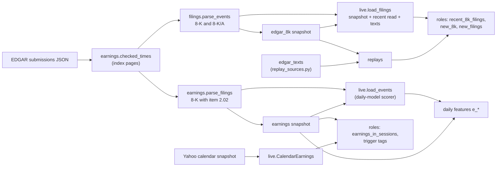

# SEC filings (EDGAR 8-Ks) and earnings dates

> Snapshot 2026-10-10, main @ 81dcfb5. Built and used in replays and live: 8-K events (item labels, texts) and item-2.02 release times, both checked against EDGAR's filing pages on every read since the Oct 6 feed fault; the Yahoo calendar of upcoming releases has one snapshot (Sep 28) and no daily job yet.

The desks' company filings and earnings release times come from SEC EDGAR, each stamped
with the moment EDGAR accepted the filing. That stamp is why this stream, unlike
headlines, can be replayed from 2016 without look-ahead. Two tables are built from it:
every event 8-K for the 30 names (10,411 rows, 1994 to 2026-09-29, 4,337 since 2016),
and every item-2.02 earnings 8-K for the 353 symbols ever in the daily model's universe
(30,284 rows, 2004 to 2026-09-24). 8-Ks reach the roles as item labels for the last 7
days, as a trigger that wakes an analyst once per new filing of a held name, and, with
real names only, as the filing's own words (the press release, for results) cut to 1,200
characters. Release times feed the daily model's `e_*` features, the agents'
`earnings_in_sessions` and the past-reaction evidence in trigger tags. EDGAR records a
release only after it happens, so live also needs Yahoo's calendar of announced dates,
and that calendar can't be rebuilt later. Since about 2026-10-06 EDGAR's submissions JSON
has served many filers' older acceptance times late by exactly Eastern's UTC offset.
Every read now checks the newest and oldest 8-K against their index pages, corrects that
one measured pattern, and refuses anything else.

Counts marked "measured" were read from the files on 2026-10-10 for this document.

## Map

| Product | Made by | Measured 2026-10-10 | Read by |
| --- | --- | --- | --- |
| `data/external/edgar_8k_2026-10-01.parquet` | [tools/filings_events.py](../tools/filings_events.py) via `filings.fetch` | 10,411 8-Ks, 30 names | replays ([tools/agent_replay.py](../tools/agent_replay.py), [tools/entry_replay.py](../tools/entry_replay.py)); live, as history under the recent read |
| `data/external/edgar_texts/texts_<lo>_<hi>.parquet` | [tools/replay_sources.py](../tools/replay_sources.py) | 30 files, 600 distinct filings, all with text | real-names replays |
| `output/live/<phase>/filings/text/<accession>.txt` | `live.load_filings` | per live round | live rounds |
| `data/external/earnings_2026-09-27.parquet` | [tools/enrich_data.py](../tools/enrich_data.py) via `earnings.fetch` | 30,284 item-2.02 8-Ks, 353 symbols | daily-model features, `desk.EarningsCalendar`, `triggers.EarningsHistory`; live scorer as history |
| `data/external/earnings_calendar_2026-09-28.parquet` | [tools/earnings_calendar.py](../tools/earnings_calendar.py) | 134 upcoming dates, 134 symbols | live `live.CalendarEarnings` |



The code:
- [icaif/filings.py](../icaif/filings.py): 8-K events, labels, texts.
- [icaif/earnings.py](../icaif/earnings.py): EDGAR client, CIKs, blocks, the time check,
  release times, reaction sessions, proximity.
- [icaif/earnings_calendar.py](../icaif/earnings_calendar.py): Yahoo's scheduled dates.
- [icaif/live.py](../icaif/live.py): `load_filings`, `load_events`, `CalendarEarnings`.
- [icaif/agents/observe.py](../icaif/agents/observe.py) (`filing_rows`, `FILING_CHARS`),
  [icaif/agents/triggers.py](../icaif/agents/triggers.py) (tags),
  [icaif/agents/desk.py](../icaif/agents/desk.py), [icaif/agents/v2.py](../icaif/agents/v2.py)
  and [icaif/agents/v3.py](../icaif/agents/v3.py): who reads what.

## 1. Fetching from EDGAR

### Endpoints

| Constant | URL | What it gives |
| --- | --- | --- |
| `earnings.TICKERS_URL` | `https://www.sec.gov/files/company_tickers.json` | current ticker to CIK (`cik_map`; class shares use a dash, BRK-B) |
| `earnings.SUBMISSIONS_URL` | `https://data.sec.gov/submissions/{name}` | a filer's filings as column arrays: `filings.recent` (the latest block) and `filings.files` (older history pages, each with `filingFrom` and `filingTo`) |
| `earnings.INDEX_URL` | `https://www.sec.gov/Archives/edgar/data/{cik}/{acc}/{accession}-index.htm` | the filing's index page: its "Accepted" time in Eastern, and the documents table |
| `filings.ARCHIVES_URL` | `https://www.sec.gov/Archives/edgar/data/{cik}/{acc}/{doc}` | one document of a filing |

### Identity, rate and failure

- **`SEC_USER_AGENT` ("name email") is required, with no default.** `earnings._client`
  raises `RuntimeError` when it is unset. The docstring gives the reason: a made-up
  contact is against the SEC's policy, and an anonymous client gets blocked, which would
  show up as an empty result rather than an error.
- **Spacing.** The readers sleep `sleep=0.12` s between requests ("the SEC allows 10
  requests a second", comment in `earnings.fetch`).
- **Errors raise.** Every request calls `raise_for_status()`. The tools stop. Live, the
  8-K read falls back to the snapshot (section 5), but the scorer's earnings read does not
  (open gaps).
- **TLS.** `_client` builds a plain `httpx.Client`, not `net.ssl_context()`. The live
  runner injects `truststore` process-wide ([tools/live_runner.py](../tools/live_runner.py));
  the fetch tools do not.

### CIKs, and the history a re-registration hides

`cik_map` knows current tickers only. A delisted name has no CIK and comes back in the
`missing` list ("no CIK"). A company that re-registers gets a new CIK, and the current map
points only at that one, so its older history silently disappears. `earnings.FORMER_CIKS`
adds the old entities by hand:

| Ticker | Former CIK | Entity |
| --- | --- | --- |
| XOM | 34088 | Exxon Mobil Corp, before the 2026 holding company |
| DIS | 1001039 | The Walt Disney Co (now TWDC Enterprises 18), before 2019 |
| GOOGL, GOOG | 1288776 | Google Inc., before Alphabet in 2015 |

Before the map, XOM had 1 release, DIS 30 and GOOGL 45 (commit 521cc46).
`tools/enrich_data.py` prints every symbol below 80% of one release a quarter. At the time
that was 22 broad-universe names, re-registrations such as BLK, LIN, AVGO and MDT, which
are left unmapped. Their earnings features are NaN before their first recorded release,
not a stale "sessions since". All 30 competition names fell within 0.96-1.14 of expected
(521cc46).

### Blocks: `earnings.submission_blocks(client, cik, ticker, sleep, recent_only, checks, window)`

| Mode | Callers | What is read |
| --- | --- | --- |
| Full history (`recent_only=False`) | `tools/filings_events.py`, `tools/enrich_data.py`, `live.load_events` when no snapshot exists | current and former CIKs: the recent block and every history page |
| Recent only | live (`load_filings`, `load_events`) | the current CIK's recent block alone, "its last 1,000 filings or at least a year": one JSON per name |
| Recent plus `window=(first, last)` | `tools/replay_sources.py` | the recent block, the history pages whose filing dates overlap the window widened by 4 days each side, and the former CIKs' blocks |

Every block goes through `checked_times` (section 2) and is tagged `_cik`, the CIK whose
block listed it, because a filing's text lives under that CIK's path.

- **Why live reads only the recent block.** The full history for the ~100 universe names
  took 4m43s on 2026-10-01 (docstring of `live.load_events`), and the scorer's watchdog
  kills it at 240 s (`runner.Config.scoring_timeout_s`). Recent-only joined to the
  snapshot took 1m22s and gave identical scores among the 30 (commit 7943340).
- **Why a replay window reads history pages.** A heavy filer's recent block is short. JPM
  files about 26,000 prospectuses a year, so its block started 2025-10-06. The Apr 2025
  window lost 10 8-Ks' texts, JPM's first-quarter results among them, and XOM's filings
  under its old CIK were missing from every window (commit e7ef5d8). The overlap is
  widened by 4 days because an 8-K accepted after 17:30 ET is dated the next business day.

### Parsing

- `filings.parse_events(block, documents=False)`: keeps forms 8-K and 8-K/A. It drops
  `IGNORED` items (9.01 exhibits, 5.07 votes, 5.03 bylaws) from each filing's list, and
  drops a filing left with none. Returns `accepted`, `items` (comma-separated codes) and
  `amended` (form is 8-K/A). `documents=True` adds `accession` and `document` (the primary
  document), which a live round needs to read texts.
- `earnings.parse_filings(block)`: form 8-K only (an 8-K/A is not a release) carrying item
  2.02. Returns `accepted`.
- **The "Z" is real UTC.** `acceptanceDateTime` is read with `utc=True` and converted to
  America/New_York. The first version read it as Eastern wall clock, which put 55% of
  releases mid-session, each on the wrong open. The timing check that caught it stays in
  `tools/enrich_data.py` and warns if more than 30% fall in session. After the fix it was
  51% before the open, 42% after the close and 8% in session, over the broad universe
  (521cc46).
- `filings.fetch(tickers, sleep=0.12, recent_only=False, timeout=60, budget_s=None,
  checks=None, window=None)` returns `(frame, missing)`. The frame holds `ticker,
  accepted, items, amended`, plus `cik, accession, document` when `recent_only`. With
  `budget_s`, it raises `TimeoutError` once the budget is spent. The budget is checked
  before each name, so a name already started finishes, each of its requests bounded by
  `timeout`.
- `earnings.fetch(tickers, sleep=0.12, recent_only=False, checks=None)` returns
  `(ticker, accepted)` and the names with no CIK. It has no budget, and the client's
  timeout is 60 s a request.
- `tools/filings_events.py` runs `filings.fetch` over the 30 (`data.load_universe()`,
  the organizers' file), full history, and writes `edgar_8k_<ET date>.parquet`.

## 2. The acceptance-time fault and `earnings.checked_times`

### What was observed

- **2026-10-06, morning** (commit fe8dcb7). The submissions JSON served every filing of
  AAPL, AMZN, BAC, CVX, GS, JPM, META, NEE, NKE and UNH since 2025 late by exactly
  Eastern's UTC offset: 4 hours in summer, 5 in winter. JPM's 2026-07-14 results, accepted
  at 06:30:38 ET according to their own index page, came back as 14:30:38Z, i.e. 10:30 ET.
  The other 20 names agreed with the Oct 1 snapshot to the second. Texts fetched on Oct 5
  were right, so the change was days old at most.
- **The same evening** (commit 426065c). Filings accepted that day came back right and
  every older one was still late. For JPM and BAC the newest entries were that day's 424B2
  prospectuses, which were right, so a check of the newest entry alone passed every late
  8-K below them. Re-fetching the Jan 13 - Feb 3, 2026 window's texts showed 9 bank 8-Ks,
  JPM's results among them, five hours late.
- **Still present on 2026-10-09.** A dry run that day (round-1 deadline 09:10 ET)
  corrected 13 of the 30 names' blocks in the shadow's 8-K read, and 53 of the 101
  universe names' blocks in the scorer's earnings read (`times_corrected`, measured in
  `output/live/dryrun-20261009T042712/rounds.jsonl` and `scores/2026-10-09/scores_meta.json`).
  The owner's notes say the filing's `-index.htm` "Accepted" line is the truth.

### What it breaks, silently

- A pre-market release read as 10:30 lands after the open, and `reaction_session` maps it
  to the next session's reaction.
- Live joins the recent read to the snapshot on the time, so each shifted filing appears
  twice. `earnings.quarterly` keeps the later copy, and the late 8-K copy fires a second
  "new 8-K" hours later (fe8dcb7). The affected names include GS, JPM, UNH and BAC, which
  report on Oct 13-14, the Official phase's first week, in the Sep 28 calendar.
- A snapshot rebuild would write the shift into history with nothing to compare it
  against. Replay texts fetched after Oct 6 carried it, so a replay would have read as the
  desk learning JPM's results after round 1.

### The algorithm

```text
idx = positions of 8-K and 8-K/A entries with a time and an accession
      (EDGAR lists newest first; other forms are returned as sent)
kind(j): read idx[j]'s index page (earnings.index_accepted, Eastern -> UTC)
         gap = sent - page, in hours
         gap == 0                          -> "as_sent"
         gap == Eastern's offset at page   -> "late_by_offset"   (4 EDT, 5 EST)
         anything else                     -> raise EdgarTimeError
newest, oldest = kind(0), kind(last)       # both ends, on every read, never cached
newest late, oldest right -> raise EdgarTimeError ("not a pattern measured")
both right                -> block unchanged
both late                 -> every 8-K moved back
right on top, late below  -> bisect for the first late 8-K (one page read a step),
                             move only the 8-Ks from there down
move back (_back_by_offset): guess = sent - offset(sent); true = sent - offset(guess)
```

`checks`, when given a list, gets one record per block: `{cik, eight_ks, late, probes,
times}`. Live metadata reports `times_corrected`, the number of blocks not used as sent.

### Each choice and the failure it prevents

- **Checked on every read, never from a cache.** A correction kept after EDGAR mends its
  feed would put every filing hours before it existed, which is look-ahead in every replay
  and every live round. `test_a_block_edgar_sends_right_is_never_moved` requires both end
  pages to be read on each call.
- **Both ends.** A check at the top alone passed JPM's late 8-Ks
  (`test_a_block_right_at_the_top_and_late_below_moves_only_the_late_8ks`).
- **Only the measured gap is corrected.** Correcting is the direction that can show a
  filing early. A 3-hour gap, or a late newest over a right oldest, is a fault nobody has
  measured, so it raises (`test_a_gap_of_any_other_size_or_a_mixed_block_stops_the_read`).
- **Only 8-Ks.** They are the only entries either reader keeps; moving a prospectus
  would gain nothing.
- **The offset in force at the corrected time.** A filing near a daylight-saving change is
  moved by the offset of its true time, not of the time EDGAR sent.

**Cost.** Live's 30-name read took 20-28 s with 60 page reads, against its 45 s budget
(426065c). A mixed block adds a bisection, at most 3 extra reads for 6 8-Ks in the test.

**When it raises.** `live.load_filings` catches it, uses the snapshot and records
`edgar_error` (`test_a_live_round_falls_back_to_the_snapshot_when_edgar_times_cannot_be_trusted`).
The tools stop. The owner's notes: if `EdgarTimeError` starts appearing, the fault has
changed shape again, so re-measure against index pages before changing the rule.

**What is unaffected.** Both snapshots predate the fault (earnings Sep 27, 8-Ks Oct 1).
The replay texts were re-fetched through the check. Measured: all 600 filings in
`edgar_texts/` match the 8-K snapshot's `(ticker, accepted, items, amended)` exactly, and
the two snapshots agree to the second on the 30 names' 2,814 item-2.02 8-Ks.

## 3. Snapshots on disk (measured)

Nothing under `data/` is in git. The copy of record is `s3://shaanil/icaif2026/data/`
(CLAUDE.md). The EDGAR tables can be refetched; the Yahoo calendar snapshots cannot.

| File | Columns | Rows | Range | Notes |
| --- | --- | --- | --- | --- |
| `edgar_8k_2026-10-01.parquet` (113 kB) | `ticker` str, `accepted` datetime ET, `items` str, `amended` bool | 10,411 (4,337 since 2016) | 1994-01-21 to 2026-09-29 16:38:50 ET | 30 names; 121 (META) to 819 (JPM) a name, median 313; 190 amendments; no duplicate keys |
| `earnings_2026-09-27.parquet` (303 kB) | `ticker`, `accepted` datetime ET | 30,284; 27,758 after `quarterly` | 2004-08-25 to 2026-09-24 | 353 symbols (every name ever in the training universe); the 30: 2,814 filings, 2,540 releases |
| `earnings_calendar_2026-09-28.parquet` (5 kB) | `ticker`, `date` (naive), `side`, `raw_time` datetime ET, `fetched_at` datetime ET | 134 | dates 2026-09-30 to 2026-12-10 | one date a name; fetched 2026-09-28 07:09:38 ET; bmo 68, amc 66; all 30 present |
| `edgar_texts/texts_<lo>_<hi>.parquet` (4.5 MB, 30 files) | the 8-K columns plus `cik`, `accession`, `document`, `text` | 899 rows, 600 distinct filings | accepted 2025-01-27 to 2026-09-10 | text kept to 20,000 characters, median 5,633; 192 at the cap |

What the 8-K snapshot holds (measured):

- **Items since 2016**, counting each code a filing carries: 8.01 other events 1,431;
  2.02 results 1,399; 5.02 officer or director change 936; 7.01 Reg FD 791; 1.01 material
  agreement 236; 2.03 debt 132; 3.03 holders' rights 66; 1.02 agreement terminated 42;
  2.01 acquisition or disposal 36; 3.02 unregistered sale 24; 2.05 restructuring 13; 5.04
  9; 1.05 cybersecurity 6; 2.06 impairment 4; 3.01 3; 2.04 3; 4.01 2; 5.01 1; 5.08 1.
  16% of filings carry more than one event item.
- **Filings a year since 2016**: 352 to 465 (2026 to Sep 29: 275).
- **Acceptance time of day since 2016**: 1,446 before 09:30 ET, 388 in session, 2,374
  between 16:00 and 17:30, 129 after 17:30. For item 2.02 alone: 796 before the open, 29
  in session, 574 after the close.
- **Old stamps are dates, not times.** All 747 rows before 2002-04-29 are whole hours: 719
  at midnight ET and 28 at 19:00 or 20:00 ET (midnight UTC). The first stamp with real
  minutes is 2002-04-29 08:47:36; after it only 4 midnight stamps remain (2009). Read as
  times, midnight is "before the open". Nothing replayed reaches that far back (replays
  start in 2016), but a longer history would.
- **Pre-2004 item numbers** ("5", "7", "12", ...) stay in the table and are never shown,
  because `label` accepts only the post-2004 `d.dd` form.

**Loaders take the latest file by name**, `universe.latest(pattern)`, the last of a
sorted glob. Two traps followed from that:

- `earnings_*` also matches `earnings_calendar_<date>`, which sorts after every dated
  EDGAR snapshot. Live's fallback read Yahoo's calendar as EDGAR releases and the scorer
  died on the missing `accepted` column. Live and the replays now glob `earnings_2*`
  (commit 4934a49, `test_the_earnings_snapshot_fallback_never_reads_the_calendar_file`).
  The training path still globs `earnings_*` (open gaps).
- Replay texts are named `texts_*` in their own directory, never `edgar_8k_*`. Otherwise
  "edgar_8k_t..." would sort after every dated snapshot and swap the 8-K history for a few
  weeks of texts without an error
  (`test_replay_texts_never_match_the_8k_snapshot_pattern_and_a_missing_span_raises`).

## 4. Item labels

`filings.ITEMS` maps 23 codes to our own words. Roles see the words, never EDGAR's
string.

| Code | Label | Code | Label |
| --- | --- | --- | --- |
| 1.01 | material agreement | 3.01 | delisting notice |
| 1.02 | agreement terminated | 3.02 | unregistered equity sale |
| 1.03 | bankruptcy or receivership | 3.03 | security holders' rights modified |
| 1.04 | mine safety | 4.01 | auditor changed |
| 1.05 | cybersecurity incident | 4.02 | prior financials unreliable |
| 2.01 | acquisition or disposal completed | 5.01 | change in control |
| 2.02 | results of operations | 5.02 | director or officer change |
| 2.03 | debt or other obligation created | 5.04 | benefit plan trading suspended |
| 2.04 | obligation accelerated | 5.05 | code of ethics changed |
| 2.05 | exit or restructuring costs | 5.08 | shareholder nomination dates |
| 2.06 | material impairment | 7.01 | Reg FD disclosure |
| | | 8.01 | other events |

- `IGNORED = {"9.01", "5.07", "5.03"}`: filed with nearly every 8-K (exhibits) or
  procedural, so not an event.
- `label(code)` returns None for an ignored code and for anything not matching `CODE`
  (`^\d\.\d\d$`). A well-formed code not in the map becomes `"item X.XX"`. A string that
  isn't a code is never shown, because a code we never saw would carry EDGAR's text into
  the prompt (commit a17e20b).
- `labels(items)` turns a filing's comma-separated codes into its labels. A filing whose
  labels are empty is not an event to `recent` or `new`.

Why every 8-K counts here, while `earnings.py` keeps one release a quarter: a departure or
a deal filed in the same week as results is a second event, not a duplicate (module
docstring of `filings.py`).

## 5. Filing text

### Which document

| Filing carries | Text read | Why |
| --- | --- | --- |
| 2.02 or 7.01 (`EXHIBIT_ITEMS`) | the press release: `EX-99.1`, else plain `EX-99`, else the lowest-numbered `EX-99.x` (`press_release`), found in the index page's documents table (`exhibits`) | the main document only says a release "is furnished as Exhibit 99.1". Read alone, it gave the analyst a boilerplate paragraph on every results day. GE, NextEra and Pfizer label theirs plain EX-99 (Jan 2026); matched on 99.1 alone, those results days fell back to the cover note (commit 21cdadc) |
| anything else, or an index that can't be read or has no EX-99 | the main document | a departure (5.02) says what happened in its own document; the codes still say what kind of event it was |

- `html_text(doc)`: an `HTMLParser` that skips `script`, `style`, `head` and `title`,
  puts a space at each `p`, `div`, `br`, `tr` and `li`, unescapes entities, collapses
  whitespace, and starts at the first `Item d.dd` heading. The cover page (check boxes,
  addresses, the exchange table) would otherwise use the whole cap. A document with no
  item heading is kept whole. `document_text` treats a body with no `<` in its first
  2,000 characters as plain text.
- `_WRAPPER` strips EDGAR's SGML header from an exhibit served as text ("EX-99.1 2
  msft-ex99_1.htm EX-99.1 "). The first 1,200 characters of a press release carry the
  headline numbers (module docstring).
- **Two caps.** `live.TEXT_KEEP_CHARS = 20_000` is what is stored, live and in replay
  texts. `observe.FILING_CHARS = 1200` is what a role sees, through
  `untrusted.clean(text, 1200)`. Measured over the 600 replay texts: 93% are longer than
  1,200 characters; the 211 results releases have a median stored length at the 20,000
  cap (172 of them at it), the 389 others a median of 2,944.

### Live: `live.load_filings(tickers, now, text_dir, *, fetch=None, read_text=None)`

1. Read the latest `edgar_8k_*.parquet` and keep the round's names. Metadata starts as
   `{"source": "snapshot", "stale": True}`.
2. With `SEC_USER_AGENT` set, call `filings.fetch(tickers, recent_only=True, timeout=10,
   budget_s=45, checks=...)` (`EDGAR_TIMEOUT_S`, `EDGAR_BUDGET_S`) and `filings.merge` it
   with the snapshot. The key is `(ticker, accepted, items, amended)`, and the recent
   copy is kept because it knows where the text is. On any exception the snapshot stands
   and `edgar_error` names it. Without the variable, a `note` says filings after the
   snapshot are missing.
3. Keep `accepted <= now`.
4. Texts: filings with an accession accepted in the last `TEXT_HOURS = 24`, newest
   first, at most `MAX_TEXTS = 6`. Each is read once (`filings.filing_text`, through one
   client with the 10 s timeout) and kept as `<accession>.txt` under
   `output/live/<phase>/filings/text/`. A filing never changes after acceptance, and an
   amendment is its own filing. The file is written to `.tmp` and renamed, because a
   worker killed mid-write would otherwise leave a truncated text that every later round
   reads as the filing. A failed read is listed in `text_errors`, retried next round, and
   the filing shows by its labels.
5. Metadata: `source`, `stale`, `recent_rows`, `no_cik`, `times_corrected`, `texts`,
   `text_errors`, `latest`. The Oct 9 dry run recorded `recent_rows` 2,212,
   `times_corrected` 13, `texts` 0 and latest filing 2026-10-06 17:16:59 (measured).

Why a recent read at all: the dated snapshot goes stale the next day. In Validation the
Oct 1 snapshot held no filing from that week, so the new-8-K trigger would never have
fired and every name would have read as having filed nothing (`live.load_filings`
docstring; `test_a_live_round_adds_edgars_newest_filings_and_reads_each_text_once`).

### Replays with real names

`tools/replay_sources.py --on <first session>` fetches, for the 15-session window, every
event 8-K accepted from `FILING_DAYS = 7` days before the first round to the last round.
It calls `filings.fetch(recent_only=True, window=(lo, last))`, reads each text through
`filing_text`, cuts it to 20,000 characters and writes `texts_<lo>_<hi>.parquet`. A failed
text is stored as None and the codes still show. The same run fetches the window's Alpaca
headlines ([05_news_feeds.md](05_news_feeds.md)).

`agent_replay.real_name_sources` loads, per window, `filings.load_texts(first - 7 days,
last)`: the first file by name whose span covers the window. It raises if none does, and
the replay stops, because a window replayed without words reads as an analyst ignoring the
text rather than never being shown it. The texts are then merged onto the 8-K snapshot,
so a filing missing from a texts file still shows by its labels.

Coverage (measured): for all 22 stage-1 windows (`v3.STAGE1`), every snapshot filing in
[entry - 7 days, last round] has its text. Four older files, fetched before commit
e7ef5d8 and left as they were, miss 13 rows: 7 bank 8-Ks of July 2025 (BAC, GS and JPM,
their results among them) and 6 rows of XOM filings that the recent read did not reach
(its pre-2026 CIK, per e7ef5d8). Those windows show them by label only. For Jan 21 - Feb 10,
2026 a real-names window holds 2,022 stories and 41 8-Ks, and a review or analyst call
grows to about 44,000 characters (README "News and profit booking").

**External text is data, never instructions.** Filing text reaches a role only inside
`source_text`, cleaned of control and format characters and capped; see
[05_news_feeds.md](05_news_feeds.md) for the three guards and their test.

## 6. Earnings release times (item 2.02)

Item 2.02 ("Results of Operations and Financial Condition") is how US issuers file their
earnings release, so its acceptance time records when the numbers became public, and
whether that was before the open or after the close. A calendar scraped today gives dates,
not when they were knowable. Coverage starts in 2004, when the item was introduced; the
first release in the snapshot is 2004-08-25.

- **One release a quarter: `earnings.quarterly(events, cluster_days=30)`.** Item 2.02 also
  carries previews and interim updates (Tesla's deliveries, Chevron's interim updates), a
  few weeks before the release. Filings less than `CLUSTER_DAYS = 30` apart form one
  cluster and the last one is kept, which also folds duplicates filed under two CIKs.
  Measured: the 30 names' 2,814 filings become 2,540 releases; the universe's 30,284
  become 27,758.
- **Reaction session: `earnings.reaction_session(accepted, sessions)`.** Before 09:30 ET
  (`MARKET_OPEN`), that day's session; at or after 09:30, the next session. Weekends and
  holidays roll forward (a Saturday release reacts at Monday's open). A release before
  the calendar starts is NaT. A mid-session release maps to the next session here, while
  the trigger tags price it from the moment itself (`triggers.priced_from`, section 8).
  Mid-session results are rare: 29 of the 30 names' 1,399 since 2016 (measured).
- **Proximity: `earnings.proximity(events, decisions, sessions)`.** For each decision
  `(day, deadline)` and name, take the last release accepted before the deadline. `since`
  is sessions from its reaction session to today, floored at 0 (one accepted mid-session
  is known to the decisions after it that day, so 0, not negative). `to_next` is sessions
  to the next release's reaction session, NaN beyond `NEXT_KNOWN_SESSIONS = 10`.
  Companies announce dates roughly two to four weeks ahead, so a longer count is one a
  live system could not have known. Both are NaN before a name's first recorded release.

### The daily model's `e_*` features

`daily_features._earnings_columns` builds three raw (unranked) columns per (date, name), at
a 09:10 ET deadline (`DEADLINE`):

| Column | Meaning |
| --- | --- |
| `e_sessions_since` | `proximity.since` |
| `e_sessions_to_next` | `proximity.to_next` (within 10 sessions, else NaN) |
| `e_last_reaction` | the last release's reaction-session return over the prior 20-day vol, available from the session after it, within `REACTION_WINDOW = 60` sessions |

**Live, `e_sessions_to_next` is NaN for every name.** `live.load_events` reads EDGAR (the
recent block joined to the latest `earnings_2*` snapshot) and keeps `accepted <= now`, so
no future release exists. Measured on the 2026 test year with the frozen model, that alone
takes universe IC from 0.053 to 0.043, and IC among the 30 from 0.021 to 0.012 (docstring
of `live.py`). Every live score records the warning, and it was still there in the Oct 9
dry run's `scores_meta.json`. The Yahoo calendar below feeds the agents, not this
feature. What the feature is worth, and why it is a risk flag rather than a ranking
signal, is in [02_daily_ensemble_model.md](02_daily_ensemble_model.md) and README "Daily-model
features".

### Past reactions: `triggers.EarningsHistory`

Built from the same item-2.02 events and the market's official daily closes
(`daily_panel`). It records each release's close-to-close move on its reaction session, in
percent and in sigmas of the prior `SIGMA_DAYS = 20` daily log returns, and treats it as
known only from that session's close. A reaction with a missing price, or without 20 full
prior returns, is left out rather than filled. Clustering into quarters happens at query
time, among the filings known by then: applied to the whole history, a later filing could
drop a reaction the decision had already seen. `summary(ticker, as_of)` gives the last
`PAST_REACTIONS = 8` quarters: `quarters`, `median_abs_pct`, `median_abs_sigmas`,
`largest_abs_pct` and `recent_pct`.

## 7. The earnings calendar (upcoming releases)

EDGAR records a release once it has happened, so the forward half has to come from
announcements. [icaif/earnings_calendar.py](../icaif/earnings_calendar.py) reads Yahoo's
`get_earnings_dates` (`fetch(tickers, limit=8, sleep=0.2, now)`). Two properties of the
source shape it:

- **Only the date and the side of the session are real.** Upcoming times are
  placeholders: 08:00 or 16:00, and 15:00 EST once the date crosses the daylight-saving
  change. `side_of_session` keeps `bmo` (before 09:30 ET), `amc` (at or after) or
  `unknown` (a midnight stamp, which is how a date with no time arrives), never a clock a
  consumer might trust. Read as a clock, midnight would move every after-close reporter's
  reaction a session early. In the Sep 28 snapshot the raw times were 08:00 (47), 16:00
  (34), 15:00 (32) and 07:00 (21) (measured).
- **History can't be rebuilt.** Asked later, Yahoo returns realised dates, not what was
  announced on a given day. So `parse` keeps only rows after `now` (past rows are
  placeholder-timed copies of what EDGAR already has), every row carries `fetched_at`,
  and the tool refuses to overwrite a day's file without `--force`.
- An empty answer for one name is normal for a day or two after it reports. An empty
  answer for every name raises, because downstream it reads as "nobody reports soon",
  the direction that removes a risk flag.

`tools/earnings_calendar.py` asks for every symbol in the training universe on any of the
last `RECENT_SESSIONS = 63` sessions, ranked to `TOP_N + BUFFER` (100 + 20), plus the 30.
The universe re-ranks daily, and a name missing from the snapshot would read as "no
release coming". It writes `earnings_calendar_<ET date>.parquet` and exits non-zero if
more than `MAX_EMPTY_SHARE = 0.10` of names have no date (the file is still written). It is
meant to run every day before 09:10 ET.

**How a calendar date becomes `earnings_in_sessions`.** `live.CalendarEarnings(cal, days)`
turns each row into a release time of 16:30 ET for `amc` and 08:00 ET otherwise, so
`unknown` is read as before the open. That is the earlier of its two possible reactions:
a flag one session early costs one analyst call, while a flag one session late is a gap
the book has already taken. It then hands the times to `desk.EarningsCalendar`, the same
`to_next` contract the replays use: `{ticker: sessions to the reaction}` for
`0 < n <= 10`. In replays, `desk.EarningsCalendar` is built from realised EDGAR releases,
treated as announced: foresight within 10 sessions (see "Generalizing for the paper").

**Status (measured).** One snapshot exists, 2026-09-28. The daily job is not scheduled
(TODO.md, "Snapshot the earnings calendar daily on the runner's machine"), and the Oct 9
dry run's shadow read the Sep 28 file. In that file 24 of the 30 names have a date inside
the Official window, Oct 12-30: GS, JNJ, JPM and UNH on Oct 13, BAC on Oct 14, and 19 more
through CVX and XOM on Oct 30. Only CRM, DIS, NKE, NVDA, PFE and WMT fall outside it.
Computed with `live.CalendarEarnings` from that file, an entry on Oct 12 sees a number for
11 names (GS, JNJ, JPM and UNH at 1 session; BAC 2; GE and KO 6; T and TMO 7; TSLA 8;
INTC 9), and null for the 13 that report in sessions 11-14 of the window.

## 8. How filings and earnings reach the roles

| Field | Content | Who reads it | Anonymised replay | Real-names replay | Live |
| --- | --- | --- | --- | --- | --- |
| `recent_8k_filings` (per name) | `filings.recent`: 8-Ks accepted in the 7 days to the deadline, newest first, each `{hours_ago, events, amendment}`; no text | v1: every role. v2: earnings analyst (reporting names), news analyst. v3: PM in raw-data arms, earnings and news analysts. Free desk | labels | labels | labels (snapshot plus EDGAR's newest) |
| `new_filings` (top level) | 8-Ks since the last morning or decision (24 h at the first), as `observe.filing_rows` with `source_text` | v2: news analyst. v3: PM in raw-data arms, news analyst. Free desk | never (empty) | text for every filing | `load_filings` supplies text for the newest 6 of the last 24 h; no live desk on main reads this field |
| `triggers[].new_8k` | the filings that woke the analyst, as `filing_rows` | v1: event analyst. v2: event analyst and event PM, with a `tag` | labels | labels and text | labels and text, as above |
| `earnings_in_sessions` (per name) | sessions to the open that first reflects the next release, 1 to 10, else null | every role, every desk; in v3 always in, never a stream | realised EDGAR releases | as anonymised | Yahoo calendar |
| `past_earnings_reactions` | `EarningsHistory.summary` | v2 tags; v3 earnings analyst's `reporting` rows | yes | yes | not on main (the live agent is v1) |

Shapes, with placeholders for values:

```text
"recent_8k_filings": [{"hours_ago": <float>, "events": ["results of operations", "Reg FD disclosure"],
                       "amendment": false}]
"new_filings": {"<name>": [{"hours_ago": <float>, "events": ["results of operations"],
                            "amendment": false,
                            "source_text": "<first 1,200 characters of the press release>"}]}
```

### `recent_8k_filings`

`filings.recent(events, deadline, days=7)` keeps filings with `deadline - 7 days <
accepted <= deadline`. A filing accepted at 09:15 is public by 09:30, but it was not known
at the 09:10 cut, so the next round sees it. Rows with no label are dropped. The
observation gives every name the key, with an empty list when it has none. Anonymised
replays keep it: "director or officer change" names no one (module docstring of
`observe.py`). In v2 the per-name rows the debate, trader, risk manager and PM read carry
`CORE` fields only, so 8-Ks reach them through the analysts' reports.

Which desk is live matters here. On main the live runner's agent is the v1 desk (below),
so live roles read `recent_8k_filings`, `triggers[].new_8k` and `earnings_in_sessions`.
`new_filings` and the trigger tags arrive live only with a v2 or v3 desk.

### The new-8-K trigger (v1 levered desk and v2)

Each filing wakes the analyst once, for a held name, from its acceptance time.
`filings.new(events, after, deadline)` returns filings with `after < accepted <= deadline`
that carry a label. The watermark `_filings_to` advances to each event round's deadline,
and it rides in the desk's state, so a restarted round does not wake on the same filing
again (`test_a_desk_restored_between_rounds_wakes_on_each_filing_once`). A price or
earnings trigger fires once a day per name; a filing fires once per filing, so a second
8-K the same day is a second event. The analyst sees `why` (for example "new 8-K:
director or officer change", appended to a move trigger when both fire) and the `new_8k`
rows.

| Accepted | v1 levered desk | v2 |
| --- | --- | --- |
| By the entry deadline | never a trigger: the entry sets the watermark; the Strategist saw it as labels | the round-1 chain reads it in `new_filings`, 24 h back on day 1 (real names only) |
| Overnight | the day's first event round, round 2 (10:25), after the round-1 review saw it as labels | the morning chain's `new_filings` (news analyst, round 1); not a trigger |
| During the session | the first round whose deadline is at or after it (11:40 wakes round 4, 12:25; exactly at a deadline counts for that round) | the same |

`test_a_new_8k_wakes_the_analyst_once_from_its_acceptance_and_never_before` pins the v1
column, and
`test_what_each_round_sees_is_unchanged_when_filings_accepted_after_its_deadline_are_added`
rewrites the future and requires every earlier observation unchanged. The rule's answer
to an event is hold, so the rule desk woken by every 8-K still trades as its backtested
candidate (`test_a_rule_desk_reading_filings_and_their_trigger_still_trades_as_its_candidate`;
167 of 167 windows, commit a17e20b).

**How often.** Over the 167 replay windows the rule desk's analyst was asked 23.4 times a
window. Of the names it was woken for, 3,606 were 8-Ks, 1,835 3-sigma moves and 1,162
earnings (commit a17e20b; README "News and profit booking"). The paid replay's estimate
counts the 8-Ks (`agent_replay.eight_k_wakes`).

### Trigger tags: `upcoming` and `already_reacted` (v2)

`TriggerTags.tag(ctx, ticker, kind, at=None, sessions_to=None)`, with `kind` one of
`earnings`, `8k` or `move`, computes the timing in code rather than leaving a role to
guess it. Every fill lands at :30 and every deadline (:10 or :25) is before it, so
anything public by the deadline is already in the next fill's price.
`priced_from(at, days)` gives the first moment a regular session can trade on it: `at`
itself inside a session, else the next open. The tag is `already_reacted` when that is at
or before this round's execution, with `minutes_traded`. 0 means the fill is the reaction
itself: "public before this session opened: this round's fill is the open, which prices
the reaction, so a trade now is made after it, not before". **An 8-K is therefore always
`already_reacted`** (`test_an_event_public_by_the_deadline_is_always_already_in_the_next_fill`;
a 10:00 filing tagged at round 2 shows `minutes_traded` 30). Only a scheduled release
not yet public is `upcoming`, with `sessions_to_reaction` from the calendar. Each tag also
carries the move since the last close (None before the open, rather than a 0.0 that would
read as a quiet name), the name's `past_earnings_reactions`, and a one-sentence `note`. A
tag asked for an event after the deadline raises. v1 had no tags: its Event analyst sold
names that had already gapped down (module docstring of `triggers.py`).

The earnings trigger: v1 wakes on "earnings reaction at the next open" at the day's last
round. v2's round-1 earnings analyst reads names with a tag within
`V2Config.earnings_horizon = 2` sessions, and its last trigger round wakes on results at
the next open.

### The live read and its budget

The 8-K read is `EDGAR_TIMEOUT_S = 10` s a request and `EDGAR_BUDGET_S = 45` s in all,
checked before each name. Past it, or on any error, the snapshot stands in, flagged. The
text reads come after and are not under the 45 s budget: at most 6 filings, each request
with the 10 s timeout. The scorer's earnings read (`live.load_events`, ~101 names) has no
budget of its own; the scorer's 240 s watchdog bounds it. It took 76 s of an 89 s scored
round 1 in the Oct 1 rehearsal (README "Live runner"). The live agent on main is the v1
`Desk` (`runner.run_desk`), fed by `runner.agent_inputs`: `filings` from
`live.load_filings`, `earnings` from `live.CalendarEarnings` over the latest
`earnings_calendar_*` file. `V3Desk` runs only in `tools/entry_replay.py`; wiring v3 into
the runner for Oct 12 is the owner's work in progress, not on main.

### v3: the `filings` stream and the 8-K plan condition

**The stream.** `v3.STREAMS` includes `"filings"`, and `v3.strip` removes both of its
fields when it is off: `recent_8k_filings` from every name row and `new_filings` from the
top. `test_a_dropped_stream_reaches_no_role_and_every_other_stream_still_does` checks that
the field appears nowhere when it's dropped and somewhere when it's kept. Earnings timing
is EDGAR-derived in replays but is not part of the stream: it is always in. In the
stage-1 factorial, `filings` is factor D, a base factor (generators E = ABC, F = BCD,
G = ACD; [09_stage1_doe.md](09_stage1_doe.md)). Who sees the stream at entry depends on
the architecture. With `analysts="none"` or `"reports_raw"` the PM reads both fields. With
`"reports_only"`, which round 2 is running on, the PM reads only the news and earnings
analysts' reports about them (`V3Desk._pm_view`, `BASIC_NAME`).

What the entry sees in the stage-1 windows (measured from the snapshot): 3 to 18 labelled
8-Ks on 3 to 17 names in the 7 days before the entry, 0 to 4 with text in the 24 hours
before it, and 10 to 31 more accepted during the window, which a stage-2 desk would be
woken by.

**The plan condition.** `schemas.CONDITION_KINDS["new_8k_item"]` has scope `"name"`: "an
8-K carrying `item`" on a held name, with action `review`, `trim_quarter`, `trim_half` or
`exit`, and `item` a string such as `"2.05"`. `v3.condition_errors` refuses the whole
entry if the condition names no item, names no held name, or acts by anything but those
four actions. In stage 1 the plan is stored and never evaluated (the book is held);
stage 2's evaluator is not built
([10_stage2_escalation_chain.md](10_stage2_escalation_chain.md)).

The PM does use it. Measured from the owner's stage-1 output in the v3 worktree
(`output/entry/*/entries.jsonl`, 14 distinct arms as of 2026-10-10; run 16 repeats round
1's reports-only arm from the cache and is counted once): of 1,268 conditions in 181 entry
plans, 113 are `new_8k_item`, most often on 5.02 (41), 1.01 (30), 2.02 (10) and 4.02 (9).
37 of the 113 come from arms that were shown no 8-Ks. The PM's system prompt names 8-Ks
in every arm, in its field list and its condition vocabulary (`prompts_v3.FIELDS`,
`CONDITIONS`, both part of `prompts_v3.PM`).

## Invariants and their tests

| Invariant | Test (file) |
| --- | --- |
| A late-by-offset time is read as the index page states it | `test_a_filing_time_edgar_sends_late_by_the_eastern_offset_is_read_as_its_page_states` (test_edgar_times.py) |
| A right block is never moved; both ends are read on every call | `test_a_block_edgar_sends_right_is_never_moved` |
| Any other gap, or a mixed block the wrong way round, raises | `test_a_gap_of_any_other_size_or_a_mixed_block_stops_the_read` |
| Right on top, late below: only the late 8-Ks move | `test_a_block_right_at_the_top_and_late_below_moves_only_the_late_8ks` |
| Live falls back to the snapshot on `EdgarTimeError` | `test_a_live_round_falls_back_to_the_snapshot_when_edgar_times_cannot_be_trusted` |
| A replay window reads the history page and former CIK it needs | `test_a_replay_window_older_than_the_recent_block_reads_the_history_page_that_covers_it` |
| An 8-K wakes once, from acceptance, never before | `test_a_new_8k_wakes_the_analyst_once_from_its_acceptance_and_never_before` (test_news_events.py) |
| Future filings change no earlier observation | `test_what_each_round_sees_is_unchanged_when_filings_accepted_after_its_deadline_are_added` |
| Live joins EDGAR's newest once and reads each text once | `test_a_live_round_adds_edgars_newest_filings_and_reads_each_text_once` |
| Without `SEC_USER_AGENT`, the snapshot stands in, marked stale | `test_without_a_contact_for_the_sec_the_snapshot_stands_in_and_says_it_is_stale` |
| A results 8-K is read from its press release, EX-99 included | `test_an_earnings_8k_is_read_from_its_press_release_not_its_cover_note`, `test_a_press_release_labelled_plain_ex99_is_still_the_one_read` (test_replay_sources.py) |
| A replay window with no fetched texts stops | `test_a_real_names_replay_stops_on_a_window_whose_news_was_never_fetched` |
| Calendar: DST placeholder stays after the close; midnight is unknown; past rows dropped; all-empty raises | test_earnings_calendar.py (7 tests) |
| Anything public by the deadline is already in the next fill | `test_an_event_public_by_the_deadline_is_always_already_in_the_next_fill` (test_triggers.py) |
| The live earnings join counts each release once | `test_live_edgar_adds_recent_filings_to_the_snapshot_without_doubling_any` (test_live.py) |

## Contest-specific vs general

| Piece | Contest-specific | General |
| --- | --- | --- |
| EDGAR as the event source | the 30 US large caps | every domestic SEC registrant files 8-Ks; for these names, acceptance times have real seconds from 2002-04-29 (measured) |
| `checked_times` | the fault measured on Oct 6 | verifying a vendor's timestamps against a second source on every read, refusing unmeasured faults |
| `ITEMS`, `IGNORED`, closed labels | none | the 8-K taxonomy since 2004; a closed vocabulary keeps the issuer's text out of the labels |
| Release time from item 2.02, `quarterly`, `reaction_session` | 09:30 open (`MARKET_OPEN`) | any US issuer; other markets need their own open and filing rules |
| `already_reacted` for anything public | fills at :30 after :10/:25 deadlines (`calendar.ROUNDS`) | tag every event against the fill it would get, not against the clock |
| 7-day labels, 24 h texts, 6 texts a round, 1,200 characters shown | sized for 30 names and the desks' current prompt sizes (README "News and profit booking") | parameters, all in `filings.recent`, `live.py`, `observe.py` |
| 10 s / 45 s live budget | the runner wakes 12 minutes before each deadline | any live loop needs a budget and a flagged fallback |
| `NEXT_KNOWN_SESSIONS = 10` | the daily model's training horizon, reused for a 15-session hold | announcement lead times vary by company |
| Labels-only anonymised replays; text only after Jan 2025 | Gemini 2.5's knowledge cutoff | the method: show text only where the model can't have read it |
| Yahoo calendar | free source, placeholders | any point-in-time calendar has to be recorded as it was known |

## Generalizing for the paper

**Bigger universe, same market.** `filings.fetch` takes any ticker list. What has to change:

- *A point-in-time CIK map.* `company_tickers.json` lists current registrants only, so a
  delisted name has no CIK and its 8-Ks are absent, reported only in `missing`. That is
  survivorship at the event level. A reused ticker would also map to its current owner
  (unverified for any name). Build the map from a historical security master, and
  replace the four-entry `FORMER_CIKS` with a systematic pass, starting from
  `tools/enrich_data.py`'s release-count check (22 names below 80% at the time).
- *Live polling.* Each name costs one JSON plus two index-page probes, more for a mixed
  block. The 30-name read took 20-28 s (426065c). At the same pace, 500 names would take
  minutes (extrapolated, not measured), so a round can't poll name by name. Run a
  background poller into a local event store, or use EDGAR's bulk submissions archive or
  latest-filings feed (neither is in the repo; verify their timestamps against index
  pages the same way).
- *Text budget.* `MAX_TEXTS = 6` would have bound in only 7 of 3,050 rounds over 2025 to
  Sep 2026 for the 30 names (at most 7 8-Ks in any 24 h before a deadline; measured).
  For hundreds of names it binds every results morning. Choose texts by held weight or
  item, or summarise with a cheaper model. With a long-context model, raise
  `FILING_CHARS`: a role now sees 1,200 characters of a results release whose median
  stored length is at the 20,000 cap.
- *Retraining.* Fix the training loader's glob first (open gaps), or every rebuild of
  the daily features fails on the calendar file.

**Other filings.** `parse_events` keeps forms 8-K and 8-K/A only. Foreign private issuers
(ADRs) furnish 6-K, not 8-K (SEC rules; not exercised in the repo), so a universe with
ADRs would have no events for them. Periodic reports (10-Q, 10-K) and their XBRL facts
would give point-in-time fundamentals, and Form 4 insider trades another event stream.
None is in the repo, and each needs its own parser, labels and text reader. Stamp each by
its acceptance time and run it through the same time check.

**Other markets.** Nothing here exists outside the US. Each market needs a regulator or
exchange disclosure feed with (i) a timestamp that means "public at", (ii) a category
taxonomy mapped to a closed label set, and (iii) a second source to check the timestamps
against. Candidates (not in the repo, unverified here): NSE/BSE corporate announcements,
London's RNS, Tokyo's TDnet, Canada's SEDAR+. Release-time logic also needs each market's
session times in place of `MARKET_OPEN`.

**Earnings calendars.** Replays use realised EDGAR releases "as if announced" within 10
sessions, which is foresight: a moved or unannounced date reads as known. Live uses
Yahoo's snapshots, which no one can rebuild for the past. For the paper, either state the
approximation, buy a vendor calendar with announcement history, or start the daily
snapshot now and evaluate forward only. Revisit the horizon too: at Official's entry it
hides 13 of 24 in-window reporters (section 7).

**Pitfalls, in order of how quietly they fail.**

- *Look-ahead.* Use acceptance, never the filing date (an after-17:30 acceptance is dated
  the next business day) and never the 8-K's event date (up to four business days
  earlier). Never cache a time correction. Shift every daily feature one session (the
  `e_*` columns read the close of d-1). Before mid-2002, stamps are dates read as midnight,
  which looks like "before the open".
- *Survivorship.* As above: current-only ticker map, former CIKs by hand, Yahoo prices
  only for survivors ([01_data_streams.md](01_data_streams.md)).
- *Vendor differences.* EDGAR's JSON and its own index pages disagreed for days (section
  2). A results release can cross the newswires before the 8-K is accepted (unmeasured
  here; if so, acceptance is late, the safe direction). Yahoo's upcoming times are
  placeholders. Replays read Alpaca news while live reads Yahoo
  ([05_news_feeds.md](05_news_feeds.md)). Replays have text for every 8-K, live for at most
  6 a round.
- *LLM knowledge-cutoff contamination.* A filing's text names the company and its numbers,
  so text is shown only in windows after the model's cutoff (January 2025 for Gemini 2.5,
  `v3.STAGE1`). The replay texts run from 2025-01-27 to 2026-09-10. A stronger model with a
  later cutoff may have read many of those press releases, so re-run
  `tools/memory_probe.py` per model and window before trusting a real-names result.
  (Grok 4.7, asked the 22 post-earnings moves of Jan 21 - Feb 10, 2026, got 10 directions
  right, every guess under 1.5% against moves up to 21%: README "News and profit
  booking".) Labels-only anonymised replays from 2016 stay usable, but they test reasoning
  about event types, not reading.

## Open questions and gaps

- **The training path reads the calendar file as EDGAR releases.** `train.daily_dataset`,
  `train.intraday_dataset`, `tools/daily_feature_report.py` and `tools/feature_report.py`
  call `external.load("earnings")`, a glob of `earnings_*` that now returns
  `earnings_calendar_2026-09-28.parquet` (checked with `universe.latest`). It has no
  `accepted` column, so `earnings.quarterly` raises a KeyError. `tools/train_walkforward.py`,
  `tools/train_gnn.py` and `tools/intraday_diagnosis.py` go through `train` too. This is
  the trap 4934a49 fixed for live (`earnings_2*`), still open here. It fails loudly, but
  it blocks any retrain or feature rebuild.
- **The scorer's EDGAR read has no fallback.** `live.load_events` doesn't catch
  exceptions, so an `EdgarTimeError` or network error fails the scorer child, and
  `runner.score_in_child` retries only after a timeout. That day's model scores are then
  missing (the submitted rule book doesn't read them). Read from the code; no test covers
  it. `load_filings`, by contrast, falls back.
- **One calendar snapshot, 14 days old by the Official entry.** The daily job is a TODO
  item. Dates posted or moved since Sep 28 are invisible to live.
- **`earnings_in_sessions` reaches 10 sessions, against a 15-session hold.** At an Oct 12
  entry, 13 of the 24 names reporting inside the window read null, the same value as "no
  release". The self-check labels its figure `weight_reporting_within_10_sessions`, but
  the per-name field does not say where its horizon ends.
- **Entry texts cover 24 hours, headlines 72.** `_new_filings` reads back 24 h on the first
  call (v2, v3, free desk), and live reads texts for 24 h, while `HEADLINE_HOURS = 72` so
  that "a Monday review still sees Friday's". A Monday entry, Official's included, sees
  Friday's after-close 8-Ks as labels only. Over the 22 stage-1 windows that is 22 filings
  with text at entry against 56 in 72 hours (measured).
- **`new_8k_item` is under-specified for stage 2.** Validation checks only that `item` is
  non-empty. An ignored code (9.01, 5.07, 5.03) or a malformed string passes and could
  never fire, since those codes are stripped at parse time. Whether an 8-K/A fires it is
  undecided. In stage 1, 37 of the 113 such conditions came from arms shown no 8-Ks.
- **A full-history rebuild through `checked_times` has not run.** Both snapshots predate
  the check. Whether the oldest pages' index pages state an "Accepted" time that matches
  their date-only JSON stamps is unverified; if not, the rebuild stops with
  `EdgarTimeError`.
- **Acceptance versus dissemination and the wire** is unmeasured. The repo treats
  acceptance as "public at".
- **The wrapper strip matches one form.** `_WRAPPER` needs the type repeated after the
  file name ("EX-99.1 n file EX-99.1"). 65 of the 600 replay texts start with the header
  left in, for example "EX-99.1 2 fy2025_q1xprxex991.htm PRESS RELEASE", spending a few
  dozen of the 1,200 characters a role reads (measured).
- **Four replay text files predate the window fix** and lack 13 filings (section 5). The
  stage-1 windows don't use them.
- **The filings stream's effect is pending.** Stage 1's round 2 (the 16-run streams
  factorial) is still running in the owner's v3 worktree; see
  [09_stage1_doe.md](09_stage1_doe.md) for results as they land.
