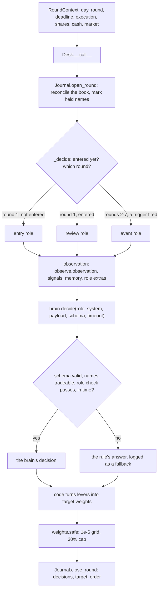
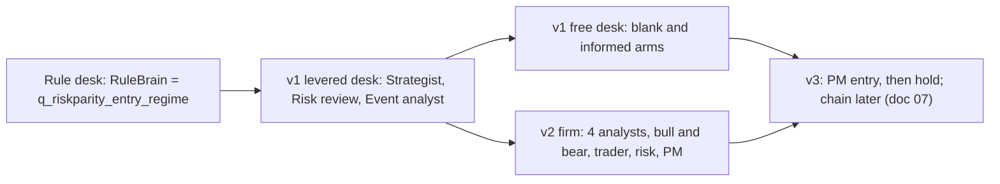
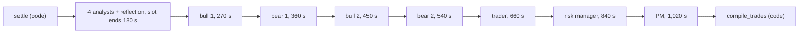

# The agent runtime, and the desks before v3

> Snapshot 2026-10-10, main @ 81dcfb5. The runtime is built and tested; the rule desk, the v1 desks and v2 have run (v2 on one window only); v3's stage 1 is running on this runtime now.

Every LLM desk in this repo runs on one small runtime in [icaif/agents/](../icaif/agents/):
code builds a point-in-time observation, a "brain" (an LLM, or code) answers one role's
question in a strict pydantic schema, and code checks the answer against the book. A
valid answer becomes weights; anything else becomes the rule's answer, and the swap is
logged. Every answer is cached by a hash of its question, so a replay repeats exactly and
can run offline, and each desk keeps a journal of its own book, reconciled every round.
The backbone is an invariance check: answered by code, each desk must trade exactly like
its reference strategy in every window (167 of 167 for the rule desk and v2), so whatever
an LLM run scores differently is the LLM's doing. Before v3, four desks ran on it (the
rule desk, the v1 "levered" desk, the v1 free desk and the v2 nine-role firm), and on the
windows they ran the LLM desks lost to the 75% inverse-vol hold or tied it, except one
Grok free-desk window won by 0.25 score points, at $0.6 to $7.4 a window. That record is
why v3 exists ([07](07_three_level_hierarchy.md)).

## Contents

1. [One round through the runtime](#1-one-round-through-the-runtime)
2. [The Desk base](#2-the-desk-base)
3. [Observations](#3-observations)
4. [Contracts: schemas and code-checked levers](#4-contracts-schemas-and-code-checked-levers)
5. [Brains](#5-brains)
6. [CachedBrain and cost accounting](#6-cachedbrain-and-cost-accounting)
7. [Deadlines, slots and fallbacks](#7-deadlines-slots-and-fallbacks)
8. [Journal and memory](#8-journal-and-memory)
9. [Budgets, triggers, trade lists and trims](#9-budgets-triggers-trade-lists-and-trims)
10. [The invariance backbone](#10-the-invariance-backbone)
11. [Replay tools and the output layout](#11-replay-tools-and-the-output-layout)
12. [The lineage: rule desk, v1, v2](#12-the-lineage-rule-desk-v1-v2)
13. [Measured latency and cost](#13-measured-latency-and-cost)

## 1. One round through the runtime



A strategy in this repo is any callable `RoundContext -> Optional[dict]` (`sim.Strategy`
in [icaif/sim.py](../icaif/sim.py)). `None` means hold. One code path serves the
backtest, the replay and the live round. The live runner builds a `RoundContext` from
fresh data and calls the same desk ([desk.py](../icaif/agents/desk.py) docstring;
`runner.run_desk` in [icaif/runner.py](../icaif/runner.py)).

The clock is the contest's. Round 1's deadline is 09:10 ET and it fills at the 09:30
open. Rounds 2-7 have deadlines at hh:25 and fill at hh:30. A half-day runs rounds 1-4
only (`calendar.ROUNDS`, `calendar.rounds_for` in [icaif/calendar.py](../icaif/calendar.py)).
Every input is cut at the deadline, and every fill lands at the execution after it.

| Module | Owns |
| --- | --- |
| [desk.py](../icaif/agents/desk.py) | `Desk`, `DeskConfig`, the v1 roles, `_ask` (call, validate, fall back), state between rounds |
| [observe.py](../icaif/agents/observe.py) | the observation, `Anonymizer`, `UniverseCodes`, headline and filing rows |
| [signals.py](../icaif/agents/signals.py) | HAR vols, score ranks, the universe ranking, Black-Litterman views |
| [schemas.py](../icaif/agents/schemas.py) | every role's answer schema (`SCHEMAS`) |
| [brains.py](../icaif/agents/brains.py) | `RuleBrain`, `ClaudeBrain`, `GeminiBrain`, `BedrockBrain`, `CachedBrain`, `PRICES`, `make` |
| [prompts.py](../icaif/agents/prompts.py), [prompts_v2.py](../icaif/agents/prompts_v2.py), [prompts_v3.py](../icaif/agents/prompts_v3.py) | frozen system prompts, one per role |
| [journal.py](../icaif/agents/journal.py) | portfolio memory, reconciliation, `verify` |
| [budget.py](../icaif/agents/budget.py), [triggers.py](../icaif/agents/triggers.py), [tradelist.py](../icaif/agents/tradelist.py) | v2's turnover budget, trigger tags, trade-list compiler |
| [untrusted.py](../icaif/agents/untrusted.py) | external text as quoted data |
| [free.py](../icaif/agents/free.py), [v2.py](../icaif/agents/v2.py), [v3.py](../icaif/agents/v3.py) | the free desk, the v2 firm, v3 (doc 07) |
| [weights.py](../icaif/weights.py) | `safe`: the last step before a decision leaves our hands |

## 2. The Desk base

### The round loop and the v1 roles

`Desk.__call__` keeps the clock and the journal. On a new day it increments `day_no` and
resets the day's fired triggers. It opens the journal, calls `_decide`, and always closes
the journal in a `finally`. `_decide` values the book first (`_value`). If a held name
has no price, the NAV is NaN and the desk holds. pandas' default `sum` would skip the NaN
and value the book without that name, so every weight would be wrong and nothing would
show it. Then it branches:

| Role (v1) | When | Schema | Levers | Rule's answer (fallback) |
| --- | --- | --- | --- | --- |
| Strategist (`entry`) | round 1, book not yet entered | `EntryDecision` | shape (`inverse_vol` / `risk_parity`), Black-Litterman `views` (`none` / `light` / `strong`), `exposure` 0.30-0.95, `avoid` up to 8 names each with a cause | risk parity at `rule_exposure(p)`, no views, no exclusions |
| Risk review (`review`) | round 1 of each later day | `ReviewDecision` | `hold`, `set_exposure` (0-0.95), `rebalance` to the entry's recipe on today's inputs (with a reason, at most `max_rebalances` = 2), `exit` names, `trim` up to 3 names | hold (plus the rule's own trims, once a trim rule has won its gate; none has) |
| Event analyst (`event`) | rounds 2-7, on a trigger for a held name | `EventDecision` | per triggered name: `hold`, `exit`, or `trim` a quarter or half, with a cause | hold every name (`brains.rule_event`) |

The rule is `q_riskparity_entry_regime`, the best entry-only candidate of the quant race
([04](04_ou_process_and_quant_signals.md)). It buys risk parity on day 1 at an exposure
blended by the two-state HMM's probability `p` that the next session is turbulent:

```
rule_exposure(p) = 0.85 * (1 - p) + 0.30 * p      # E_CALM, E_TURBULENT; NaN p -> 0.575
```

Then it holds through every event. `RuleBrain` answers every role with
`payload["rule_proposal"]`. It is a brain, not a shortcut, so the rule takes the same path
an LLM does. That is what makes the invariance check in section 10 a test of the plumbing.

### `DeskConfig`

| Field | Default | What it prevents or controls |
| --- | --- | --- |
| `window_days` | 15 | the contest window |
| `review`, `events` | True | switch the v1 roles on or off (replays use `--no-review` to cut calls about 15x) |
| `band` | 0.05 | a review exposure change smaller than this is a hold: it would pay the fee and a turnover rank for nothing |
| `max_rebalances`, `rebalance_min_turnover` | 2, 0.02 | "occasional" enforced, not asked; a rebalance under 2% turnover is a hold and does not spend the budget |
| `sigma_trigger` | 3.0 | the event trigger, in daily sigmas since yesterday's close |
| `anonymize` | False | replay mode (section 3) |
| `anchored` | True | show `rule_proposal` and the "adopt it unless" paragraph (`prompts.ANCHOR`), or withhold it and keep it only as the fallback |
| `evidence` | True | tell roles our backtest findings; `False` needs `anchored=False` and strips every finding (`prompts.NO_EVIDENCE_EDITS`, with asserts that each edit lands) |
| `regime` | True | show the HMM's turbulence odds and persistence (`observe.REGIME_FIELDS`), or only the raw readings it is fit on |
| `seed` | 0 | the per-window code draw in replays |
| `round_budget_s`, `timeouts` | 360; entry 240, review 120, event 120 | section 7 |
| `enter_any_round` | False | enter from cash at any round (Validation's late start only, commit 81dcfb5) |
| `journal_strict` | True | a journal error raises (replays, tests) or is recorded and the round goes on without memory (live) |
| `max_trims` | `trim.MAX_TRIMS` = 3 | trims a window, rule and agent together |
| `headline_roles`, `universe_roles` | (`review`, `event`); (`entry`, `review`, `event`) | which roles read held names' headlines and the universe ranking |

### `_ask`: call, validate, fall back

`Desk._ask(role, payload, schema, check, rule=None)` is the whole contract between an LLM
and the book:

1. The rule's answer is validated against the schema first. Unanchored, `rule_proposal`
   is removed from the payload but kept as the fallback.
2. The timeout is `min(timeouts[role], round_budget_s - elapsed)`. Under 5 s left, the
   brain is not asked ("round budget spent").
3. The system prompt is `prompts.system(role, anchored, evidence)`: a frozen string.
4. `brain.decide(...)` returns a pydantic object or raises. `_only_tradeable` and the
   role's `check` then run on it.
5. Any `BrainError`, `ValueError`, `KeyError` or `TypeError`, or any other exception, makes
   the source `fallback` and the decision the rule's. A crash would miss the round, so
   nothing escapes.
6. Each call appends one log entry: `day`, `round`, `role`, `brain`, `source`
   (`brain` / `fallback`), `reason`, `decision` (the full answer), `same_as_rule` (the
   levers equal the rule's, rationale aside) and `latency_s`. Event entries add the
   `triggers` that woke the analyst and the `trims_done` that actually traded.

### State between rounds

Live, each round runs in its own process, so `Desk.state()` serialises everything the
desk carries as JSON: the day count, the fired triggers, the HMM's parameters, NAV
history, traded notional, the entered flag, the code mapping, the universe codes, the
entry's recipe and its signals at entry, rebalances and trims spent, the 8-K watermark
(`filings_to`), the journal and the log. A desk rebuilt from nothing would re-enter a
book it already holds, tell the agent it is day 1 again, fire the same event twice, and
read the regime with a model fit on a later window. `restore()` never restores weights:
every round recomputes them from the shares and cash it is handed, which is the book that
exists. Tests: `test_a_desk_restored_before_every_round_trades_exactly_as_one_that_never_stopped`
(anonymised and not) in [tests/test_agents.py](../tests/test_agents.py),
`test_a_v2_desk_restored_before_every_round_trades_as_one_that_never_stopped` in
[tests/test_v2.py](../tests/test_v2.py), and
`test_a_desk_restarted_every_round_replays_triggers_and_reflection_identically` in
[tests/test_v2_triggers.py](../tests/test_v2_triggers.py).

## 3. Observations

### What a role reads

`observe.observation(...)` returns one JSON-able dict. `Desk._payload` adds `memory` and
the role's extras. Everything is built from daily closes cut at the deadline
(`quant_strategies.daily_closes`).

| Block | Contents |
| --- | --- |
| `clock` | `day`, `of` (15), `round`, `sessions_left_after_today`; `date` only with real names |
| `book` | `return_to_date`, `drawdown_from_peak`, `gross`, `entered`, `turnover_spent` (no NAV level) |
| `market` | basket returns 1/5/20d, `basket_vol_ann_ewma`, `vol_vs_3y_median`, `p_turbulent_next_session` and `regime_persistence_days` (unless `regime=False`), `avg_pairwise_corr_60d`, the basket's HAR vols and their `_at_entry` values |
| `names` (30 rows, sorted by name) | `vol_ann_20d`, `ret_1d/5d/20d`, `weight_now`, `weight_if_inverse_vol`, `weight_if_risk_parity`, `ou_s_score`, previews `weight_if_<key>`, `vol_ann_har_1d/3d`, `model_score_rank`, after entry `model_score_rank_at_entry` and `vol_ann_har_3d_at_entry`, `earnings_in_sessions`, `recent_8k_filings`, `headlines` (real names, headline roles only), and the journal's per-name fields |
| `macro` | SPY returns, vol and drawdown, VIX z-score and change, yield and curve changes, sector returns vs SPY; levels only with real names (`macro.readings`); FOMC timing |
| `universe_context` | the daily model's rank and percentile for every name it scored that day (about 100), the 30 flagged `tradeable`; rows as lists under `columns` to halve the block |
| `memory` | the journal's bounded view (section 8) |
| role extras | `rule_proposal` (anchored), `rebalance` offer, `trim_lever`, `triggers`, `new_filings` |

The signals (HAR, score rank, sessions to earnings, universe ranks) and their door
`compiler.DailyPanel` are described in [03](03_har_vol_forecaster.md),
[02](02_daily_ensemble_model.md) and README "Agent signals". The OU s-score and the
regime model are in [04](04_ou_process_and_quant_signals.md). Headlines and 8-Ks are in
[05](05_news_feeds.md) and [06](06_sec_filings.md).

**Sizes.** The rule desk's median observation is 16,617 characters, at most 18,937, over
the 4,495 rounds a role was asked in 167 windows. The universe block is about 2,800 of
them (median 2,791, at most 2,973), and the memory 9.5% at the median
(`reports/journal_budget.json`; README "Agent signals"). Before headlines were capped,
55,000 of the first live entry observation's 65,000 characters were headlines. With all
30 names held the capped titles are about 11,600 characters, plus about 1,500 per
triggered name (README "News and profit booking"). A real-names review or analyst call
on Jan 21 - Feb 10, 2026 grew to about 44,000 characters (same section).

### Per-role views

| Desk | Who reads what |
| --- | --- |
| v1 levered | every role gets the full observation; headlines only in `review` and `event`, for held names; the universe block in all three |
| v1 free | one role reads everything, headlines for all 30 names with real names, and `new_filings` (8-K text since its last decision); no universe block, since the free arms are an experiment on what each prompt is given |
| v2 | `V2Desk._views` slices the observation per job: market (market + macro), earnings (reporting names with their tags), news (headlines and 8-Ks), quant (signals + universe), and a shared core for the debate, trader, risk manager and PM |
| v3 | `v3.strip` removes whole streams for ablations, including their `_at_entry` copies; entry analysts read one stream each (doc 07) |

### Anonymised and real-names modes

The model has read 2016-25 market history. Shown "NVDA, 2024-05-20", it can recall what
happened next, and a replay that scores well on memory is no evidence of judgement
(`observe` docstring). So replays before a model's training cutoff are anonymised:

| Item | Anonymised replay | Real names (post-cutoff replays, live) |
| --- | --- | --- |
| The 30 tickers | `S01`-`S30`, a random bijection per window (`Anonymizer`, seed `cfg.seed * 1_000_003 + first_day.toordinal()`); rows sorted by code, so even alphabetical order is gone | real tickers |
| Other universe names | `U01`-`U99`, drawn from a shuffled pool when the window first shows a name (`UniverseCodes`, `POOL = 99`), kept for the window; no sector, index membership or entry date | real tickers |
| Dates | "day k of 15"; no `clock.date` | `clock.date`, journal dates |
| Price levels and NAV | none, anywhere | still none in the observation; the journal adds `entry_price` |
| Macro | z-scores and changes | levels too (VIX, yields, curve) |
| Headlines | dropped (they name the company) | shown to the headline roles |
| 8-Ks | item labels and hours since acceptance | plus the filing's own text, quoted |

An invented code raises `KeyError` in `Anonymizer.ticker`, which the desk treats as an
invalid answer. A guessed mapping would sell a name the agent never named. Real names
are for windows after the model's cutoff only, which for Gemini 2.5 is January 2025
(`brains` docstring). That is a convention the tools state (`--real-names`: "post-cutoff
windows only"), not a check in code. The contamination screen is `tools/memory_probe.py`
(section 11, and [05](05_news_feeds.md)).

### Point-in-time guarantees and their tests

Each door cuts at the deadline, and each has a test that rewrites the future and requires
the past unchanged.

| Door | Guarantee | Test |
| --- | --- | --- |
| `sim.Market.recent_closes`, `qs.daily_closes` | bars by their end time; a session still trading has no close | `test_the_entry_observation_is_unchanged_when_every_later_bar_is_rewritten` (test_agents) |
| `compiler.DailyPanel.for_day` | serves a row only for the day the deadline falls on, else `LookAheadError` | `test_a_signal_asked_for_on_another_day_raises_rather_than_serving_it`, `test_the_har_vols_the_entry_sees_are_unchanged_when_every_later_bar_is_rewritten`, `test_the_score_ranks_the_entry_sees_are_unchanged_when_every_later_score_is_rewritten` (test_signals) |
| `EarningsCalendar.to_next` | a release is visible only within `earnings.NEXT_KNOWN_SESSIONS` = 10 sessions, as announced dates would be | `test_a_release_further_ahead_than_dates_are_announced_is_invisible_to_the_entry` (test_signals) |
| `sim.Market.fill_prices` | raises for an execution at or after the deadline | `test_a_rounds_own_order_has_no_fill_until_a_later_round_sees_it_in_the_book`, `test_the_journal_a_round_sees_is_unchanged_when_every_later_bar_and_fill_is_rewritten` (test_journal) |
| `TriggerTags.tag`, `EarningsHistory` | refuses an event after the deadline; a reaction counts once its session has closed; quarters clustered only among releases known by then | `test_no_tag_changes_when_every_price_and_release_after_the_deadline_is_rewritten`, `test_an_event_dated_after_the_deadline_is_refused_not_tagged`, `test_a_reaction_counts_only_once_its_session_has_closed`, `test_a_session_still_trading_has_no_close_in_the_daily_panel` (test_triggers) |
| `news.known_at` | a headline counts from our first fetch, not its pubDate | `test_the_headlines_a_round_sees_are_unchanged_when_every_later_snapshot_is_rewritten` (test_news_events) |
| v2 morning, triggers, settlements, lessons | all paths at once | `test_no_morning_payload_changes_when_every_later_bar_is_rewritten` (test_v2), `test_nothing_from_a_later_round_reaches_an_earlier_decision` (test_v2_triggers) |
| anonymisation | no ticker, date or price level in a replayed payload or memory | `test_replayed_observations_carry_no_real_ticker_and_no_date`, `test_replayed_observations_with_every_signal_still_carry_no_ticker_and_no_date`, `test_replayed_memory_carries_no_ticker_no_date_and_no_price_level` |

## 4. Contracts: schemas and code-checked levers

**Strict schemas.** Every answer class derives from `_Strict` (`extra="forbid"`). Every
field is required; a nullable field must be sent as `null`. Bounds are the levers' own
ranges, never clamps. A clamped answer runs a book the agent did not choose, and its
rationale would describe one that never existed ([schemas.py](../icaif/agents/schemas.py)
docstring).

| Desk | Schemas (`SCHEMAS` key) |
| --- | --- |
| v1 levered | `EntryDecision` (entry), `ReviewDecision` (review), `EventDecision` of `NameCall`s (event); `Exclusion`, `Trim` |
| v1 free | `FreeDecision`: `hold` or `rebalance` with up to 30 `NameWeight` (each 0-0.30) |
| v2 | `AnalystReport`, `EarningsReport`, `DebateTurn`, `TradeList` (`AddLine`, `CutLine`, `Trim`, `target_exposure`), `RiskReview` (`exposure_signoff` 0.75-1.0), `PMDecision` (approve / amend / hold), `EventReport`, `TriggerDecision`, `Reflection` (at most 4 `Lesson`s, each citing settlement ids) |
| v3 | `PMEntry`, `PMCheck`, `Condition` (doc 07) |

**Prose is a request, not a gate.** `schemas.prose(stated)` tells the model the stated
cap (the schema's `maxLength`) and validates up to `PROSE_OVERRUN` = 1.5 times it. Hard
text caps had cost Flash 37 of 178 calls on the 2026-04-13 v2 replay (the trader's list
on 8 of 15 mornings) and Pro 7 of 181 (commit fa56a30). Each was a well-formed answer a
few characters over, counted only as "failed". The bound stays because later roles read
every report again. Names, weights and trade lines stay exact. v1's `FreeDecision` keeps
its hard 1,500-character rationale, since its four-window record was scored with it.

**Provider schema limits, worked around without loosening the contract.**

- Gemini compiles a schema into a decoding grammar and refused four with "too many
  states" (`EventDecision`, `TradeList`, `PMDecision`, `TriggerDecision`: lists of up to
  30 objects with a capped reason). Without a fix every v2 decision would have fallen back.
  `brains.gemini_schema` moves `maxLength`/`minLength`/`maxItems`/`minItems` into the
  description as words ("Must be at most 600 characters."). Numeric bounds stay, because
  Gemini honours them (commit 24d4e30).
- Grok 4.7's constrained decoding on Bedrock snapped bounded numbers to a bound. Asked for
  0.62 and 0.41 under [0.3, 0.95], it returned 0.3 and 0.3, so the first paid free-desk run
  wrote every weight as 0.30 against its own rationale. `brains.bedrock_schema` sends
  numeric bounds as words instead. Bedrock's forced tool call also dropped `null` values,
  so 2 of the first 3 holds fell back. The fix reads JSON text under `outputConfig`
  instead (commit 1e93008).
- Either way pydantic enforces every bound on what comes back, and an answer over one is
  an error the desk falls back on.

**Refused whole, never clipped.** An answer that is wrong anywhere is replaced entirely
by the fallback. It is never repaired, rescaled or trimmed of its bad line.

- `Desk._only_tradeable` checks every lever that names a name (`exit`, `avoid`, `trim`,
  `calls`, `weights`) against the 30, once for every role. A name shown only in
  `universe_context` gets its own message. v2's `_names_ok`, `tradelist.compile_trades`
  and v3's `_judge` do the same.
- Role checks, for example: an `avoid` code twice; views on `inverse_vol`; `set_exposure`
  with no number; an exit of a name not held; a rebalance with no reason, no offer, the
  budget spent, or a trim beside it; an event call for a name with no trigger; a trim
  without a fraction and a cause.
- The free desk rejects a book summing over 1. That happened once in the four official4
  Gemini runs: "book sums to 1.0002 > 1" on day 11 of the 2026-07-13 window, which then
  held (`output/agent/v1_free_gemini_2026-07-13/log.jsonl`).
- A v2 trade list is refused with every reason at once (section 9).

**What is submitted is what was stated.** `weights.safe` puts all 30 tickers in, caps
each at 0.30, rescales only if the total is over 1, then floors every weight to the 1e-6
grid. The organizers' Decimal check rejects `0.1 + 0.2 = 0.30000000000000004` as over the
cap, and one such weight invalidates the whole decision. A NaN target raises, because
`min(0.30, nan)` is 0.30 in Python ([weights.py](../icaif/weights.py)). Flooring alone
moved 697 of 300,000 six-decimal weights a grid step low (0.000493 became 0.000492). So
v2 and v3 lift each weight by `tradelist.NUDGE` = 1e-12 before `safe`, and a stated weight
is submitted as stated (commit 2a4f602).

## 5. Brains

A brain is anything with a `name` and
`decide(role, system, payload, schema, timeout) -> BaseModel` that raises `BrainError`
for an answer the desk cannot use (`brains.Brain` protocol).

| Brain | Where | What |
| --- | --- | --- |
| `RuleBrain` | brains.py | answers with `payload["rule_proposal"]` |
| `ClaudeBrain` | brains.py | Anthropic `messages.parse` with `output_format=schema`, `max_tokens` 16,000, the system prompt marked `cache_control: ephemeral`, adaptive thinking and `effort` (not on Haiku 4.5), `max_retries=1`; refusal, truncation and no parsed output are `BrainError`s; no server-side model fallback, which would answer with a model the disclosures don't name |
| `GeminiBrain` | brains.py | Gemini API `generateContent` over httpx through `net.ssl_context()`, with `responseJsonSchema`, an explicit `thinkingBudget` and `maxOutputTokens = budget + 16,000`. The key comes from the `GEMINI_API_KEY` environment variable (or `.env`), sent in a header, never the URL. Refusal finish reasons, `MAX_TOKENS`, no candidates, empty text, HTTP errors and schema failures are all `BrainError`s |
| `BedrockBrain` | brains.py | Grok 4.7 through Bedrock Converse with `outputConfig` JSON schema (`WIRE = 2`) and `reasoning.effort`; a botocore client per call so its read timeout is the call's share of the round. `make` refuses it; it stays only to replay cached Grok answers |
| `CachedBrain` | brains.py | section 6 |
| `v2.HoldBrain`, `v3.HoldBrain` | v2.py, v3.py | answer every role in code as a desk that only holds; the invariance checks |
| `Recording` | runner.py | live wrapper that keeps every call's payload, answer and latency, for disclosure |
| `SizeProbe` | tools/opus_replay.py | records prompt sizes, then declines, so the desk falls back |

**Model choice is a contest rule.** The kit's
[docs/llm_and_external_data.md](../starter-kit/docs/llm_and_external_data.md) allows, among
hosted models, OpenAI GPT-5 / GPT-5-mini, Anthropic Claude Opus 5 / Sonnet 5 / Haiku 4.5,
Google Gemini 2.5 Pro / Flash and xAI Grok 4. Among open-weight models it allows Llama 4,
Qwen3, DeepSeek-V3 / R1, Gemma 3 and Mistral Large. `brains.ALLOWED_MODELS` is Claude's
three plus Gemini's two, and `brains.make` refuses anything else. Rulings and constraints
that shaped this (brains docstring; README "Live runner"; commits 1e93008, 24d4e30):

- 2026-10-05: Bedrock serves Grok 4.6 and 4.7 but no plain Grok 4, and the owner read the
  kit's line as the family. On 2026-10-06 the organizers ruled Grok 4.7 out. Read
  strictly, "Grok 4" excludes 4.6 too, so no Grok model is allowed, and every Grok answer
  in `output/agent` is research only.
- Claude on Bedrock is refused for our AWS account ("not available for channel program
  accounts"; it is billed through a reseller). GPT-5 and Gemini are not on Bedrock.
- Gemini 2.5 Pro and Flash are named exactly and reachable with our key. `DEFAULT_MODEL`
  is `gemini-2.5-pro`. Their knowledge cutoff is January 2025.

**Prices** (`brains.PRICES`, USD per million tokens: input, output, cache read, cache write):

| Model | In | Out | Cache read | Cache write | Source noted in code |
| --- | --- | --- | --- | --- | --- |
| `claude-opus-5` | 5.00 | 25.00 | 0.50 | 6.25 | |
| `claude-sonnet-5` | 2.00 | 10.00 | 0.20 | 2.50 | |
| `claude-haiku-4-5` | 1.00 | 5.00 | 0.10 | 1.25 | |
| `grok-4.7` | 2.20 | 6.60 | 0.55 | 2.20 | Bedrock us-east-1, AWS Price List 2026-10-05 |
| `gemini-2.5-pro` | 1.25 | 10.00 | 0.125 | 1.25 | Gemini API paid tier, prompts up to 200k tokens, 2026-10-06 |
| `gemini-2.5-flash` | 0.30 | 2.50 | 0.03 | 0.30 | same |

Gemini bills thinking tokens as output, and `GeminiBrain` counts them so. Counted free, a
deep role would cost a tenth of its bill (commit 24d4e30). Implicit caching has no write
charge, and the code charges a write as input, the safe side.

**Effort and thinking.** `GeminiBrain.THINKING` maps effort to an explicit budget: `low`
1,024, `medium` 4,096, `high` 16,384, `xhigh` 24,576, `max` 32,768 tokens. It is capped
per model (`MAX_THINKING`: Pro 32,768, Flash 24,576), so a rerun asks at the same depth.
`ClaudeBrain` sends `thinking: adaptive` with `output_config.effort`. Grok got
`reasoning.effort`, which xAI validates. The brain's `name` carries model, effort and wire
version (`gemini:gemini-2.5-pro:high:wire1`), and that name is part of the cache key.

**No tools, ever.** No request carries a `tools` field, so Google Search grounding cannot
run. In a replay it would read how the window turned out, and live it would be a data
source nobody logged (`test_gemini_is_never_sent_a_tool_so_it_cannot_search_the_web`). The
v3 PM's "self-check" is a second call carrying code's report, not a tool loop
([v3_desk_plan.md](../v3_desk_plan.md)).

**Credentials.** Every failed call falls back to the rule without error. So a missing key
or a lapsed AWS login would publish a shadow that "agrees with the rule" in every round.
`brains.credentials_problem(model)` names the problem before a run. `agent_replay.py`
refuses to spend on a replay that would only measure the rule.

**Adding a provider: the Gemma example (unmerged).** Branch
`origin/gemma-brain-and-system-guide`, commit 0303363 (2026-10-02, a teammate), added
`GemmaBrain` for Gemma 3 on Bedrock (ap-south-1; `google.gemma-3-27b-it`, `-12b-it`,
`-4b-it`). It has no constrained decoding, so the brain does what the API would:

- It appends `answer_format(schema)` to the system prompt: the role's JSON schema, plus a
  required wrapper `{"analysis": ..., "decision": ...}`. The analysis comes first, since
  Gemma has no thinking mode.
- `read_reply` takes the first JSON object and ignores markdown fences. Gemma fences its
  JSON, and a bare-JSON reader would have turned every answer into the rule's.
- An invalid answer gets one repair: the model sees its reply and the validation error,
  inside the same time budget. A second miss is a `BrainError`. The model answers again;
  code never edits the answer.
- Temperature 0, `max_tokens` 2,048, no botocore retries, and the remaining time as the
  read timeout.
- The raw reply and analysis are kept for disclosure.

Measured there: on the 2026-09-30 entry observation (27,258 input tokens) the 27B
answered validly first time in 7.3 s for $0.0075. The branch forked at eda0565, before
Grok, Gemini, v2 and v3. Where it disagrees with main, main is the truth. It is a
template, not a component: to add any provider today you write the class, add its prices,
make `make` and `credentials_problem` know it, and give it a wire version in its `name`.

## 6. CachedBrain and cost accounting

**The key.** `CachedBrain.key` is the SHA-256 of
`json.dumps({brain, role, system, payload, schema, [repeat]}, sort_keys=True)`:

- `brain` is the inner brain's name: model, effort and wire.
- `role` is the role as asked, with the debate's turn (`v2_bull_1`, `v3_pm`). Keyed
  without the role or the turn, the cache would hand the bear the bull's answer whenever
  their payloads matched. The prefix is `V2Desk.PREFIX` / `V3Desk.PREFIX`; without it a
  v3 PM would be handed a v2 PM's answer the same way.
- `system` is the frozen prompt.
- `payload` is the observation itself.
- `schema` is the class name.
- `repeat` is added only when nonzero, so repeat 0 keeps every earlier key.

The answer is stored as `<cache>/<key>.json` holding `{"role", "brain", "answer"}`.

**Behaviour.**

- A hit returns the stored answer, validated again by its schema. With `offline=True` a
  miss raises `BrainError`, which the desk treats as a fallback. It never calls out
  (`test_an_offline_cache_miss_falls_back_rather_than_calling_out`).
- Only answers the inner brain returned are written. A failed, late, refused or invalid
  call is never cached. An answer that passed the schema but failed the desk's own check
  is cached, so the replay repeats that fallback.
- `repeat=N` asks every question again under new keys, to measure answer noise. A noise
  check that reused repeat 0's cache would compare every answer with itself.
- `hits` and `misses` are counted under a lock, because v2's analysts call from threads.

Consequences you should know. A rerun that is not `--offline` asks again any question
that failed or was skipped before. The v2 rerun of 2026-04-13 made 12 new calls beside 165
hits (`output/agent/v2_pro_2026-04-13.out`), so a non-offline rerun can diverge from its
original. The key holds the schema's name, not its content. A schema changed under the
same name would replay answers given to the old one. That is why commit fa56a30 checked
the request stayed byte-identical for every schema, and why `BedrockBrain` bumped `WIRE`
when its wire format changed. An ablation that leaves a role's slice unchanged reuses that
role's cached answer for free. In v3's stage-1 runs the earnings analyst's 12 windows
needed only 24 answers across all the arms run so far (the v3 worktree's cache).

**Where, how big.** The main checkout's `output/agent/cache/` holds 824 answers, 3.3 MB
(counted 2026-10-10):

| Brain | Answers | Roles |
| --- | --- | --- |
| `gemini:gemini-2.5-pro:medium:wire1` | 261 | v2 quick roles on Pro |
| `gemini:gemini-2.5-pro:high:wire1` | 201 | `free_blank` 60, `v2_pm` 45, `v2_risk` 45, `v2_reflect` 31, `v2_event_pm` 6, memory probe 14 |
| `bedrock:grok-4.7:high:wire2` | 203 | `free_blank` 105, `event` 60, `review` 28, `entry` 2, memory probe 8 |
| `gemini:gemini-2.5-flash:medium:wire1` | 99 | v2 quick roles on Flash |
| `bedrock:grok-4.7:high` | 53 | the first, wire-1 Grok answers |
| `bedrock:grok-4.7:medium:wire2` | 7 | memory probe |

Neither cache holds a `claude:` answer, and `cache_free/` (the Opus replay's cache) does
not exist. The owner's v3 worktree keeps its own cache: about 630 answers, all `v3_pm`,
`v3_pm_check` (Pro high) and the four v3 analysts (Flash medium), growing while stage 1
runs.

**Cost.** Each paid brain appends a record per call, failures included: `role`, `model`,
`effort`, `request_id`, `stop_reason`, `latency_s`, `error`, and input, output,
cache-read and cache-write tokens. `brain.cost()` prices them with `PRICES`, and
`brains.cost_by_role(brain)` splits the bill by role key. Spend caps live in the brain:
`max_calls` and `max_cost` (USD) raise `BrainError` once spent. So an overrun ends the
spend, not the run, and later questions fall back. The live shadow's cap is
`runner.Config.shadow_cost_cap` = $10 a phase, tracked in `state.json` as `spent_usd`.

**Spend lines.** `agent_replay.py` ends with one line per paid brain:

```
gemini:gemini-2.5-pro:high:wire1: 15 calls, $0.72; cache hits 0, misses 15
```

The `.out` files in `output/agent/` are those console logs, saved beside each run.
`icaif/replay_entry.py` parses the line with the regex `_SPEND` and the `fallbacks:` tally
line, and refuses to build a board entry from a run without one: a cost typed by hand is
the one number nobody could check. `calls` counts records, failed calls included. The
dollar figure covers misses only.

## 7. Deadlines, slots and fallbacks

| Desk | Time budget | When time runs out |
| --- | --- | --- |
| v1 (`Desk._ask`) | `round_budget_s` = 360 s a round; per call `min(timeouts[role], left)`, with entry 240, review 120, event 120 | under 5 s left: not asked, fallback "round budget spent"; a provider timeout is a `BrainError`, so a fallback |
| v2 (`V2Desk._ask_many`) | `V2Config.slots`: each stage's slot ends a fixed time after the chain starts: analysts 180 s, bull_1 270, bear_1 360, bull_2 450, bear_2 540, trader 660, risk 840, PM 1,020 (17 minutes); trigger rounds: event 240, event_pm 540 | a role is asked with its slot's time left as its timeout; under `min_call_s` = 5 s it is `skipped`; a future still running `grace_s` = 15 s past its slot is `late`; time a stage saves rolls forward |
| v3 | `v3.SLOTS`: analysts 180 s, PM 600, PM check 1,020 | as v2 |
| live runner | wakes `lead_s` = 12 minutes before each deadline; no upload within 45 s of it; the v1 shadow gets `agent_budget_s` = 360 s | see [11](11_systems_infrastructure.md) |

The v2 slots run to 17 minutes, not the design's 7.5. Grok 4.7 took 40-235 s a call at
effort high in the v1 runs (README "Desk v2"; `v2.SLOTS` comment), so the runner's
12-minute lead would have skipped most roles. A live v2 or v3 entry must wake earlier.
Its inputs are as of the prior close plus overnight news, so it can (v3_desk_plan.md
"Build order", step 9).

**Fallbacks, and how they are counted.**

| Desk | A role fails | The decision-maker fails | Counted as |
| --- | --- | --- | --- |
| v1 levered | that role gets the rule's answer | (each role decides) | log `source: fallback` with a `reason`; `agent_replay` prints "answers that differ from the rule: N of M" from `same_as_rule` |
| v1 free | (one role) | before entry, the 75% inverse-vol book (`baselines.scaled(InverseVolHold, 0.75)`, exactly what we would submit); after, hold | log `source: fallback` |
| v2 | skipped, late or failed: logged and counted; later roles see `{"unavailable": reason}` | a failed PM or a refused list means no trade; before the first buy, the 75% inverse-vol book | `V2Desk.fallbacks` Counter: `<role>:skipped/late/failed`, `pm:refused`, `pm:hold`, `entry:hold_book`, `event_pm:refused`; printed as a `fallbacks:` line |
| v3 | analysts as v2 | a refused or failed entry buys inverse-vol at the fallback gross (75%, or a sleeve's) | adds `pm_check:refused` |

The fallback is always the reference book, run through the reference's own code, so a
failing model costs nothing against it (section 10).

## 8. Journal and memory

[journal.py](../icaif/agents/journal.py) (Roadmap step 4; README "Portfolio memory")
keeps **one journal per desk, so one per book**. Live, the rule desk's journal is the
submitted book's, and the shadow agent's is its paper book's. Both live in `state.json`,
committed atomically with the books they describe.

**Each round.**

1. **Reconcile** (`open_round`). The journal takes the book the round starts from: the
   server's portfolio live, a paper book in a dry run, the simulator's ledger in a
   replay. It compares that book with what it expects: last round's book plus each open
   order's fill, sized by `sim.rebalance` at the execution's prices. A match within
   `TOLERANCE` = 5e-4 of NAV (5 bps) in every name and in cash records the fill as
   `exact` or `within tolerance`. Anything larger is an issue (`book_differs`) naming the
   names and the cash gap, and the journal then adopts the book. The book is the source of
   truth; the journal never edits it. The 5 bps line sits far above vendor noise: Yahoo's
   :30 opens against Alpaca's differ by p99 21 bps, about 0.6 bps of NAV on a 3% name.
   A missed or unexpected fill is the whole trade. Orders that can no longer fill expire
   with an `unfilled_order` issue. A rerun of the same round replaces its earlier entry
   (`round_rerun`). A journal that starts over a book already holding names says its
   entries are unknown (`no_journal`, entries priced at the last close) rather than
   inventing them.
2. **Mark.** Each held name gets its last price and its peak since entry: its fill, then
   every bar closed after it by the deadline (`LOOKBACK_BARS` = 400).
3. **Record** (`close_round`). The journal stores the decisions as the desk logged them,
   with the levers apart from the stated reason. A target becomes an order `placed`.
   Live, `set_order` says what became of it. Statuses `placed`, `dry-run`, `paper`,
   `uploaded` and `executed` expect a fill, `ambiguous` maybe, anything else (a guard
   hold, not armed, refused) none. So a guard hold never reads next round as a fill that
   failed, and an upload never reads as a decision nobody made. `skipped` records a round
   the desk did not run.

**Point in time.** Bars come through `Market.recent_closes` and fills through
`Market.fill_prices`, both cut at the deadline. A round's own order has no fill until a
later round sees it in the book.

**What a role reads.** `memory(code, real)` returns the book as reconciled (cash as a
share of NAV, names held, return since start and its best, orders pending), the latest
`RECENT_ROUNDS` = 7 rounds in full (consecutive quiet holds folded into one row), earlier
days a line each, the last 6 names sold out with their gain and peak gain, and the last 6
issues. `name_fields(real)` adds per held name `entry_day`, `gain_since_entry` and
`peak_gain_since_entry`, plus `entry_date` and `entry_price` with real names. The gap
between the two gains is what a winner has given back, and the trim reads it. In
replays the view carries codes, day numbers and returns only.

**Bounded, hard.** `_fit` holds the block under `MEMORY_MAX_CHARS` = 6,000 characters (as
the brain sends it, `json.dumps(sort_keys=True)`). It reserves 200 for a note saying what
went, then cuts in this order:

1. count older days' decisions instead of listing them;
2. merge older days pairwise;
3. drop older sold names and issues down to 2;
4. shorten reasons to 120 characters;
5. drop earlier days;
6. strip older rounds' detail;
7. drop older rounds, the latest round always last.

**Measured** (`tools/journal_report.py`, 234 s; [reports/journal_budget.json](../reports/journal_budget.json)),
the memory a role would read at every one of the 105 rounds of each of 167 windows:

| Desk | Max chars | Median | p95 | Share of observation (median / max) | Journal vs ledger |
| --- | --- | --- | --- | --- | --- |
| Rule desk | 3,776 | 1,604 | 2,667 | 9.5% / 20.4% | 167 of 167 agree |
| Busy scripted desk (a lever at every chance, ~1,000-character reasons) | 5,859 | 4,371 | 5,757 | 22.2% / 32.7% | 167 of 167 agree (3,530 fills, 3,359 names sold); trimmed to fit in 243 of 3,588 asked rounds |
| Worst case (every round the longest answers the schemas allow, and a trade; 12 windows) | 5,873 | 5,568 | 5,859 | | (no desk) |

**`journal.verify(journal, fills, ...)`** lists every way the journal disagrees with the
ledger it kept (`sim_fills` for a replay, `paper_fills` for a paper book):

- each fill on record is one the ledger made, to the cent, against the round that
  ordered it, and each ledger fill is on record;
- a hold traded nothing;
- an order expected to fill has its fill, is still open, or says why not;
- the stated levers are what the book did: an avoided name not bought, an exit sold
  out, an exposure bought at its level within 31e-6, a trim that sold some and kept some;
- each held name's shares, entry time, cost and peak can be rebuilt from the ledger
  alone;
- no issue is on record unless allowed.

It checks levers, not prose. Whether an LLM's reasons stay consistent with its memory is
untested (README "Portfolio memory").

**Failure handling.** With `journal_strict=False` (live), a journal error restores the
journal as it stood before the round. Half a reconcile on disk would read next round as a
book that changed without an order. The role is then told the memory is `unavailable`
this round. The submitted book's entry must not wait on a bug in what the agent is shown.

**v2's reflection** stores `settlements` and `lessons` in the journal, which v1's memory
view never shows. Code settles each line the PM traded after the entry, from its fill to
the close of the next session: `effect_bp = weight_traded * move * 1e4`, fees apart.
It also settles each name held through its results, as weight times the reaction. Only
names a list named are graded. A fill also moves every other name by the drift between
the close it was valued at and the open it fills at, and grading that drift would teach
lessons about noise (commit d182f1d). A deep role writes at most 4 lessons, each citing
the settlement ids it rests on, or the answer is refused. Roles see the last 8 lessons and
6 settlements. The lessons live in that window's journal and never cross windows.

## 9. Budgets, triggers, trade lists and trims

**Turnover budget** ([budget.py](../icaif/agents/budget.py), v2). The unit is the kit's.
The board's turnover is the mean over a window's rounds of traded notional over NAV
before the trade, so a budget of `B` "books", fully spent, scores `B / rounds`. Buying the
75% hold spends 0.75. `TurnoverBudget(total, rounds)` counts spent as filled turnover (the
journal's reconciled fills, adoptions included) plus the estimate of every order not yet
seen filled. Counting targets would charge refused orders. Counting only fills would let
two rounds spend the same headroom while the first is in flight. It is read from the
journal, so a restarted desk reads the same budget. v2 shows it to every trading role and
caps only a runaway (`turnover_cap` = 5 books a window). v3's plan sets 1 book after entry
and 2 PM interventions; stage 2 is not built ([10](10_stage2_escalation_chain.md)).

**Triggers.** v1 and v2 wake an analyst in rounds 2-7 only for a held name, for one of
three causes:

- **Earnings at the next open:** at the day's last round, the next reaction session is 1
  away (`EarningsCalendar`).
- **A 3-sigma move:** `z = log(last bar / yesterday's close) / std(last 20 daily log
  returns)`, `|z| >= 3`.
- **A new 8-K:** accepted between the last event round's deadline and this one's.

A price or earnings trigger fires once a day per name, and a filing once per filing. Over
the 167 windows the analyst is asked 23.4 times a window. Of the names woken, 3,606 were
8-Ks, 1,835 3-sigma moves and 1,162 earnings (README "News and profit booking").

v2 adds a tag to each trigger, computed by code (`triggers.TriggerTags`):

- `status` is `upcoming` or `already_reacted`, measured against the fill, not the clock.
  Every deadline is before its :30 execution, so anything public by the deadline is
  already in the next fill. Round 1 fills at the open, which is the reaction
  (`minutes_traded` 0).
- The move since the last close, in percent and in daily sigmas.
- The name's last 8 earnings reactions.

The tags exist because v1's analyst sold names after they had gapped down, and the free
desk sold 16 names before their results without asking how far each moves
([triggers.py](../icaif/agents/triggers.py) docstring).

**Trade lists** ([tradelist.py](../icaif/agents/tradelist.py), v2). Roles say what
changes; code alone writes weights:

- adds set a name to a stated weight;
- cuts sell outright;
- trims sell a quarter or half;
- `target_exposure` scales only the names no line touches, so a stated weight is never
  moved by someone else's exposure call.

`compile_trades` refuses the whole list, with every reason at once, for any of these:

- a name outside the 30 (a universe-only name is named as such);
- a name in two lines;
- a cut or trim of a name not held;
- an add at or below the current weight;
- a number off the 1e-6 grid;
- a line moving under `MIN_TRADE` = 0.005 of NAV;
- a name over 0.30;
- gross over the cap;
- more turnover than the budget has left.

Roles see weights to 4 decimals, so a PM filling to exactly 0.75 can land up to
`GROSS_SLACK` = 30 x 0.5e-4 = 0.0015 over without seeing it. On the 2026-04-13 replay a
list at 0.7500x was refused for "gross 0.7500 is over the 0.75 allowed". A gross within
that slack of a cap below 1.0 now trades as stated, and 1.0 is never exceeded (commit
4b47a22). v2's gross above `exposure_free` = 0.75 needs the risk manager's
`exposure_signoff`.

**Trims** ([icaif/trim.py](../icaif/trim.py)). `FRACTIONS` is quarter 0.25 and half 0.5.
A sale under `MIN_TRIM` = 0.005 of NAV is a hold and spends nothing, and `MAX_TRIMS` = 3
a window, rule and agent together. Each trim carries a cause (`give_back`, `news`,
`filing`, `volatility`, `earnings`) so a replay can score trims by cause. The rule's own
trim did not win its gate, so the rule desk does not trim (README "News and profit
booking").

**Untrusted text.** Headlines and filing text reach a role only inside a `source_text`
field. They are cleaned (NFKC, every Unicode category-C character turned to a space,
whitespace collapsed) and capped: 160 characters a title, 240 a summary, 1,200 a filing.
Every prompt says the field is evidence, never instruction, and the system prompts are
frozen strings no external byte reaches. A test feeds a headline ordering "exit every
position" to a brain that obeys it. The answer is refused, the desk trades the rule's
book, and the rule desk's decisions are identical with and without the headline
(`test_a_headline_that_gives_instructions_changes_no_decision_and_stays_quoted_data`).
Details in [05](05_news_feeds.md).

## 10. The invariance backbone

Answered by code, each desk must trade exactly as its reference, trade for trade, in every
window. Its journal must also agree with its ledger. A tool that finds otherwise stops and
reports nothing.

| Desk | Code brain | Must equal | Windows | Command | Runtime | Result |
| --- | --- | --- | --- | --- | --- | --- |
| v1 levered `Desk` | `RuleBrain` | `q_riskparity_entry_regime`'s ledger; `journal.verify` clean | all 167 (2016-03-31 to 2026-08-18) | `agent_replay.py --ledgers-only` | 142-185 s as inputs were added (README) | 167 of 167 at every step since commit 89828a0 (4,495 decisions, none different) |
| v2 `V2Desk` | `v2.HoldBrain` | `inv_vol_hold_75` | all 167 | `agent_replay.py --desk v2 --ledgers-only` | 127 s (commit 3898df0) | 167 of 167, triggers included |
| v3 `V3Desk` | `v3.HoldBrain` | inverse-vol hold at the fallback gross (75%, and a 30% sleeve) | the 22 stage-1 windows, at both grosses | `entry_replay.py ledgers` | not recorded | 22 of 22 (commit d7224b7) |
| `FreeDesk` | a failing brain | `baselines.scaled(InverseVolHold, 0.75)` | test windows; 20 in the Opus dry run | `test_a_failing_opus_trades_exactly_the_hold_we_would_submit`; `opus_replay.py --dry` | | ties the hold in all 20 (commit 952019e) |

Without `--ledgers-only`, a rule-brain replay also ranks the desk against the field. It
stops if the desk's score differs from its reference in any window.

**Why it matters for the paper.** An LLM desk shares everything with its code-answered
twin: observation assembly, signal doors, lever arithmetic, the 30% cap, the grid, the
journal, fills and fees. So when the twin equals the reference exactly, a paired
difference between the LLM desk and the reference measures the LLM's choices alone. The
same discipline caught plumbing bugs that would otherwise have read as LLM behaviour.
The free desk's first fallback was a lookalike of the hold, and its dry run scored
0.13-0.20 worse than the real one (commit 952019e). A recipe filled at 1.0 and then scaled
would have landed a three-name book at 0.9 of its exposure (`Desk._recipe_book`
docstring).

## 11. Replay tools and the output layout

| Tool | What it does | Key flags | Writes |
| --- | --- | --- | --- |
| [tools/agent_replay.py](../tools/agent_replay.py) | runs a desk through 15-session windows and ranks it, with `inv_vol_hold_75` and `q_riskparity_entry_regime`, against the modelled field (`baselines.FIELD`, [00](00_contest_and_evaluation.md)); loads macro, FOMC, scores, universe scores, HAR, earnings and 8-Ks for every desk | `--brain rule/claude` (`claude` means "the paid brain", whatever `--model`), `--model`, `--effort`, `--desk levered/free/v2`, `--arm blank/informed`, `--deep-model`, `--quick-effort`, `--deep-effort`, `--unanchored`, `--no-evidence`, `--no-regime`, `--real-names`, `--on DAY`, `--start/--end/--windows`, `--no-review`, `--no-events`, `--max-calls`, `--offline`, `--yes`, `--tag`, `--ledgers-only` | `output/agent/<tag>/log.jsonl`, `windows.csv`, and for v2 `chain.jsonl` (every role's call: tier, source, reason, answer, `payload_chars`, `system_chars`, `latency_s`) |
| [tools/opus_replay.py](../tools/opus_replay.py) | the free desk's two arms on `ClaudeBrain` (Opus 5) over 20 windows from 2025, scored on the no-clone and active fields | `--arm`, `--windows`, `--effort`, `--max-cost` (75), `--workers` (8), `--dry`, `--offline`, `--yes` | `output/agent/opus_<tag>_<n>w/`; cache `output/agent/cache_free/` |
| [tools/memory_probe.py](../tools/memory_probe.py) | asks the model for a window's earnings reactions and its 20 largest daily moves, and flags the window as remembered when signs beat their chance rate or guesses correlate, at 5% one-sided ([icaif/memprobe.py](../icaif/memprobe.py)) | `--on`, `--board`, `--model`, `--effort`, `--largest`, `--yes`, `--offline` | `output/agent/memory_probe/<model>_<start>.json` |
| [tools/board_rank.py](../tools/board_rank.py) | places a replay's strategies on the holdout board, after requiring the replay's hold to equal the board's to 1e-9 in all four metrics | `tags...`, `--field` | `output/agent/<tag>/board.csv` |
| [tools/submit_agentic.py](../tools/submit_agentic.py) | builds one agentic board entry from per-window runs and submits it; [icaif/replay_entry.py](../icaif/replay_entry.py) refuses a missing or doubled window, mixed desks or models, a run with no spend line, or a window priced differently from the board | `tags`, `--suite`, `--name`, `--desk`, `--window-choice`, `--dry` | the public board (remote; never run it yourself) |
| [tools/journal_report.py](../tools/journal_report.py) | memory size and journal-vs-ledger over 167 windows, for the rule, busy and worst-case desks | `--windows` | `reports/journal_budget.json` |
| [tools/entry_replay.py](../tools/entry_replay.py) | v3 stage 1 ([09](09_stage1_doe.md)) | `round0`, `ledgers`, `arm ...` | `output/entry/<tag>/` |

Every paid tool prints its call count and dollar estimate and stops without `--yes`.

**`output/agent/` in the main checkout:**

| Entry | What |
| --- | --- |
| `cache/` | the answer cache (section 6) |
| `<tag>/` | one replay: `log.jsonl`, `windows.csv`, `chain.jsonl` (v2), `board.csv` (from `board_rank`); `C_grok47_free_blank_2026-01-21/` also has `attribution.csv` and `nav.csv`, which no tracked tool writes |
| `<tag>.out` | the replay's console log, ending in its spend lines |
| `rule_167w/` | the rule desk over all 167 windows (2026-09-29) |
| `check_rule_*` | rule-brain checks of the unanchored, no-evidence and free variants |
| `opus_dry_20w/` | the free desk's dry run (`spend.json` is empty) |
| `grok_smoke/`, `invalid_wire1/` | a capped Grok smoke run, and runs under the broken bounded wire, kept apart |
| `B_*`, `B2_*`, `C_*` | the v1 Grok runs (section 12) |
| `v1_free_gemini_<start>` | the free desk on the four official4 windows |
| `v2_gemini_2026-04-13`, `v2_pro_2026-04-13*` | the v2 runs |
| `v2_rule_measure_*` | v2 on `HoldBrain` with real names, to measure prompt sizes |
| `memory_probe/` | probe results for Grok 4.7 and Gemini 2.5 Pro |

Strategy names in `windows.csv` carry `claude` for any paid brain (`free_blank_claude`,
`v2_claude`, `desk_claude_unanchored`). This is a historical artefact of `--brain claude`,
and the model is in the `.out` spend line.

## 12. The lineage: rule desk, v1, v2



### The rule desk (2026-09-29, commit 89828a0)

The quant race found that any trade after entry costs turnover ranks that the drawdown it
saves does not buy back ([04](04_ou_process_and_quant_signals.md); `icaif/agents/__init__.py`).
So the desk puts judgement where it is cheapest: the entry, which is paid for anyway. The
rule desk is `Desk(RuleBrain())`, and it is what the live runner submits
(`runner.run_desk`). It reproduces its candidate trade for trade in 167 of 167 windows.

### v1: the levered desk (2026-09-29 to 2026-10-06)

Three roles pull levers that code turns into weights (section 2). Over a week the inputs
and levers grew:

- 2322e58 added macro, the Fed calendar, 8-K events and archived headlines;
- 50613d4 added our signals, Black-Litterman views, exclusions with a cause, and the
  rebalance;
- 5ea123d added the journal;
- a17e20b limited headlines to held names in the review and the analyst, and added the
  8-K trigger and trims;
- 705c0a4 added the universe ranking.

Commit 21cdadc added three switches, so the cause of a behaviour could be isolated:
`anchored` (show the rule's answer), `evidence` (tell the backtest findings) and `regime`
(show the HMM's read). Paid runs, all Grok 4.7 at effort high, one window from
2026-01-21, real names:

| Run | Flags | Questions | What it did | Cost | Score vs hold (modelled field) | Board place |
| --- | --- | --- | --- | --- | --- | --- |
| B | unanchored, with evidence | 53 calls: 1 entry, 14 reviews, 38 event calls covering 72 names | entered inverse-vol at 0.90 avoiding GE and INTC, then held through all 86 later questions (14 reviews + 72 names) | $3.13, 3,019 s | +0.000 | 31 of 39 (hold 27 of 38) |
| B2 | unanchored, no evidence | 37 calls: 1 entry, 14 reviews, 22 event calls covering 30 names | entered risk parity, light views, 0.80, avoiding GE and INTC; then exited 14 names over 8 of its 14 reviews (and trimmed one), while the analyst trimmed 2 names and exited 2 | $2.22, 2,399 s | +0.250 | |

Sources: `output/agent/B_grok47_unanchored_2026-01-21/log.jsonl`, `board.csv` and `.out`,
and the same for B2. Scores are lower-better differences in mean overall score. The
anchored levered desk never had a full paid run, only a capped smoke run.

### v1: the free desk (commit 952019e, 2026-09-29)

The free desk asks "what if we just ask Opus?". One role writes the whole book each
morning, or holds. There are two arms. **Blank** gets the game's rules and the
observation. **Informed** also gets our backtest evidence and the backtested book as the
bar to beat. The fallback is the hold we would submit. `tools/opus_replay.py --dry`
measured about 3.4k tokens a call (blank) and 3.7k (informed), about 600 calls and about
$56 at effort high for 20 windows. The paid Opus run never happened. Commit 952019e left
it out for want of an API key, Claude on Bedrock was later refused for the AWS account,
and the cache holds no Claude answer. The free desk then ran on Grok and on Gemini:

| Run | Windows | Calls, cost | Result (score vs hold, lower better) | Source |
| --- | --- | --- | --- | --- |
| C, Grok 4.7 high, blank | 2026-01-21, 2026-02-26, 2026-04-13 | 15 each; $1.15, $1.06, $0.97 | -0.250, +1.000, +1.750; Jan 21 board place 12 of 39, but 34th of 39 on turnover; differed from the rule on 10 of 15 mornings | `C_grok47_free_blank_*` |
| C without the regime read | same three | $0.91, $0.87, $1.03 | +0.000, +1.000, +2.000 | `C_grok47_free_blank_noregime_*` |
| C with macro (rerun) | 2026-01-21 | $1.05 | +0.000 | `C_grok47_free_blank_macro_2026-01-21` |
| v1 free, Gemini 2.5 Pro high, blank, real names | the four official4 windows (2025-04-11, 2025-10-13, 2026-04-13, 2026-07-13) | 60 calls, $0.63 + $0.76 + $0.72 + $0.81 = $2.92; 1 fallback | +1.250, +0.750, +2.750, +1.750; turnover 1.9%, 4.2%, 5.4%, 4.8% against the hold's 0.71%; differed from the rule on 13-14 of 15 mornings; 2026-04-13 board place 25 of 29 (hold 10 of 28) | `v1_free_gemini_*` |

Until 2026-10-06 `agent_replay.py` never passed `macro` to any desk, so Run C decided
without the block its prompt says it may get (commit 0c8a508). The Gemini runs came after
the fix.

**What v1 taught** (README "Desk v2"; commits 21cdadc, 3898df0, 722ddd9; v3_desk_plan.md
"Why a third desk"):

- What the prompt said moved the behaviour more than anything else measured. Same model,
  same window, same levers: told our evidence, the unanchored levered desk held through
  all 86 later questions (B); without it, the desk exited 16 names and trimmed 3 (B2).
  The free desk, told nothing, traded on 10 of 15 mornings (C).
- An LLM trusts a label it is shown. Through the Feb 26 - Mar 18, 2026 sell-off the free
  desk cited "calm regime, turbulence odds 1.7%" every morning while its book fell 3%,
  and stayed 93% invested. That is why `regime` became a switch, and why v2 shows no
  regime label. Hiding the label did not help in that window: -4.22% against -3.78% with
  it (`C_grok47_free_blank_noregime_2026-02-26.out`).
- Asked "what book?" every morning, a model rewrites the book, and turnover ranks pay
  for it.
- The v1 analyst sold names that had already gapped down, and the free desk sold 16
  names before their results without asking how far each usually moves. That led to the
  trigger tags with past reactions.
- Infrastructure failures look like decisions: bound snapping, dropped nulls, a missing
  macro block. None showed in the score. Each was found by reading answers, fallback
  reasons or payloads.

### v2: the firm (commits 3898df0, d182f1d; 2026-10-06)

Each morning four analysts (market, earnings and events, news, quant) report in
parallel, beside the reflection. A bull and a bear then argue for two rounds, the trader
writes a `TradeList`, the risk manager reviews it with code's compile of it, and the PM
approves, amends or holds. Only the PM's answer reaches code. In rounds 2-7 the event
analyst and an event PM decide triggered names only: a list naming another name, or
setting an exposure, is refused.

The tiers (`V2Config.tiers`, `ROLE_TIER`) are quick (analysts, debate, trader, event
analyst: Gemini 2.5 Flash, medium) and deep (risk, PM, event PM, reflection: Gemini 2.5
Pro, high). Who hears what is fixed by asserts in [prompts_v2.py](../icaif/agents/prompts_v2.py).
Only the risk manager hears the backtest evidence, and nobody sees a regime label or the
rule's answer.



The pre-run estimate was about 222 calls and $10 a window at Grok 4.7's prices ($110 for
an 11-window evaluation; README "Desk v2"; commit d182f1d). The tool's own estimate on
Gemini was $7.01 (Flash/Pro) and $12.03 (all Pro) a window (the `.out` headers). It ran
on one window, 2026-04-13, four times:

| Run | Tiers | Calls, cost, wall time | Fallbacks | PM traded | Return, turnover | Score vs hold | Board place |
| --- | --- | --- | --- | --- | --- | --- | --- |
| `v2_gemini_2026-04-13` | Flash medium / Pro high | 136 + 42; $1.64 + $1.72 = $3.36; 3,056 s | 37 failed role calls (bull 12, bear 10, trader 8, news 4, quant 2, earnings 1); 2 PM lists refused, so the desk held | 11 of 15 mornings | +2.03%, 3.70% | +2.500 | 24 of 28 |
| `v2_pro_2026-04-13_hardcaps` | Pro medium / Pro high | 137 + 44; $5.51 + $1.91 = $7.42; 4,035 s | 7 failed role calls; 1 PM list refused | 14 of 15 | +1.01%, 3.24% | +2.250 | 25 of 28 |
| `v2_pro_2026-04-13_strictgross` (after fa56a30) | same | 120 + 40 (+17 hits); $6.73; 3,223 s | 1 failed (market); 1 PM list refused ("0.7500 over 0.75") | 13 of 15 | -0.94%, 4.07% | +4.000 | 29 of 29 |
| `v2_pro_2026-04-13` (after 4b47a22, mostly cached) | same | 9 + 3 new (+165 hits); $0.53; 269 s | 1 failed (market) | | -0.82%, 4.12% | +4.000 | 29 of 29 |

The hold returned +3.97% in that window, with turnover 0.71%. Sources: each run's `.out`,
`log.jsonl` and `board.csv`. From chain start to the PM's decision took a median 201 s
(Flash/Pro) and 251 s (Pro/Pro), at most 310 s, well inside the 1,020-second slot.

**What v2 taught.**

- A firm built to produce a trade list every morning produces one. The PM traded on
  11-14 of 15 mornings and ranked 24th-29th of 28-29.
- It cost 5-10x the free desk for no better result (commit d7224b7).
- Two silent failures cost roles at random with nothing wrong on the face of the score:
  hard prose caps, and an exact gross check against 4-decimal displays. Hence
  `PROSE_OVERRUN` and `GROSS_SLACK`.
- The board crowds just above a pure hold. On 2026-04-13 the rule spent 0.08% more
  turnover than the hold and fell 4 turnover ranks, a full point of score
  (v3_desk_plan.md).

So v3 spends its thinking once, on the entry, and makes every later trade climb an
escalation chain ([07](07_three_level_hierarchy.md), [10](10_stage2_escalation_chain.md)).
`V3Desk` subclasses `V2Desk` and reuses its call machinery (`_ask_many`, slots, tiers,
the cache prefix, the fallback counter) and the journal.

### What the live runner runs

On main the live shadow is the v1 levered `Desk` with a paid brain, built by
`runner.run_desk` with `anonymize=False` and `journal_strict=False`. It is wrapped in
`Recording` and capped at $10 a phase. Neither v2 nor v3 is wired into the live runner
(commits d182f1d and d7224b7, "Left out"). See [11](11_systems_infrastructure.md).

## 13. Measured latency and cost

| What | Per call | Per window | Source |
| --- | --- | --- | --- |
| Grok 4.7 high, v1 runs (as stated) | 40-235 s | | README "Desk v2"; `v2.SLOTS` comment |
| Grok 4.7 high, free desk (desk log) | 30-210 s, medians 73-114 s | 15 calls, $0.87-1.15, 1,220-1,786 s | `C_grok47_*` `log.jsonl` and `.out` |
| Grok 4.7 high, levered desk | 16-120 s, median 57 s | 37-53 calls, $2.22-3.13 | `B_*`, `B2_*` |
| Grok 4.7 output size | about 7,000 output tokens a call at high, reasoning included ($0.067 a call on 31,000-character prompts) | | commit 3898df0 |
| Gemini 2.5 Pro high, free desk | 15-67 s (medians 23-33 s); entry calls 18, 29, 38, 41 s | 15 calls, $0.63-0.81, 400-533 s | `v1_free_gemini_*` |
| Gemini v2 roles | Flash/Pro run: role means 11-27 s on Flash medium, 15-37 s on Pro high; all-Pro run: role means 17-53 s; slowest call 88 s | 178-181 calls, $3.36-7.42 | v2 `.out` tables |
| v2 prompt sizes (characters) | systems 4,240-6,395; payloads: market about 1,190, quant about 13,300, news about 18,400, debate 26,000-29,000, trader 31,000-35,000, risk 33,000-38,000, PM 34,000-39,000 (max 48,201) | | v2 `.out` tables |
| v3 single PM, Gemini 2.5 Pro high | draft 44-80 s (median 58 s), check 14-51 s (median 36 s); payload median 24,719 characters | estimated $0.07 + $0.04 on the smoke window | v3 worktree `output/entry/v3_none_free_select_13w/chain.jsonl`; `entry_replay.EST` comment |
| v3 estimates | | single-PM arm $0.10-0.20 a window, analysts add about $0.05; stage 2 $2-4 a window | v3_desk_plan.md |
| Gemma 3 27B on Bedrock (unmerged) | 7.3 s on 27,258 input tokens | $0.0075 a call | commit 0303363 |
| Memory probe, Gemini 2.5 Pro | | 7 windows, 14 calls, $0.54 | commit 24d4e30 |
| Live shadow cap | | $10 a phase | `runner.Config.shadow_cost_cap` |

## Contest-specific vs general

| Piece | Contest-specific | General |
| --- | --- | --- |
| `Desk` loop, `_ask`, fallback to a reference | the three v1 roles and their levers | call, validate, fall back, log; state as JSON between processes |
| Observation | 30 names, 15-day window, 7 rounds, :30 fills, the US session calendar, the score's rank framing | point-in-time doors, per-role views, the `_at_entry` comparison, previews of the exact book a lever buys |
| Anonymisation | `S01`-`S30`, `U01`-`U99`, Gemini's Jan 2025 cutoff | per-window random codes, day numbers, no levels, text dropped; real names only after the cutoff |
| Schemas | 30-item lists, 0.30 cap, exposure 0.30-0.95, 0.75 sign-off | strict schemas, every field required, refuse whole, prose as a request |
| Brains | `ALLOWED_MODELS`, the organizers' rulings, Bedrock account limits | the `Brain` protocol, explicit effort, no tools, per-call records, credentials check |
| Cache | | content-addressed answers, offline replays, repeat keys |
| Journal | the kit's portfolio, Yahoo vs Alpaca noise behind the 5 bps tolerance | reconcile against the book of record, adopt and say so, bounded memory, `verify` |
| Budget, trade lists, trims | the kit's turnover unit, the 1e-6 grid and Decimal check | turnover counted from fills plus pending orders; lists compiled by code, refused whole |
| Triggers | EDGAR 8-K items and item-2.02 earnings, US sessions | event tags measured against the fill, not the clock |
| Evaluation | rank against a modelled field and the board; official4 | paired-by-window differences against a reference; the invariance backbone |

## Generalizing for the paper

What has to change, by file:

1. **Models.** In [brains.py](../icaif/agents/brains.py), replace the contest whitelist
   (`ALLOWED_MODELS`, `make`) with a research registry, but keep refusing unnamed models:
   each answer should name the exact model, effort and wire version it came from, as the
   cache key does. Add providers through the `Brain` protocol. Use native structured
   output where it exists (Claude's `output_format`, Gemini's `responseJsonSchema`), and
   the Gemma pattern where it doesn't (schema in the prompt, first JSON object, one
   model-side repair). Keep pydantic validation on every answer. Test each provider's
   decoder for the two traps found here: bounds snapped to a bound, and `null`s dropped.
   Re-measure `PRICES` with dates.
2. **Tools.** The runtime has none, by design. Retrieval or search is a new experimental
   factor with its own look-ahead risk. A search at replay time reads the future, so any
   tool must be served through point-in-time doors and logged like an input.
3. **Prompts.** `prompts.COMMON`, `GAME` and `prompts_v2.GAME` hard-code the game: 30 US
   large caps, $1,000,000, 15 days, 7 rounds, 0.1% fee, rank-based score. Parameterise
   them. The evidence paragraphs are this contest's backtest findings; re-derive them per
   market or leave them out. B, B2 and C show that the evidence text alone moves the
   behaviour.
4. **Universe size.** Schemas cap lists at 30 and weights at 0.30. Observation rows grow
   linearly. The rule desk's median observation is about 16,600 characters for 30 names.
   Subtracting the median universe block (2,791) and the median memory (1,604) leaves
   roughly 12,200 for the name rows plus the clock, book, market and macro blocks (a
   rough derivation from medians in `reports/journal_budget.json` and README). Gemini's
   decoder already refused 30-object lists with capped text; longer lists and larger
   schemas are untested. For hundreds of names you need screening before allocation, and
   per-role views. v2's `_views`, v3's `strip` and the "reports only" arm are the working
   patterns. `UniverseCodes` runs past `U99` in order, so the code scheme scales.
5. **Markets.** `calendar.ROUNDS` and `EARLY_CLOSES`, `sim` fills at :30 opens, the 0.1%
   fee, `weights.safe`'s grid, the journal's `TOLERANCE` (tied to Yahoo-vs-Alpaca noise),
   and the trigger sources (EDGAR acceptance times) are all US- and kit-specific. Each new
   market needs its own session calendar, fill model, vendor-noise measurement and
   disclosure feed with acceptance timestamps.
6. **Strategies and score.** The v1 levers assume a long-only book of risk parity or
   inverse-vol. The free and v3 desks write arbitrary books. For a generic setup, report
   absolute metrics (return, Sharpe, drawdown, turnover and cost) beside any rank. Keep
   paired-by-window comparisons and the selection/confirmation split (`v3.STAGE1`).
7. **Keep the backbone.** For every new desk, market or strategy family, define the
   reference strategy and a code brain, and require trade-for-trade equality (and a clean
   `journal.verify`) before any paid run.

Pitfalls:

- **Look-ahead.** Every input goes through a door cut at the deadline, and every door has
  a rewrite-the-future test. Add one for any new input. The LLM is its own look-ahead
  channel: training data and any tool.
- **Survivorship.** The 30 tradeable names are the organizers' list, published in 2026
  ([starter-kit/universe.json](../starter-kit/universe.json)). Every replay from 2016 on
  trades survivors chosen by a 2026 list. The daily model's training universe is point in
  time ([01](01_data_streams.md), [02](02_daily_ensemble_model.md)); the agent replays are
  not. A generic setup needs point-in-time membership for the tradeable set too.
- **Vendor differences.** Replays fill on our reconstruction of the organizers' bars
  ([01](01_data_streams.md)); live fills are the organizers' own. The journal's 5 bps
  tolerance was set against measured Yahoo-vs-Alpaca noise. Replay headlines are Alpaca
  (Benzinga), live headlines Yahoo RSS (README "News and profit booking"). A real-names
  replay and the live shadow read different text.
- **Knowledge-cutoff contamination.** Anonymise every window before a model's cutoff.
  Use real names only after it. A stronger model with a later cutoff shrinks the clean
  span: the stage-1 windows were chosen as post-cutoff for Gemini 2.5 (January 2025) and
  are not clean for a model trained into 2026. The memory probe is not yet a usable
  screen (Open questions). Whether a model can recognise a window from anonymised returns
  and macro z-scores has not been tested.
- **Noise.** Gemini does not answer the same prompt the same way twice. Use `repeat` keys
  and report the spread between repeats beside any gap between arms (stage1_doe.md
  "Round 4: noise").
- **Latency shapes design.** A 17-minute chain does not fit a 12-minute lead. Per-call
  latency (16-210 s for Grok 4.7 at high, 15-88 s for Gemini 2.5 Pro, section 13) bounds
  how many sequential roles a decision can afford.

## Open questions and gaps

- **v1 free-desk summary does not match the run logs.** v3_desk_plan.md says the free
  desk "beat the hold's return once in four", and commit d7224b7 says it "lost to the
  inverse-vol hold in three of four". The four `.out` files show it behind the hold on
  overall score in all four windows on the modelled field, and ahead on return in two
  (2025-10-13: 2.75% vs 2.07%; 2026-07-13: 1.34% vs 1.23%). The board's field may explain
  the score count. Recheck before quoting.
- **No paid Claude run exists.** The Opus replay ran dry only. The anchored levered desk
  had only a capped smoke run. v2 ran one window, four times. Before v3's stage 1, no LLM
  desk had a multi-window record on Gemini beyond the free desk's four windows.
- **The memory probe misfires on Gemini.** Pro flagged 3 of 6 post-cutoff windows as
  remembered (2025-10-13, 2026-01-13, 2026-07-13), which cannot be memory, and cleared the
  Oct 2024 control inside its training data (commit 24d4e30;
  `output/agent/memory_probe/`). Grok 4.7 declined the largest-moves set in four of five
  windows, with guesses averaging 0.04-0.06% against moves of 5.6-8.9%. Contamination is
  therefore controlled by window choice and anonymisation, not measured.
- **Reasons vs memory.** `journal.verify` checks levers, not prose. Whether an LLM's
  stated reasons stay consistent with its own journal is unmeasured.
- **Headline judgement** can be scored only live or in real-names replays of
  post-cutoff windows; anonymised replays drop headlines. The live shadow on main is the
  v1 desk, and v2 and v3 are not wired in.
- **Reproducibility needs `--offline`.** Only answers are cached. A rerun online re-asks
  failed and skipped questions. The cache key holds a schema's name, not its content.
- **Tooling gaps.**
  - `opus_replay.py` prices its estimate with `PRICES[DEFAULT_MODEL]` (now Gemini 2.5
    Pro) while calling Opus 5.
  - `replay_entry.DESK_PREFIXES` (`desk_`, `free_`, `v2_`) and its `.out` spend-line
    parser do not cover v3. `entry_replay.py` writes to `output/entry/` and prints its
    spend without saving it, so v3 runs cannot become board entries without an adapter.
  - The `entry_replay.py ledgers` runtime is not recorded.
  - `attribution.csv` and `nav.csv` in one Grok run directory have no tracked producer.
- **Grok answers** (263 cached) are research only under the 2026-10-06 ruling. They are
  usable for a paper's model comparison only if the paper is not the contest entry.
