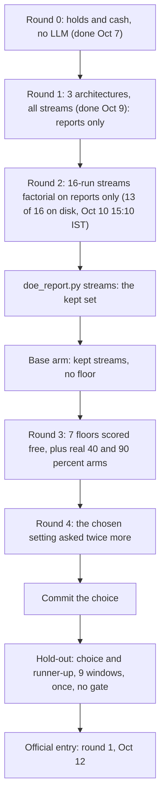

# Stage 1: tuning v3's entry by a designed experiment

> Snapshot 2026-10-10, main @ 81dcfb5. Rounds 0 and 1 are done (round 1 chose "reports only"); round 2's 16-run streams factorial had 13 of 16 runs on disk at 15:10 IST, with run 13 running; rounds 3 and 4 and the hold-out check have not started.

Stage 1 chooses the settings of desk v3's entry. On day 1 of a 15-session window the PM reads its inputs once and buys a book, and the book is held untouched to the window's end. The experiment asks three questions of one response, the contest score (the mean of four ranks against a modelled field of seven rivals, lower better, paired window by window): how the PM should take in data (3 architectures), which of 7 data streams earn their place, and how much cash it must hold (7 floors). The full factorial is 2,688 arms (about $3,500), so the program is sequential and fractional: 25-30 arms, nearly all on the 13 selection windows, about $30-50 by the plan ([stage1_doe.md](../stage1_doe.md)). Round 1 scored "reports beside raw data" 3.000, "reports only" 3.010 and the single PM 3.240 on the primary field, all behind the 75% inverse-vol hold's 2.808, and the cost tie rule picked reports only (commit 6ae9ed6). The decision rules are code ([tools/doe_report.py](../tools/doe_report.py)), so a verdict is the rule's and not a reading of the table; measured spend to 15:01 IST on Oct 10 was about $23.

What v3 is, role by role, is in [07_three_level_hierarchy.md](07_three_level_hierarchy.md); its runtime (brains, cache, slots) is in [08_agent_runtime_and_lineage.md](08_agent_runtime_and_lineage.md). Stage 2, the escalation chain that runs after the entry, is [10_stage2_escalation_chain.md](10_stage2_escalation_chain.md). The contest's score and the modelled field are in [00_contest_and_evaluation.md](00_contest_and_evaluation.md).

All stage-1 results live outside git, in the owner's v3 worktree:
`/Users/shaanilpunglia/Projects/alphaBT/icaif2026/.claude/worktrees/v3/output/entry/`. Below, `entry/<tag>` means a directory there. That worktree is branch `v3` at 6ae9ed6, two commits behind main. Its experiment code matches main's: `git diff --no-index` finds no difference in `v3.py`, `selfcheck.py`, `prompts_v3.py`, `brains.py`, `entry_replay.py`, `doe_report.py` or `stage1_doe.md`. Main's two later commits touch only `requirements.txt`, the live runner and a desk switch that is off by default (e9c4644, 81dcfb5).

## 1. The question, the unit and the response

**The question.** Which settings give v3's entry the best contest score. v3 is what the team submits (the owner's decision, recorded in stage1_doe.md), so stage 1 picks its settings; it is not a test of whether to use v3.

**The unit** is one window of 15 sessions (`windows.WINDOW_DAYS`), run from $1M in cash at its first round, as Official will run: `sim.run` on `markets.research_market()`, which fills at Alpaca's :30 opens (the organizer's vendor; [01_data_streams.md](01_data_streams.md)). The PM enters at round 1 of day 1 and the desk holds from then on.

**The response**, per window per arm:

- **The overall score**: the mean of four ranks, cumulative return (higher better), Sharpe (higher), maximum drawdown (lower) and turnover (lower), with tied values sharing the average rank (`ranking.METRICS`, `ranking.rank_window`). The metrics come from the organizers' own calculator (`kit.metrics`, which calls [starter-kit/kit/evaluation.py](../starter-kit/kit/evaluation.py)).
- **Against the modelled field.** `baselines.FIELD` holds eight stand-in rivals: `cash`, `ew_hold`, `ew_daily`, `inv_vol_hold` (inverse-vol at 100%), `kit_momentum_hourly`, `momentum_daily`, `random_churn`, `concentrated_hold` ([icaif/baselines.py](../icaif/baselines.py)). The **primary field is the no-clone field**: FIELD without `inv_vol_hold`, so seven rivals and ranks from 1 to 8. The 100% inverse-vol hold is a near-copy of the 75% reference, so the reference's Sharpe rank turns on a near-tie with its own copy, which it loses in 89% of windows. That once made risk parity and the rule desk look about 0.1 better than the hold when they weren't (TODO.md, "Correction (2026-09-29)"). The default field (all eight) is printed beside the primary one.
- **Each arm is ranked alone** against the field (`windows.rank_against_field`, called by `entry_replay.ranked`). Ranked jointly, arms that resemble each other crowd each other's ranks, and the winner would be the arm least like its neighbours rather than the one that beats the field. `cash` is ranked against the field less its own `cash`.
- **Paired by window.** The market moves a window's score far more than any setting does, so every comparison is a per-window difference, and every SE is the standard deviation of those differences over windows divided by the square root of their number.
- **Raw metrics** (return, Sharpe, drawdown, turnover) are kept beside the ranks; they don't depend on any field.
- **Diagnostics**: gross chosen, names held, effective names, largest weight and beta (all in the self-check report), fallbacks, revisions, cost and latency.

**Turnover is decided by gross alone.** The kit's turnover is the mean over the window's rounds of traded notional over pre-fee NAV, so a hold's turnover is its gross divided by the window's rounds: 105, or 102 when the window holds a half-day (`entry/round0_select/windows.csv` shows 0.007143 and 0.007353 for the 75% hold). stage1_doe.md's shorthand "its turnover equals its gross" means this. On the primary field the turnover rank is a step function of gross. Across round 1's 39 entries it was 2 at every gross below 0.9, 2.5 at exactly 0.9 (a tie with `concentrated_hold`'s 3 x 30%), 3 between 0.9 and 1.0, and 4 at 1.0 (computed from the three round-1 arms' `windows.csv` and `entries.jsonl`). Streams and architecture move turnover rank only by moving the PM's gross across the steps at 0.9 and 1.0.

## 2. Factors, levels and what is held fixed

### S: seven data streams, each in or out

`v3.STREAMS` names them; `v3.strip(obs, streams)` deletes every field of each dropped stream from the observation, including the `<field>_at_entry` copies, before any role sees it. A dropped stream still present somewhere would make the ablation measure nothing and read as "this stream doesn't matter". The test `test_a_dropped_stream_reaches_no_role_and_every_other_stream_still_does` checks every role's payload, the analysts' slices and the PM's check included.

| Stream (`FACTORIAL_ORDER` letter) | What it carries | Fields removed when out | Details |
| --- | --- | --- | --- |
| `har_vol` (A) | HAR 1- and 3-day vol forecasts, per name and for the basket | `vol_ann_har_1d`, `vol_ann_har_3d` in names and market | [03](03_har_vol_forecaster.md) |
| `model_rank` (B) | the daily ensemble's score, as a rank among the 30 | `model_score_rank` in names | [02](02_daily_ensemble_model.md) |
| `headlines` (C) | recent headlines per name | `headlines` in names | [05](05_news_feeds.md) |
| `filings` (D) | recent 8-Ks per name, and new filings with text | `recent_8k_filings` in names; top-level `new_filings` | [06](06_sec_filings.md) |
| `macro` (E) | the macro block as of the prior close | top-level `macro` | [01](01_data_streams.md) |
| `universe` (F) | the broad-universe ranking (about 2,800 characters, v3_desk_plan.md) | top-level `universe_context` | [01](01_data_streams.md) |
| `regime` (G) | the HMM regime read | `p_turbulent_next_session`, `regime_persistence_days` in market | [04](04_ou_process_and_quant_signals.md) |

**Always in, never tested** (stage1_doe.md; the comment on `v3.STREAMS`): returns, 20-day vol, earnings timing, the OU s-score and the weights the inverse-vol and risk-parity shapes would give each name. These are the minimum a book is chosen from. Everything else in the observation that no stream names also stays. Under "reports only" the PM itself sees only the basic rows (`BASIC_NAME`, `BASIC_MARKET`), which leave out the OU score, so there the OU score reaches the PM only through the quant analyst's report.

### A: three architectures

| Level | `--analysts` | The PM reads | Calls a window | `doe_report.COST` rank |
| --- | --- | --- | --- | --- |
| A1 single PM | `none` | every input, raw | 2 deep (draft, check) | 0 (cheapest) |
| A2 reports + raw | `reports_raw` | the four analysts' reports and every input | 4 quick + 2 deep | 2 |
| A3 reports only | `reports_only` | the reports, plus clock, book, gross rule, `BASIC_MARKET` and `BASIC_NAME` | 4 quick + 2 deep | 1 |

The four entry analysts are v2's four (market, earnings, news, quant), asked about an entry. Each reads only its own slice of the already-stripped observation (`V3Desk._entry_analysts`), so a report can't carry a dropped stream back in:

| Analyst | Reads | Depends on streams |
| --- | --- | --- |
| market | the market block, plus `macro` | `har_vol` (basket HAR), `regime`, `macro` |
| earnings | basic rows of names reporting within the calendar's reach, their past reactions, their 8-Ks | `filings` |
| news | each name's 1-day return, headlines and 8-Ks, plus new filings; not asked when there are none | `headlines`, `filings` |
| quant | name rows without headlines or 8-Ks, the market's vol fields, `universe_context` | `har_vol`, `model_rank`, `universe` |

The dependency column is read from the code and confirmed by the cache: every run's count of cache hits in round 2 matches it exactly (section 6).

### C: seven cash floors

A floor is the least cash the PM must hold, so a limit on gross, not a target: the PM still chooses gross freely under it (`v3.CASH_FLOORS`, `v3.floor_gross`).

| `--cash-floor` | 0 (none) | 0.20 | 0.40 | 0.50 | 0.75 | 0.90 | 0.95 |
| --- | --- | --- | --- | --- | --- | --- | --- |
| Gross cap (`floor_gross`) | 1.00 | 0.80 | 0.60 | 0.50 | 0.25 | 0.10 | 0.05 |

### Held fixed

| Setting | Value in every stage-1 arm | Where |
| --- | --- | --- |
| Evidence | off: the PM's prompt carries no backtest findings | `V3Config.evidence`; `prompts_v3.SYSTEM` vs `SYSTEM_EVIDENCE` |
| Self-check | on: code's report on the draft, then confirm or revise once | `V3Config.self_check`; [icaif/agents/selfcheck.py](../icaif/agents/selfcheck.py) |
| PM (deep tier) | `gemini-2.5-pro`, effort high: a 16,384-token thinking budget | `GeminiBrain.THINKING` in [icaif/agents/brains.py](../icaif/agents/brains.py) |
| Analysts (quick tier) | `gemini-2.5-flash`, effort medium: 4,096 tokens | same |
| Sampling | the request sets no temperature and no seed, and carries no tools (no search grounding) | `GeminiBrain.request` |
| Names | real tickers and dates (`run_arm` passes `anonymize=False`) | [tools/entry_replay.py](../tools/entry_replay.py) |
| Slots | wall-clock deadlines from the chain's start: analysts 180 s, PM 600 s, check 1,020 s | `v3.SLOTS` |
| Fallback | a refused or failed entry buys inverse-vol at 75% gross | `v3.FALLBACK_GROSS`, `V3Config.fallback_gross` |

The self-check shows the draft's concentration, expected vol, beta, recent drawdown, weight reporting within 10 sessions, entry turnover and fee, beside inverse-vol and risk parity at the same gross. It deliberately shows no trailing return: in the first paid window the PM confirmed an 11-name, beta-1.09 book citing "the backtested performance", and the only performance it had seen was that line (commit d7224b7).

**Size of the full factorial.** 2^7 stream sets x 3 architectures x 7 floors = 2,688 arms. On 13 windows that is about 35,000 entries and about $3,500 (stage1_doe.md; commit 6ae9ed6).

## 3. The sequential design



Each round's verdict fixes a setting for the rounds after it. Every round is asked for before it runs, and arms run as separate processes one after another (stage1_doe.md); process pools ran about 600x slow on this machine (the owner's notes, "tooling quirks").

### Round 0: baselines (done, free)

Inverse-vol and risk-parity holds at 25, 50, 75 and 100% gross, and cash, on the 13 selection windows (`entry_replay.py round0`, 26 s per v3_desk_plan.md). They run beside every arm as reference columns, so a result can be read against something simple. They decide nothing. Results are in section 8.

### Round 1: architecture (3 arms)

A1, A2 and A3, each with all seven streams and no floor. All streams in is where the architectures should differ most, since the analysts have the most to digest. **Rule:** the lowest mean score on the primary field; if a cheaper architecture is within one SE of the best, the cheapest such (section 4).

### Round 2: streams, a 16-run 2^(7-3) fractional factorial of resolution IV

On round 1's architecture, with no floor. The factors A-G are the streams in `v3.FACTORIAL_ORDER`: A `har_vol`, B `model_rank`, C `headlines`, D `filings`, E `macro`, F `universe`, G `regime`. `v3._streams16` builds the runs from `itertools.product((-1, 1), repeat=4)` over A, B, C, D (A slowest, D fastest) with the generators **E = ABC, F = BCD, G = ACD**. Row n of `v3.STREAMS16` is run n. The table below was printed from `v3.STREAMS16` and matches stage1_doe.md's hand table row for row:

| Run | A `har_vol` | B `model_rank` | C `headlines` | D `filings` | E `macro` | F `universe` | G `regime` |
| ---: | :-: | :-: | :-: | :-: | :-: | :-: | :-: |
| 1 | - | - | - | - | - | - | - |
| 2 | - | - | - | + | - | + | + |
| 3 | - | - | + | - | + | + | + |
| 4 | - | - | + | + | + | - | - |
| 5 | - | + | - | - | + | + | - |
| 6 | - | + | - | + | + | - | + |
| 7 | - | + | + | - | - | - | + |
| 8 | - | + | + | + | - | + | - |
| 9 | + | - | - | - | + | - | + |
| 10 | + | - | - | + | + | + | - |
| 11 | + | - | + | - | - | + | - |
| 12 | + | - | + | + | - | - | + |
| 13 | + | + | - | - | - | + | + |
| 14 | + | + | - | + | - | - | - |
| 15 | + | + | + | - | + | - | - |
| 16 | + | + | + | + | + | + | + |

Every stream is in for 8 runs and out for 8; run 1 is all out and run 16 all in. The test `test_the_streams_factorial_is_balanced_orthogonal_and_keeps_mains_clear_of_pairs` checks balance, orthogonality (X'X = 16 I) and that no main effect is aliased with a pair. The table is built in code because a hand-typed row could silently break both, and a stream's "effect" would then be partly another stream's.

**Aliasing** (computed from `STREAMS16`). The defining relation has seven words, all of length 4, so the design is resolution IV:

```text
I = ABCE = BCDF = ACDG = ADEF = BDEG = ABFG = CEFG
```

- Each main effect is clear of every two-stream interaction, and aliased with four three-stream interactions: A = BCE = BFG = CDG = DEF; B = ACE = AFG = CDF = DEG; C = ABE = ADG = BDF = EFG; D = ACG = AEF = BCF = BEG; E = ABC = ADF = BDG = CFG; F = ABG = ADE = BCD = CEG; G = ABF = ACD = BDE = CEF.
- The 21 two-stream interactions fall into seven chains of three, so no single pair can be estimated: AB = CE = FG, AC = BE = DG, AD = CG = EF, AE = BC = DF, AF = BG = DE, AG = BF = CD, BD = CF = EG. In names, the first is `har_vol` x `model_rank` = `headlines` x `macro` = `universe` x `regime`.
- The 15th contrast carries no main effect and no pair (ABD = ACF = AEG = BCG = BEF = CDE = DFG).
- One alias matters here: **`regime` = `har_vol` x `model_rank` x `universe`**, and those are exactly the three streams the quant analyst reads together. Any three-way effect that runs through the quant report is read as a regime effect.

**Why a fraction rather than leave-one-out.** Leave-one-out (8 arms: all in, and each stream dropped once) estimates a stream from one contrast, all-in minus all-but-one. The factorial estimates it from all 16 runs, 8 against 8, in every window. If each arm's score in a window carries independent LLM noise of variance s^2, the factorial's effect has variance s^2/8 + s^2/8 = s^2/4 against s^2 + s^2 = 2 s^2 for leave-one-out: 8 times smaller for twice the runs. And it says whether a stream helps averaged over the other streams' levels, not only when every other stream is present (stage1_doe.md). The cache weakens the independence assumption for the analysts' share of the noise; see section 6.

**Analysis** (`doe_report.stream_effects`):

```python
# for each stream s and window w (13 windows), on the primary field's overall score
effect[s][w] = mean(score[r][w] for r in runs if s in STREAMS16[r - 1]) - mean(score[r][w] for r in runs if s not in STREAMS16[r - 1])
effect[s] = mean over w of effect[s][w]          # negative helps: lower score is better
se[s] = std over w of effect[s][w] / sqrt(13)    # pandas std, ddof 1
keep s if effect[s] < -se[s]                     # a NaN se drops the stream
```

The same effects are printed for each raw metric and each metric's rank, so you can see how a stream helps and not only whether (headlines might lower drawdown and cost return, for instance). The kept set is generally not one of the 16 rows, so `doe_report.py streams` prints the `entry_replay.py arm ... --drop ...` command that runs it as its own arm for rounds 3 and 4.

### Round 3: the cash floor (2 real arms, the rest free)

**The free part.** A hold trades once, so the PM's book bought again at a lower gross is exactly what that gross would have done. Every arm already scores its books capped at each floor's gross (`v3.capped_book`, then `v3.BoughtBook`), as the rows `arm_floor_20` to `arm_floor_95` of its `windows.csv`. No new calls. It assumes the PM would have picked the same names, in the same proportions, under a floor.

**The check on that assumption.** Two real arms run with the floor in the PM's prompt: `--cash-floor 0.4` and `--cash-floor 0.9`, one moderate and one extreme. The PM is told a band, `gross_rule = {"rule": "band", "range": [0, 1 - floor]}`. `doe_report.py cash BASE --real TAG40 TAG90` compares, window by window, each real book with the base arm's book capped at the same floor: shared names (Jaccard), the correlation of their shares (each book divided by its own gross, so a capped book reads as identical), and the real minus capped score. If they agree within round 4's noise, the free scores stand for all seven floors; if not, the other five floors run for real (5 more arms).

**Rule:** the floor with the lowest mean score on the primary field; within one SE of "no floor", no floor, since a constraint has to earn its place too. Round 0's holds scored worse at every deep floor than at 75% invested, so a deep floor wins only if the PM's own names behave differently under it (stage1_doe.md).

### Round 4: noise (2 arms)

Gemini doesn't answer the same question the same way twice. The chosen setting runs twice more on all 13 windows with `--repeat 1` and `--repeat 2`. `CachedBrain(repeat=N)` adds the repeat number to every cache key, so each repeat asks every question again; repeat 0 keeps the keys every earlier answer was stored under. A noise check reusing repeat 0's cache would compare each answer with itself and report no noise at all (`test_v3_roles_reach_the_cache_under_their_own_names_and_a_repeat_asks_again`). The spread across the three runs of one arm is the noise floor; a gap between arms smaller than it is not a finding. Round 4 runs last so it measures the setting that will be used. If it shows that round 1's or round 3's winner was within noise, the tie rules apply retroactively, and that is recorded.

### The hold-out check: once, no gate

The chosen settings are committed first, then run once on the 9 confirmation windows (2026) beside the runner-up of the closest call: `entry_replay.py arm --split confirm --confirm-choice <commit>`, 2 arms x 9 windows. It is not a pass/fail gate; v3 ships either way. It answers the one question the 13 windows can't: was the choice the best setting, or the luckiest on those windows? Choosing the best of about 20 arms on the windows that also score them favours luck. If the runner-up beats the choice on the hold-out, the edge on the 13 was noise, and the tie rule (cheaper or simpler wins) decides. The hold-out numbers are the honest estimate of tuned v3 for the write-up (stage1_doe.md). The code refuses `--split confirm` without `--confirm-choice` and records the value in `config.json`; it does not check that the commit exists.

## 4. Decision rules, as `tools/doe_report.py` implements them

The rules are written once in code so that a round's verdict is the rule's, not a reading of the table after the fact (module docstring). All read `overall_score` on the no-clone field and pair by window (`doe_report.paired`: the mean of a - b over the windows both have; SE = std/sqrt(n) when n > 1, else NaN; counts of windows better and worse).

| Round | Function | Rule exactly as coded |
| --- | --- | --- |
| 1 | `choose_architecture(scores, COST)` | `best` = the lowest mean. `near` = the arms cheaper than `best` (`COST`: `none` 0 < `reports_only` 1 < `reports_raw` 2) whose paired difference from `best` is **not** greater than its SE. If any, pick the cheapest of them; else `best`. Cheaper arms are compared with the best only, never with each other. |
| 2 | `stream_effects`, `keep_streams` | Keep a stream only if `effect < -se` (it helps by more than one SE). Every other stream is dropped, including ties: one that can't show its worth in 16 x 13 entries isn't earning its prompt length, latency and money. |
| 3 | `choose_floor(scores)` | `best` = the lowest mean over no floor and the free-scored floors. If `best` is no floor, no floor. Else no floor stays unless no-floor minus `best` is greater than its SE. |
| 4 | `cmd_noise` | Reported, not decided: each repeat's mean score, the SD of the arm's mean across repeats, the mean absolute per-window gap between two repeats, and how alike the books are. "A gap between arms smaller than the SD of the arm's mean is not a finding." |

**A comparison with no SE is a tie.** With one window there is no SE; every rule reads a NaN SE as "not shown to be worse or better", so the simpler choice stands rather than whatever won one window by chance (`test_with_too_few_windows_to_measure_a_difference_the_simpler_choice_stands`). In Python, `x > nan` and `x < -nan` are both false, which is what implements this.

**Guards.** `cmd_streams` refuses unless it gets 16 `streams16` runs, rows 1-16 once each, every run's recorded streams equal to `STREAMS16[run - 1]`, one architecture and one floor across them, and the same windows (`same_windows`). `cmd_arch` wants each architecture once; `cmd_cash` wants a no-floor base; `cmd_noise` wants identical configs and distinct repeat numbers.

**The 1-SE rule's false-keep rate.** A stream with no real effect is kept about 16% of the time, so across seven streams about one useless stream is kept on average; a 2-SE bar cuts that to about 2%, but then a real effect has to be about twice as large to be kept (stage1_doe.md). With 13 windows the ratio effect/SE is closer to a t distribution with 12 degrees of freedom; on that reading (my computation with `scipy.stats`, not in the repo) the rates are 16.9% at 1 SE (1.18 of 7 streams expected, and a 73% chance at least one useless stream is kept) and 3.4% at 2 SE. Under a normal approximation, a true effect of 2 SE is kept 84% of the time at the 1-SE bar and 50% at the 2-SE bar. The owner's earlier hold-out studies set a stricter bar: more than 2 SE better on the selection windows, and better on the hold-out too (`reports/har_sizing_choice.json`, its "win" line). Stage 1's bar is lower because a wrong keep costs prompt length, not much else (stage1_doe.md), and there is no gate.

**What the rules don't do.** No correction for multiple comparisons within or across rounds. No automatic retroactive tie after round 4: the comparison with the noise SD is printed for a human. Round 3's agreement check is printed, not acted on, and the rule chooses on the free scores.

## 5. Windows

`v3.STAGE1` fixes 22 non-overlapping 15-session windows: tiled from 2025-02-03 (the first session of February 2025), restarting at the first session after each `official4` window whenever the next tile would overlap it, and split by date into 13 selection windows (2025) and 9 confirmation windows (2026). `entry_replay.windows_of` checks that each window's 15 sessions in the market end on its stated last day, and stops otherwise: a missing session would run a window on into the next one's days.

**Selection** (`STAGE1["select"]`, where every arm runs and the choice is made):

| # | First session | Last session | Inverse-vol 100% return | Cash's score |
| ---: | --- | --- | ---: | ---: |
| 1 | 2025-02-03 | 2025-02-24 | +0.6% | 3.0 |
| 2 | 2025-02-25 | 2025-03-17 | -5.1% | 1.0 |
| 3 | 2025-03-18 | 2025-04-07 | -11.2% | 1.0 |
| 4 | 2025-05-05 | 2025-05-23 | +2.0% | 3.5 |
| 5 | 2025-05-27 | 2025-06-16 | +2.4% | 3.5 |
| 6 | 2025-06-17 | 2025-07-09 | +4.1% | 3.0 |
| 7 | 2025-07-10 | 2025-07-30 | +1.1% | 2.5 |
| 8 | 2025-07-31 | 2025-08-20 | +0.4% | 2.0 |
| 9 | 2025-08-21 | 2025-09-11 | +2.2% | 3.5 |
| 10 | 2025-09-12 | 2025-10-02 | +2.7% | 4.0 |
| 11 | 2025-11-03 | 2025-11-21 | -1.6% | 1.0 |
| 12 | 2025-11-24 | 2025-12-15 | +3.7% | 3.5 |
| 13 | 2025-12-16 | 2026-01-07 | +0.9% | 3.0 |

**Confirmation** (`STAGE1["confirm"]`, the hold-out, scored once for the committed choice and its runner-up):

| # | First session | Last session |
| ---: | --- | --- |
| 1 | 2026-01-08 | 2026-01-29 |
| 2 | 2026-01-30 | 2026-02-20 |
| 3 | 2026-02-23 | 2026-03-13 |
| 4 | 2026-03-16 | 2026-04-06 |
| 5 | 2026-05-04 | 2026-05-22 |
| 6 | 2026-05-26 | 2026-06-15 |
| 7 | 2026-06-16 | 2026-07-08 |
| 8 | 2026-08-03 | 2026-08-21 |
| 9 | 2026-08-24 | 2026-09-14 |

The last two selection columns are from `entry/round0_select/windows.csv` (the 100% inverse-vol hold's cumulative return, and cash's overall score on the primary field); they show the market swing each window carries. Cash ranks first in the three falling windows. Selection windows 6, 12 and 13 each hold a half-day (2025-07-03, 2025-11-28, 2025-12-24 in `calendar.EARLY_CLOSES`), so 102 rounds instead of 105. Nothing has been computed on the confirmation windows, and this doc deliberately computes nothing there.

- **Why after January 2025.** The PM sees real names and dates, and Gemini 2.5's knowledge stops in January 2025 (the `STAGE1` comment; v3_desk_plan.md). On these windows the model can't remember the outcome, so news and filings are judged where they could only help through reasoning. stage1_doe.md adds that each window's memory is spot-checked with `tools/memory_probe.py`; see section 10 for what the probes on disk cover.
- **Why they step past `official4`.** The four `official4` windows (from 2025-04-11, 2025-10-13, 2026-04-13 and 2026-07-13; [icaif/suites.py](../icaif/suites.py)) are stage 2's. The entry's settings must not be tuned on them (`test_stage1_windows_follow_the_cutoff_never_overlap_and_split_selection_before_confirmation`).
- **Why they are not a suite.** A suite in `suites.py` is built into the scorer Space and the public board, with prices shipped for its windows; these are a research split, not a board (`v3.py` docstring).
- **Why split by date.** Picking the best of a dozen arms on the windows that also judge it finds the luckiest arm, and a gate checked there would pass on luck while reading as evidence (`STAGE1` comment). Confirmation follows selection in time, so no confirmation day precedes a selection day.
- **News coverage.** The 22 windows' headlines and 8-K texts were fetched with `tools/replay_sources.py`, and every window passes the replay's coverage check (commit 6ae9ed6). `agent_replay.real_name_sources` stops the run if a window's news isn't covered, rather than replaying a desk shown no headlines.

## 6. Tooling and artefacts

### `tools/entry_replay.py`

| Subcommand | What it does | Costs |
| --- | --- | --- |
| `round0` | Inverse-vol and risk-parity holds at 25/50/75/100% and cash on the split's windows; writes `windows.csv` to `entry/round0_<split>` | free |
| `ledgers` | A v3 desk answered in code (`v3.HoldBrain`) on all 22 windows, at free gross (falls back to 75%) and as a 30% sleeve. It must trade exactly as inverse-vol at the fallback gross, and its journal must agree with its ledger. So anything an LLM arm scores differently is the LLM's doing. Prints only. | free |
| `arm` | One setting on the split's windows. Prints the estimate and stops without `--yes`. | paid |

| Flag | Meaning |
| --- | --- |
| `--analysts none\|reports_raw\|reports_only` | the architecture (default `none`) |
| `--gross free\|band:LO:HI\|fixed:G` | the gross rule (default `free`); `--cash-floor` sets it for you |
| `--cash-floor F` | F in `CASH_FLOORS`; F > 0 becomes `band:0:<1-F>`; not combinable with a non-free `--gross` |
| `--drop S ...` | streams to strip |
| `--design streams16 --run N` | row N (1-16) of `STREAMS16`; sets `--drop`; not combinable with `--drop` |
| `--repeat N` | ask every question again under repeat N's cache keys |
| `--split select\|confirm` | default `select`; `confirm` requires `--confirm-choice <commit>` |
| `--offline` | answers from the cache only; a missing answer fails that role, which falls back and is counted |
| `--yes` | spend |
| `--evidence`, `--no-self-check` | the two prompt settings, held fixed in stage 1 |
| `--quick-model`, `--deep-model`, `--quick-effort`, `--deep-effort` | defaults `gemini-2.5-flash` medium and `gemini-2.5-pro` high; models must be in `brains.ALLOWED_MODELS` |
| `--windows K`, `--on DAY`, `--max-calls`, `--tag` | subsets, a call cap, the output directory's name |

Before spending, `run_arm` checks the models' credentials (`brains.credentials_problem`) and stops if they are missing: otherwise every call would fail and the arm would quietly buy the hold in every window.

**Names.** The arm's name is `v3_<analysts>_<gross>[_s16rNN | -<dropped>...][_evidence][_nocheck][_rN]`, where `<gross>` is `cf<pct>` under a cash floor, else the gross rule without colons. The output tag defaults to `<arm>_<split>_<n>w`, for example `v3_reports_only_free_s16r05_select_13w`.

### What each arm writes under `entry/<tag>/`

Schemas below are read from the real files (`v3_reports_only_free_select_13w`, the s16 runs).

- **`config.json`**: `arm`, `split`, `windows` (first sessions), `config` (`analysts`, `gross`, `streams`, `evidence`, `self_check`, `tiers` {quick, deep: [model, effort]}, `slots`), `quick`, `deep`, `repeat`, `cash_floor`, `design`, `design_run`, `confirm_choice`. The Oct 7 smoke run's file predates the `cash_floor` and `design` keys.
- **`windows.csv`**: one row per (window, strategy, field), with columns `window`, `strategy`, `cumulative_return`, `sharpe_ratio`, `maximum_drawdown`, `turnover`, `invalid_rounds`, `rank_cumulative_return`, `rank_sharpe_ratio`, `rank_maximum_drawdown`, `rank_turnover`, `overall_score`, `position` (1 + the field members ahead after the tie-breaks), `field` (`no_clone` or `default`). Every strategy has up to 2 x 13 rows:

| `strategy` | What it is | New calls |
| --- | --- | --- |
| the arm's name, e.g. `v3_reports_only_free` | the desk's own run | yes |
| `inv_vol_at_arm_gross` | inverse-vol bought at the gross the PM chose in that window (cash if it chose none): the PM's names apart from its cash | no |
| `arm_names_at_25`, `_50`, `_75`, `_100` | the PM's book rescaled to that gross (`BoughtBook`); a gross the book can't reach under the 30% cap is left out, never capped quietly | no |
| `arm_floor_20` ... `arm_floor_95` | the PM's book capped at each floor's gross (`capped_book`): round 3's free scores | no |
| `inv_vol_hold_75` | the bar | no |
| `q_riskparity_entry_regime` | the rule: risk parity at a regime-blended exposure, bought at round 1 and held (TODO.md; [04](04_ou_process_and_quant_signals.md)) | no |
| `cash` | cash, ranked against the field less its own cash | no |

- **`entries.jsonl`**: one line per window, `{"window", "entry", "plan", "fallbacks"}`. `entry` is `V3Desk.entry`: `draft` (the PM's `PMEntry`: `weights` [{name, weight}], `thesis`, `conditions` [{kind, name, threshold, item, action, gross, why}]), `draft_source`, `draft_reason`, `draft_errors`, `self_check` (the report: `your_book`, `inverse_vol_at_your_gross`, `risk_parity_at_your_gross`, each with `gross`, `cash`, `names_held`, `effective_names`, `largest`, `expected_vol_ann`, `beta_to_basket`, `diversification_ratio`, `weight_reporting_within_10_sessions`, `entry_turnover`, `entry_fee_bps_of_nav`, `last_15_sessions_if_held` {max_drawdown}; plus `notes`; or `{"refused": [...]}` for a refused draft), `check` (`PMCheck`: `action` confirm or revise, `revised`, `rationale`), `check_source`, `revised_errors` and `revised_self_check` when it revised, then `source` (`brain` or `fallback`), `reason`, `final` (`draft`, `revised` or null), `gross` and `weights` {ticker: weight as bought}. `plan` is the thesis and conditions stage 2 will read; `fallbacks` counts each fallback by role.
- **`chain.jsonl`**: one line per role call: `day`, `round`, `role` (`market`, `earnings`, `news`, `quant`, `pm`, `pm_check`), `tier`, `brain` (e.g. `cached(gemini:gemini-2.5-pro:high:wire1)`), `source` (`brain`, `failed`, `late` or `skipped`), `reason`, `answer`, `payload_chars`, `system_chars`, `latency_s` (wall seconds; about 0.001 on a cache hit), `window`. Neither file records tokens or dollars: cost is printed to stdout by `run_arm` and kept only in the owner's run logs.

### The response cache

`brains.CachedBrain` stores each answer as `<sha256>.json` under `output/agent/cache/` (in the v3 worktree: a real directory there, not a symlink to main's, holding 619 files when counted at about 14:49 IST). The key hashes the brain's name (model, effort, wire version), the role (`v3_pm` etc.), the system prompt, the payload, the schema's name and, when non-zero, the repeat number. Only successful answers are written, so a rerun re-asks exactly the calls that failed. That is how round 1's slept run was repaired (section 8).

**The cache makes arms share answers.** An analyst whose slice is identical in two arms is asked once, and both arms read the same report. In round 1, A3's 51 analyst calls were all cache hits on A2's: the two arms read identical reports in every window and differ only in the PM's view and the PM's own draws. Run 16 of round 2 is the same setting as A3, so all 77 of its calls were cache hits; it is A3, scored again, identical in every window. Within round 2 the analysts' answers are shared across runs with the same slice (each run's Flash hit count in the logs matches the dependency table in section 2). The PM's payload differs in every run, so the PM is always asked fresh.

This is common random numbers, and it changes the variance argument for the analysts' part of the noise. Computed from `STREAMS16` and the dependency table, here is the variance one analyst's report noise adds to each stream's effect, as a multiple of the independent-per-run case (0 = it cancels exactly):

| Analyst | `har_vol` | `model_rank` | `headlines` | `filings` | `macro` | `universe` | `regime` |
| --- | ---: | ---: | ---: | ---: | ---: | ---: | ---: |
| market | 2 | 0 | 0 | 0 | 2 | 0 | 2 |
| earnings | 0 | 0 | 0 | 8 | 0 | 0 | 0 |
| news | 0 | 0 | 4 | 4 | 0 | 0 | 0 |
| quant | 2 | 2 | 0 | 0 | 0 | 2 | 2 |

For a stream an analyst doesn't read, its report sits on both sides of the contrast equally and cancels, with one exception: the quant analyst's noise loads onto `regime` through the alias G = ABF. For the streams it reads, there are fewer independent draws than 16 (the earnings report, which depends on `filings` alone, is one draw on each side of the `filings` contrast in each window). The SE over 13 windows still includes all of this, so the rule's SEs stay honest. What doesn't hold uniformly is stage1_doe.md's "8 times smaller".

### Cost estimates (`entry_replay.EST`) and what was measured

`EST` gives tokens a call: PM 8,500 in and 6,000 out; check 10,000 and 3,000; analyst 4,000 and 3,500. The PM and check are measured on the smoke window (2025-02-03), where the observation was 24,000 characters and the prompt 5,700; the analysts are unmeasured. At `brains.PRICES` (Pro $1.25 in and $10 out per million tokens, Flash $0.30 and $2.50) that is $0.113 a window for the single PM and $0.153 with analysts, printed as "~$1.47" and "~$1.99" for 13 windows. Measured (run logs): the single PM cost $1.66 for 13 windows, about $0.128 a window (25 paid calls; one PM answer came from the smoke run's cache), and four fresh analysts $0.49, about $0.038 a window. Payload sizes from `chain.jsonl` (median characters, all streams in): single PM 24,719; PM with reports and raw data 34,576; PM with reports only 15,273; analysts: market 1,337, earnings 1,071, news 11,557, quant 12,404.

Latency of calls not served from the cache, across every stage-1 `chain.jsonl` through round 2's run 11: PM median 49 s (184 calls, including two 600 s timeouts), check median 19 s (182), and the Flash analysts' medians market 10.5 s, earnings 10.9 s, news 12.5 s, quant 21.6 s. A reports-only round-2 run of 13 windows took 975-1,386 s.

### `tools/doe_report.py`

```bash
.venv/bin/python tools/doe_report.py arch TAG TAG TAG            # round 1
.venv/bin/python tools/doe_report.py streams TAG x16             # round 2
.venv/bin/python tools/doe_report.py cash BASE --real TAG TAG    # round 3
.venv/bin/python tools/doe_report.py noise TAG TAG TAG           # round 4
.venv/bin/python tools/doe_report.py table TAG ...               # writes output/entry/doe_table.csv
```

It reads arms from `<checkout>/output/entry/` (`doe_report.OUT`). To read another checkout's arms without writing anything, build `doe_report.Arm(tag, root)` in Python with `root` pointed there, and call `summary`, `paired`, `choose_architecture` or `stream_effects` on it. That is how this doc's numbers were computed. Don't use `table` for read-only work: it writes a CSV.

Tests: [tests/test_doe_report.py](../tests/test_doe_report.py) (the factorial recovers planted effects exactly and no others; the 1-SE keep rule; the architecture and floor rules; book agreement reads shares, not gross; no SE means the simpler choice) and the experiment tests at the end of [tests/test_v3.py](../tests/test_v3.py) (the windows, the factorial's properties, `BoughtBook` at its own gross repeating the desk trade for trade, `capped_book` keeping a book's shape).

## 7. From the plan's rounds to the designed experiment

v3_desk_plan.md's "Evaluation" (vision agreed 2026-10-07) set out stage 1 as a program of rounds with a gate. stage1_doe.md (drafted and revised 2026-10-08) replaces its rounds; the runs on disk follow stage1_doe.md.

| | v3_desk_plan.md "Evaluation" | stage1_doe.md | Why the change |
| --- | --- | --- | --- |
| Purpose | Calibrate the entry, then a gate decides whether the PM's book enters live at all | Choose v3's settings; v3 ships either way | The owner decided v3 is what is submitted |
| Order | 1 architecture, 2 cash handling, 3 streams, 4 prompt, then noise | 0 baselines, 1 architecture, 2 streams, 3 cash floor, 4 noise | Not stated; the floors are scored from the chosen configuration's books, which need the streams verdict first |
| Cash | G1 free; G2 a band from round 0; G3 a sleeve fixed at round 0's best; G4 a 25-30% sleeve | 7 cash floors (bands 0 to 1 - F), all scored free by capping, 2 real arms to check | Seven levels for the price of two arms; a floor limits, the PM still chooses |
| Streams | Leave-one-out on 6 (headlines, 8-Ks and filing text, macro, model ranks, universe ranking, HAR vol) | 16-run fraction on 7, `regime` added | 8x less LLM-noise variance per effect for 2x the runs; effects averaged over the other streams; v3 measures the regime read where v2 hid it (`V3Config.regime` comment) |
| Prompt | Evidence on and off; one shot without the self-check | Held fixed: evidence off, self-check on | Not stated; the `prompts_v3` docstring still says stage 1 measures evidence |
| Noise | The leading arm twice on 6 windows | The chosen setting twice on all 13, run last | Measures the setting actually used |
| Windows | 12 selection windows | 13 | One more costs nothing |
| Hold-out | A gate: beat `inv_vol_hold_75` paired by more than k SE on the confirmation set, k open; fail and the PM's book doesn't enter live | No gate: one run of the choice beside the runner-up | Asks whether the choice was best or luckiest; v3 ships either way |
| Rules | In prose | In code (`doe_report.py`) | A verdict is the rule's, not a reading after the fact |

## 8. Results so far

Computed read-only from `entry/` with `doe_report`'s own functions; every number below is on the 13 selection windows. Lower scores are better; SEs are in brackets.

### Round 0 (2026-10-07)

| Strategy | No-clone mean (SE) | Default mean (SE) | Mean return | Mean max drawdown |
| --- | --- | --- | ---: | ---: |
| cash | 2.654 (0.296) | 3.038 (0.351) | 0 | 0 |
| inverse-vol 25% | 2.904 (0.146) | 3.327 (0.168) | 0.04% | 0.89% |
| inverse-vol 50% | 2.885 (0.143) | 3.308 (0.165) | 0.08% | 1.77% |
| inverse-vol 75% (`inv_vol_hold_75`) | 2.808 (0.124) | 3.231 (0.146) | 0.12% | 2.65% |
| inverse-vol 100% | 3.058 (0.184) | 3.058 (0.184) | 0.16% | 3.51% |
| risk parity 25% | 2.904 (0.185) | 3.212 (0.204) | 0.04% | 0.80% |
| risk parity 50% | 2.846 (0.189) | 3.096 (0.220) | 0.08% | 1.60% |
| risk parity 75% | 2.788 (0.179) | 3.019 (0.213) | 0.13% | 2.39% |
| risk parity 100% | 2.981 (0.209) | 3.385 (0.259) | 0.17% | 3.17% |

(`entry/round0_select/windows.csv`; these match v3_desk_plan.md's table to two decimals.) On the primary field, 75% is the best invested gross: 25% and 50% lose to it by 0.096 (SE 0.045) and 0.077 (SE 0.033), worse in 4 windows and better in none. Cash leads on the mean by 0.154 (SE 0.238), less than its own spread. On the default field the 100% hold is ranked with the field's own copy of it removed, while the 75% hold has to beat that copy. So the 100% hold beats the 75% one there (-0.173, SE 0.100) and loses to it on the no-clone field (+0.250, SE 0.090). That reversal is the clone effect the no-clone field exists to remove.

### Round 1: architecture (A1 and A2 on Oct 8, A3 rerun on Oct 9)

| Arm (tag) | No-clone mean (SE) | Default mean (SE) | Mean gross (range) | Mean names (range) | Mean return | Mean max drawdown |
| --- | --- | --- | --- | --- | ---: | ---: |
| A1 single PM (`v3_none_free_select_13w`) | 3.240 (0.315) | 3.683 (0.381) | 0.862 (0.60-1.00) | 13.9 (10-20) | 0.22% | 3.20% |
| A2 reports + raw (`v3_reports_raw_free_select_13w`) | 3.000 (0.330) | 3.308 (0.388) | 0.821 (0.60-0.97) | 11.4 (8-20) | 0.09% | 3.22% |
| A3 reports only (`v3_reports_only_free_select_13w`) | 3.010 (0.381) | 3.356 (0.472) | 0.848 (0.65-1.00) | 12.2 (6-23) | 0.49% | 2.98% |
| `inv_vol_hold_75` | 2.808 (0.124) | 3.231 (0.146) | 0.75 | 30 | 0.12% | 2.65% |
| `q_riskparity_entry_regime` (the rule) | 2.750 (0.200) | 2.981 (0.234) | | | 0.51% | 1.95% |
| cash | 2.654 (0.296) | 3.038 (0.351) | 0 | 0 | 0 | 0 |

Paired differences on the primary field (a minus b, by window):

| a - b | Diff (SE) | a better / worse in | Default field |
| --- | --- | --- | --- |
| A1 - A2 | +0.240 (0.162) | 4 / 8 | +0.375 (0.202) |
| A1 - A3 | +0.231 (0.267) | 6 / 5 | +0.327 (0.335) |
| A3 - A2 | +0.010 (0.240) | 4 / 5 | +0.048 (0.311) |

**The rule's pick: reports only** (`choose_architecture`, on both fields). A2 scored best; A3 is cheaper and within one SE of it (+0.010, SE 0.240); A1 is cheaper still but worse than A2 by more than one SE (+0.240, SE 0.162). A1 is within one SE of A3, but the rule compares cheaper arms with the best only. These are the numbers in commit 6ae9ed6's message. Round 2 runs on `reports_only`.

**Other readings of round 1's files** (descriptive; no rule uses them):

- Every arm trails `inv_vol_hold_75` on the primary field: A1 +0.433 (SE 0.262), A2 +0.192 (0.270), A3 +0.202 (0.324).
- The PM chose more gross than 75% on average (0.82-0.86), and 16 of 39 entries were at 0.95 or more. Rescaled to 75% gross (`arm_names_at_75`), the PM's books score close to the hold: A1 +0.212 (0.223), A2 +0.038 (0.258), A3 -0.019 (0.308) against `inv_vol_hold_75`. Against inverse-vol bought at the same gross the PM chose (`inv_vol_at_arm_gross`), the arms score A1 +0.413 (0.225; worse in 8 of 13), A2 +0.154 (0.241), A3 +0.125 (0.295).
- The PM revised its draft after code's self-check in 6 (A1), 7 (A2) and 5 (A3) of 13 windows. In A1 one revision was refused and the valid draft stood (`pm_check:refused 1`).

**The `.slept` rerun.** A3's first run (`entry/v3_reports_only_free_select_13w.slept`) ran while the Mac slept: 66,977 s of wall time, and two PM calls (windows 2025-05-05 and 2025-07-10) hit the 600 s slot with `ReadTimeout` and fell back to the 75% inverse-vol book. The owner kept that directory as `.slept` and reran under `caffeinate` (commit 6ae9ed6). The rerun took 146 s and $0.18: 73 of 77 answers came from the cache, and only the two windows' PM and check were asked again. The rerun is the run on record. The slept run scored 3.163 against the rerun's 3.010 (slept minus rerun +0.154, SE 0.119); the two runs differ only in those two windows' books.

### Round 2: streams factorial, in progress

At 15:10 IST on Oct 10, runs 1-12 and 16 were on disk and run 13 had been running since 15:01:42 (`entry_replay.py arm --analysts reports_only --design streams16 --run 13 --yes`, from the owner's loop over rows 1-15). Run 16 was scored at 11:04 from the cache alone (8 s, $0).

**PROVISIONAL, NOT FOR CITATION.** Per-run means of incomplete round 2, for orientation only:

| Run | Streams (A-G) | Finished (Oct 10) | No-clone mean (SE) | Default mean | Mean gross | Mean names | Fallback windows | Cost | Runtime |
| ---: | --- | --- | --- | --- | ---: | ---: | ---: | ---: | ---: |
| 16 | + + + + + + + | 11:04 | 3.010 (0.381) | 3.356 | 0.848 | 12.2 | 0 | $0.00 | 8 s |
| 1 | - - - - - - - | 11:25 | 3.692 (0.266) | 4.231 | 0.892 | 12.8 | 0 | $1.64 | 1,258 s |
| 2 | - - - + - + + | 11:47 | 3.462 (0.316) | 3.904 | 0.857 | 13.0 | 0 | $1.69 | 1,281 s |
| 3 | - - + - + + + | 12:07 | 3.481 (0.420) | 3.904 | 0.847 | 12.8 | 0 | $1.50 | 1,145 s |
| 4 | - - + + + - - | 12:25 | 3.519 (0.268) | 4.038 | 0.854 | 11.7 | 0 | $1.40 | 1,105 s |
| 5 | - + - - + + - | 12:49 | 2.904 (0.269) | 3.173 | 0.819 | 11.5 | 0 | $1.62 | 1,386 s |
| 6 | - + - + + - + | 13:10 | 3.442 (0.416) | 3.904 | 0.856 | 11.5 | 0 | $1.48 | 1,269 s |
| 7 | - + + - - - + | 13:27 | 3.385 (0.354) | 3.692 | 0.870 | 11.9 | 0 | $1.32 | 975 s |
| 8 | - + + + - + - | 13:44 | 3.125 (0.325) | 3.471 | 0.874 | 11.8 | 0 | $1.36 | 1,001 s |
| 9 | + - - - + - + | 14:04 | 3.115 (0.294) | 3.481 | 0.815 | 11.7 | 0 | $1.46 | 1,198 s |
| 10 | + - - + + + - | 14:25 | 3.385 (0.290) | 3.788 | 0.808 | 13.4 | 1 | $1.51 | 1,193 s |
| 11 | + - + - - + - | 14:43 | 3.481 (0.316) | 3.962 | 0.877 | 14.2 | 0 | $1.36 | 1,063 s |
| 12 | + - + + - - + | 15:01 | 3.202 (0.249) | 3.548 | 0.870 | 12.2 | 0 | $1.42 | 1,084 s |
| 13-15 | | pending | | | | | | | |

Scores, gross and names are from each run's `windows.csv` and `entries.jsonl`; cost and runtime from the run logs. The SE here is each run's spread over windows, not a paired SE. Run 16 is round 1's A3, identical in every window and every book. Run 10's fallback is window 2025-12-16: the PM call failed with HTTP 503 ("model is currently experiencing high demand") and the desk bought the 75% inverse-vol book. The PM revised its draft in 3 to 9 of 13 windows per run.

**Don't difference these means into stream effects before all 16 exist.** With rows missing, the remaining columns are neither balanced nor orthogonal, and a partial "effect" mixes streams. Once runs 1-16 are on disk, the owner computes the effects and the verdict in the v3 worktree:

```bash
.venv/bin/python tools/doe_report.py streams $(cd output/entry && echo v3_reports_only_free_s16r??_select_13w)
```

## 9. Cost, time and the calendar

| Round | Arms | Entries | Cost (plan) | Runtime (plan) | Measured |
| --- | ---: | ---: | ---: | ---: | --- |
| 0 | - | - | done | done | free; 26 s |
| 1 | 3 | 39 | ~$5 | ~1 h | $5.05: A1 $1.66 (1,140 s), A2 $2.13 (1,351 s), A3's slept run $1.08, its rerun $0.18 (146 s) |
| 2 | 16 | 208 | ~$20-30 | ~4-5 h | runs 1-12: $17.76 in 3 h 57 min (11:04-15:01); run 16 free |
| 3 | 2 (+5 if needed) | 26 (+65) | ~$3 (+$7) | ~30 min (+1.5 h) | not started |
| 4 | 2 | 26 | ~$3 | ~30 min | not started |
| Hold-out | 2 | 18 | ~$2 | ~20 min | not started |
| **Total** | **25-30** | **~320-385** | **~$30-50** | **~6-8 h** | **$22.81 to 15:01 IST, Oct 10** |

Plan columns are stage1_doe.md's; measured costs are the `brain.cost()` lines each run printed, rounded to cents, so sums are good to a few cents. At the 12 paid runs' pace ($1.48 and about 20 minutes a run, 11:04 to 15:01), runs 13-15 would add about $4.40 and an hour, finishing round 2 near 16:00 IST on Oct 10. That is a projection, not a measurement. The plan's table doesn't count the base arm of the kept stream set, which rounds 3 and 4 need unless the kept set is one of the 16 rows (about one more arm).

**The calendar.** Official is one 15-session window, Oct 12-30, and its entry is round 1 on Oct 12 (deadline 09:10 ET, 18:40 IST; README "Dates"). stage1_doe.md projected rounds 1-4 done by Oct 10 and the hold-out check by Oct 11. Round 1 closed on Oct 9 (after the slept run) and round 2 is running on Oct 10. **If a round slips, v3 enters with the settings decided so far and defaults for the rest** (stage1_doe.md). The defaults were single PM, all streams, no floor; round 1 has since decided the architecture, so the defaults now cover only the streams (all in) and the floor (none). The earlier plan held that entering live without the confirmation run was not an option; with no gate, stage1_doe.md drops that condition. On main @ 81dcfb5, neither `tools/live_runner.py` nor `icaif/runner.py` mentions v3 (commit d7224b7 lists wiring v3 into the live runner as left out); see [11_systems_infrastructure.md](11_systems_infrastructure.md).

## 10. What stage 1 can and can't tell

From stage1_doe.md:

- **It can** find which streams carry signal for the PM, tell the three ways of feeding it apart if they differ by more than the noise, and price the cash choice exactly.
- **It can't** separate settings that differ by less than the noise round 4 measures. Those are ties, and the tie rules decide them by cost and simplicity.
- **Every number is conditional on the modelled field.** The real field is unknown until Official. A conclusion that flips between the two fields depends on the guess about rivals, and is reported as such.
- **News is judged on post-cutoff windows only.**

The threats, in more detail:

- **LLM noise.** The request sets no temperature or seed, so the same question gets different answers. Round 1's paired SEs were 0.16-0.27 rank points, the size of a 1-SE threshold. Round 4 estimates the noise from three runs of one arm, which is two degrees of freedom: the noise floor is itself noisy.
- **Window-to-window variation.** Two things spread a stream's per-window effect: LLM noise, and real variation of the stream's value from one window to the next. The factorial shrinks only the first, and 13 windows bound how well either is measured. Which of the two is larger here is not yet known.
- **The modelled field.** Seven synthetic rivals set every rank. The turnover-rank step at 0.9 gross (section 1) is a property of this field; a real field may have none.
- **Multiple looks.** The same 13 windows decide rounds 1 to 4, and each round's choice conditions the next. The rules use 1 SE with no multiplicity correction, and choosing the best of about 20 arms favours luck. The hold-out check is the one guard, run once. Provisional tables like the one above are more looks; they shouldn't inform a decision ahead of the rule.
- **The gross confound.** With no floor, a stream or an architecture changes the PM's gross as well as its names, and the score mixes the two. The `arm_names_at_<g>` rows separate them, but no rule reads them.
- **Fallbacks inside arms.** A failed or refused entry buys the 75% inverse-vol book, and the rule scores that window as the arm's (run 10 carries one).
- **Shared answers.** Section 6: arms are not independent draws for the analysts' part of the noise, and `regime`'s effect absorbs the quant analyst's noise.
- **Untested interactions.** Round 2 runs on `reports_only` only, so a stream's value under the single PM, or under reports beside raw data, is not measured. Two-stream interactions are aliased in chains of three, and `regime` is aliased with `har_vol` x `model_rank` x `universe`.
- **Memory probes.** stage1_doe.md says each window's memory is spot-checked with `tools/memory_probe.py`. The probe results on disk (`output/agent/memory_probe/` in the main checkout, Oct 6, Gemini 2.5 Pro) cover seven windows, none of them a stage-1 window: 2024-10-14 clean, 2025-04-11 clean, 2025-07-14 clean, 2025-10-13 remembered, 2026-01-13 remembered, 2026-04-13 clean, 2026-07-13 remembered (`probe_gemini25pro.out`). The one window before the cutoff reads clean and three after it read "remembered", which can't be memory of those windows if the cutoff holds. So the probe, at this sample size, certifies nothing either way. [05_news_feeds.md](05_news_feeds.md) covers contamination.

## Contest-specific vs general

| Piece | Contest-specific | Generalizes | What would change |
| --- | --- | --- | --- |
| Response: the mean of four ranks against a modelled field | Yes: the contest's score, and FIELD is a guess at rivals | The analysis: paired by window, SEs over windows, ranks and raw metrics side by side | Absolute metrics or a utility; if ranks, several fields |
| Unit: a 15-session window from cash, entry then hold | Yes: Official's shape, with turnover ranked | Windows as replicates of one decision | Longer horizons, rebalancing policies |
| Free rescale and floors (`BoughtBook`, `capped_book`) | Exact only because a hold trades once | Scoring transforms of an LLM's decision with no new calls | A book that trades after entry needs real runs per floor |
| Fractional factorial over information streams | No | Yes: ablating an LLM's inputs as designed factors | More streams, resolution V, crossed with architecture and model |
| Architecture (single PM, reports + raw, reports only) | No | Yes: information routing in multi-agent LLM systems | Larger universes push towards reports first |
| Cash floors | Partly: the score rewards cash through the drawdown and turnover ranks | A risk constraint as a factor | Volatility or drawdown targets |
| Windows after Gemini 2.5's cutoff, stepping past `official4` | Model- and contest-specific | The post-cutoff, split-by-date discipline | Re-tile for each model's cutoff |
| 30 names, 30% a name, 100% gross, 6-decimal weights | Yes: contest rules and the kit's validator | | `V3Desk._judge`, `_names_ok`, `weights.CAP`, `kit.validate_weights` |
| Gemini 2.5 Pro and Flash at fixed thinking budgets | The models of record for v3 | | `--deep-model`, `--quick-model` |
| The response cache and keyed repeats | No | Yes: reproducible, cheap replays; common random numbers | Persist tokens and cost; decide on sharing deliberately |
| Rules in code before the data; a hold-out after a committed choice | No | Yes: pre-registration in miniature | |

## Generalizing for the paper

The paper doesn't need the contest's constraints. Here is what to change, file by file, if you reuse this machinery.

1. **Choose the response first.** `doe_report.py` reads `overall_score` in `cmd_arch`, `cmd_streams`, `cmd_cash` and `cmd_noise`, but `paired`, `stream_effects` and the rules take any per-window series. The raw metrics are already in every `windows.csv`, so deciding on Sharpe, net return, drawdown or a utility is a small change per command. If you keep ranks, rank against more than one field: `entry_replay.fields` builds the no-clone and default fields from `baselines.FIELD`, and `baselines.ACTIVE_FIELD` is a ready field of mostly active traders.
2. **Models as a factor.** `--deep-model` and `--quick-model` accept anything in `brains.ALLOWED_MODELS` (`claude-opus-5`, `claude-sonnet-5`, `claude-haiku-4-5`, `gemini-2.5-pro`, `gemini-2.5-flash`); adding another provider means a brain class in [icaif/agents/brains.py](../icaif/agents/brains.py) with a price in `PRICES`. At `EST`'s token counts and list prices, ignoring prompt caching, a single-PM window costs about $0.32 on `claude-opus-5` against $0.113 on `gemini-2.5-pro` (my arithmetic; `EST` was measured on Gemini, and other models write different amounts). Cross model with architecture, since a stronger PM may need the analysts less.
3. **A bigger design for a bigger budget.** At about $1.48 a run, the full 2^7 = 128 stream sets for one architecture cost about $190. The 64-run half fraction (2^(7-1), defining word ABCDEFG, so resolution VII) estimates every main effect and every two-stream interaction clear of each other for about $95. Both figures use round 2's measured cost a run. Cross it with the three architectures, put evidence and the self-check back as factors, and repeat every arm at least three times so noise is estimated from more than two degrees of freedom.
4. **More windows.** 13 windows give paired SEs of 0.16-0.27 rank points. The post-cutoff rule limits how many you can have for one model, so more markets and periods are where power comes from. Keep the split by date and the committed choice before the hold-out.
5. **Separate names from gross.** Compute stream effects on the `arm_names_at_75` rows as well as the arm's own; they exist for every arm and cost nothing. A floor or a fixed sleeve (`--gross fixed:G`) removes the confound by design.
6. **Larger universes.** `_names_ok` refuses any name outside the 30, `weights.CAP` is the 30% cap, and `kit.validate_weights` is the contest's contract. The observation grows with names: the single PM's payload was a median 24,719 characters for 30 names. A raw-data PM over hundreds of names won't fit one prompt at this verbosity; reports first, or a screen, is the scalable path, and round 1 found reports only no worse here.
7. **Other markets.** You need a calendar ([icaif/calendar.py](../icaif/calendar.py): rounds, deadlines, half-days), an execution price grid from a known vendor, point-in-time news and filings (EDGAR is US-only), and either a field or absolute metrics.
8. **Other strategies.** Stage 1 tests entries only. For a PM that rebalances, the free rescale is no longer exact, the turnover cost matters more, and stage 2's escalation chain becomes the object of study ([10_stage2_escalation_chain.md](10_stage2_escalation_chain.md)).
9. **Keep the measurement durable.** `run_arm` prints `brain.cost()` but saves no tokens or dollars; persist `brain.records` per arm. Slots are wall-clock, so a sleeping or overloaded machine turns into fallbacks (the `.slept` run); keep the machine awake and the runs serial.

**Pitfalls to carry over.**

- **Look-ahead.** The observation is point in time (`Desk._payload`), and `test_no_entry_payload_or_self_check_changes_when_every_later_bar_is_rewritten` rewrites every bar after the deadline and requires identical payloads. Every new stream needs the same test.
- **Survivorship.** The 30 names are a fixed list of companies that exist today, so any backtest in earlier years conditions on their survival. Arms and field share the universe, so comparisons are fair, but absolute returns are biased. A larger universe needs point-in-time membership ([01_data_streams.md](01_data_streams.md)).
- **Vendor differences.** Fills here are Alpaca's :30 opens, the organizer's vendor; Yahoo's grid differs (README "Traps in the data", "Alpaca is the organizer's vendor"). Measure parity before mixing vendors or markets.
- **Knowledge-cutoff contamination.** The PM sees real names and dates, so windows must follow the model's cutoff, and a stronger model usually has a later one, which leaves fewer clean windows before the data ends. The memory probe is weak evidence either way (section 10). Anonymizing tickers doesn't hide a company that a headline names, so ticker anonymization and headline streams don't mix.

## Open questions and gaps

1. **Round 2 isn't finished.** Runs 13-15 remain; no stream effect exists yet. The provisional means above are not for citation.
2. **Run 10 carries a fallback** (window 2025-12-16, HTTP 503). As it stands, the factorial scores the 75% inverse-vol book as that window's run-10 entry. Failed calls aren't cached, so rerunning run 10 would re-ask only that window's PM and check, as was done for A3. Whether to do so is the owner's call.
3. **A cash-floor arm's fallback ignores its floor.** `V3Config.fallback_gross` returns a sleeve's own gross for `fixed` rules but 0.75 for a band. Under `--cash-floor 0.4` (cap 0.6) or `--cash-floor 0.9` (cap 0.1), a failed or refused entry buys the 75% book, above the floor the arm is testing. So far fallbacks have hit 1-2 windows in 13 (A3's slept run, run 10). One in round 3's real arms would move both its score and the agreement check.
4. **The base arm of the kept set** isn't in stage1_doe.md's cost table, and round 4's "three runs of one arm" needs a base run of the final setting even when its floor was only free-scored.
5. **"The runner-up of the closest call"** for the hold-out isn't defined in code; someone has to pick it.
6. **Memory probes on the stage-1 windows** aren't on disk, as far as `output/agent/memory_probe/` shows, and the probes that are there flag post-cutoff windows.
7. **Evidence and the self-check** were dropped as factors without a stated reason.
8. **Cost and tokens** survive only in the owner's run logs, which live in a temporary session directory outside the repo.
9. **Where the results live.** `entry/` and the stage-1 response cache exist only in the owner's v3 worktree. Whether they have been synced to `s3://shaanil/icaif2026/output/` is unverified. Without the cache, an `--offline` rerun fails every call it can't find and falls back.
10. **v3 in the live runner.** Nothing on main @ 81dcfb5 runs v3 live; the Oct 12 entry depends on wiring not committed at this snapshot.
