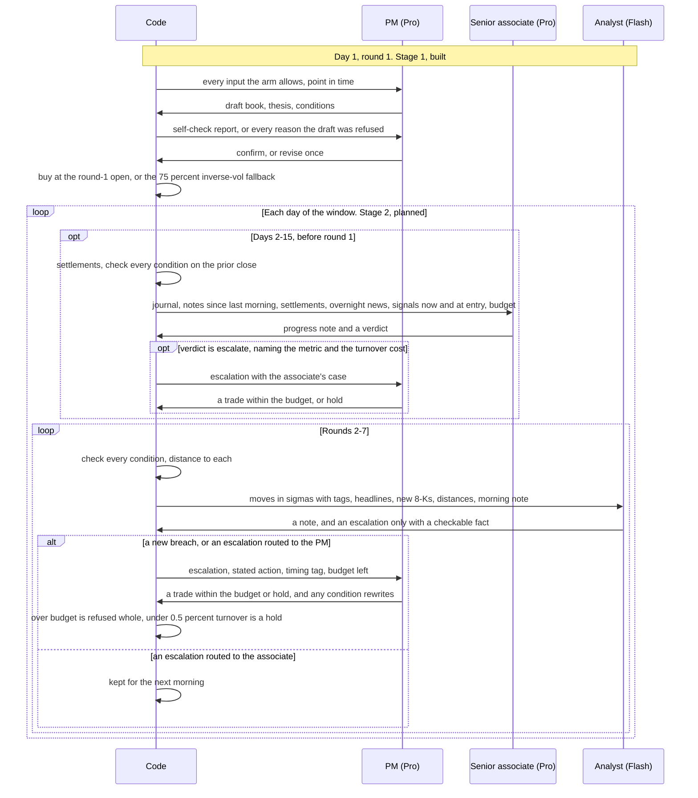
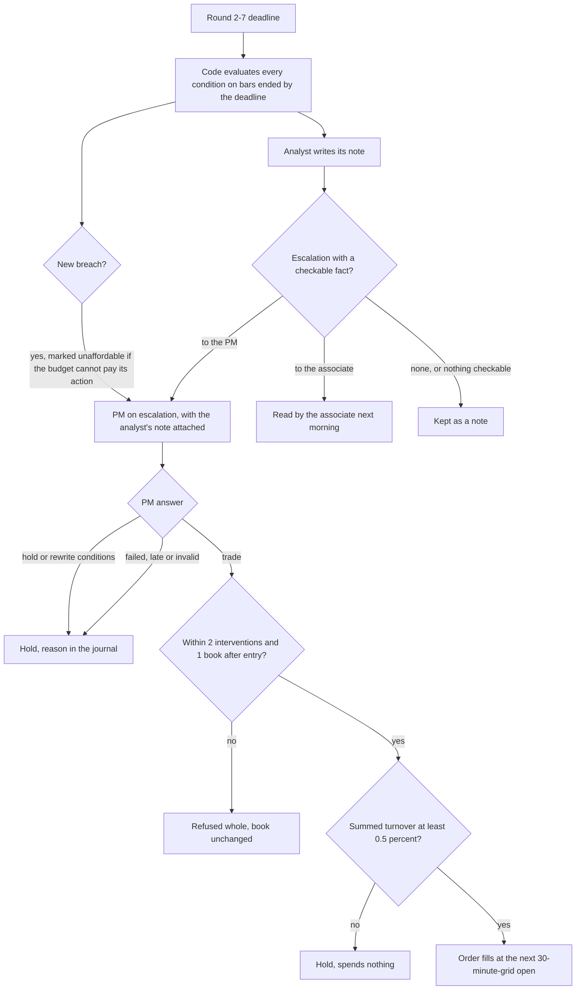

# Stage 2: the escalation chain and its experiments (planned)

> Snapshot 2026-10-10, main @ 81dcfb5. Planned, not built: no analyst, senior associate, condition evaluator, intervention budget or stage-2 tool exists on any branch; the stage-1 entry it sits on is built, and v2's trigger, settlement, budget and journal machinery is ready to reuse.

Stage 2 is the part of desk v3 that runs after the entry. An analyst (Gemini 2.5 Flash)
wakes in every round 2-7 and writes a note. A senior associate (Gemini 2.5 Pro) reviews
the book against the PM's plan each morning. Only the PM, on escalation, may trade, inside
a code-enforced budget of 2 interventions and 1 book of turnover after the entry
([v3_desk_plan.md](../v3_desk_plan.md)). The contract between the levels is the set of
plan conditions the PM writes at entry: code evaluates them every round, and a breach
reaches the PM with the PM's own stated action, whatever the analyst writes. The planned
experiment runs the chain on the four `official4` windows plus 3-4 volatile stage-1 windows
and sweeps the intervention cap over 0, 1, 2 and unlimited, for an estimated $2-4 a window
and about $30 in all (plan, "Stage 2: the chain"). For the paper this is an adaptive-compute
cascade: a cheap model every round, an expensive one on demand, and typed contracts between
them that code checks.

Read [07_three_level_hierarchy.md](07_three_level_hierarchy.md) for the hierarchy as a whole
and [09_stage1_doe.md](09_stage1_doe.md) for the entry experiment this one follows.

## 1. Why a chain, and what it must not do

The score is the mean of four ranks against a field: return, Sharpe, max drawdown and
turnover ([00_contest_and_evaluation.md](00_contest_and_evaluation.md)). The plan's case
for v3 rests on three observations (plan, "Why a third desk"):

- The 75% inverse-vol hold has been the hardest entrant to beat, and every rule tested
  that traded after entry lost (TODO.md, "Exposure-timing race").
- Desks that decide every morning churn. The v1 free desk rewrote its book on 13-14 of 15
  mornings, with turnover 1.9-5.4% against the hold's 0.71%. The v2 firm (nine roles,
  a debate and a trade list every morning) placed 24th-29th of 28-29 on 2026-04-13.
- The field crowds just above a pure hold, so the first intervention after entry is the
  expensive one. On 2026-04-13 the rule (`q_riskparity_entry_regime`) traded 0.0079 of
  board turnover against the hold's 0.0071 (0.08% more, about 0.08 books over 105 rounds)
  and ranked 19th on turnover on the holdout board, where the hold ranked 15th: a full
  point of overall score. On the modelled field (8 entrants plus the candidate) the same
  two books both ranked 2nd on turnover (output/agent/v2_pro_2026-04-13/board.csv and
  windows.csv).

So the chain's design target is restraint. In a calm window a working chain does nothing,
and escalations in a calm window are "a prompt bug we can see" (plan, "Analyst"). Every
later trade must climb a chain to the one role that can trade, carry a checkable reason,
and fit a budget code enforces.

## 2. Status at the snapshot

| Build-order step (plan) | Status on main @ 81dcfb5 | Where |
| --- | --- | --- |
| 1. Schemas | `PMEntry`, `Condition`, `PMCheck` built. `AnalystNote`, `AssociateNote`, `PMIntervention` absent | [schemas.py](../icaif/agents/schemas.py) |
| 2. Condition evaluator | Not built. Only `condition_errors`, a static check at entry | [v3.py](../icaif/agents/v3.py) |
| 3. Self-check report | Built | [selfcheck.py](../icaif/agents/selfcheck.py) |
| 4. PM entry desk | Built as `V3Desk`. Run by `tools/entry_replay.py`, not by the plan's `agent_replay.py --desk v3 --stage entry` | [v3.py](../icaif/agents/v3.py), [entry_replay.py](../tools/entry_replay.py) |
| 5. Entry analysts | Built (`V3Desk._entry_analysts`) | [v3.py](../icaif/agents/v3.py) |
| 6. Stage 1 | Running. Round 1 chose `reports_only` (commit 6ae9ed6). 12 of round 2's 16 rows had results in the owner's v3 worktree when this was written | [stage1_doe.md](../stage1_doe.md) |
| 7. The chain | Not built | - |
| 8. Stage-2 runs and the sweep | Not run | - |
| 9. Live shadow | Not wired. `runner.run_desk` builds a v1 `Desk`. Commit d7224b7 lists "wiring v3 into the live runner" as left out | [runner.py](../icaif/runner.py) |

`git grep -n -E "AnalystNote|AssociateNote|PMIntervention"` finds the three names only in
`v3_desk_plan.md`, on main and on every other branch (`v3`, `official4`, `step4`, `step5`,
`universe-ranks`, `claude/elastic-galileo-f58a47`, `origin/gemma-brain-and-system-guide`).
The owner's v3 worktree has no uncommitted stage-2 code either: its `v3.py` is main's.

Today `V3Desk._decide` returns `None` at every round but round 1, and at round 1 once
`book.entered` is set. `V3Config` turns v2's `triggers` and `reflect` off. A v3 window is
therefore the entry followed by a pure hold.

## 3. The chain as planned

### 3.1 Roles

| Role | When | Reads | Writes | May trade | Tier (plan) | Calls a window (plan) |
| --- | --- | --- | --- | --- | --- | --- |
| PM, entry (stage 1, built) | Day 1, round 1 | Every input the arm allows, or the four entry analysts' reports | A free book, a thesis and up to 12 conditions. Then confirms or revises once after code's self-check | Yes, the entry | Pro, high | 2 deep (plus 4 quick with analysts) |
| Analyst | Every round 2-7 | Held names' moves since the last close in sigmas, with v2's `TriggerTags`; held names' headlines and new 8-Ks; each condition with code's distance to it; the morning note | A note every round, and optionally an escalation that cites a checkable fact, routed to the associate or the PM | No | Flash, medium | About 90 |
| Senior associate | Every morning, before round 1 | The journal (thesis, conditions, every analyst note since the last morning, earlier escalations and their outcomes); code's settlements; overnight news and 8-Ks; signals now against their values at entry; return, drawdown, turnover spent; budget left | A progress note, and a verdict: no action, or escalate. An escalation names the metric it protects and the turnover it costs, in books and in turnover rank on the modelled field | No | Pro, high | 15 |
| PM on escalation | On a breach or an escalation | What the entry read, refreshed, plus the escalation, the plan, the journal and the budget; the trigger's timing tag | A trade (a new book, or trims and exits) within the budget, or a hold. May rewrite conditions, with a reason in the journal | Yes | Pro, high | "A few" |
| Code | Always | - | Caps, fills, condition checks, settlements, the journal. A failed call holds | - | - | - |

### 3.2 The analyst

- It wakes every round from 2 to 7, so about 90 quick calls a window: 15 sessions times
  6 rounds, fewer on a half-day, which runs rounds 1-4 only (`calendar.rounds_for`).
- It escalates only by citing something checkable: a condition that fired or is near
  firing, a move in sigmas, a filing, a release. "I'm uneasy" is refused as an
  escalation and kept as a note. This is a partial acceptance, unlike the repo's usual
  rule that an answer failing a check is refused whole.
- Its schema has no trade field. The risk the plan names is escalation creep, not churn.
  The escalation rate is logged per window.
- It may argue against acting on a fired condition. Its note is attached to the breach,
  but it cannot stop the breach reaching the PM.

What it will see at round 2 is thinner than the plan's wording suggests. Information bars
are 60-minute bars on the live :30 grid (09:30-10:30, ..., 15:30-16:00; `alpaca.to_60m`),
and a decision sees only bars ended by its deadline (`Market.recent_closes`). Round 2's
deadline is 10:25 (`calendar.ROUNDS`), so no bar of the day has ended. `move_since_close`
returns `(None, None)` there, and the first intraday close a decision can see is 10:30's,
at round 3. The round-1 fill's opens are visible from round 2 through `Market.fill_prices`,
which returns the whole row of an execution that happened before the deadline. So about 15
of the 90 calls see no new bar, only news and 8-Ks since round 1.

### 3.3 The senior associate

- It runs before round 1, as of the prior close, like v2's reflection, which runs "in the
  analysts' slot ... as of the prior close (nothing later is visible at round 1)" (`v2.py`
  docstring).
- Settlements are code's, not the roles' self-report: "what each held name and each past
  intervention did since, in bp of NAV after fees. v2's `_settle` does most of this"
  (plan). Section 5 lists what it does not do.
- An escalation must name the metric it protects (return, Sharpe or drawdown) and the
  turnover it costs, in books and in what code says it does to the turnover rank on the
  modelled field. No function computes that rank effect today. `icaif/rankplay.py` has the
  machinery to project a field's turnover and ranks mid-window (`EntrantState`,
  `expected_scores`). The modelled field (`baselines.FIELD`, 8 entrants) is sparse near the
  hold: section 1's 2026-04-13 trade cost 0 ranks there and 4 on the board. The README's
  trim section says the same ("A quarter of one name never moves our turnover past a
  rival's in the modelled field").

### 3.4 The PM on escalation

- It may trade anything, in the morning or intraday: a new full book, or trims and exits.
- It sees the trigger's timing tag. A fill lands at the :30 open after the deadline, so
  anything public by the deadline is already in that price, and "selling after a 3-sigma
  drop sells at the drop" (plan).
- It may rewrite conditions with a reason. Without that, a condition that fired and was
  declined would fire again.
- Its scope after an urgent intraday escalation is open decision 4: the whole book, or the
  escalated names only, leaving book-wide changes to the morning. v2's answer was the
  narrow one. Its trigger PM may name only the triggered names and set no exposure, or the
  list is refused, and gross may not rise above max(0.75, gross now)
  (`V2Desk._triggered`; `tests/test_v2_triggers.py::test_a_trigger_list_naming_another_name_or_an_exposure_is_refused`).

### 3.5 Code's rules

| Rule (plan) | Settled? | Exists today? |
| --- | --- | --- |
| Fired conditions bind: code checks every condition every round. A breach goes to the PM with the condition's stated action as the proposal, whatever the analyst writes. Once per breach, unless the PM rewrites it | Settled 2026-10-07 | No evaluator, no breach state |
| Budget: at most 2 PM interventions a window and 1 book of turnover after the entry ("the entry is 1 book, so 2 in all"). Over budget is refused whole, never scaled. A fired condition the budget can't pay for reaches the PM marked unaffordable | Starting values settled 2026-10-07. "The sweep in stage 2 replaces these with measured values" | Turnover budget yes (`budget.TurnoverBudget`). Intervention count no |
| A trade below 0.5% summed turnover is a hold and spends nothing | Plan | Live only, in `runner.guard` (`MIN_TURNOVER = 0.005`). See section 4.5 |
| Fallbacks: an invalid or late entry buys the 75% inverse-vol book. Any later failure holds. Every fallback is counted | Plan | Entry fallback built (`V3Desk._enter_book`). Later failures: v2's pattern (`pm:hold`, `event_pm:refused`) |
| Journal: every note, escalation and route, condition check and distance, PM decision and reason. `journal.verify` checks the ledger against it | Plan | `Journal` has none of these fields yet |
| Tiers: PM and associate on Gemini 2.5 Pro (high), analyst on 2.5 Flash (medium) | Plan | `V3Config.tiers` is inherited from `V2Config`. `v3.ROLE_TIER` has no analyst or associate key |

Why the budget's starting values (plan): the first intervention costs the most turnover
rank, so 2 interventions allow one real change of mind plus one exit, and 1 book allows a
full rewrite or several trims, never both. The free desk spent about 7 books.

### 3.6 One window

### 3.7 One round's routing

## 4. Conditions: the contract between levels

### 4.1 The vocabulary as implemented

`schemas.Condition` has `kind`, `name`, `threshold`, `item`, `action`, `gross` and `why`
(prose, 300 characters stated). `PMEntry.conditions` holds at most 12. The units come from
the field's description, which is what the model reads.

| Plan's row | `kind` (`CONDITION_KINDS`) | Scope | Threshold (schema text) | Actions allowed (`condition_errors`) | Written by stage-1 PMs |
| --- | --- | --- | --- | --- | --- |
| Name: move from entry in daily HAR sigmas | `move_from_entry_sigma` | name | Daily HAR sigmas, signed (-2.5 is a fall) | `NAME_ACTIONS`: review, trim_quarter, trim_half, exit | 36 |
| Name: move from entry in % | `move_from_entry_pct` | name | Percent, signed | `NAME_ACTIONS` | 427 |
| Name: gap on its earnings reaction | `earnings_gap_pct` | name | Percent, signed | `NAME_ACTIONS` | 56 |
| Name: give-back from its peak since entry | `give_back_from_peak` | name | Fraction of the gain since entry given back (0.5) | `NAME_ACTIONS` | 219 |
| Name: a new 8-K of a stated item | `new_8k_item` | name | `item`, e.g. "2.05". No threshold | `NAME_ACTIONS` | 120 |
| Book: drawdown from peak | `drawdown_from_peak_pct` | book | Percent, positive | `BOOK_ACTIONS`: review, set_gross | 155 |
| Book: drawdown from entry | `drawdown_from_entry_pct` | book | Percent, positive | `BOOK_ACTIONS` | 34 |
| Market: basket move from entry | `basket_move_from_entry_pct` | market | Percent, signed | `BOOK_ACTIONS` | 146 |
| Market: basket vol against its 3-year median | `vol_ratio_above` | market | Ratio (1.8) | `BOOK_ACTIONS` | 158 |

The plan's six rows map onto nine kinds. The plan's free-text "watch" note, which the
analyst reads but which never fires, has no field in `Condition` or `PMEntry`.

The PM's system prompt already tells it that conditions bind: "a fired condition goes to
the PM with its action as the proposal, and every trade costs the fee and turnover rank"
(`prompts_v3.CONDITIONS`). Stage-1 PMs wrote their conditions believing that, though in
stage 1 nothing evaluates them.

### 4.2 What `condition_errors` checks, and what it does not

An entry with any condition code cannot evaluate is refused whole, with every reason
(`V3Desk._judge`). The docstring of
`tests/test_v3.py::test_a_condition_code_cannot_evaluate_refuses_the_whole_entry` names the
failure this prevents: a condition code can't evaluate "would sit in the plan never firing,
while the PM believed it was guarded." `condition_errors(c, held)` checks:

- a name kind names a name, and that name is held (weight above 0 in the entry);
- a book or market kind names no name;
- the action fits the scope (`NAME_ACTIONS` or `BOOK_ACTIONS`);
- `new_8k_item` has an `item`, and every other kind has a finite `threshold`;
- `gross` is given exactly when the action is `set_gross`.

It does not check, so a dead condition can still pass:

- **The 8-K item code.** `filings.parse_events` drops items in `filings.IGNORED` (9.01,
  5.07 and 5.03) at load, and `filings.label` shows only codes matching `filings.CODE`. A
  `new_8k_item` condition on "9.01" can never fire, and one on a string like "Item 2.05"
  would never match a stored code.
  None of the stage-1 plans so far hit this: their 11 distinct items are all event items.
- **Threshold sign and range per kind.** A negative `drawdown_from_peak_pct` is true from
  the first check. A `give_back_from_peak` of 50, read as percent, never fires. The
  stage-1 plans so far are in range: drawdowns 5-10, give-backs 0.33-0.6, vol ratios
  1.25-3.5.

### 4.3 What stage-1 PMs actually wrote

These are free test data for an evaluator: the plans of 15 finished stage-1 arms in the
owner's v3 worktree (`.claude/worktrees/v3/output/entry/v3_*/entries.jsonl` under the main
checkout, read 2026-10-10 while round 2 was still running). That is 195 window entries,
194 with a plan (one fell back).

- 1,351 conditions, 4-12 a plan, mean 6.96.
- Actions: review 816, trim_half 154, exit 148, set_gross 130, trim_quarter 103. So 60% of
  conditions only ask for another look.
- Most common pairs: `move_from_entry_pct`/review 256, `drawdown_from_peak_pct`/review 145,
  `new_8k_item`/review 108, `basket_move_from_entry_pct`/review 102,
  `move_from_entry_pct`/exit 97, `give_back_from_peak`/trim_half 93.
- Medians: `move_from_entry_pct` -10 (range -20 to +25); `basket_move_from_entry_pct` -5
  (-7.5 to +8); `drawdown_from_peak_pct` 5; `give_back_from_peak` 0.5; `vol_ratio_above`
  1.5; `earnings_gap_pct` -5 (-10 to +10); `move_from_entry_sigma` -2.5 (-3 to +3).
- Upside thresholds exist: 48 of 427 `move_from_entry_pct`, mostly with review (26) or
  trim_quarter (20), which are take-profits. There are 25 upside basket moves (9 with
  set_gross) and 4 upside earnings gaps. So "fires" must mean "at or past the threshold in
  its own sign's direction". The schema text implies this but does not say it.
- `set_gross` targets run 0.0-0.95 (median 0.5). A target above the gross held is a buy,
  so a fired condition can add turnover, not only cut it.
- 8-K items: 5.02 (officer change) 46, 1.01 (material agreement) 31, 2.02 (results) 10,
  4.02 9, 2.05 6, 1.02 5, 2.01 4, 8.01 4, 2.03 2, 2.06 2, 1.05 1. A 2.02 condition fires
  on every results release of that name.

### 4.4 What a runtime evaluator must compute, point in time

Every input below must come from bars ended by the deadline (`Market.recent_closes`), fills
of executions before it (`Market.fill_prices`), and filings accepted by it (`filings.new`,
`filings.recent`).

| Kind | Inputs | Existing source in code | Point-in-time notes and choices |
| --- | --- | --- | --- |
| `move_from_entry_pct` | Entry price, latest price | `Journal.positions[t]`: `entry_price` (the fill at the :30 open), `last_price` (latest bar close). `Journal.name_fields` gives `gain_since_entry` | `entry_price` becomes a size-weighted cost after an add (`Journal._buy`), so an intervention that adds moves the condition's base |
| `move_from_entry_sigma` | The same, plus a daily sigma | HAR mean daily variance per name and session (`signals.VolForecasts.for_day`, columns `har_h1`, `har_h3`); `trim.sigma_today` uses `har_h3` | Which horizon, and whether the sigma is fixed at entry or re-read each day. Whether the move is scaled by the square root of sessions held, as the trim rule's gain test is ("a x its HAR vol x sqrt(sessions held)", README) |
| `earnings_gap_pct` | Reaction session, prior close, first print after | `triggers.EarningsHistory`, `TriggerTags.earnings`, `move_since_close`; the 09:30 opens via `fill_prices` | The first bar of the day is visible at round 3 (section 3.2). The open is visible from round 2. The PM's fill comes after the gap |
| `give_back_from_peak` | Gain since entry, peak gain since entry | `Journal.positions[t]["peak_price"]`, the highest bar close after the fill; `name_fields` gives `peak_gain_since_entry` | Undefined while the peak gain is at or below 0: the condition is not armed yet. Give-back = (peak gain - gain) / peak gain |
| `new_8k_item` | 8-Ks accepted since the last check, with item codes | `filings.new(events, after, deadline)`; `items` is a comma-separated code string | Acceptance time is the stamp. EDGAR's JSON served late acceptance times from 2026-10-06; `earnings.checked_times` verifies them ([06_sec_filings.md](06_sec_filings.md)) |
| `drawdown_from_peak_pct` | NAV now, peak NAV | `Journal.nav()`, `Journal.peak_nav` (updated in `open_round`, once a round at its deadline) | Peak sampled 7 times a day from bar closes, not intrabar |
| `drawdown_from_entry_pct` | NAV now, NAV at entry | `Journal.start_nav` (the cash before the entry) or the entry fill's `nav_after` | The base includes the entry fee or not: 7.5 bps at 75% gross |
| `basket_move_from_entry_pct` | Basket level at entry and now | `qs._basket`: the mean of the 30 names' log returns, NaN on a day any is missing | A daily or an intraday basket. NaN days must hold, not fire |
| `vol_ratio_above` | EWMA basket vol over its median | `observe.readings(closes, hmm).vol_ratio`: EWMA with `alpha=0.06` over its median across `qs.HISTORY_DAYS` (750) daily closes; shown as `vol_vs_3y_median` | Built from daily closes, so it changes once a day, at round 1, and a breach can't be seen intraday. A threshold below the value at entry is already breached at the first check (4.5, item 3) |

Also to define: the "distance" the analyst and the associate read. The same unit as the
threshold, signed so that 0 means firing, is the obvious choice. The plan does not define
it.

### 4.5 Semantics still to decide

1. **Direction.** Signed thresholds fire on the side of their sign (section 4.3).
2. **Once per breach.** A breach is presumably an episode that starts when the predicate
   turns true. When does it re-arm: after the predicate is false for one check, or never
   unless rewritten? v2's triggers fire once a day per name for moves (`Desk._fired`,
   reset each day) and once per filing for 8-Ks (`_filings_to`).
3. **True at entry.** Fire at the first check, or require a crossing?
4. **Two sigma units.** The analyst's moves come from `TriggerTags`, which divide by the
   standard deviation of the last 20 daily log returns (`triggers.SIGMA_DAYS`). The
   condition's `*_sigma` is "daily HAR sigmas". Showing both side by side, unlabelled,
   invites a role to compare unlike numbers.
5. **The 0.5% floor.** The plan says a trade below 0.5% summed turnover "is a hold and
   spends nothing, as in v1". In code, three floors disagree:
   - `runner.guard` (live only) holds below `MIN_TURNOVER` 0.005 summed;
   - `tradelist.compile_trades` refuses any single line under `MIN_TRADE` (0.005 of NAV)
     with a `TradeListError`;
   - v1's `Desk._cuts` drops a sub-floor trim as a hold.

   Replays have no guard, so the desk must apply the floor itself. Whether a floored trade
   counts as an intervention is not said. "Spends nothing" suggests not.
6. **The budget's total.** `TurnoverBudget.total` counts the entry. "1 book after entry"
   and "2 in all" differ when the entry's gross is under 1. At 75% gross the first gives a
   total of 1.75 and the second 2.0.
7. **Round-1 routing.** Code checks conditions every round, including the morning, when
   the associate runs and the analyst does not. Does a breach seen at round 1 go straight
   to the PM, or through the associate?
8. **Day 1's associate.** The plan counts 15 associate calls. On day 1 there is nothing to
   review before the entry, so 14 calls review a book.

## 5. Existing machinery stage 2 builds on

| Piece (file) | What it does today | What stage 2 takes | What it lacks for stage 2 |
| --- | --- | --- | --- |
| Role calls: `V2Desk._ask_many`, `_ask_one`, `_record`, `fallbacks`, `PREFIX` ([v2.py](../icaif/agents/v2.py)) | Parallel calls in slots; each call's timeout is the time left in its slot; every skip, late and failed call is counted. The `PREFIX` keys the cache and the cost by desk and role | The analyst, associate and PM calls | No analyst or associate tier or slot in `v3.ROLE_TIER` and `v3.SLOTS`. v2's trigger-round slots (`event` 240 s, `event_pm` 540 s) are the template |
| Trigger tags: `TriggerTags`, `move_since_close`, `EarningsHistory`, `priced_from` ([triggers.py](../icaif/agents/triggers.py)) | Status `upcoming` or `already_reacted` against the fill, not the clock; move since the last close in 20-day sigmas; the last 8 earnings reactions, each counted once its close has passed | The analyst's per-name view and the PM's timing tag | Sigma is 20-day realised, not HAR (4.5, item 4) |
| v2's trigger path: `V2Desk._triggered` | Rounds 2-7 wake on results at the next open (last round), a 3-sigma move (once a day a name) or a new 8-K (once a filing). An event analyst and an event PM decide the triggered names alone | The intraday round's shape, and one answer to the intraday PM's scope | No conditions, no note every round, no intervention budget |
| Settlements: `V2Desk._settle` | Each line the PM traded after the entry, from its fill to the next session's close: weight times move, bp of NAV, fees apart. Each name held through its results. Only names a list named are graded, read from the decision's `levers.lines` (`_record_of`) | The associate's settlements, and grading interventions | The plan wants "since", after fees, and per held name. No paper settlement of a trade that was refused or blocked |
| Citation check: `V2Desk._analysts` (`cites`) | Refuses a reflection whose lessons cite a settlement id that does not exist | The pattern for "escalates only by citing something checkable": cite ids code issued this round | - |
| Turnover budget: `TurnoverBudget` ([budget.py](../icaif/agents/budget.py)) | The kit's unit (notional / NAV before, summed). Spent = the journal's fills plus unfilled orders. `view()` shows spent, left, and the board turnover if no more trades | "1 book after entry", in books and board units | No count of interventions |
| Trade lists: `compile_trades`, `TradeList` ([tradelist.py](../icaif/agents/tradelist.py)) | Adds, cuts, quarter or half trims and a target exposure become weights, or a refusal with every reason. Checks `budget_left`, the cap and the gross. `NUDGE` keeps a stated weight as stated | `PMIntervention`'s trades | Per-line `MIN_TRADE` refusal against the plan's hold (4.5, item 5) |
| Journal: `Journal`, `verify` ([journal.py](../icaif/agents/journal.py)) | Reconciles the book each round. Marks entry, last and peak per name. Keeps a `memory` view under 6,000 characters, plus `settlements` and `lessons`. `verify` checks fills, positions, holds and v1's levers | Entry prices and peaks for conditions, and the record | No fields for notes, escalations, condition checks or rewrites. `_levers_vs_book` knows roles `entry`, `review` and `event` only |
| Cache: `CachedBrain` ([brains.py](../icaif/agents/brains.py)) | Keys each answer by brain name, role key, system prompt, payload and schema name. `repeat=N` asks again under new keys | Free reruns, and the sweep's shared prefix | Shares only while payloads are byte-identical (7.2) |
| Untrusted text ([untrusted.py](../icaif/agents/untrusted.py)) | External text arrives only in `source_text`, cleaned and capped | Headlines and filings in the analyst's view | The injection test covers the v1 desk only (7.5) |
| Board tools: [board_rank.py](../tools/board_rank.py), [submit_agentic.py](../tools/submit_agentic.py), [replay_entry.py](../icaif/replay_entry.py), [boardrank.py](../icaif/boardrank.py) | Places a replay on the holdout board after an anchor check. `--suite official4` builds a fixed-suite entry from one run per window | Board place per window | See section 6 |
| Suites: `suites.SUITES["official4"]` ([suites.py](../icaif/suites.py)) | Four fixed windows: 2025-04-11, 2025-10-13, 2026-04-13 and 2026-07-13, each 15 sessions | The stage-2 windows | - |

### 5.1 What v2's trigger path did on 2026-04-13

v2's rounds-2-7 path is the nearest thing to stage 2 that has run with an LLM. It ran
twice on the 2026-04-13 window (the main checkout's output/agent/v2_pro_2026-04-13 and
v2_gemini_2026-04-13, `log.jsonl` and `chain.jsonl`):

- Triggers were rare. There was 1 trigger round in the Pro run and 2 in the Flash-plus-Pro
  run. Over 167 windows, v1's rule desk wakes its analyst 23.4 times a window (README,
  "News and profit booking"), but two mechanisms differ. That desk holds all 30 names,
  and its 8-K trigger also catches overnight filings at the day's first event round.
  v2's morning chain reads overnight 8-Ks itself (`V2Desk._new_filings` moves
  `_filings_to` at round 1), so only a filing accepted during the session wakes a v2
  trigger round.
- The trigger PM traded every time it was asked (`"traded": true` on all three). Both
  runs cut CRM at day 9 round 3 after it "moved -3.7 daily sigmas since the last close".
  The Flash-plus-Pro run also exited TMO at day 8 round 7, because "results react at the
  next open".
- The CRM sale was made at the drop. In both runs a reflection lesson cites code's
  settlement `day9-r3:CRM` and puts its cost at about 10 bp. The Flash-plus-Pro run's
  lesson adds that the stock rebounded the next day. In that run another lesson credits
  the TMO and TSLA exits with a combined +88 bp (settlements `day8-r1:TMO`, `day8-r7:TMO`
  and `day8-r1:TSLA`). These bp figures are the LLM restating code's numbers; they are not
  recomputed here.
- In the Flash-plus-Pro run, from the round's start to the trigger PM's answer took 23 s
  and 33 s (`latency_s`). The window cost $1.64 for 136 Flash calls and $1.72 for 42 Pro
  calls, all cache misses (`v2_gemini_2026-04-13.out`).

## 6. What is still to build

Step 7 of the plan ("Analyst, associate, escalation routing, budget, settlements, journal
entries, plan rewrites. `--stage chain`. The all-hold ledgers test again") breaks down
into these pieces. File names for new code are suggestions.

1. **Schemas** in `schemas.py`:
   - `AnalystNote`: the note, an escalation (none, associate or PM), and the cited fact;
   - `AssociateNote`: progress, verdict, metric and cost;
   - `PMIntervention`: a book, or trims and exits, plus condition rewrites and a reason.

   The first two have no trade field. Gemini's schema limits apply: length caps go as
   words (`brains.gemini_schema`) and pydantic enforces them.
2. **A condition evaluator** (for example `icaif/agents/conditions.py`): one value, one
   distance and one breach state per condition per round, from the inputs in 4.4. Breach
   state belongs in `Desk.state()`, so a restarted live round neither re-fires nor forgets.
3. **`V3Desk` routing:**
   - round 1 of days 2-15 goes to the associate, and rounds 2-7 to the analyst;
   - snapshot the signals at entry (`self.at_entry`; only v1's `Desk._enter` sets it
     today, so v2 and v3 roles never see `*_at_entry` fields);
   - an intervention counter, and a `TurnoverBudget` with the stage's total;
   - new role keys under the `v3` prefix. v2's `PREFIX` comment says the prefix "keys the
     cache and the cost by role", so the escalation PM's calls and dollars are counted
     apart from the entry PM's (`brains.cost_by_role`);
   - `ROLE_TIER` and `SLOTS` entries that fit the runner's 12-minute lead.
4. **Prompts** in `prompts_v3.py`, as frozen strings.
5. **Settlements** extended to "since", after fees, per held name, and to paper
   settlements of trades a cap refused (7.2).
6. **The journal:**
   - fields for notes, escalations with route and cited fact, condition checks with
     distance, PM decisions with reasons, and rewrites;
   - a dedicated view for the associate. About 90 notes a window cannot all fit in
     `MEMORY_MAX_CHARS` (6,000 characters) at any useful length, and `_fit` enforces that
     bound by cutting the oldest detail first;
   - `verify` extended to the PM's intervention levers.
7. **A plan for a held book.** The plan's fallback, "the PM writes the plan and conditions
   for the book it holds, without trading", for when the chain runs on the rule's entry.
   `V3Desk` writes a plan only with its own entry.
8. **Tooling:**
   - `agent_replay.py --desk` accepts `levered`, `free` and `v2` only, and `--stage` exists
     nowhere;
   - `entry_replay.py` writes `output/entry/<tag>/windows.csv` with a `field` column, two
     rows per window and strategy. `board_rank.py` and `submit_agentic.py` read
     `output/agent/<tag>/windows.csv` with one row each, so `boardrank.check_anchor` would
     find two `inv_vol_hold_75` rows and refuse;
   - `replay_entry.DESK_PREFIXES` is `("desk_", "free_", "v2_")`, so a `v3_` row is not
     recognised as a desk;
   - `submit_agentic.py` also needs a `<tag>.out` console log ending in each model's spend
     line;
   - `board_rank.py` ranks against the holdout board only (`leaderboard.standings`). Of
     `official4`, only 2026-04-13 lies in that span. Placing the other three without a
     public submission needs the `official4` standings (`leaderboard.boards(...)["suites"]["official4"]`).
9. **Tests**: section 7.5.

Step 8 is the runs and the sweep, asking the owner first. Step 9 is the live shadow:
`runner.run_desk` would build a `V3Desk`, analyst calls must fit each round's lead, with a
spend cap per phase "as for the current shadow" (`runner.Config.shadow_cost_cap`, $10).
`--submit agent` happens only by the owner's decision, after the gates.

## 7. The stage-2 experiment as planned

### 7.1 Windows

The plan uses the four `official4` windows, plus 3-4 volatile ones from the stage-1 set
"(the largest basket drawdowns), so there are turns to react to". By construction they
never overlap stage 1's 22 windows:
`tests/test_v3.py::test_stage1_windows_follow_the_cutoff_never_overlap_and_split_selection_before_confirmation`
asserts it ("official4 is stage 2's"). All 26 windows lie after Gemini 2.5's January 2025
knowledge cutoff (`brains.py` docstring). The Alpaca news archive's
`data/external/news_alpaca/coverage.json` lists fetched spans covering every one of them,
from 72 hours before each window's first deadline. 8-K texts are checked separately when a
real-names replay starts (`agent_replay.real_name_sources`).

The owner has not chosen the volatile windows. For orientation, here are the basket
drawdowns: my computation for this hand-off, not the plan's. The basket is the mean of the
30 names' daily log returns (`qs._basket`), taken from the last regular-session bar per
session in `data/public/alpaca_30m_2026-09-27.parquet`. Each path runs from the close
before the window's first session to its last close.

| Window | Set | Basket return | Basket max drawdown |
| --- | --- | ---: | ---: |
| 2025-03-18 to 2025-04-07 | stage-1 select | -11.85% | 13.80% |
| 2025-02-25 to 2025-03-17 | stage-1 select | -5.47% | 7.92% |
| 2025-11-03 to 2025-11-21 | stage-1 select | -3.17% | 4.84% |
| 2026-02-23 to 2026-03-13 | stage-1 confirm | -3.84% | 4.78% |
| 2026-03-16 to 2026-04-06 | stage-1 confirm | -0.12% | 4.27% |
| 2025-04-11 to 2025-05-02 | official4 | +6.84% | 4.38% |
| 2025-10-13 to 2025-10-31 | official4 | +3.83% | 1.38% |
| 2026-04-13 to 2026-05-01 | official4 | +6.07% | 0.80% |
| 2026-07-13 to 2026-07-31 | official4 | +0.49% | 2.17% |

The median stage-1 window's drawdown is 2.1%. Three of the four `official4` windows are
calm on this measure, which is the plan's reason for adding volatile ones. A chain that
escalates in 2026-04-13 is the calm-window prompt bug. Windows chosen by realised drawdown
are a stress set: their mean score says how the chain behaves when it has something to do,
not what it is worth in a random window. For a selection window, the chosen stage-1 arm's
entry may already be in the cache. Every `official4` entry would be a new call.

### 7.2 The budget sweep

The plan sweeps caps of 0, 1, 2 and unlimited interventions on the same windows. "Cached
answers make the extra runs nearly free: runs are identical until a cap first binds."
Then it asks whether the interventions a cap blocked would have paid, "judged on
settlements, not on how good the reasons sounded".

Three consequences for whoever builds it:

- **The sharing holds only if no role is shown the cap before it binds.**
  `CachedBrain.key` hashes the whole payload. The plan has the associate read "the budget
  left" and the PM read "the budget". If those views show interventions left, a cap-0 run
  differs from a cap-2 run from day 2's first associate call, and every run is fresh and
  paid. The options are to show every arm the same budget view and enforce the cap in code
  alone (blocked trades get a paper settlement), or to show the real cap and pay for four
  full runs. The first measures the value of blocking. The second measures how a known
  budget changes behaviour. They are different experiments.
- **A blocked intervention's value is clean only up to the first divergence.** The
  unlimited run executes and settles the intervention the cap-k run blocked. After that
  point the books differ, later payloads differ, and the runs no longer share answers.
- **Paper settlement is new code.** It marks the refused list's lines from the fill price
  the round would have had (the :30 open after its deadline, via `Market.fill_prices`) to
  the horizon close, using `_settle`'s arithmetic.

### 7.3 What gets reported per window (plan)

- The escalation rate per role.
- Interventions and their settlements.
- Turnover in books.
- The fallbacks.
- Cost.
- The board place (`tools/board_rank.py`, `tools/submit_agentic.py --suite official4`).

`submit_agentic.py` without `--dry` writes to the private entry dataset and the public
board, so that step is the owner's.

### 7.4 Cost and time

- **The plan's estimate:** $2-4 a window (90 Flash analyst calls, 15 Pro associate calls,
  a few PM calls), about $30 for 8 windows across the sweep.
- **Measured per-call costs:**
  - v2's Flash-plus-Pro run on 2026-04-13 paid about 1.2 cents a Flash call and 4.1
    cents a Pro call (section 5.1);
  - stage 1's smoke window paid $0.07 for a Pro entry call and $0.04 for the check
    (`entry_replay.py`, the `EST` comment).
- **Measured latencies** (`v3_reports_raw_free_select_13w/chain.jsonl` in the same v3
  worktree directory, the first arm with analysts; all above 10 s, so none was a cache
  hit):
  - Flash entry analysts: 10-24 s;
  - the Pro entry draft: 40-58 s (median 49 s);
  - the Pro check: 18-53 s.
- **Runtime** (my arithmetic from those latencies, unverified): about 90 analyst calls at
  15-20 s each is 20-30 minutes of serial calls a window, before the associate's and the
  PM's, because a replay runs its rounds in sequence. Cached reruns take seconds.
- **How to run it:** as separate processes, not a process pool. Pools ran about 600 times
  slower here (plan; owner's notes). Ask the owner before each paid round.

### 7.5 Tests the plan requires

The house pattern: each test is named for the silent failure it prevents.

| Guarantee (plan) | Nearest existing test or check | Status |
| --- | --- | --- |
| A desk whose every role holds trades exactly as `inv_vol_hold_75` in all 167 windows (`agent_replay.py --desk v3 --ledgers-only`) | `test_v3.py::test_a_v3_desk_answered_by_code_trades_exactly_as_the_hold`; `entry_replay.py ledgers` (22 windows at two grosses, journal against ledger, per d7224b7); `agent_replay.py --desk v2 --ledgers-only` (167 of 167, README "Desk v2") | Extend. `v3.HoldBrain` must answer the new schemas. It makes no entry, so there is no plan and nothing fires. A stronger version: a scripted entry that buys the hold's book with conditions that do fire, and a PM that always holds |
| No look-ahead: conditions see only bars ended by the deadline | `test_v3.py::test_no_entry_payload_or_self_check_changes_when_every_later_bar_is_rewritten`; `test_triggers.py::test_no_tag_changes_when_every_price_and_release_after_the_deadline_is_rewritten`; `test_v2_triggers.py::test_nothing_from_a_later_round_reaches_an_earlier_decision` | To build, for the evaluator and every new payload |
| Neither the analyst nor the associate can trade: no trade field, and a brain that tries | - | To build |
| A breach reaches the PM whatever the analyst writes, once per breach unless rewritten | - | To build |
| The budget is enforced in code, and a refused trade leaves the book unchanged | `test_v2.py::test_turnover_is_shown_and_capped_only_against_a_runaway`; `test_v2.py::test_a_pm_list_code_refuses_is_no_trade_never_a_repaired_one` | Turnover yes. The intervention count is to build |
| Headlines and filing text stay data, extended to the analyst's escalation | `test_news_events.py::test_a_headline_that_gives_instructions_changes_no_decision_and_stays_quoted_data` (v1 desk) | Extend |
| Weights go through `weights.safe`, and a stated weight is submitted as stated | `test_v2.py::test_an_approved_entry_list_trades_exactly_the_weights_it_states`; `test_v3.py::test_a_confirmed_entry_trades_exactly_the_weights_it_states_and_then_holds` | Reuse through `compile_trades` |
| A desk restored before every round trades as one that never stopped (the repo's pattern; not in the plan's list) | `test_v3.py::test_a_v3_desk_restored_before_every_round_trades_as_one_that_never_stopped`; `test_v2_triggers.py::test_a_desk_restarted_every_round_replays_triggers_and_reflection_identically` | Extend to breach state, the intervention count and notes |

### 7.6 Open decisions and timing

- **Open (plan, "Open decisions"):**
  - the intraday PM's scope (item 4);
  - the stage-1 gate's k (item 2). The DOE later dropped the entry's gate ("v3 ships
    either way"). No gate is written for switching the chain to submit;
  - the default prompt for a live shadow (item 3);
  - the name (item 5).
- **Settled 2026-10-07:** fired conditions bind, and the budget starts at 2 interventions
  and 1 book.
- **Timing:**
  - Official is one 15-session window, Oct 12-30, entered at round 1 on Oct 12 with v3's
    stage-1 settings (stage1_doe.md);
  - the chain "can join mid-phase as a shadow first". Switching it to submit mid-window
    "is the owner's call, after stage 2";
  - final materials are due Nov 3, and "the journal is the write-up's record of what each
    role saw and why it acted" (plan, "The calendar").

## Contest-specific vs general

| Element | Contest-specific | What generalizes |
| --- | --- | --- |
| 7 rounds a day, deadlines at 09:10 and hh:25, fills at the :30 open, a 12-minute runner lead | Yes (`calendar.ROUNDS`, `runner.Config.lead_s`) | A decision cadence with a hard deadline before execution, and a latency budget per level |
| One 15-session window entered from cash, then held | Yes | A holding period that opens with a plan and closes with an evaluation |
| A rank score with turnover as one of four ranks; the field crowding above the hold | Yes | A transaction-cost or turnover budget, priced in the objective rather than in ranks |
| 2 interventions and 1 book after entry | Calibrated to the contest's rank cost | An intervention budget as a policy knob, swept |
| Gemini 2.5 Pro and Flash as the tiers | Yes (`brains.ALLOWED_MODELS`, the kit's model list) | Any cheap and expensive model pair, and more than two tiers |
| 30 names, long-only, 30% cap, gross at most 1, fee 0.1% | Yes (`weights.CAP`, `sim.FEE_RATE`, `V3Desk._judge`, `compile_trades`) | Constraints checked in code, refused rather than repaired |
| 8-K item conditions | US-specific (EDGAR) | Event-type conditions over any disclosure feed |
| Fallback: the 75% inverse-vol book at entry, then hold | Yes | A safe default that a failed model call falls back to |
| The condition vocabulary, settlements, cited-fact escalations, the cache, the journal | No | All of it |

## Generalizing for the paper

**The chain is an adaptive-compute cascade.** There are four levels:

- Level 0 is code. It evaluates conditions and triggers, enforces the budget and keeps the
  journal, every round, at no cost.
- Level 1 is a cheap model every round. It triages unstructured inputs into a note.
- Level 2 is a mid-cadence reviewer each morning. It reads the notes against the plan and
  code's settlements.
- Level 3 is an expensive model, called only on escalation, and it is the only level that
  acts.

The interfaces between levels are typed contracts code can check: the PM's conditions,
escalations that must cite ids code issued, and budgets. The systems claim to test is that
compute scales with events, not with rounds times names, while the decisions hold up. A
calm window should cost about the level-1 calls and nothing more.

**What to measure:**

- **Escalation precision and recall against settlements.** Precision is the share of
  escalations whose action, or the condition's stated action settled on paper if the PM
  held, settled positive after fees at a fixed horizon. Recall is the share of name-rounds
  where an available action would have settled above a margin that the chain escalated.
  The horizon must be fixed in advance: v2 uses the next session's close, and the plan's
  associate uses "since".
- Escalation rate per role, split by calm and volatile windows.
- Calls and dollars per window by role (`brains.cost_by_role`), and cache hits and misses.
- Latency per round against the slot and the deadline, from `chain.jsonl`'s `latency_s`
  and the `late` fallbacks.
- Turnover in books and in board units, and the score against the hold.
- Fallbacks per role.
- **Plan consistency:** how often the PM at escalation confirms its past self's stated
  action, declines, or rewrites.

**Ablations:**

| Arm | What changes | Notes |
| --- | --- | --- |
| No chain | The entry, then a pure hold | Stage 1 as built |
| The PM every round | The expensive model at every decision | Cost ceiling. The free desk (every morning) and v2 (a firm every morning) are this repo's precedents, and both churned |
| Conditions only, no LLM analyst | Code fires, and the PM decides | Isolates the analyst's value |
| Conditions executed by code | A breach executes the stated action with no LLM | The PM's pre-committed rule. Is the PM at escalation better than its own plan? |
| Analyst only | No binding conditions | Isolates the contract's value |
| Caps 0, 1, 2 and unlimited | The sweep | See 7.2 for cache sharing |
| Model-tier swaps | Flash and Pro swapped at each level, and stronger models | Cache keys include the brain's name, so a new model is asked afresh and is never handed another model's answers |

**Beyond 15-session long-only windows:**

- **Longer horizons.** Treat each rebalance as a new entry with a new plan. Conditions
  then need an expiry, and the budget a period.
- **Long-short.** Signed conditions need the position's sign. `compile_trades`,
  `V3Desk._judge` and `weights.safe` assume long-only and gross at most 1.
- **Several markets.** Each needs a calendar (`calendar.ROUNDS`, `EARLY_CLOSES`), a fee
  model, a per-market HAR fit ([03_har_vol_forecaster.md](03_har_vol_forecaster.md)) and a
  filings feed in place of EDGAR.
- **A larger universe.** The evaluator is per name and cheap. The analyst should read only
  names near or past a threshold, which keeps level-1 cost flat as the universe grows. Test
  that directly.

**Pitfalls:**

- **Look-ahead.** Every condition input must be point in time (4.4). Settlements count
  only after their close has passed the deadline. The repo's guard is a test that rewrites
  the future and requires the past unchanged; add one for the evaluator. Do not cache the
  EDGAR time correction: a stale correction is look-ahead (owner's notes).
- **Survivorship.** The 30 names are a fixed list from the organizers. If that list was
  drawn from today's large caps (unverified), backtests over it carry survivorship bias by
  construction. For a larger universe use point-in-time membership
  (`data/external/sp500_ticker_start_end_2026-09-27.csv`;
  [01_data_streams.md](01_data_streams.md)).
- **Vendor differences.**
  - Replays fill at Alpaca's :30 opens. Live rounds read Yahoo bars, whose opens differ
    from Alpaca's by 21 bps at the 99th percentile (README, "Portfolio memory").
  - A condition within that noise of its threshold can fire in one and not the other.
  - Historical bars sit on a different grid from live execution (README, "Traps in the
    data").
- **Knowledge-cutoff contamination.**
  - Every window here is after Gemini 2.5's January 2025 cutoff. A stronger, newer model
    may have read these windows.
  - Headlines and filing text name companies, so they cannot be anonymised. The repo
    scores news only on windows after the model's cutoff.
  - Re-run `tools/memory_probe.py` for each model and window
    ([05_news_feeds.md](05_news_feeds.md)). Otherwise choose windows after the model's
    cutoff, or use anonymised streams only (`DeskConfig.anonymize`).
- **Contest rules in code.** `brains.make` refuses any model outside `ALLOWED_MODELS`, which
  is a contest rule. Widen it on a research branch, never on main.

## Open questions and gaps

1. **The sweep's cache sharing against what the roles are shown.** The plan's "nearly
   free" holds only if no payload reveals the cap before it binds (7.2). Unresolved in the
   plan.
2. **The condition semantics in 4.5:** direction, re-arming, true-at-entry, the two sigma
   units, the floor, the budget's total, round-1 routing and day 1's associate.
3. **`condition_errors` lets dead conditions through:** an ignored or malformed 8-K item, or
   a threshold of the wrong sign or range (4.2).
4. **PM calls are not capped.** The budget caps trades, not escalations. Every escalation
   is a Pro call, and a chatty analyst raises cost without moving the score. The only
   spend limits are the brains' `max_calls` and `max_cost` and the runner's $10 a phase
   (`runner.Config.shadow_cost_cap`).
5. **Selection on the same windows.** The sweep picks a cap on the windows that score it,
   with 7-8 windows and 4 caps and no hold-out. Stage 1's own warning ("finds the luckiest
   arm") applies. The plan also has no repeat runs for stage 2, so the noise floor stage 1
   measures in its round 4 is unknown here.
6. **The turnover-rank estimate the associate must quote** has no implementation. On the
   modelled field it understates the board's cost (sections 1 and 3.3).
7. **"Reads what the entry read, refreshed."** With stage 1's `reports_only` architecture,
   the entry PM read reports, not raw data. A refreshed view at escalation means four more
   analyst calls or a view the PM never had at entry.
8. **Settlements:** "since" and "after fees" against v2's next-close and fees-apart; per
   held name; paper settlements for blocked trades (5, 7.2).
9. **The journal's capacity.** About 90 notes a window against a 6,000-character memory
   (6, item 6).
10. **Tooling formats.** `agent_replay.py` has no v3, `DESK_PREFIXES` has no `v3_`,
    `entry_replay.py`'s `windows.csv` is not `board_rank.py`'s, and `board_rank.py` knows
    only the holdout board (6, item 8).
11. **Live.** v3 is not wired into the runner on main. The analyst's round-2 call sees no
    new bar (3.2). Whether the chain's calls fit each round's lead live is unmeasured.
12. **Unverified here:**
    - the bp figures in 5.1, which are the LLM's restatement of code's settlements;
    - the runtime arithmetic in 7.4;
    - the basket drawdowns in 7.1, my computation, not the owner's selection.
