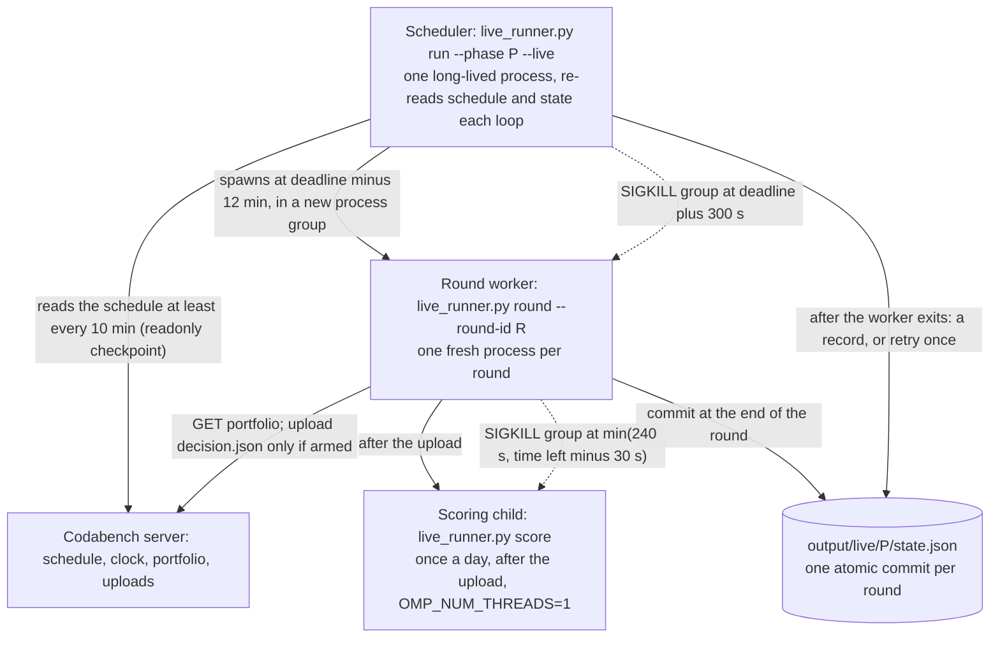
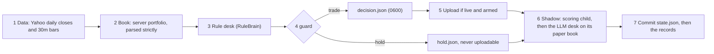
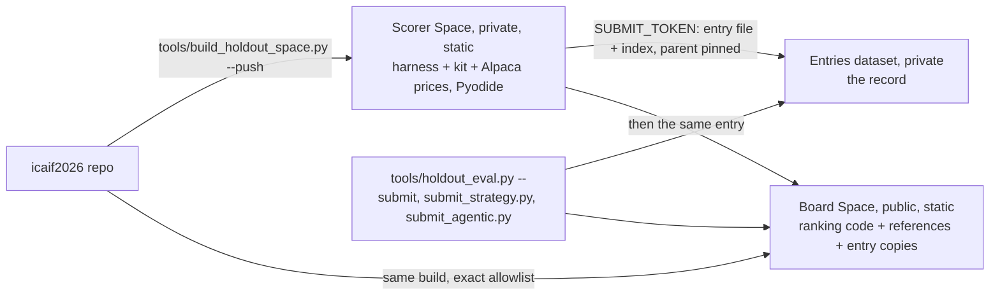

# Systems infrastructure: live runner, replays and the evaluation services

> Snapshot 2026-10-10, main @ 81dcfb5. Built, drilled and live: the runner went live for Validation on a GCP VM on 2026-10-09 (what it uploaded there is not in the repo), and desk v3 is not yet wired into it.

This is the engineering that lets an LLM desk decide under a hard deadline without ever being the reason a round goes wrong. Live, a scheduler on the organizers' clock spawns one killable process per round, submits the backtested rule's book through an owner-armed guard, runs the LLM desk afterwards as a shadow on its own paper book, and commits everything in one atomic write. A drill that SIGKILLs five workers mid-write over 28 rounds ends in the same state as an unbroken run (`reports/restart_drill.json`). Offline, the same desk code replays through a simulator that validates and scores with the organizers' own kit, behind point-in-time doors, with a content-addressed LLM cache, and a code-answered desk must equal its reference trade for trade (167 of 167 windows) before any LLM result is read (README "Portfolio memory"). Two HuggingFace Spaces serve evaluation: a private static scorer that runs the harness in the browser (Pyodide 0.29.5, within 1e-13 of native; commit 6e0a173) and a public leaderboard built from an exact allowlist. Key numbers: a round's decision is ready 2-13 s after the round starts, which live is 12 minutes before its deadline; the daily model's scoring took 14-138 s against a 240 s limit; a Gemini 2.5 Pro entry call takes a median 49 s (sources in the tables below).

## The pieces

| Piece | Code | What it guarantees |
| --- | --- | --- |
| Scheduler | [icaif/runner.py](../icaif/runner.py) `run_phase`; [tools/live_runner.py](../tools/live_runner.py) `run`, `rehearse` | Wakes each round on the server's clock and runs it in its own process; retries a dead worker once |
| Round | `runner.run_round`, `_round` | Data, book, rule, guard, file, upload, shadow, commit, in that order; every stage fails toward a hold |
| Watchdog | [icaif/watchdog.py](../icaif/watchdog.py) `run` | Kills a child's whole process group at its timeout |
| Arming and guard | `runner.arm_status`, `runner.guard`, `live_runner.cmd_arm` | Nothing uploads without the owner's scoped, expiring approval; a hold is never an uploadable file |
| Book | [icaif/portfolio.py](../icaif/portfolio.py) `parse`, `PaperBook` | The server's book read strictly or not at all; paper books fill through the backtest's own rule |
| State | `runner.State`, `runner.write_atomic` | One file, one commit per round; every file whole or as it was |
| Live inputs | [icaif/live.py](../icaif/live.py) | Completed, fresh bars or an exception; the decision row built as training built it |
| Kit | [icaif/kit.py](../icaif/kit.py), `starter-kit/kit/` | The organizers' validator and metric calculator, imported, never copied |
| TLS | [icaif/net.py](../icaif/net.py), `truststore` | HTTPS verified against the OS store behind the office proxy; verification never off |
| Simulator | [icaif/sim.py](../icaif/sim.py), [icaif/markets.py](../icaif/markets.py), `compiler.DailyPanel` | One ledger for backtest, paper and shadow; decisions see only what had ended by their deadline |
| LLM replay | [icaif/agents/brains.py](../icaif/agents/brains.py) `CachedBrain`; [tools/agent_replay.py](../tools/agent_replay.py), [tools/entry_replay.py](../tools/entry_replay.py) | A paid run repeats for free and offline; spend is estimated first and capped |
| Holdout harness | [icaif/holdout.py](../icaif/holdout.py), [icaif/suites.py](../icaif/suites.py), [tools/holdout_eval.py](../tools/holdout_eval.py) | Any agent's decisions file scored per window from cash, rejected or held as the backend would |
| Scorer Space | [space/](../space/), [tools/build_holdout_space.py](../tools/build_holdout_space.py) | The same harness in a browser, checked against the CLI before upload |
| Leaderboard | [icaif/leaderboard.py](../icaif/leaderboard.py), [icaif/ranking.py](../icaif/ranking.py), [board/](../board/), [icaif/space_hub.py](../icaif/space_hub.py), [icaif/boardrank.py](../icaif/boardrank.py), [icaif/replay_entry.py](../icaif/replay_entry.py) | Contest-rule ranks per window; every look at the holdout counted; agent entries carry model, calls and cost |

The contest itself (rounds, fee, caps, scoring) is in [00_contest_and_evaluation.md](00_contest_and_evaluation.md). The desks the runner hosts are in [07_three_level_hierarchy.md](07_three_level_hierarchy.md) and [08_agent_runtime_and_lineage.md](08_agent_runtime_and_lineage.md).

## The live runner

### Process model

Three kinds of process, each started by the one above it (`runner.run_phase`, `runner.score_in_child`, `watchdog.run`):



**Why a process per round, killed as a group.** On the owner's Mac, predicting LightGBM and then the FastAI net in one process deadlocked: torch's batch_norm waited forever in an OpenMP barrier, two OpenMP runtimes, 0% CPU and no error (docstrings of `watchdog.py` and `live.load_predictor`). A thread with a timeout returns, and the deadlocked thread keeps the process and the round waiting. A child process can be killed. `watchdog.run` starts it with `start_new_session=True` and, at the timeout, kills the whole group with `os.killpg(pid, SIGKILL)`, so a grandchild (a data loader's worker pool) cannot keep the deadlock alive. The defence is layered: torch held to one thread (`live.load_predictor`), `OMP_NUM_THREADS=1` in the scoring child's environment, the group kill, one retry in a fresh process ("the deadlock was a property of a process, not of the data", `score_in_child`), and scoring placed after the upload, so only the shadow ever waits on it.

**The scheduler re-reads everything each loop.** Each loop re-reads the schedule and `state.json`, so a scheduler stopped and started again resumes where the last commit left it (`tools/restart_drill.py` stops it twice). Only the set of rounds already retried lives in its memory. A second worker on the same phase is refused by an exclusive non-blocking `flock` on `output/live/<phase>/.lock` (`runner.phase_lock`): two would each read "not entered" and each upload an entry. The kit also locks its own checkpoint per process, so schedule reads use a separate `readonly-checkpoint.json` and never block a round's upload (`runner.kit_session`).

### The clock and the constants

The scheduler reads the organizers' schedule and the server clock's offset from ours (`runner.server_schedule`: `current_time` minus local time), writes both to `schedule.json`, and computes every wake on the server's clock. The worker reads the same snapshot, so its clock carries the same offset (`live_runner.cmd_round`). The kit's own `decision()` checks the window again on the server's clock at upload.

| Constant (code name) | Value | Where | What it is for |
| --- | --- | --- | --- |
| `Config.lead_s` | 720 s | `run_phase` | Wake 12 minutes before each deadline. The kit's own watch fired when a window opened, about 45 minutes early, on stale data (commit 3e72fe7) |
| Schedule re-read | at most every 600 s while waiting | `run_phase` | A cancelled round or a moved deadline is seen before the wake (`test_a_deadline_moved_by_the_organizers_is_seen_before_the_wake`) |
| `Config.upload_margin_s` | 45 s | `runner.upload` | No upload starts later than this before the deadline; the round records `too-late` |
| Worker timeout | (deadline minus now) + 300 s, at least 60 s; 3,600 s in a fast rehearsal | `run_phase` | A hung worker is killed and the next round still runs |
| Worker retry | once, while more than 240 s remain (always once in a fast rehearsal) | `run_phase` | A worker that died before recording its round runs again; after that the round is recorded `missed: the worker died` |
| `Config.scoring_timeout_s` | 240 s a try, capped at the time left minus 30 s; a second try only after a timeout; a try is skipped when that cap is under 20 s | `score_in_child` | Clears the slow honest run (82 s with live EDGAR on 2026-10-01) while a deadlock never finishes (comment on the field) |
| `Config.agent_budget_s` | 360 s | `_agent` | The LLM desk's round budget, further capped by time left |
| Role timeouts (`DeskConfig.timeouts`) | entry 240 s, review 120 s, event 120 s; under 5 s left means fallback | [icaif/agents/desk.py](../icaif/agents/desk.py) `_ask` | Each call gets min(its timeout, the round budget left) |
| Shadow reserve | 30 s before the deadline (agent mode: 45 + 60 s) | `_agent` | The shadow stops before the deadline; in agent mode the reserve leaves time to upload |
| Kit `result_timeout` | 90 s (the kit's default is 180 s) | `kit_session` | Receipt polling; the submission exists before polling starts, and a pending receipt is re-read at the next round 1 |
| `Config.shadow_cost_cap` | $10 a phase | `make_brain` | Spend cap; once spent, every role falls back to the rule |
| `runner.MIN_TURNOVER` | 0.005 | `guard` | Summed turnover below 0.5% is drift, not a decision |
| `compiler.HELD` | 1e-6 (the weight grid) | `guard` | A target equal to the book within the grid is a hold |
| Arm expiry | the phase's last `close_time` + 1 h | `cmd_arm` | An approval cannot outlive its phase |
| `runner.NEWS_NOW_S` | 1,800 s | `agent_inputs` | A round this close to its deadline on the wall clock archives the news feeds itself before the shadow decides |

On macOS the scheduler holds `caffeinate -ims -w <pid>` (`runner.keep_awake`); on Linux nothing is held. A closed lid on battery still sleeps: during the Oct 1 rehearsal the Mac slept until 26 minutes before round 1's wake (commit 6aa090d).

### One round, step by step

`run_round` takes the phase lock, loads `State`, and refuses to run a round that already has an upload (`uploaded`, `executed` or `ambiguous`: outcome `skipped`, recorded in `round.rerun.json` so the round's own `round.json` stays) or whose deadline has passed (`missed`). Then `_round`:



1. **Data.** `live.fetch_closes`: 1,200 calendar days of Yahoo daily bars for the 30 names (`CLOSE_HISTORY_DAYS`), anything dated after the last completed session dropped, every name required to have that session's bar, and at least 751 sessions (`qs.HISTORY_DAYS + 1`) or `LiveDataError`. `live.fetch_intraday`: Yahoo 30m bars over its `5d` period (`INTRADAY_PERIOD`), completed by now. A failure in closes is an error (no desk can answer); a failure in intraday is a warning (rounds 2-7 lose their trigger, not their book). The paper books' pending orders are then filled at the 30m opens they executed at (`PaperBook.settle`).
2. **Book.** Live: `session.portfolio(phase)`, saved raw as `portfolio_raw.json` (mode 0600), then `portfolio.parse`. Dry: the paper book of what earlier dry rounds "submitted". The book is valued at the latest close; a held name without a price makes the weights NaN, and the guard then refuses to trade (`Book.weights` sums with `skipna=False`, since pandas' default would value that name at zero). At a live round 1, a pending entry receipt is re-read (`refresh_entry`).
3. **Rule.** `live.market` builds a `sim.Market` over the live bars, and the backtested rule desk runs unchanged: `Desk(RuleBrain())`, which at the phase's first round 1 from cash buys risk parity at the regime-blended exposure, then holds (README "Live runner"; the rule is in [04_ou_process_and_quant_signals.md](04_ou_process_and_quant_signals.md)). The desk's state is carried between processes as JSON (`Desk.state`/`restore`, commit 0dec185): rebuilt from nothing it would re-enter a book it holds, tell the agent it is day 1 again, and refit the regime model later than the window it entered on.
4. **Choose and guard.** The fallback chain is the agent's book, then the rule's, then no submission. With `--submit rule` (the default, and Validation's) the agent is not asked before the upload. With `--submit agent` it is asked first, finishing 105 s before the deadline, and the rule's answer stands if it fails. The chosen target then passes `runner.guard` (below). A trade is written as `decision.json` through `live.envelope` and `live.check_decision`, which validates the serialized text parsed back with `Decimal`, as the backend parses it. A hold is written as `hold.json`.
5. **Upload.** Only when `--live`, the arm file matches, the session holds team credentials, and more than 45 s remain. Through the kit's own `decision()`.
6. **Shadow.** With `--submit rule`, the LLM desk runs after the upload on its own paper book, inside the time left minus 30 s: the scoring child first (once a day; later rounds reuse `scores/<day>/`), then each input loaded alone (`runner.agent_inputs`: scores, universe scores, context, earnings calendar, FOMC, 8-Ks, HAR forecasts, news), a missing input recorded and left out rather than dropping the round. A brain wrapped in `runner.Recording` keeps each call's role, payload, timeout, answer or error, and latency. If its trade passes the guard, it is ordered on the paper book. A crash is recorded, never raised: the submitted book is already out.
7. **Record.** Each desk's journal is told what became of its decision (`runner.journal_order`: dry-run, uploaded, paper, held, not armed), so a guard hold never reads next round as a fill that failed. Then the commit (below), `round.json`, `rounds.jsonl`, and `journal/<desk>.json`.

"Every stage fails toward silence" (`runner.py` docstring). A missed round holds the book (`starter-kit/docs/rules.md`), which costs at most a day of a book already chosen. An upload cannot be taken back: the first attributable attempt in a window consumes the slot even when invalid, and a re-submitted hold pays the fee on every name's drift.

### Arming

**Nothing uploads unless the owner armed it.** `--live` alone only reads (the schedule and the book). An upload also needs `starter-kit/.icaif/ARMED.json`, and only `live_runner.py arm` writes it (`cmd_arm`). It refuses unless stdin is a terminal ("approval is typed by the owner, not piped"), team credentials exist, the server's schedule lists the phase's rounds, and the server's portfolio parses. The owner must type the phase name back. The file (mode 0600) names one `phase`, one `submit` mode (`rule` or `agent`) and an `expires` time, plus `armed_at`, `host` and `user`. `runner.arm_status` checks all of it at every upload, so an approval for Validation's rule book is not one for Official or for the agent's book. `disarm` deletes it. The repo's rule binds agents too: never run `arm` for the owner (CLAUDE.md).

A dry run cannot upload by construction. Its `decision.json` carries the kit's placeholder credentials and a `dryrun-` round id (`live.envelope`), which the kit's client refuses locally. Rehearsal round ids are `<phase>-<day>-r<n>` under a phase no server knows (`runner.rehearsal_schedule`), so they cannot match a real round even before the prefix (`test_a_rehearsals_rounds_cannot_name_a_real_one`).

### The guard, and "entered means entered"

**A hold is never a file the kit can upload.** The kit uploads only a file named exactly `decision.json` (`original_client._read_submission`), and a hold is written as `hold.json`. The kit re-sizes every name to its target at the fill, so a hold uploaded as weights is a trade of every name's drift, fee and turnover rank included. `runner.guard(target, current, source, entered, book_all_cash, round_no, late_entry)` returns (upload?, why), in this order:

1. No target: hold.
2. The book cannot be valued (NaN): no trade, since nothing can be checked against it.
3. Every name within `HELD` of the book: hold.
4. From the rule: refused if the phase has entered, if the book holds shares, or at any round but 1 (unless `late_entry`). "The rule trades once a phase, at round 1 from cash; anything else from it is a bug."
5. Summed |target minus book| under `MIN_TURNOVER` (0.005): drift.
6. Otherwise: trade.

**Entered means entered** (`runner.entered`). The entry record counts if its status is one of `ENTERED` = (`dry-run`, `uploaded`, `executed`, `ambiguous`). Failing that, any held share counts: a lost state file must not read as a fresh phase over a book that holds 30 names (`test_a_lost_state_file_over_a_held_book_never_buys_the_entry_again`). Receipts are read conservatively (`runner.receipt_outcome`), because "a failure read as success costs a day in cash; a success read as a failure buys the whole entry a second time":

| Receipt | Read as |
| --- | --- |
| `status` MISSED_DEADLINE | failed |
| `status` SLOT_CONSUMED or DUPLICATE, or `selection_status` DUPLICATE | ambiguous (an attempt already holds the slot, perhaps ours from a crashed worker): entered |
| `validation_status` INVALID, LATE or MISSING; `selection_status` NOT_ELIGIBLE; `execution_status` HELD or EXECUTION_FAILED | failed: the next round 1 may enter again |
| `execution_status` EXECUTED | executed |
| anything else | uploaded (accepted, not yet executed): entered, re-read at the next round 1 |

The kit's `AmbiguousSubmission` is recorded as `ambiguous`. An `AutomationError` raised after the kit had already created the submission (its checkpoint holds a `submission_id`) is recorded as `uploaded`, not refused; one saying the operation "already has a different immutable file" is `ambiguous`.

**The upload is idempotent end to end.** `decision.json` is written once, whole, mode 0600 (it carries the team token). A retried worker re-uses an existing file byte for byte (`reused_file`), because the kit recovers an uncertain upload by the file's hash: it keys each operation `decision:<phase>:<round_id>` in its checkpoint, refuses a different file under the same key, and resolves an interrupted creation by matching the receipt's sha256, phase and file name (`original_client._submit`, `_reconcile`). The server adds the last layer: the earliest attributable attempt consumes the round, and later ones cannot replace it (`docs/rules.md`).

### The strict portfolio parser

The server's portfolio format is unpublished: the kit GETs `/api/v1/me/portfolio` and hands the response over untouched (`portfolio.py` docstring). A tolerant reader is the dangerous one, because a book misread as all cash looks like a fresh phase, and the rule's answer to a fresh phase is to buy the entry again over the book it holds. `portfolio.parse` accepts one declared shape: `{"cash": n, "positions": ..., "nav": n?, "as_of": ...?}`, optionally nested under `"portfolio"`, with positions as `{symbol: shares}`, `{symbol: {"shares": n}}` or `[{"symbol": s, "shares": n}]`. The few spellings it accepts are listed (`POSITION_KEYS`, `SHARES_KEYS`, `SYMBOL_KEYS`, `NAV_KEYS`), and two spellings present at once raise, since which one is meant is a guess. A symbol outside the 30, a duplicate, negative shares, a non-finite number, or cash below `MIN_CASH_SHARE` (-0.02) of the reported NAV ("not a fee") raises `PortfolioFormatError`, whose message names keys, never values. `portfolio.keys_only` prints the shape with every value blanked. Checked against the server on 2026-10-09: the Validation book parsed (cash 1,000,000, nothing held; commit 1b20e57). A book with positions has not been seen in the repo's record.

### Atomic commits and restarts

**One file, one commit.** `runner.State` holds the entry, every round's outcome, each desk's state and journal, both paper books (`submitted`, `agent`) and `spent_usd`, and `run_round` saves it once, at the end. A journal saved apart from the paper book it describes could survive a crash the book did not, and the next round would reconcile a fill that never happened (`State` docstring).

**Every file is written whole or not at all** (`runner.write_atomic`): a temp file beside the target with a fixed name, the final mode applied from creation, flush, `fsync`, `os.replace`, then an `fsync` of the directory so the rename survives a power cut. Before this, a worker killed while writing `decision.json` left a truncated file; the retry re-uses an existing file by design, the kit refuses a truncated one, and the entry would have gone unsubmitted for a day (commit 5ea123d). `rounds.jsonl` is rewritten whole each round; a torn line from an old append is dropped, and a committed round whose line is missing (its worker died between the commit and the index) gets one back from its `round.json` (`runner.index_round`). 8-K texts cached on disk are also written to a temp file and renamed, so a killed worker never leaves a truncated filing that later rounds read (`live.load_filings`).

**The restart drill** (`tools/restart_drill.py`; `reports/restart_drill.json`) replays Sep 25-30 2026 (4 sessions, 28 rounds) twice through the real scheduler in fast mode, each round in its own worker process, dry, with the rule as the shadow (no LLM), on one Yahoo snapshot fetched once so both runs see identical data:

| | Unbroken | Broken |
| --- | --- | --- |
| Worker processes | 28 | 31 (3 retries) |
| SIGKILLed halfway through a temp file | none | 5: the entry's `decision.json`, two `state.json` commits, a journal copy (`agent.json`), `rounds.jsonl` |
| Scheduler stopped and restarted | 0 | 2 (after 5 and after 17 rounds) |
| Outcomes | 27 holds, 1 dry-run entry | the same |
| Rounds indexed in `rounds.jsonl` | 28 | 28 |
| Each of 4 journals vs its paper ledger | 28 rounds, 1 fill, 30 names, 0 issues, 0 disagreements | the same |
| Seconds | 72 | 75 |

The committed states are equal (`same_state: true`, `differs_in: []`; 151 s in all). Three kills came before their round's commit, so those rounds ran again; two (the journal copy, `rounds.jsonl`) came after it, so the round stood and the next round's whole rewrite healed the file. SIGKILL runs no `finally` and flushes nothing, which is why the drill uses it.

### Late entry (Validation only)

On 2026-10-09 the runner started on the new GCP VM 70 s after Validation's last round-1 upload cutoff (18:39:15 IST, i.e. 45 s before the 09:10 ET deadline). The rule enters only at a round 1, so rounds 2-7 would all have held, and the first real upload, receipt and book read-back would have been Official's entry, "the one round that matters, tested for the first time live" (commit 81dcfb5). `--late-entry` (`Config.late_entry`) lets the rule enter from cash at the first round it sees, once: `DeskConfig.enter_any_round` lifts the desk's round-1 rule, `guard(late_entry=True)` lifts the guard's, and `runner.worker_argv` passes the flag to every worker. `Config.__post_init__` refuses it for any phase but Validation, so Official's entry rule cannot change. Default off; three tests cover it.

### Network: TLS, the office proxy and the VM

The office network runs a Netskope proxy that re-signs traffic to some hosts with a company CA. macOS trusts that CA; Python's bundled store does not, and Python 3.13's strict X.509 checks reject it (`icaif/net.py`). Three fixes, none of which turns verification off, because that "would also accept any other interceptor, silently":

- Our own HTTPS calls (the Gemini brain, Alpaca bars and news, the macro and news fetchers, the board reader) use `net.ssl_context()`, a `truststore` context that hands verification to the OS.
- The kit's client (httpx) verifies against certifi alone, so behind the proxy every portfolio read and upload failed as a bare "Network request failed". Registration on 2026-10-08 only went through a gitignored launcher that injected truststore first. Since commit 1b20e57, `tools/live_runner.py` calls `truststore.inject_into_ssl()` at import, which covers the scheduler, every worker and the scoring child, since each runs that file afresh. Off that network the OS store agrees with certifi and this changes nothing.
- `space_hub._api()` injects truststore before `huggingface_hub` calls. Netskope also blocks authenticated HF downloads (`/resolve` and `/raw` on private repos), which shaped the board's design below.

The kit discards 4xx response bodies ("HTTP 400; inspect..."); the first registration failure was only explained by an httpx response hook that printed the body (the owner's notes on kit TLS and errors).

**The VM.** The commits record that the live runner ran on "the new GCP VM" from 2026-10-09 (81dcfb5), that uv refused `requirements.txt` there until the pyarrow pin was fixed (e9c4644), and that the VM sits off the office network (1b20e57). Nothing else about it (machine type, OS, process supervision, how its data was synced) is in the repo. The commits do not say why the runner moved; the recorded risks a VM removes are the Mac's sleep (6aa090d) and the TODO's requirement that the machine "must not sleep" and "must not be alphaBT infrastructure".

### Credentials and environment

The runner reads `CODABENCH_TOKEN` and `ICAIF_PROFILE` (default `profiles/profile99-production.json`) from `starter-kit/.env` or the environment; the team credentials live in `starter-kit/.icaif/credentials.json`, a one-time token that is never reset (README "Credentials"). The default shadow model needs `GEMINI_API_KEY`; a Claude shadow needs `ANTHROPIC_API_KEY`. `SEC_USER_AGENT` enables live EDGAR reads; without it the 8-K and earnings inputs come from dated snapshots, flagged stale. A missing model key does not stop a round: `brains.credentials_problem` names it in the round's warnings, because every failed call falls back to the rule and would otherwise publish a shadow that "agrees with the rule" in every round.

### Evidence kept per round

Everything a round saw and decided stays under `output/live/<phase>/`. The tree below is the dry run of 2026-10-09 (`output/live/dryrun-20261009T042712/`), with the files that only a scheduler run or a live round adds marked:

```text
output/live/<phase>/
  .lock                          flock: one worker per phase
  state.json                     the commit: entry, rounds, desks (state, journal, log), paper books, spent_usd
  rounds.jsonl                   one line per round, rewritten whole
  schedule.json                  scheduler only: the schedule read, clock_offset_s, read_at, window_days
  runner.log                     scheduler only: wakes, starts, outcomes
  journal/rule.json, agent.json  each desk's journal, a copy for reading, written after the commit
  scores/<day>/                  the scoring child's archive: scores.parquet, scores_universe.parquet,
                                 features.parquet, prices_daily_universe.parquet, prices_context.parquet,
                                 earnings_events.parquet, scores_meta.json
  vol/<day>/                     har.parquet, har_meta.json (HAR forecasts, made once a day)
  filings/text/<accession>.txt   8-K texts from the last 24 h, read once, kept by accession (none on 2026-10-09)
  <round_id>/
    round.json                   the record: timings, closes, intraday, book, entered, rule, shadow (with its inputs),
                                 shadow_scores, submitted, outcome, warnings, errors
    decision.json or hold.json   0600 decision (live: carries the team token) or a hold the kit cannot upload
    shadow_calls.json            every LLM call: role, payload, timeout, answer or error, latency
    portfolio_raw.json           live only, 0600: the server's book as returned
    round.rerun.json             a rerun of a round that already had an upload
```

The Mac's `output/live/validation/` holds only `portfolio_raw_20261009T042703.json` from the `portfolio` check; the Validation rounds ran on the VM. Of all these files only a live `decision.json` carries the team token; a test requires that no journal or record does (`test_no_journal_or_record_holds_the_team_token`).

### Measured timings, and parity with the backtest

`round.json` timings are cumulative seconds from the round's start; `decision_ready` is when `decision.json` (or `hold.json`) had been written, before any upload.

| Run | Decision ready | Scoring | Round total | Source |
| --- | --- | --- | --- | --- |
| Dry round 1, no scoring (2026-10-01) | 2.2 s | none | 2.4 s inside the round; the README gives 2.7 s | `dryrun-20261001T053524`; README "Live runner" |
| Dry round 1, stale EDGAR snapshot (2026-10-01) | | 14.1 s | 20.5 s | `dryrun-20261001T053641`; README |
| Fast rehearsal of 2026-09-30, round 1 | 4.2 s | 16.0 s | 20.4 s; 7 workers in 36 s | `rehearsal-2026-09-30-fast`; commit 3e72fe7 |
| Real-time rehearsal 2026-10-01, round 1, live EDGAR | 13.0 s | 75.8 s | 89.0 s | `rehearsal-2026-10-01`; commit 6aa090d |
| Same day, rounds 2-7 (scores cached) | | cached | 1.45-3.13 s | `rehearsal-2026-10-01` |
| Dry round 1 on 2026-10-09 | 5.1 s | 138.1 s | 178.0 s | `dryrun-20261009T042712` |

In the Oct 1 rehearsal every round was ready 706.6-718.2 s before its deadline against a 720 s lead, and no round logged an error or a warning (commit 6aa090d). Scoring is the variable cost: asking EDGAR for each name's full history took 4m43s on 2026-10-01, so live scoring now asks only for recent filings and joins them to the last snapshot (1m22s that day, identical scores among the 30; commit 7943340). The Oct 9 dry run's 138 s is 58% of the 240 s limit.

**Parity.** On 7 past entry days (Oct 2025 to Sep 2026) the live rule on Yahoo closes and the research desk on Alpaca bars agree: gross within 0.0011, no single name more than 0.0016 apart, summed difference at most 0.015, including the turbulent 2025-10-13 (p = 0.78, gross 0.42) (README "Live runner"; commit 3e72fe7). The residue is Yahoo's official close against Alpaca's last 16:00 bar. I found no tool in the repo that reproduces this check.

## The replay and backtest harness

### One simulator for backtest, paper and shadow

`sim.run(strategy, market, start, n_days, sizing="pre_fee")` runs one contest-shaped window: a fresh $1M (`INITIAL_NAV`), `FEE_RATE` 0.001 of traded notional, fractional shares. A round's decision executes at that round's execution price, sized on NAV before the trade. A missing or invalid decision holds, with no trade and no fee. Period k ends at the next round's execution price, the last period at the final close, and drawdown sees the initial NAV, every period endpoint and every 16:00 close. `sizing="post_fee"` shrinks targets so the fee fits; which one the backend does was unconfirmed when written (`sim.py` docstring).

Two things are imported rather than reimplemented (`icaif/kit.py`): weights are validated through the kit's own contract (`kit.validate_weights`), so float dust such as `0.1 + 0.2` over the 0.30 cap shows in a backtest as an `invalid_rounds` hold, exactly as the backend would hold it; and metrics come from the kit's Decimal calculator (`kit.metrics`), so a backtest is scored by the number the leaderboard computes. `sim.rebalance` is the one trade function for the backtest and for every paper book (the dry run's stand-in for the server's book and the shadow's own), so a shadow's P&L differs from the submitted book's by its decisions, never by a second copy of the fee rule (`test_a_paper_fill_is_the_simulators_fill_to_the_cent`).

### The doors a decision sees through

A `sim.Market` holds `exec_prices` (execution time by ticker), `closes`, and `info_bars`. A strategy reaches prices only through doors cut at its deadline:

- `Market.history(as_of)` and `recent_closes(as_of, n)` serve bars whose `end` is at or before the deadline, by binary search on UTC nanoseconds. Filtering by `end`, not `start`, is the whole guard: a bar that started before the deadline but ends after it contains later prices.
- `Market.fill_prices(execution, as_of)` raises for an execution at or after `as_of`, so a journal cannot mark its book at a fill that has not happened.
- `compiler.DailyPanel.for_day(day, deadline)` serves daily values (model scores, vol) only for the day the deadline falls on and raises `LookAheadError` otherwise, because "an off-by-one in a date lookup reads as a very good model". `trailing` goes through the same door.

`markets.research_market("alpaca")` is the market strategies are scored on: Alpaca's 30m bars paired into the live 60m grid, fills at the :30 opens from 2016 (the organizers' vendor, 0 bps against their panel), information bars Alpaca then Yahoo 60m. Days where a price had to be stood in are listed as `degraded_days`, and windows touching one are skipped (`sim.market_from_public_60m`, `windows.window_starts`). Live, `live.market` builds the same `Market` type over Yahoo bars, so the rule desk and the shadow run the backtested `Desk` unchanged. Data sources and vendors are in [01_data_streams.md](01_data_streams.md).

`windows.run_field` runs a field of strategies per window and ranks it with `ranking.rank_window`, the contest's rules with ties averaged. `windows.rank_against_field` ranks one candidate against a precomputed field without re-simulating it, so near-copies from one sweep never crowd each other's ranks.

### LLM replays: cache, cost and deadlines

`tools/agent_replay.py` (desks v1, free, v2) and `tools/entry_replay.py` (v3 stage 1, [09_stage1_doe.md](09_stage1_doe.md)) share these mechanisms:

- **Estimate first.** A paid run prints its call count and dollar estimate and stops without `--yes`; `--offline` answers from the cache only. Before spending, `brains.credentials_problem` must pass, or "every call would fall back to the rule, and the replay would score the rule desk as the LLM's". `--max-calls` and the brain's `max_cost` stop calling once reached (checked under a lock before each call).
- **The cache.** `brains.CachedBrain` keys each answer by `sha256(json({brain, role, system, payload, schema}, sort_keys=True))`, where `schema` is the answer class's name and `brain` the brain's name: model and effort, plus a wire version for Gemini and Bedrock (`gemini:gemini-2.5-pro:high:wire1`; `ClaudeBrain` has none). So a change to the system prompt or the observation is a new key, never a stale answer. A schema edited under the same name is not: a cached answer it no longer accepts fails validation and counts as a fallback, and one it still accepts is served. When replays started passing the macro block (2026-10-06), cached answers given without it were re-asked rather than reused (README "Desk v2"). A failed call is never cached. Offline, a missing answer raises `BrainError`, which the desk counts as a fallback. Files are one JSON per answer under `output/agent/cache/` (824 files, 3.3 MB in the main checkout on 2026-10-10). The v3 worktree keeps its own cache.
- **Repeat keys.** `repeat=N` adds `"repeat": N` to the key, so the same question is asked fresh under its own keys. Stage 1's noise check uses it; reusing repeat 0's cache "would compare every answer with itself and report no noise at all". No brain sets a temperature (`brains.py`), so a fresh ask is a fresh sample: the cache, not the API, makes a replay reproducible.
- **Cost ledgers.** Each paid brain keeps a record per call (role, model, effort, request id, stop reason, latency, input, output, cache-read and cache-write tokens) and prices it from `brains.PRICES` (USD per million tokens; Gemini 2.5 Pro 1.25 in and 10.00 out, Flash 0.30 and 2.50). `brains.cost_by_role` splits the spend by role. Each run ends with one line per model, `<brain>: N calls, $X; cache hits H, misses M`, which `replay_entry.spend` parses into a board entry; a run with no such line is refused as unfinished.
- **Deadlines inside a chain.** v1 gives each role min(its timeout, the round budget left). v2 and v3 give each stage a slot that ends a fixed time after the chain starts (v3 `SLOTS`: analysts 180 s, PM 600 s, PM check 1,020 s; v2's run to 1,020 s too), with time a stage saves rolling forward. Analysts run in parallel on a `ThreadPoolExecutor`; a call already running is awaited `grace_s` (15 s) past its slot; a slot with under `min_call_s` (5 s) left is not asked; late, failed and invalid roles are skipped and counted ([icaif/agents/v2.py](../icaif/agents/v2.py)). These 17-minute chains do not fit the runner's 12-minute lead; the code comments plan an earlier wake for a live v2 or v3 entry, since its inputs are as of the prior close plus overnight news.

**Measured latency** of live (uncached) calls in the stage-1 entry runs, from `output/entry/*/chain.jsonl` in the owner's v3 worktree (calls over 0.5 s, i.e. not served from the cache; computed 2026-10-10 while round 2 of the design was still running):

| Role | Model, effort | Calls | Median | p90 | Max |
| --- | --- | --- | --- | --- | --- |
| PM entry | Gemini 2.5 Pro, high | 181 | 49.0 s | 59.1 s | 80.0 s |
| PM self-check | Gemini 2.5 Pro, high | 182 | 19.4 s | 42.1 s | 68.7 s |
| Analysts (market, earnings, news, quant) | Gemini 2.5 Flash, medium | 383 | 12.4 s | 23.6 s | 28.8 s |

Three PM calls failed and fell back: one HTTP 503 ("model is currently experiencing high demand") after 12.9 s, and two read timeouts at the PM's 600 s slot in a run whose directory is suffixed `.slept`. Earlier models were slower: Grok 4.7 took 40-235 s a call at high effort in the v1 runs (`v2.py` comment).

**Measured wall time and spend per window** (console logs `output/agent/<tag>.out`):

| Run | Desk and models | Calls | Spend | Wall time |
| --- | --- | --- | --- | --- |
| `v1_free_gemini_<date>`, the 4 official4 windows | v1 free desk, one call a morning, Pro high | 15 a window, 60 in all | $0.63-0.81 a window, $2.92 in all | 400-533 s a window |
| `v2_gemini_2026-04-13` | v2 chain, Flash medium quick roles, Pro high deep roles | 136 + 42 | $1.64 + $1.72 | 3,056 s |
| `v2_pro_2026-04-13_hardcaps` | v2 chain, Pro medium quick, Pro high deep | 137 + 44 | $5.51 + $1.91 | 4,035 s |
| `v2_pro_2026-04-13` (a rerun) | v2 chain | 12 paid, 165 from the cache | $0.53 | 269 s |

A replay is serial and latency-bound: windows run one after another in one process, and roles run one after another except the analysts of v2 and v3, which run in parallel.

### Equivalence gates

Before any LLM result is read, a desk answered entirely in code must trade exactly as the strategy it stands for, or "the desk's plumbing, not its judgement, is what any LLM result would measure" (`agent_replay.py` docstring). The run stops if it does not. `--ledgers-only` compares the two ledgers trade for trade in every window and checks the desk's journal against its own ledger (`journal.verify`: each fill to the cent, each held name's entry, cost and peak).

| Check | Windows | Result | Runtime | Source |
| --- | --- | --- | --- | --- |
| v1 rule desk (`RuleBrain`, every input, its journal) vs `q_riskparity_entry_regime` | 167 | 167 of 167, journal agrees in 167 | 142 s; 173 s after step 5; 185 s with the universe ranking | README "Portfolio memory", "News and profit booking", "Agent signals" |
| v2 desk on `v2.HoldBrain` vs `inv_vol_hold_75` | 167 | 167 of 167, journal included | 127 s | commit 3898df0 |
| v3 desk on code vs the inverse-vol hold at 75% and at a 30% sleeve | 22 stage-1 windows | all equal, journal agrees in each | not stated | commit d7224b7 |
| Journal memory size at every round (`tools/journal_report.py`) | 167 x 105 rounds | rule desk max 3,776 characters against a 6,000 bound | 234 s | `reports/journal_budget.json` |

### Process model for experiments

Tools run serially, in one process each, and separate arms run as separate processes one after another (`stage1_doe.md`). Process pools are avoided: on 2026-10-03 a `ProcessPoolExecutor` (spawn, 2 workers, each loading `markets.research_market()`) took 29 minutes for work one process did in 3 s, with memory and cores free, and the cause was not found (the owner's tooling notes). Parallel work is isolated by git worktree instead: a worktree symlinks `.venv`, `data`, `output/ag` and `output/preds` from the main checkout but keeps its own `output/`, so its replays and cache never write next to `output/live/` (the owner's worktree notes). Runs measured in minutes, and every paid run, are asked for before they start (CLAUDE.md).

## Evaluation services



### The holdout harness

`holdout.load_decisions` scores any agent's decisions, handed over as one JSON file: `{"strategy", "suite", "windows": {start: [{"round_id", "cash", "weights"}]}}`, one decision sequence per window, each the agent run from $1M cash at that window's first round, as the contest runs it (README "Holdout harness"; format and suites in [00_contest_and_evaluation.md](00_contest_and_evaluation.md)). Weights are parsed as `Decimal` from the JSON text and never snapped, since snapping would quietly fix the float dust the backend rejects. Two kinds of error are treated as the backend treats them:

- **Rejected before anything runs:** a missing window or a key that starts none, a round that does not exist or lies outside its window, a duplicate round, a wrong symbol set, cash more than 1e-9 from 1 minus the weights, the old one-run format (by name), or a file naming another suite. A systematic error is listed for the first 25 occurrences, then counted.
- **Held and listed:** a missing round, or a weight that breaks a rule. `--strict` makes them fatal.

A fixed suite (`official4`) raises rather than skipping a window on a degraded day or one the market lacks a session of, because skipping one of four would rank a different suite under the same name. A full file (11,445 decisions, 6.6 MB) scores natively in 1.8 s (commit 11f9d6b).

### The scorer Space

https://huggingface.co/spaces/MO-AI-Inv/icaif2026-holdout runs the same harness in the browser. It is a static Space because Gradio Spaces need a paid HF plan (HF answered 402; commit 6e0a173). The page fetches the harness and prices and posts them to a Web Worker ([space/worker.js](../space/worker.js)), which loads Pyodide 0.29.5 (Python 3.13, pandas 2.3.3, the repo's versions; the 314.x line moves to pandas 3.0, never tested), writes the files into Pyodide's filesystem and calls one entry point, `webapp.score` ([space/webapp.py](../space/webapp.py)). The page fetches rather than the worker because the worker's own requests reached HF without the viewer's login and got a 401 page. Prices ship as JSON, not CSV, because the office network blocks `.csv` downloads.

**The tzdata trap.** Pyodide must load `tzdata` too. Without it every `tz_localize` (twice a round, in `calendar.at`) retries a failed import that is never cached, and a score took 103 s instead of 2.7 s (commit 6e0a173; README says about 30x).

**What ships, and the checks before upload** (`tools/build_holdout_space.py`). The Space is an allowlist, not a copy of the repo, because `icaif/` is mostly strategy code and one stray import would carry it into the upload:

- 10 harness modules (`ICAIF_MODULES`: `__init__`, calendar, data, holdout, kit, leaderboard, ranking, sim, suites, windows), 5 kit files, 4 page files, and a price file of Alpaca fills and closes from 2025-12-01 on plus every fixed suite's windows session by session (236 days, README), nothing between them.
- `check`: in a subprocess with the repo off `sys.path`, import the harness from the built folder alone; fail if any `icaif` or `kit` module loaded from outside it, or any module outside the allowlist.
- `parity`: `price_file_problems` requires the shipped prices to be bit-identical to the full market's and every suite's windows on them to equal the full market's, session for session and round for round (a test fails the build on a price one ulp off). Then the page's entry point must score every suite as the CLI does to 1e-12, on a probe file that rebalances at rounds 1 and 4 with weights that differ by window, so a window scored with another's decisions would show.
- The references (cash, ew_hold, inv_vol_hold_75) are scored natively at build time, since `inv_vol_hold_75` reads information bars neither page ships.

Measured in the browser, page and CLI agree within 1e-13 on 1,224 values across two files, one deliberately messy (commit 6e0a173). The only step the build cannot check is Pyodide itself.

### The leaderboard Space and its record

https://huggingface.co/spaces/MO-AI-Inv/icaif2026-leaderboard is public and needs no login. It ranks entries the way the contest ranks a window, in every window of a suite, and orders them by mean Overall Rank Score (lower is better), with the SE divided by the count of windows that share no day (about 8 for the 109 holdout windows), because dividing by the overlapping count "would claim ~3.7x more precision than the data holds" (`leaderboard.standings`). It is re-ranked on every page load in the browser, since a stored rank goes stale when another entry arrives (`board/boardapp.py`). Metrics are rounded to 12 decimals before ranking so float dust does not split a tie the kit's Decimals would call.

- **Allowlist.** The board build ships exactly `BOARD_FILES` (the page, its README, the worker, `boardapp.py`, `icaif/__init__.py`, `ranking.py`, `leaderboard.py`, `suites.py`), the references and a manifest; any other file stops the deploy, because the board is public and Alpaca's prices and the kit are not ours to redistribute. `check_board` requires that importing `boardapp` loads exactly `icaif`, `icaif.leaderboard`, `icaif.ranking` and `icaif.suites`, and that every suite ranks its 3 references with nothing excluded.
- **Three repos, designed visibility** (`icaif/space_hub.py`): the scorer Space private (it carries prices, the kit and the submit token), the entries dataset `MO-AI-Inv/icaif2026-holdout-entries` private (the record), the board public. Entry writes check the designed visibility and refuse otherwise. A deploy goes through whatever a Space's visibility is and warns loudly when it differs, by the owner's decision of 2026-10-06 that visibility is set on HF, never by a deploy.
- **Submitting needs no sign-in.** A static page has no server to hold a secret, so the scorer writes with its `SUBMIT_TOKEN` Space variable, a fine-grained token meant to write only the dataset and the board; HF injects it into the page, and on a private Space only people who can open it can read it (commit 8eda8dd). The CLI path is `holdout_eval.py --submit`. Only a whole canonical suite at `pre_fee` sizing is accepted.
- **Concurrent submits cannot drop each other's entry.** A submit adds one entry file plus a rebuilt `entries/index.json` in one commit pinned to the parent it read (`parent_commit` in Python, `parentCommit` in the page). The index is rebuilt from the repo's file list, never downloaded and edited. A 409 or 412 means someone committed in between, and the write retries on the new head, up to 4 attempts. The dataset is written first, then the board; if the second fails, the entry is on record but not shown, and `build_holdout_space.py --sync` copies it across off the office network (the board's copy is the only one a page can read there).
- **Looks are counted.** Only a name's newest version ranks, but every version, old-format ones and agents included, is listed and counted, because every look at the holdout is a chance to tune against it.
- **Panels.** Four tabs: *Main board*; *Earnings season* (the official4 suite, by strategy or by window); *By window* (one window's whole field, sortable); *Agentic panel*. An agentic entry must carry `model`, `desk`, `calls`, `cost_usd` and `window_choice` (`leaderboard.AGENT_FIELDS`), and its row shows model, calls and cost. On the holdout it is ranked in each window it covers against the main field only, never against another agent, so adding one moves no other entry; on a fixed suite agents rank in the one field with the submissions and references.
- **Agent entries are checked against the board first** (`replay_entry.build_entry`, `tools/submit_agentic.py`). They refuse a missing or doubled suite window, runs of different desks or models, a run with no spend line, or a window whose `inv_vol_hold_75` differs from the board's reference by more than `boardrank.ANCHOR_TOL` (1e-9): the replay and the board price on separate snapshots, and a place against a field priced on other data still looks right. Only metrics and the run's description are published, never decisions or reasoning. The four v1 official4 runs combined cleanly: 60 calls, $2.92, 1 fallback (commit 269513d).

## Testing strategy

**Size.** 526 test functions (`grep "def test_"`) in 44 files under `tests/`, plus a helper (`tests/journal_world.py`) that runs a two-day dry phase in or out of process; 29 `@pytest.mark.parametrize` decorators multiply them. The 81dcfb5 message reports the full suite at 634 passing; it takes about 85 s (CLAUDE.md). It was not re-run for this document. Five files skip some tests when local data is absent (the organizer panel, an Alpaca snapshot, a membership snapshot). The largest files are `test_runner.py` (31), `test_v3.py` (28), `test_agents.py` (28), `test_holdout.py` (26), `test_leaderboard.py` (23) and `test_compiler.py` (23).

**Names are the failures they prevent**, with docstrings naming the silent bug: `test_a_lost_state_file_over_a_held_book_never_buys_the_entry_again`, `test_an_ambiguous_upload_counts_as_entered_so_the_next_round_one_cannot_buy_again`, `test_a_hanging_scorer_is_killed_and_the_submitted_book_is_already_out`, `test_a_grandchild_holding_the_hang_dies_with_its_parent`, `test_a_shipped_price_one_ulp_off_fails_the_build`.

| Kind | What it requires | Examples |
| --- | --- | --- |
| Point in time | Rewrite every later bar, score, filing or headline, and require what a decision saw to be unchanged; a grep for such names finds 25 tests in 20 files | `test_the_entry_observation_is_unchanged_when_every_later_bar_is_rewritten`, `test_the_journal_a_round_sees_is_unchanged_when_every_later_bar_and_fill_is_rewritten`, `test_a_bar_that_ends_after_the_deadline_is_invisible_to_the_decision`, `test_no_entry_payload_or_self_check_changes_when_every_later_bar_is_rewritten` |
| Equivalence | A code-answered desk trades exactly as its reference; a restored desk as one that never stopped; a paper fill as the simulator's | `test_a_rule_desk_trades_exactly_as_the_backtested_quant_candidate`, `test_a_v2_desk_answered_by_code_trades_exactly_as_the_hold`, `test_a_v3_desk_answered_by_code_trades_exactly_as_the_hold`, `test_a_desk_restored_before_every_round_trades_exactly_as_one_that_never_stopped` |
| Agreement with the organizers | The kit's calculator reproduces its own published example; the board ranks as the rules do; a template scores exactly as `ew_hold` | `test_the_kit_calculator_reproduces_its_own_published_example`, `test_the_board_ranks_each_window_exactly_as_the_contest_rules_do`, `test_an_equal_weight_hold_file_scores_exactly_as_the_ew_hold_reference` |
| Crash consistency | Kill mid-write in process and by SIGKILL in a real subprocess; the phase ends where an unbroken one does | `test_a_worker_killed_in_the_middle_of_a_write_leaves_the_last_commit_and_its_retry_matches_an_unbroken_run`, `test_a_worker_sigkilled_mid_write_in_its_own_process_recovers_on_retry`, `test_an_atomic_write_cut_short_leaves_the_old_file_whole` |
| The runner offline | A synthetic market, a fake kit session and a hand-moved clock | `test_the_scheduler_wakes_each_round_before_its_deadline_and_skips_a_cancelled_one`, `test_a_worker_that_dies_without_a_record_is_retried_once_then_marked_missed`, `test_two_workers_cannot_hold_one_phase_at_once` |

The runner is testable offline because everything a round touches outside its process is a door: `runner.Doors(now, closes, intraday, session, score, inputs, brain, book)`, and `run_phase(sleep=, spawn=, clock=)` for the scheduler. Tests replace them (`tests/test_runner.py`).

**Checks outside the suite** take minutes and write reports: the restart drill (151 s), the `--ledgers-only` gates (127-185 s), the journal budget (234 s), the data parity reports (`reports/data_parity.json`, `reports/alpaca_parity.json`; see [01_data_streams.md](01_data_streams.md)), and the scorer build's own parity checks.

## Environment and pins

[requirements.txt](../requirements.txt), for Python 3.13 (3.13.12 in the owner's venv):

| Package | Pin | Why |
| --- | --- | --- |
| pandas, numpy | 2.3.3, 2.3.5 | AutoGluon 1.5 pins both below 2.4; moving later would mean re-validating every number produced before |
| pyarrow | 20.0.0 | AutoGluon 1.5 needs pyarrow below 21, so every environment ran 20.0.0 while the file named 25.0.1; uv on the VM refused the file as unresolvable (commit e9c4644) |
| autogluon.tabular[all] | 1.5.0 | The daily ensemble; brings torch (2.9.1 installed) and lightgbm (4.6.0) |
| yfinance, httpx, truststore | 1.7.0, 0.28.1, 0.10.4 | Live data, HTTP, the OS trust store |
| scipy, scikit-learn | 1.16.3, 1.7.2 | The quant models; pinned so the dependency is stated, not inherited |
| anthropic, boto3 | 1.9.0, 1.43.102 | Claude and Bedrock brains, imported lazily |
| pytest | unpinned | |

`pydantic` (2.13.5 installed) and `huggingface_hub` (0.36.2) are imported directly but not pinned; they arrive as dependencies of other packages. The pages pin Pyodide 0.29.5 from cdn.jsdelivr.net.

## Contest-specific vs general

| Component | Contest-specific today | What generalizes |
| --- | --- | --- |
| Venue | Codabench kit client, `decision.json` envelope, team token, receipt fields (SLOT_CONSUMED, NOT_ELIGIBLE), validation and official phases | A venue adapter behind one door (`Doors.session`), with receipts mapped to entered or not and read conservatively |
| Schedule | 7 rounds a day at fixed ET times (`calendar.ROUNDS`), NYSE holidays and half-days, 12-minute lead, 45 s margin | Deadline-relative wakes on the venue's clock, schedule re-reads, a process per decision killed as a group |
| Rules | 30 names, 0.30 cap, `Decimal` check, 1e-6 grid, 0.1% fee, $1M, long-only | Validating through the venue's own contract before writing a file; one ledger function for backtest, paper and shadow |
| Governance | `ARMED.json` per phase and submit mode; Official's entry rule frozen | Scoped, expiring, typed human approval; hold as a non-uploadable file; a guard that only lets a real trade out |
| Desk | The rule's book submitted, the LLM as shadow; Gemini 2.5 only (`brains.ALLOWED_MODELS`) | Fallback chain agent, then rule, then nothing; a shadow on its own paper book with a spend cap |
| Scoring | Four-metric rank against a field, 15-session windows, holdout and official4 suites | Rank-based multi-window evaluation from cash per window, looks counted, an anchor check between scorers |
| Hosting | Static HF Spaces (no paid plan), Pyodide, Netskope workarounds | Allowlisted builds with import probes and bit-identical parity before upload |
| Reliability | One VM, no standby | Single-file atomic commits, SIGKILL drills, idempotent uploads by file hash |
| Testing | Organizer-panel parity, kit example | Point-in-time tests that rewrite the future; equivalence gates before any LLM result |

## Generalizing for the paper

The paper may use stronger models, more data, larger universes, several markets and other strategies. These are the changes, where they land, and what will break quietly if you skip them.

1. **Lift the model allow-list without losing the refusal.** `brains.ALLOWED_MODELS` gates `runner.Config` and `brains.make` because the contest names allowed models. For the paper, add brain classes and `PRICES` rows, but keep `make` refusing names it does not know: a typo otherwise becomes a stream of fallbacks that "agree with the rule". Keep the wire version in the brain's name (`GeminiBrain.WIRE`, `BedrockBrain.WIRE`), since a changed request format must change every cache key. Test each provider's constrained decoding against every answer schema first. Two failures seen here: Grok on Bedrock snapped bounded numbers to a bound (every weight came back 0.30), and Gemini refused schemas with capped text in lists of up to 30 objects ("too many states"), so `bedrock_schema` and `gemini_schema` move bounds or lengths into descriptions and pydantic enforces them. A larger universe makes the second worse.
2. **Make the cache safe for parallel runs, and complete its key.** `CachedBrain.decide` writes with `path.write_text`, not `write_atomic`, and nothing locks a key across processes (my reading of `brains.py`). One process per arm, serially, as today, is safe. A parallel sweep sharing a cache needs atomic writes. Put the schema's JSON, not only its class name, into the key, and give every brain a wire version, so a schema or request change can never be served an answer given under the old one. Store per-call token records too: as far as I can see they live only in the brain's memory and the run's console spend line, so per-call cost cannot be recomputed after the run.
3. **Choose replay windows per model.** Gemini 2.5's knowledge cutoff is January 2025, so stage 1 used only windows from February 2025 on (`v3.STAGE1`), and the replay tools' real-names mode is meant for post-cutoff windows only (`agent_replay.py --real-names`); otherwise windows are anonymised (codes, day numbers, returns; no ticker, date or price level). A stronger, newer model has a later cutoff: the Jan-Jun 2026 holdout and the official4 windows may sit inside its training data. Re-derive each model's post-cutoff windows, and use `tools/memory_probe.py` (`icaif/memprobe.py`) to test whether a model remembers a window's moves before trusting a result on it.
4. **Generalize the calendar and clock.** `calendar.TZ` is New York throughout (`runner.et` reads a naive time as ET), `calendar.ROUNDS` fixes 7 rounds, `live._NYSEHolidays` and `calendar.EARLY_CLOSES` are NYSE's. For several markets you need per-market sessions, holidays, half-days and time zones (a maintained exchange-calendar library would be a new dependency), and per-market fill rules. Daily or weekly rebalancing is more practical than hourly and keeps the same runner: `run_phase` is generic over schedule rows.
5. **Generalize the universe.** `data.load_universe()` (the 30 names), `portfolio.parse` ("position symbol outside the 30"), `weights.CAP` and the observation's per-name block all assume 30. The rule desk's observation is about 16,600 characters at the median for 30 names (README "Portfolio memory"); for hundreds of names the roles need per-role views or retrieval, and the 6,000-character journal bound needs rethinking.
6. **Generalize costs and fills.** `sim.FEE_RATE` is a flat 0.1%. A larger, less liquid universe needs spread and impact. Keep one `rebalance` for backtest and paper, so a shadow never carries a second copy of the fee rule.
7. **Replace the venue.** For paper trading at a broker, implement what the runner uses of the kit's session (`portfolio`, `decision`, `fetch`, `schedule`, the `creds` it checks before an upload, and the checkpoint `state` it reads after an error) and a parser as strict as `portfolio.parse`. Keep `receipt_outcome`'s asymmetry (a maybe counts as entered) and the immutable decision file.
8. **Keep the evaluation discipline.** One run per window from cash; rank against a stated field and report which; count looks at any holdout; check an anchor strategy between any two scorers (`boardrank.check_anchor`); require a code-answered agent to equal its reference before reading an LLM result.

**Pitfalls that look fine when they happen:**

- **Look-ahead.** Filter bars by end time, serve daily values only through a `DailyPanel`-style door, drop the in-progress bar (Yahoo serves today's partial bar during the session; `live.completed_only`), and never read a session still trading as its close (commit a714fd7). Train/serve skew counts too: `e_sessions_to_next` is NaN for every name live, which took the daily model's IC among the 30 from 0.021 to 0.012 on 2026 (`live.py` docstring). Add a test that rewrites the future for every new input.
- **Stale feeds.** A stale feed looks like a quiet market. `live.check_fresh` raises unless the latest bar is the last completed session, per symbol for context series.
- **Survivorship.** The 30 tradable names are fixed today's large caps, so a 2016-2026 backtest on them trades survivors. The daily model ranks a point-in-time S&P universe, but Yahoo no longer serves many names that left it (16 unpriced on 2026-10-01, takeovers and delistings, four of them renames; `live.fetch_inputs`). A larger universe needs point-in-time membership and delisted prices.
- **Vendor differences.** Yahoo's and Alpaca's :30 opens differ by a median 0, p95 2, p99 21 bps; a :30 fill guessed from the organizer's :00 grid errs by a median 11, p95 45 bps; the 09:30 open is vendor-dependent (README "Public feed vs organizer panel", "Alpaca is the organizer's vendor"). Run a parity report for every new vendor and market before trusting a fill.
- **Nondeterminism.** No temperature is set, so reruns are fresh samples. Report noise from repeat keys, and treat a gap between arms smaller than the gap between repeats as no finding (`v3_desk_plan.md`).

## Open questions and gaps

- **What Validation did live is not in the repo.** Receipts, the server's book after an entry, whether sizing is `pre_fee` or `post_fee`, and which print fills round 1 were all to be learned from Validation (README "Traps in the data", "Public feed vs organizer panel"). The evidence is on the VM under `output/live/validation/`, and as of 81dcfb5 no commit records it.
- **The portfolio shape has been seen only for an all-cash book** (commit 1b20e57). A book with positions could still raise `PortfolioFormatError`; by design that holds the round rather than misreading the book.
- **v3 is not wired into the runner.** The runner hosts the v1 `Desk`; commit d7224b7 lists "wiring v3 into the live runner" as left out, and v3's 17-minute chain needs an earlier wake than the 12-minute lead. How Official's Oct 12 entry runs v3 is not on main at 81dcfb5.
- **No standby host, no alerting.** The TODO's "standby host (the Deployment tab's hh:23 check)" is not built, and no code alerts on a missed round. `keep_awake` works only on macOS; how the VM's runner is supervised is not recorded.
- **Scoring time varies.** 76 s on Oct 1 and 138 s on Oct 9 against a 240 s limit; nothing in the repo explains the Oct 9 time.
- **Live token usage is not persisted.** `Recording` keeps payloads, answers and latencies; tokens survive only as `spent_usd` in `state.json` (my reading of `runner._agent`).
- **A late call may still be cached (unverified).** In v2 and v3 a call abandoned past its slot and grace keeps running in its thread; if it later succeeds, `CachedBrain` would store it, and an offline replay would then answer where the live run fell back. Worth a test before a paper cites replay reproducibility.
- **The process-pool slowdown is unexplained** (29 minutes against 3 s), so parallel sweeps are untested here.
- **The 7-day live-vs-research parity has no tool**; it is recorded only in the README and commit 3e72fe7.
- **Unpinned direct dependencies** (`pydantic`, `huggingface_hub`), and the scorer Space's actual visibility, which deploys only warn about, are not recorded.
