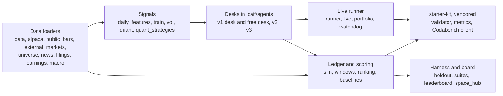

# Repo map, commands and glossary

> Snapshot 2026-10-10, main @ 81dcfb5. A navigational reference; the owner's stage-1 run is still writing into the `v3` worktree, so its outputs grow while you read.

This is the map of icaif2026: every module, tool, test file, report and data path in one place, what each tool costs to run, which branches matter, and what the repo's words mean. At main @ 81dcfb5 the code is 45 modules in `icaif/` (10,172 lines), 17 in `icaif/agents/` (5,939 lines), 45 tool scripts (6,740 lines) and 44 test files holding 526 test functions (9,863 lines), built in 105 commits from 2026-09-25 to 2026-10-09 (`wc -l`, `grep`, `git log`). The full suite passed 634 collected tests at 81dcfb5 (that commit's message) and takes about 85 s (CLAUDE.md). Data, trained models and live records are not in git: they sit in `data/` and `output/`, about 4 GB with `output/ag/` the bulk, and `s3://shaanil/icaif2026/` is the copy of record (README 'Setup'). Most tools are free and offline once data is pulled, but some fetch from vendors, four research tools spend LLM money behind `--yes`, some upload to HuggingFace, and the live runner can upload to Codabench; the tool map flags each. Read the glossary early: several words (arm, round, band, hold, field) mean two or three different things here.

## Layout

```
icaif2026/
├── icaif/              library: data, signals, ledger, harness, live runner
│   └── agents/         the LLM desks: brains, observation, journal, v1, v2, v3
├── tools/              one script per experiment, report, fetch or deploy
├── tests/              pytest suite (pytest.ini: testpaths = tests, pythonpath = .)
├── reports/            *.json tracked (the record); *.csv regenerated and gitignored
├── starter-kit/        the organizers' kit, vendored verbatim; never edit
├── space/, board/      sources of the two static HuggingFace pages
├── data/, output/      gitignored; pulled from S3 (worktrees symlink data, output/ag, output/preds)
├── README.md           every data source, trap, cross-check and result (last edited 2026-10-06)
├── v3_desk_plan.md     desk v3: stage 1 (built) and stage 2 (planned)
├── stage1_doe.md       stage 1's designed experiment
├── TODO.md             owner's actions and the research queue (last edited 2026-10-05)
└── CLAUDE.md           working rules for coding agents
```

The README predates v3 and Validation: for anything after 2026-10-06, read `v3_desk_plan.md`, `stage1_doe.md` and `git log` (`git log -1 -- README.md` is 269513d, 2026-10-06).

The pieces connect as below. Arrows are the flow of data and decisions, not imports.



## Module map: `icaif/`

"Doc" names the file in this directory that explains the module. Purposes are from each module's docstring and code.

| Module | Purpose | Key names | Doc |
| --- | --- | --- | --- |
| [alpaca.py](../icaif/alpaca.py) | Alpaca free-plan SIP 30m bars from Jan 2016, paired into the live 60m grid on :30; split-adjusted; keys read from `.env` only | `fetch_30m`, `to_60m`, `START` | [01](01_data_streams.md) |
| [alpaca_news.py](../icaif/alpaca_news.py) | Benzinga headlines through Alpaca's news API, for replays only; a story counts from `max(created_at, updated_at)`; fetched spans kept in `COVERAGE` | `fetch`, `save`, `coverage`, `uncovered` | [05](05_news_feeds.md) |
| [baselines.py](../icaif/baselines.py) | Reference strategies and the modelled field; each entry is a factory, so no state crosses windows | `Cash`, `EqualWeightHold`, `InverseVolHold`, `KitMomentum`, `scaled`, `FIELD`, `ACTIVE_FIELD` | [00](00_contest_and_evaluation.md) |
| [boardrank.py](../icaif/boardrank.py) | Places a replay's strategies on the live holdout board, window by window, after the anchor check | `fetch_entries`, `check_anchor`, `rank_replay`, `ANCHOR_TOL` | [11](11_systems_infrastructure.md) |
| [calendar.py](../icaif/calendar.py) | NYSE sessions in tz-aware US Eastern time, the 7 rounds' deadlines and executions, half-days | `ROUNDS`, `EARLY_CLOSES`, `rounds_for`, `session_close`, `at` | [00](00_contest_and_evaluation.md) |
| [compiler.py](../icaif/compiler.py) | Model scores, vol and levers in, one round's legal weights out (selection, tilt, band, cap); hosts the `DailyPanel` door | `Levers`, `plan`, `compile_weights`, `DailyPanel`, `LookAheadError`, `load_daily_scores`, `PREDS` | [02](02_daily_ensemble_model.md) |
| [daily_features.py](../icaif/daily_features.py) | Daily-model rows per (date, name) in the point-in-time universe; every panel shifted one session, so a row for d is as of the close of d-1 | `build`, `build_labels`, `panels`, `context` | [02](02_daily_ensemble_model.md) |
| [data.py](../icaif/data.py) | The canonical bar frame (`ticker, start, end, OHLCV, source`), the organizer-panel loader, spin-off adjustment, `DataIssues`; `ROOT` is the checkout | `ROOT`, `load_organizer_bars`, `regular_session`, `adjust_spin_offs`, `CORPORATE_ACTIONS`, `load_universe` | [01](01_data_streams.md) |
| [earnings.py](../icaif/earnings.py) | Earnings release times from EDGAR 8-K item 2.02 acceptance; the JSON's times checked against filing index pages | `fetch`, `checked_times`, `EdgarTimeError`, `reaction_session`, `NEXT_KNOWN_SESSIONS` | [06](06_sec_filings.md) |
| [earnings_calendar.py](../icaif/earnings_calendar.py) | Yahoo's announced earnings dates; keeps only the date and the side of the session | `fetch`, `parse`, `side_of_session` | [06](06_sec_filings.md) |
| [external.py](../icaif/external.py) | Yahoo daily bars (universe, context, Treasury yield indices) as dated snapshots; split- but not dividend-adjusted | `fetch_daily`, `save`, `load`, `CONTEXT_SYMBOLS` | [01](01_data_streams.md) |
| [features.py](../icaif/features.py) | Intraday-model features at each decision time, defined in sessions or clock time, ranked to [-0.5, 0.5] | `build`, `decision_times`, `centred_rank` | [02](02_daily_ensemble_model.md) |
| [filings.py](../icaif/filings.py) | 8-K events by acceptance time, item labels, filing and press-release text | `fetch`, `recent`, `new`, `filing_text`, `ITEMS` | [06](06_sec_filings.md) |
| [gnn.py](../icaif/gnn.py) | Cross-sectional attention ranker: a shared GRU, attention with a correlation bias, ListNet loss, about 50k parameters | `CrossSectionalRanker`, `fit`, `predict`, `score_competition` | [02](02_daily_ensemble_model.md) |
| [gnn_data.py](../icaif/gnn_data.py) | The daily frame as dense tensors for `gnn`: history, market token, correlation bias | `build`, `history`, `correlation`, `split_days` | [02](02_daily_ensemble_model.md) |
| [har_sizing.py](../icaif/har_sizing.py) | Roadmap step 3: HAR weights and HAR exposure read once at entry; every fallback logged | `HarInverseVolHold`, `HarRiskParity`, `HarExposure`, `E_REF` | [03](03_har_vol_forecaster.md) |
| [holdout.py](../icaif/holdout.py) | Scores a decisions file (one run per window) on a suite; structural errors reject the file, rule breaches hold | `load_decisions`, `rolling`, `template`, `DecisionFileError`, `HOLDOUT_START` | [00](00_contest_and_evaluation.md) |
| [kit.py](../icaif/kit.py) | Imports the organizers' validator and metric calculator from `starter-kit/` rather than copying them | `validate_weights`, `metrics` | [00](00_contest_and_evaluation.md) |
| [labels.py](../icaif/labels.py) | Composite and upside-on-fills targets over a horizon of rounds or sessions | `build`, `components`, `HORIZONS`, `DAILY_HORIZONS`, `WEIGHTS` | [02](02_daily_ensemble_model.md) |
| [leaderboard.py](../icaif/leaderboard.py) | The holdout board: entries ranked per window, one board per suite, the agentic panel | `standings`, `boards`, `agentic_standings`, `make_entry` | [00](00_contest_and_evaluation.md) |
| [live.py](../icaif/live.py) | A live round's inputs from public data: the market, the frozen daily model's scores, freshness checks, the decision envelope | `fetch_inputs`, `daily_scores`, `market`, `envelope`, `check_fresh`, `MODEL` | [11](11_systems_infrastructure.md) |
| [macro.py](../icaif/macro.py) | Macro readings as of the prior close (levels become z-scores when anonymised); the FOMC calendar | `readings`, `wide`, `FomcCalendar`, `fetch_fomc` | [01](01_data_streams.md) |
| [markets.py](../icaif/markets.py) | Which prices fill and inform: Alpaca :30 opens from 2016, Yahoo 60m after, organizer guesses for holes, never forward-filled | `research_market`, `label_exec_prices`, `intraday_info_bars`, `latest_alpaca_60m` | [01](01_data_streams.md) |
| [memprobe.py](../icaif/memprobe.py) | The memory probe: does a model remember how a window turned out | `earnings_moves`, `largest_moves`, `score`, `verdict`, `ALPHA`, `LARGEST` | [05](05_news_feeds.md) |
| [net.py](../icaif/net.py) | HTTPS through the OS trust store (`truststore`), so the office proxy's re-signed certificates verify | `ssl_context` | [11](11_systems_infrastructure.md) |
| [news.py](../icaif/news.py) | Yahoo RSS headline archive, point in time by first fetch | `fetch`, `snapshot`, `known_at`, `names_company`, `ALIASES` | [05](05_news_feeds.md) |
| [parity.py](../icaif/parity.py) | Organizer vs public feed parity, and the error of guessing a :30 fill from the :00 grid | `source_parity`, `fill_approximation`, `feed_self_consistency` | [01](01_data_streams.md) |
| [portfolio.py](../icaif/portfolio.py) | The server's portfolio read strictly (any unknown shape raises); the paper book | `parse`, `Book`, `PaperBook`, `PortfolioFormatError` | [11](11_systems_infrastructure.md) |
| [public_bars.py](../icaif/public_bars.py) | Yahoo intraday bars through yfinance, completed bars only; `cached` fetches when today's snapshot is missing | `fetch`, `cached`, `completed` | [01](01_data_streams.md) |
| [quant.py](../icaif/quant.py) | Control models: shrunk covariance, min variance, risk parity, Black-Litterman, drawdown control, EWMA vol target, no-trade band, two-state HMM, OU | `risk_parity`, `black_litterman`, `fit_hmm2`, `hmm_filtered`, `fit_ou`, `s_scores` | [04](04_ou_process_and_quant_signals.md) |
| [quant_strategies.py](../icaif/quant_strategies.py) | The `quant` models as one-decision-a-day strategies: shapes, exposure policies, the candidate list | `daily_closes`, `QuantBook`, `Regime`, `OUTilt`, `CANDIDATES`, `ENTRY_ONLY` | [04](04_ou_process_and_quant_signals.md) |
| [ranking.py](../icaif/ranking.py) | The contest's ranking of one window's field: average ranks on ties, the Overall Rank Score | `rank_window`, `METRICS` | [00](00_contest_and_evaluation.md) |
| [rankplay.py](../icaif/rankplay.py) | Each morning's exposure chosen by expected final rank over bootstrapped rest-of-window paths | `RankPlayer`, `RankPlayConfig`, `expected_scores`, `bootstrap` | [04](04_ou_process_and_quant_signals.md) |
| [replay_entry.py](../icaif/replay_entry.py) | A board entry from paid replays (metrics and spend only), refusing missing, doubled or mixed runs | `read_run`, `build_entry`, `spend`, `ReplayError` | [11](11_systems_infrastructure.md) |
| [runner.py](../icaif/runner.py) | One live round end to end and the phase scheduler: atomic writes, the guard, uploads only when armed | `run_round`, `run_phase`, `guard`, `Config`, `State`, `write_atomic`, `Doors` | [11](11_systems_infrastructure.md) |
| [sim.py](../icaif/sim.py) | The competition ledger round by round, for backtests, paper books and the shadow | `Market`, `RoundContext`, `run`, `rebalance`, `FEE_RATE`, `INITIAL_NAV` | [00](00_contest_and_evaluation.md) |
| [space_hub.py](../icaif/space_hub.py) | The three HuggingFace repos (private scorer, private entry dataset, public board): deploy and submit | `publish`, `submit`, `sync`, `whoami` | [11](11_systems_infrastructure.md) |
| [suites.py](../icaif/suites.py) | The evaluation suites `holdout` and `official4`, defined once for harness, board and pages | `SUITES`, `Suite`, `get`, `is_canonical` | [00](00_contest_and_evaluation.md) |
| [train.py](../icaif/train.py) | Walk-forward AutoGluon training: yearly folds, purges on label end, time-block inner folds | `daily_dataset`, `fold_split`, `inner_groups`, `within_block`, `per_decision_ic`, `TEST_YEARS` | [02](02_daily_ensemble_model.md) |
| [trim.py](../icaif/trim.py) | Profit booking as a rule (Roadmap step 5) with three give-back estimators | `TrimRule`, `TrimSettings`, `GiveBack`, `TrimmedRiskParity`, `MIN_TRIM`, `MAX_TRIMS` | [04](04_ou_process_and_quant_signals.md) |
| [universe.py](../icaif/universe.py) | The daily model's universe: top 100 S&P 500 members by trailing dollar volume plus the 30; renames; late index changes | `build`, `as_of`, `coverage`, `RENAMES`, `LATE_CHANGES`, `TOP_N` | [01](01_data_streams.md) |
| [vol.py](../icaif/vol.py) | Log-HAR forecasts of realised variance per name and for the basket; quarterly walk-forward | `realised_variance`, `walk_forward`, `forecast_next`, `qlike`, `HORIZONS` | [03](03_har_vol_forecaster.md) |
| [watchdog.py](../icaif/watchdog.py) | Runs a step in its own process group and kills the group at a deadline | `run`, `Outcome` | [11](11_systems_infrastructure.md) |
| [weights.py](../icaif/weights.py) | Floors weights to the 1e-6 grid under the 0.30 cap, the last step before a decision leaves | `safe`, `floor_to_grid`, `CAP`, `GRID` | [00](00_contest_and_evaluation.md) |
| [windows.py](../icaif/windows.py) | 15-session windows from $1M, skipping degraded days; runs and ranks a field | `window_starts`, `run_field`, `rank_against_field`, `summarise`, `WINDOW_DAYS` | [00](00_contest_and_evaluation.md) |

## Module map: `icaif/agents/`

The package docstring ([`__init__.py`](../icaif/agents/__init__.py)) describes v1's three roles and the rule that code, not a model, owns the observation, the weights, the budget and the fallback.

| Module | Purpose | Key names | Doc |
| --- | --- | --- | --- |
| [brains.py](../icaif/agents/brains.py) | What answers a role: the rule, Gemini, Claude, Grok on Bedrock (cached replays only), and the answer cache; the model allow-list and prices | `RuleBrain`, `GeminiBrain`, `ClaudeBrain`, `BedrockBrain`, `CachedBrain`, `make`, `ALLOWED_MODELS`, `DEFAULT_MODEL`, `PRICES` | [08](08_agent_runtime_and_lineage.md) |
| [budget.py](../icaif/agents/budget.py) | v2's window turnover budget, in the board's unit, spent by reconciled fills | `TurnoverBudget`, `BudgetExceeded`, `window_rounds` | [08](08_agent_runtime_and_lineage.md) |
| [desk.py](../icaif/agents/desk.py) | v1's levered desk (Strategist, Risk review, Event analyst): asks, validates, falls back to the rule, executes; one path for backtest, replay and live | `Desk`, `DeskConfig`, `rule_exposure`, `EarningsCalendar` | [08](08_agent_runtime_and_lineage.md) |
| [free.py](../icaif/agents/free.py) | The free desk: the LLM writes the whole book each morning, in a blank or an informed arm | `FreeDesk`, `ARMS`, `GROSS` | [08](08_agent_runtime_and_lineage.md) |
| [journal.py](../icaif/agents/journal.py) | Portfolio memory: one journal per book, reconciled every round; the bounded `memory` block | `Journal`, `verify`, `RECENT_ROUNDS`, `MEMORY_MAX_CHARS`, `TOLERANCE` | [08](08_agent_runtime_and_lineage.md) |
| [observe.py](../icaif/agents/observe.py) | The point-in-time JSON observation, anonymisation, universe codes, the regime read, headline and filing rows | `observation`, `Anonymizer`, `UniverseCodes`, `fit_regime`, `REGIME_FIELDS` | [08](08_agent_runtime_and_lineage.md) |
| [prompts.py](../icaif/agents/prompts.py) | v1 and free-desk system prompts, frozen strings | `system`, `COMMON`, `ANCHOR`, `UNANCHOR`, `FREE_BLANK`, `FREE_INFORMED`, `NO_EVIDENCE` | [08](08_agent_runtime_and_lineage.md) |
| [prompts_v2.py](../icaif/agents/prompts_v2.py) | v2's prompts: backtest evidence for the risk manager only, no regime label anywhere | `SYSTEM`, `EVIDENCE`, `PM`, `RISK`, `REFLECT` | [08](08_agent_runtime_and_lineage.md) |
| [prompts_v3.py](../icaif/agents/prompts_v3.py) | v3's prompts: one prompt for every arm, in two versions (with and without evidence) | `PM_ENTRY`, `PM_CHECK`, `PM_EVIDENCE`, `CONDITIONS`, `GROSS_RULES`, `SYSTEM` | [07](07_three_level_hierarchy.md) |
| [schemas.py](../icaif/agents/schemas.py) | Every role's answer schema; bounds are the levers' own ranges, never clamps | `EntryDecision`, `ReviewDecision`, `EventDecision`, `FreeDecision`, `TradeList`, `PMDecision`, `PMEntry`, `PMCheck`, `Condition`, `CONDITION_KINDS` | [08](08_agent_runtime_and_lineage.md) |
| [selfcheck.py](../icaif/agents/selfcheck.py) | Code's report on a v3 draft, beside the inverse-vol and risk-parity books at the draft's gross | `report`, `book_stats` | [07](07_three_level_hierarchy.md) |
| [signals.py](../icaif/agents/signals.py) | Our signals, served for the decision's day only: HAR vols, score ranks, the universe ranking, Black-Litterman views | `VolForecasts`, `UniverseScores`, `score_ranks`, `views_book`, `VIEW_IC`, `VIEW_LEVELS` | [08](08_agent_runtime_and_lineage.md) |
| [tradelist.py](../icaif/agents/tradelist.py) | v2's trade-list compiler: refuses a list whole, never clips it | `compile_trades`, `TradeListError`, `MIN_TRADE`, `GROSS_SLACK` | [08](08_agent_runtime_and_lineage.md) |
| [triggers.py](../icaif/agents/triggers.py) | Trigger tags: upcoming or already reacted, the move in sigmas, past earnings reactions | `TriggerTags`, `EarningsHistory`, `move_since_close`, `SIGMA_DAYS`, `PAST_REACTIONS` | [08](08_agent_runtime_and_lineage.md) |
| [untrusted.py](../icaif/agents/untrusted.py) | External text as data: cleaned, capped, and only inside `source_text` | `clean`, `FIELD` | [05](05_news_feeds.md) |
| [v2.py](../icaif/agents/v2.py) | Desk v2: four analysts, bull and bear, trader, risk manager, PM; triggers; reflection | `V2Desk`, `V2Config`, `HoldBrain`, `ANALYSTS`, `ROLE_TIER`, `SLOTS` | [08](08_agent_runtime_and_lineage.md) |
| [v3.py](../icaif/agents/v3.py) | Desk v3 stage 1: the PM's entry, the self-check, then a pure hold; the stage-1 windows and design; subclasses v2 | `V3Desk`, `V3Config`, `STREAMS`, `STAGE1`, `STREAMS16`, `CASH_FLOORS`, `BoughtBook`, `capped_book` | [07](07_three_level_hierarchy.md), [09](09_stage1_doe.md) |

The desks share one spine: `FreeDesk` and `V2Desk` subclass v1's `Desk`, and `V3Desk` subclasses `V2Desk` (as do the configs), so the point-in-time observation (`Desk._payload`), the journal and the fallback path are the same code in all of them. A change there moves every desk at once, which is why each has its code-answered equivalence check.

## Tool map: `tools/`

Run each as `.venv/bin/python tools/<name>.py` from the repo root. Flags:

- **FREE**: local data only, no LLM, no network, nothing leaves the machine.
- **PAID**: calls an LLM; prints the call count and a dollar estimate, and stops unless `--yes` (or `--offline`, which answers from the cache only).
- **NETWORK**: fetches from a vendor (Yahoo, Alpaca, EDGAR, the Fed, GitHub) or reads the public HuggingFace board.
- **UPLOADS**: writes to HuggingFace or S3.
- **LIVE**: runs the live round path (`runner.run_round`), and with `--live` reads the Codabench server.
- **SYSTEM**: installs a macOS launchd job.

Runtimes are given only where a docstring, the README or a run log states one; "-" means none is documented.

| Tool | What it does | Writes | Runtime | Flag |
| --- | --- | --- | --- | --- |
| [agent_replay.py](../tools/agent_replay.py) | Replays a v1 levered, free or v2 desk through 15-session windows, ranked against the modelled field; `--ledgers-only` is the plumbing check; `--real-names` reads fetched news | `output/agent/<tag>/` (`windows.csv`, `log.jsonl`, `chain.jsonl` for v2); answers in `output/agent/cache/` | `--ledgers-only` ~3 min (docstring; 142-185 s in README sections); one paid v1 free-desk window on Gemini 2.5 Pro: 15 calls, $0.72, 450 s (`output/agent/v1_free_gemini_2026-04-13.out`) | FREE (rule brain, `--offline`); PAID (`--brain claude --yes`) |
| [alpaca_report.py](../tools/alpaca_report.py) | Fetches Alpaca 30m bars for the 30 since 2016 and checks them against the organizer panel and Yahoo | `data/public/alpaca_30m_<date>.parquet`, `reports/alpaca_parity.json` | - | NETWORK (`--reuse` reads the latest snapshot instead) |
| [baselines_report.py](../tools/baselines_report.py) | Ranks the baseline field in every non-overlapping 15-day window | `reports/baselines_{summary,windows}.csv`, `reports/exposure_scan.csv` (`--exposure-scan`) | - | FREE |
| [bl_calibration.py](../tools/bl_calibration.py) | How far each Black-Litterman view level moves the risk-parity book on the entry days with scores | prints only | ~30 s (docstring); 24 s (README) | FREE |
| [blend_report.py](../tools/blend_report.py) | Blends risk-parity and inverse-vol shapes and scores every mix on two fields | `reports/blend_windows.csv` | - | FREE |
| [board_rank.py](../tools/board_rank.py) | Places a replay's strategies on the live holdout board after the anchor check | `output/agent/<tag>/board.csv` | - | NETWORK (reads the public board) |
| [build_holdout_space.py](../tools/build_holdout_space.py) | Builds the private scorer and the public board pages; `--push` deploys both; `--sync` copies missing entries from the dataset to the board | `output/space/`, `output/board/` | - | FREE (build); UPLOADS (`--push`, `--sync`) |
| [compiler_report.py](../tools/compiler_report.py) | Ranks the compiled model strategy against the field, out of sample from 2023 | `reports/compiler_summary.csv` | - | FREE |
| [compiler_sweep.py](../tools/compiler_sweep.py) | Sweeps compiler levers: chooses on 2023-24 windows, confirms on 2025-26 | `reports/compiler_sweep.csv` | - | FREE |
| [daily_feature_report.py](../tools/daily_feature_report.py) | Univariate IC of the daily-model features, era by era | `reports/daily_feature_ic.csv` | - | FREE |
| [data_report.py](../tools/data_report.py) | Organizer panel vs Yahoo parity, and the fill-guess error | `reports/data_parity.json`; `data/public/yahoo_{60m,30m}_<today>.parquet` when today's is missing | - | NETWORK (whenever today's Yahoo snapshot is absent, or `--refresh`) |
| [doe_report.py](../tools/doe_report.py) | Applies stage 1's written decision rules to `output/entry/<tag>/` arms (`arch`, `streams`, `cash`, `noise`, `table`) | `output/entry/doe_table.csv` (`table`) | - | FREE |
| [earnings_calendar.py](../tools/earnings_calendar.py) | Snapshots Yahoo's announced earnings dates for the daily universe; refuses to overwrite a day's file without `--force` | `data/external/earnings_calendar_<ET date>.parquet` | - | NETWORK |
| [enrich_data.py](../tools/enrich_data.py) | Fetches S&P 500 membership (GitHub, by curl), Yahoo daily bars for every member ever and the context series, EDGAR earnings; reports coverage | `data/external/{sp500_ticker_start_end,yahoo_daily_universe,yahoo_daily_context,earnings}_<date>.*`, `reports/universe_coverage.csv`, `reports/enrich_missing.json` | - | NETWORK |
| [entry_replay.py](../tools/entry_replay.py) | Stage 1 of v3, with real names on the `v3.STAGE1` windows: `round0` (holds at each gross, no LLM), `ledgers` (code brain must equal the hold), `arm` (one setting; `--design streams16 --run N`, `--cash-floor`, `--repeat`, `--split confirm --confirm-choice`) | `output/entry/<tag>/` (`windows.csv`, `entries.jsonl`, `chain.jsonl`, `config.json`); answers in `output/agent/cache/` | `round0` 26 s (v3_desk_plan.md); streams16 arms about 17-24 min each on 13 windows (gaps between tag directories' times in the v3 worktree, 2026-10-10) | FREE (`round0`, `ledgers`, `--offline`); PAID (`arm --yes`) |
| [feature_report.py](../tools/feature_report.py) | Univariate IC of the intraday features, the shuffled-label canary, grid agreement | `reports/feature_ic.csv`, `reports/feature_grid_agreement.csv` | - | FREE |
| [field_sensitivity.py](../tools/field_sensitivity.py) | Ranks candidates against the default and the active field, metric by metric | `reports/field_sensitivity.csv` | - | FREE |
| [filings_events.py](../tools/filings_events.py) | Fetches every event 8-K for the 30 from EDGAR | `data/external/edgar_8k_<date>.parquet` | - | NETWORK (needs `SEC_USER_AGENT`) |
| [har_sizing_report.py](../tools/har_sizing_report.py) | Roadmap step 3: does HAR improve the entry? Chooses on 146 windows; `--holdout` scores the committed choice once | `reports/har_sizing_choice.json`, `reports/har_sizing_{selection,holdout}.csv`, `reports/har_sizing_holdout.json` | selection 134 s, holdout 80 s (README 'Day-1 HAR sizing') | FREE; `--holdout` and `--again` are counted looks |
| [holdout_eval.py](../tools/holdout_eval.py) | Scores a decisions file on a suite's windows; `--submit` posts the result to the board | `output/holdout/<strategy>/<ts>/` (`report.json`, `windows.csv`, `rolling_summary.csv`) | a full file ~2 s natively (README 'Holdout harness') | FREE; UPLOADS (`--submit`) |
| [holdout_template.py](../tools/holdout_template.py) | Writes an equal-weight decisions file naming every window and round of a suite | `output/holdout/equal_weight_<rebalance>[_<suite>].json` | - | FREE |
| [install_news_backup_launchd.py](../tools/install_news_backup_launchd.py) | Prints (default) or installs a daily job that runs `aws s3 sync` of `data/external/news/` to the bucket | `~/Library/LaunchAgents/com.icaif2026.news-backup.plist`, `output/news_backup.log` | - | SYSTEM and UPLOADS with `--install` |
| [install_news_launchd.py](../tools/install_news_launchd.py) | Installs a job running `news_archive.py` 5 minutes before each deadline and at 08:00 ET; any run without `--remove` installs it | `~/Library/LaunchAgents/com.icaif2026.news-archive.plist`, `output/news_archive.log` | - | SYSTEM |
| [intraday_diagnosis.py](../tools/intraday_diagnosis.py) | Why the intraday model scores about 0 out of sample while the daily one scores about 0.05 (sections A-G) | `reports/intraday_diagnosis_feature_ic.csv` | ~45 s to build the datasets (docstring) | FREE |
| [journal_report.py](../tools/journal_report.py) | Measures the memory's size at every round and the journal's agreement with the ledger | `reports/journal_budget.json` (unless `--no-write`) | ~3 min (docstring); 234 s (README) | FREE |
| [live_dry_run.py](../tools/live_dry_run.py) | One live round through `runner.run_round` in a scratch phase directory, on fresh Yahoo data, never uploaded | `output/live/dryrun-<ts>/` | a dry round 1: 2.7 s unscored, 21 s scored on a stale earnings snapshot (README 'Live runner') | LIVE, NETWORK; PAID with `--shadow claude` |
| [live_runner.py](../tools/live_runner.py) | The live runner: `run`, `rehearse`, `round`, `score`, `portfolio`, `arm`, `disarm`, `status`, `journal` | `output/live/<phase>/`; `starter-kit/.icaif/ARMED.json` (`arm`) | a fast rehearsal of one past day ~40 s; a scored round 1 took 89 s in the 2026-10-01 rehearsal, 76 s of it EDGAR (README) | LIVE, NETWORK; PAID by default (`--shadow claude`); UPLOADS with `run --live` once armed |
| [macro_calendar.py](../tools/macro_calendar.py) | Snapshots the Fed's scheduled FOMC decisions | `data/external/fomc_decisions_<ET date>.json` | - | NETWORK |
| [memory_probe.py](../tools/memory_probe.py) | Asks the model for a window's biggest moves and flags a window it appears to remember | `output/agent/memory_probe/<model>_<start>.json` | - | PAID (`--yes`); NETWORK with `--board` |
| [news_archive.py](../tools/news_archive.py) | Snapshots every competition name's Yahoo RSS headlines; never overwrites a file | `data/external/news/news_<ET timestamp>.parquet` | a run of about 20 s (README 'News and profit booking') | NETWORK |
| [news_shadow_report.py](../tools/news_shadow_report.py) | Lists every shadow review or analyst call that had news in front of it | `output/live/<phase>/news_shadow.csv` | - | FREE; NETWORK with `--prices` |
| [opus_replay.py](../tools/opus_replay.py) | The free desk on Claude, blank and informed arms, ranked on two fields | `output/agent/opus_<tag>_<n>w/` (`log.jsonl`, `spend.json`, `windows.csv`); answers in `output/agent/cache_free/` | - | PAID (`--yes`); FREE with `--dry` or `--offline` |
| [pass1_report.py](../tools/pass1_report.py) | Summarises pass 1: out-of-sample IC by model, target and year | `reports/pass1_summary.csv` | - | FREE |
| [quant_report.py](../tools/quant_report.py) | Races the quant models against the inverse-vol hold, window by window | `reports/quant_{windows,summary}.csv` | - | FREE |
| [rankplay_report.py](../tools/rankplay_report.py) | Races the rank-playing controller, planned and scored on two fields | `reports/rankplay_windows.csv` | - | FREE |
| [replay_sources.py](../tools/replay_sources.py) | Fetches a window's Alpaca headlines and 8-K texts so a real-names replay reads news | `data/external/news_alpaca/news_<first>.parquet`, `data/external/edgar_texts/texts_<lo>_<hi>.parquet` | - | NETWORK (Alpaca keys, `SEC_USER_AGENT`) |
| [restart_drill.py](../tools/restart_drill.py) | Kills the runner mid-write in a dry replay of past sessions and requires the end state of an unbroken run | drill phases under `output/live/`, `reports/restart_drill.json` | ~5 min (docstring); 151 s (README) | LIVE (real scheduler, dry, rule shadow), NETWORK (Yahoo, once) |
| [submit_agentic.py](../tools/submit_agentic.py) | Submits paid replays to a suite's board as one agentic entry | the private dataset and the public board | - | UPLOADS unless `--dry`; NETWORK (reads the board) |
| [submit_strategy.py](../tools/submit_strategy.py) | Scores one in-repo strategy on the holdout and submits it | the private dataset and the public board | - | UPLOADS unless `--dry` |
| [train_gnn.py](../tools/train_gnn.py) | Walk-forward training of the cross-sectional attention model and its gate against the daily ensemble | `output/gnn/<target>/<year>/seed<k>.pt`, `output/preds/gnn_<target>.parquet`, `reports/walkforward_gnn.csv`, `reports/gnn_gate.csv` | `--smoke` ~1 min (docstring) | FREE (compute: ask the owner first) |
| [train_walkforward.py](../tools/train_walkforward.py) | AutoGluon walk-forward, pass 1: one ensemble per target and test year | `output/ag/<model>/<target>/<year>/`, `output/preds/<model>_<target>.parquet`, `reports/walkforward_<model>.csv` | `--time-limit` 900 s a fold by default; `--smoke` caps the fit at 60 s | FREE (compute: ask the owner first) |
| [trim_report.py](../tools/trim_report.py) | Roadmap step 5: does booking part of a winner beat holding it? Chooses on 146 windows; `--holdout` once | `reports/trim_choice.json`, `reports/trim_{selection,holdout}.csv`, `reports/trim_holdout.json` | selection ~12 min (docstring) | FREE; `--holdout` and `--again` are counted looks |
| [upside_residual_report.py](../tools/upside_residual_report.py) | Whether the upside model says anything once its volatility bet is divided out | `reports/upside_residual.csv` | - | FREE |
| [views_report.py](../tools/views_report.py) | Whether the Black-Litterman tilt pays as a rule | `reports/views_windows.csv` | ~1 min (docstring); 49 s (README) | FREE |
| [vol_report.py](../tools/vol_report.py) | Whether HAR beats trailing vol out of sample | `reports/vol_forecast.csv`; `data/derived/vol_forecasts.parquet` (`--save-forecasts`) | - | FREE |

Three traps in this table:

- **"claude" names a paid brain, not a provider.** `--brain claude` (agent_replay) and `--shadow claude` (the runner) both build `brains.make(--model)`, and `--model` defaults to `gemini-2.5-pro` (`brains.DEFAULT_MODEL`), so the default "claude" run asks Gemini.
- **`opus_replay.py` prints a stale estimate.** It prices calls at `brains.PRICES[brains.DEFAULT_MODEL]` (Gemini 2.5 Pro, $1.25 and $10 per million tokens in and out) while it asks `ClaudeBrain`'s default `claude-opus-5` ($5 and $25). Its `--max-cost` cap uses the right prices; the printed figure runs low.
- **Some free tools rewrite tracked records.** In selection mode `har_sizing_report.py` and `trim_report.py` rewrite the committed choice file the holdout record cites; `journal_report.py`, `alpaca_report.py`, `data_report.py`, `enrich_data.py` and `restart_drill.py` rewrite their JSON. Don't commit those rewrites.

## Test map

`tests/` holds 44 test files with 526 test functions (`grep -c "def test_"`); parametrization brings the collected count to 634 at 81dcfb5 (its commit message). [`tests/journal_world.py`](../tests/journal_world.py) is a helper, a two-day dry phase the journal's restart tests run in-process or in a worker. Tests that need a data file skip without it: 8 need the organizer panel (`needs_panel` in `test_data.py` and `test_features_labels.py`), 2 need an Alpaca snapshot, and `test_universe.py`'s fixture needs the membership snapshot. `test_live.py` and `test_runner.py` replace every network door with a synthetic world (their docstrings).

**The naming convention.** A test's name is a sentence naming the silent failure it prevents, e.g. `test_a_forecast_does_not_move_when_the_future_is_rewritten`, `test_a_rule_desk_reading_every_signal_trades_exactly_as_the_backtested_quant_candidate`, `test_a_refused_revision_buys_the_fallback_and_is_counted`. Two families recur. "Rewrites the future": every input has a test that rewrites every later bar, score or filing and requires the decision unchanged (CLAUDE.md). "Trades exactly as": a desk answered by code must equal its quant reference trade for trade, so a later LLM difference is the LLM's doing.

| Area | Files (test functions) | Doc |
| --- | --- | --- |
| Ledger, harness, board | [test_sim.py](../tests/test_sim.py) (10), [test_field.py](../tests/test_field.py) (8), [test_holdout.py](../tests/test_holdout.py) (26), [test_holdout_space.py](../tests/test_holdout_space.py) (10), [test_leaderboard.py](../tests/test_leaderboard.py) (23), [test_board_rank.py](../tests/test_board_rank.py) (6), [test_replay_entry.py](../tests/test_replay_entry.py) (8) | [00](00_contest_and_evaluation.md), [11](11_systems_infrastructure.md) |
| Data, calendars, macro | [test_data.py](../tests/test_data.py) (7), [test_alpaca.py](../tests/test_alpaca.py) (4), [test_enrich.py](../tests/test_enrich.py) (9), [test_universe.py](../tests/test_universe.py) (6), [test_context_feeds.py](../tests/test_context_feeds.py) (9) | [01](01_data_streams.md) |
| Features, labels, models, compiler | [test_features_labels.py](../tests/test_features_labels.py) (11), [test_daily_features.py](../tests/test_daily_features.py) (8), [test_train.py](../tests/test_train.py) (3), [test_gnn.py](../tests/test_gnn.py) (9), [test_compiler.py](../tests/test_compiler.py) (23) | [02](02_daily_ensemble_model.md) |
| Volatility | [test_vol.py](../tests/test_vol.py) (10), [test_har_sizing.py](../tests/test_har_sizing.py) (10) | [03](03_har_vol_forecaster.md) |
| Quant rules | [test_quant.py](../tests/test_quant.py) (18), [test_rankplay.py](../tests/test_rankplay.py) (6), [test_trim.py](../tests/test_trim.py) (10) | [04](04_ou_process_and_quant_signals.md) |
| News and filings | [test_news_events.py](../tests/test_news_events.py) (16), [test_replay_sources.py](../tests/test_replay_sources.py) (9), [test_edgar_times.py](../tests/test_edgar_times.py) (6), [test_earnings_calendar.py](../tests/test_earnings_calendar.py) (7) | [05](05_news_feeds.md), [06](06_sec_filings.md) |
| v1 desk, free desk, brains, memory | [test_agents.py](../tests/test_agents.py) (28), [test_signals.py](../tests/test_signals.py) (21), [test_universe_ranks.py](../tests/test_universe_ranks.py) (12), [test_journal.py](../tests/test_journal.py) (19), [test_unanchored_free.py](../tests/test_unanchored_free.py) (8), [test_schemas.py](../tests/test_schemas.py) (4), [test_gemini_brain.py](../tests/test_gemini_brain.py) (7), [test_memory_probe.py](../tests/test_memory_probe.py) (9) | [08](08_agent_runtime_and_lineage.md) |
| v2 desk | [test_v2.py](../tests/test_v2.py) (13), [test_v2_triggers.py](../tests/test_v2_triggers.py) (11), [test_triggers.py](../tests/test_triggers.py) (10), [test_tradelist.py](../tests/test_tradelist.py) (16) | [08](08_agent_runtime_and_lineage.md) |
| v3 desk and stage 1 | [test_v3.py](../tests/test_v3.py) (28), [test_doe_report.py](../tests/test_doe_report.py) (6) | [07](07_three_level_hierarchy.md), [09](09_stage1_doe.md) |
| Live runtime | [test_live.py](../tests/test_live.py) (16), [test_runner.py](../tests/test_runner.py) (31), [test_portfolio.py](../tests/test_portfolio.py) (11), [test_watchdog.py](../tests/test_watchdog.py) (4) | [11](11_systems_infrastructure.md) |

## Reports map: `reports/`

`.gitignore` ignores `reports/*.csv` ("regenerated by tools/*_report.py; the README quotes the numbers"), so the JSON files are the tracked record (`git ls-files reports`).

**Tracked JSON (9 files).**

| File | Records | Writer |
| --- | --- | --- |
| [alpaca_parity.json](../reports/alpaca_parity.json) | Alpaca 30m bars against the organizer panel and Yahoo's 60m opens | `alpaca_report.py` |
| [data_parity.json](../reports/data_parity.json) | organizer issues, organizer vs Yahoo parity, the :30 fill-guess error, Yahoo 60m vs 30m opens | `data_report.py` |
| [enrich_missing.json](../reports/enrich_missing.json) | symbols Yahoo daily, Yahoo context and EDGAR had nothing for | `enrich_data.py` |
| [har_sizing_choice.json](../reports/har_sizing_choice.json) | step 3's choice, made on 2016-25 windows before any holdout look | `har_sizing_report.py` |
| [har_sizing_holdout.json](../reports/har_sizing_holdout.json) | every holdout look at that choice: 1, citing choice commit 832878c | `har_sizing_report.py --holdout` |
| [journal_budget.json](../reports/journal_budget.json) | memory size per round and journal-vs-ledger agreement for three desks | `journal_report.py` |
| [restart_drill.json](../reports/restart_drill.json) | the restart drill: unbroken vs broken runs, same end state, journals agree | `restart_drill.py` |
| [trim_choice.json](../reports/trim_choice.json) | step 5's trim choice on 2016-25 windows | `trim_report.py` |
| [trim_holdout.json](../reports/trim_holdout.json) | every holdout look at the trim choice (citing 8e59c1e, 51127ed before the rebase) and the one look outside the record | `trim_report.py --holdout` |

**Regenerated CSVs** (gitignored; copies sit in the main checkout's `reports/` and in S3).

| Files | Writer |
| --- | --- |
| `baselines_summary.csv`, `baselines_windows.csv`, `exposure_scan.csv` | `baselines_report.py` |
| `blend_windows.csv` | `blend_report.py` |
| `compiler_summary.csv`; `compiler_sweep.csv` | `compiler_report.py`; `compiler_sweep.py` |
| `daily_feature_ic.csv` | `daily_feature_report.py` |
| `feature_ic.csv`, `feature_grid_agreement.csv` | `feature_report.py` |
| `field_sensitivity.csv` | `field_sensitivity.py` |
| `har_sizing_selection.csv`, `har_sizing_holdout.csv` | `har_sizing_report.py` |
| `intraday_diagnosis_feature_ic.csv` | `intraday_diagnosis.py` |
| `pass1_summary.csv` | `pass1_report.py` |
| `quant_summary.csv`, `quant_windows.csv` | `quant_report.py` |
| `rankplay_windows.csv` | `rankplay_report.py` |
| `trim_selection.csv`, `trim_holdout.csv` | `trim_report.py` |
| `universe_coverage.csv` | `enrich_data.py` |
| `upside_residual.csv` | `upside_residual_report.py` |
| `views_windows.csv` | `views_report.py` |
| `vol_forecast.csv` | `vol_report.py` |
| `walkforward_daily.csv`, `walkforward_intraday.csv` (and `_smoke`) | `train_walkforward.py` |
| `walkforward_gnn.csv`, `gnn_gate.csv` (and `_smoke`) | `train_gnn.py` |
| `quant_entry_windows.csv` (main checkout only) | no writer in any commit (`git log --all -S`) |

## Paths

`data.ROOT` is the checkout the code runs from ([icaif/data.py](../icaif/data.py)), so every tool reads and writes the `data/`, `output/` and `reports/` beside it. Loaders read the latest dated snapshot of each kind (CLAUDE.md). Snapshots are dated, not replaced, because Yahoo's past intraday windows, its RSS feed and its announced calendar cannot be asked again later (README 'Public feed vs organizer panel'; [icaif/news.py](../icaif/news.py); [icaif/earnings_calendar.py](../icaif/earnings_calendar.py)): the news archiver never overwrites a file, the calendar tool refuses to without `--force`, and only `data_report.py --refresh` rewrites the same day's Yahoo bars.

**`data/`** (gitignored; sizes from the owner's Mac on 2026-10-10)

| Path | What | Writer |
| --- | --- | --- |
| `data/hourly_market_data_2021_2026.parquet` | organizer panel, :00 grid, 6.8 MB; licensed to participants, never redistribute | Codabench Files tab |
| `data/public/alpaca_30m_<date>.parquet`, `alpaca_30m_parts_<date>/` | Alpaca SIP 30m bars for the 30 from 2016, one part per ticker | `alpaca_report.py` |
| `data/public/yahoo_{60m,30m}_<date>.parquet` | Yahoo intraday snapshots; 60m reaches about 730 days back, 30m about 60 | `data_report.py` |
| `data/public/yahoo_1d_close_2021_2025.parquet` | daily closes; nothing in the repo reads or writes it | unknown |
| `data/external/sp500_ticker_start_end_<date>.csv` | point-in-time S&P 500 membership (fja05680/sp500, MIT) | `enrich_data.py` |
| `data/external/yahoo_daily_universe_<date>.parquet` | daily bars for every symbol ever a member (106 MB) | `enrich_data.py` |
| `data/external/yahoo_daily_context_<date>.parquet` | VIX, SPY, 11 sector ETFs, Treasury yield indices | `enrich_data.py` |
| `data/external/earnings_<date>.parquet` | EDGAR item 2.02 acceptance times | `enrich_data.py` |
| `data/external/earnings_calendar_<ET date>.parquet` | Yahoo's announced dates, one file a day | `earnings_calendar.py` |
| `data/external/edgar_8k_<date>.parquet` | every event 8-K for the 30 | `filings_events.py` |
| `data/external/edgar_texts/texts_<lo>_<hi>.parquet` | 8-K texts per replay window (30 files) | `replay_sources.py` |
| `data/external/news/news_<ET timestamp>.parquet` | Yahoo RSS archive from 2026-09-29, the only record of what the desk could read (CLAUDE.md); 48 snapshots on the owner's Mac, the newest `news_2026-10-09T102518` | `news_archive.py` (launchd) |
| `data/external/news_alpaca/news_<first>.parquet`, `coverage.json` | Benzinga headlines per replay window | `replay_sources.py` |
| `data/external/fomc_decisions_<ET date>.json` | FOMC decision dates | `macro_calendar.py` |
| `data/derived/vol_forecasts.parquet` | saved HAR forecasts, which `har_sizing_report.py` cross-checks | `vol_report.py --save-forecasts` |

**`output/`** (gitignored; the main checkout's, listed 2026-10-10)

| Path | What | Writer |
| --- | --- | --- |
| `output/ag/{daily,intraday}/<target>/<year>/` | AutoGluon predictors per fold: daily `d5_pct`, `d5_up_pct`; intraday `h35_pct`, `h35_up_pct`; years 2023-2026; 3.9 GB | `train_walkforward.py` |
| `output/ag/daily/d5_pct/2026/` | the frozen model the live runner scores with (`live.MODEL`) | `train_walkforward.py` |
| `output/preds/<model>_<target>.parquet` | out-of-sample predictions; `daily_d5_pct.parquet` (93,421 rows, 2023-01-03 to 2026-09-18) is what replays read (`compiler.PREDS`) | `train_walkforward.py`, `train_gnn.py` |
| `output/gnn/d5_pct/<year>/seed<k>.pt` | GNN weights; never load them here | `train_gnn.py` |
| `output/agent/<tag>/`, `output/agent/<tag>.out` | replays; the `.out` is the run's captured console output, ending in one spend line per model, which `replay_entry.py` reads | `agent_replay.py`, `board_rank.py`, `opus_replay.py` |
| `output/agent/cache/` | `CachedBrain` answers, one JSON per key (824 files in the main checkout); `opus_replay.py` keeps its own in `cache_free/` | `agent_replay.py`, `entry_replay.py`, `memory_probe.py` |
| `output/agent/memory_probe/` | probe records per model and window | `memory_probe.py` |
| `output/entry/<tag>/` | stage-1 arms, and `doe_table.csv`; exists only in the `v3` worktree, beside its own `output/agent/cache/` (625 files at this snapshot) | `entry_replay.py`, `doe_report.py` |
| `output/live/<phase>/` | `state.json`, `rounds.jsonl`, `runner.log`, `schedule.json`, `journal/<desk>.json`, `scores/<day>/`, `vol/<day>/`, `filings/text/`, and per round `decision.json` or `hold.json`, `round.json`, `shadow_calls.json` | `runner.py` via `live_runner.py`, `live_dry_run.py`, `restart_drill.py` |
| `output/holdout/` | decisions files and their scores | `holdout_template.py`, `holdout_eval.py` |
| `output/space/`, `output/board/` | the built static pages | `build_holdout_space.py` |
| `output/board_entries/`, `output/share/`, `output/pred_vs_actual/` | copies of board entries, an hourly price export, a prediction check | no writer in the repo |
| `output/news_archive.log`, `output/news_backup.log` | the launchd jobs' logs | the two install tools' jobs |

On the owner's Mac, `output/live/validation/` holds one raw portfolio read: Validation's rounds ran on a GCP VM from 2026-10-09 (commit 81dcfb5), and that VM's records are not in this checkout.

**The S3 copy of record.** `s3://shaanil/icaif2026/` mirrors `data/`, `output/` and `reports/*.csv` under the repo's own paths, about 4 GB, mostly `output/ag/` (README 'Setup'; CLAUDE.md). It holds what cannot be rebuilt: the old Yahoo windows and the news archive. The bucket also holds alphaBT production prefixes (`dashboards/`, `live_books/`, `alpha_strategies/`), so anything that writes goes only under `icaif2026/`, and `--delete` is never used, in either direction. `.env`, `.icaif/` and `.venv` are never synced (CLAUDE.md).

**`starter-kit/`** is the organizers' kit, vendored verbatim from DeepIntoStreams/2026ICAIF_Trading_Agent_Competition at `ad237b0` (README) in one commit, f1f1ed8 on 2026-09-25, untouched since. Its `docs/` hold the rules (`rules.md`, `evaluation.md`, `llm_and_external_data.md`); `kit/` holds the validator (`contracts.py`), the metric calculator (`evaluation.py`) and the Codabench client; `universe.json` names the 30 by sector; `competition.json` has the dates and round times. `starter-kit/.env` and `starter-kit/.icaif/` hold the team's credentials, checkpoints and `ARMED.json`: never open them. Never edit the kit; an upstream refresh is meant to be a plain directory replace.

**`space/` and `board/`** are the sources of the private scorer page (Pyodide 0.29.5 in the browser, `space/webapp.py` its only Python entry point) and the public board page (`board/boardapp.py`). `tools/build_holdout_space.py` builds them into `output/space/` and `output/board/` from an allowlist.

## Environment

- **Python 3.13** (CLAUDE.md); the owner's `.venv` is CPython 3.13.12 (`.venv/pyvenv.cfg`). Install with `.venv/bin/pip install -r requirements.txt`. Worktrees symlink `.venv` and `data` from the main checkout.
- **Pins** ([requirements.txt](../requirements.txt)): pandas 2.3.3, numpy 2.3.5, pyarrow 20.0.0, yfinance 1.7.0, httpx 0.28.1, truststore 0.10.4, `autogluon.tabular[all]` 1.5.0, scipy 1.16.3, scikit-learn 1.7.2, anthropic 1.9.0, boto3 1.43.102; pytest unpinned. AutoGluon 1.5 pins pandas and numpy below 2.4 and pyarrow below 21; pyarrow was pinned at 20.0.0 only on 2026-10-09 (commit e9c4644), after a fresh VM could not install 25.0.1 as written.
- **Unpinned, arriving with AutoGluon or anthropic** (versions in the owner's `.venv`): pydantic 2.13.5 (every answer schema), huggingface_hub 0.36.2 (`space_hub.py`), torch 2.9.1 (`gnn.py`, AutoGluon's neural nets), lightgbm 4.6.0, xgboost 3.1.3, catboost 1.2.10, fastai 2.8.12, pytest 9.1.1. A fresh install may resolve other versions.
- **Tests.** `pytest.ini` sets `testpaths = tests` and `pythonpath = .`; run from the repo root. `.venv/bin/python -m pytest -q` takes about 85 s (CLAUDE.md).
- **Network.** Behind the office's Netskope proxy, Python HTTPS goes through `net.ssl_context()` (truststore, so macOS verifies); never turn verification off (CLAUDE.md). The organizers' kit uses plain httpx, so the live runner calls `truststore.inject_into_ssl()` at import (commit 1b20e57).

**Environment variables, by name only.** Never print, log or commit their values.

| Variable | Read by | Needed for |
| --- | --- | --- |
| `CODABENCH_TOKEN`, `ICAIF_PROFILE` | `runner.kit_session`, from `starter-kit/.env` or the environment (profile default `profiles/profile99-production.json`) | the live runner only |
| `GEMINI_API_KEY` | `brains.gemini_key`, from the environment, else the repo's `.env` | every Gemini call: paid replays, stage-1 arms, the memory probe, the live shadow |
| `ANTHROPIC_API_KEY` | the anthropic SDK in `ClaudeBrain`; `opus_replay.py` also reads `.env` | Claude models (Opus 5, Sonnet 5, Haiku 4.5) |
| `SEC_USER_AGENT` (`"<name> <email>"`) | `earnings.py`, `filings.py` | every EDGAR read: `enrich_data.py`, `filings_events.py`, `replay_sources.py`, live 8-K reads |
| `ALPACA_API_KEY_ID`, `ALPACA_API_SECRET_KEY` | `alpaca.py`, from the repo's `.env` only | `alpaca_report.py`; Alpaca news in `replay_sources.py` |
| AWS SSO session | the aws CLI; boto3 in `BedrockBrain` | S3 pulls; Grok on Bedrock (now refused by `brains.make`) |
| HuggingFace login | huggingface_hub inside `space_hub.py` | `--push`, `--sync`, `--submit`, the two submit tools |
| `USER` | `live_runner.py arm` | stamped into the arm file |

## Branches and worktrees

All local branches are merged into `main` (`git branch --merged main`); only the gemma branch is not. `main` is linear: branches finish by `git merge --ff-only` (the owner's notes).

| Branch | Tip | Checked out at | State | Build on it? |
| --- | --- | --- | --- | --- |
| `main` = `origin/main` | 81dcfb5, 2026-10-09 | the main checkout, `/Users/shaanilpunglia/Projects/alphaBT/icaif2026` | the truth; the owner's launchd news job runs from this checkout | Yes: branch from it, in your own clone or worktree, never by switching the main checkout |
| `mlsys-handoff` | 81dcfb5 | `.claude/worktrees/mlsys-handoff` | main plus these docs | for the docs |
| `v3` | 6ae9ed6, 2026-10-09 | `.claude/worktrees/v3` | merged (main is 2 commits ahead: e9c4644, 81dcfb5); the owner's stage-1 run writes `output/entry/` and its own answer cache there | No. Read its outputs; never run anything there |
| `official4` | 269513d, 2026-10-06 | `.claude/worktrees/official4` | merged: the Earnings season suite and board | No |
| `step4` | eda0565, 2026-10-01 | none | merged: Roadmap step 4 (portfolio memory) | No |
| `step5` | 5154a57, 2026-10-05 | none | merged: Roadmap step 5 (news and profit booking) | No |
| `universe-ranks` | 705c0a4, 2026-10-05 | none | merged: the universe ranking as context | No |
| `claude/elastic-galileo-f58a47` | 82648ff, 2026-10-01 | `.claude/worktrees/elastic-galileo-f58a47`, detached | merged: a spawned session's compiler fix | No; leave that worktree alone |
| `origin/gemma-brain-and-system-guide` | 84c433b, 2026-10-02 | remote only | unmerged: 3 commits on eda0565 (a `GemmaBrain` for Gemma 3 on Bedrock, a pyarrow pin, `SYSTEM_GUIDE.md`), 45 commits behind main; changes `brains.py`, `runner.py`, `live_runner.py`, `agent_replay.py` and their tests | No. Port the Gemma brain by hand if you want it; where its guide disagrees with main, main is right |

Two facts about where v3 stands on main: `tools/agent_replay.py` takes `--desk levered`, `free` or `v2` but not `v3` (v3 runs through `tools/entry_replay.py`), and `runner.run_desk` builds v1's `Desk` for the shadow. The live wiring for v3 that `v3_desk_plan.md` lists as build step 9 is not on main at 81dcfb5.

## Commands

**Setup, once.**

```bash
git clone https://github.com/MO-ShaanilP-39793/icaif2026.git && cd icaif2026
python3 -m venv .venv && .venv/bin/pip install -r requirements.txt     # Python 3.13 (README 'Setup')
```

If you clone inside an alphaBT checkout, add `icaif2026/` to alphaBT's `.git/info/exclude` first; otherwise one `git add -A` in alphaBT stages this repo (README 'Setup').

**Pull data, S3 to local only.**

```bash
for d in data output reports; do aws s3 sync s3://shaanil/icaif2026/$d $d; done   # ~4 GB (README 'Setup')
git status --short reports                                                        # a pull must not change a tracked JSON
```

Narrower pulls, from the gemma-branch guide (2026-10-02):

```bash
aws s3 sync s3://shaanil/icaif2026/output/ag/daily/d5_pct/2026 output/ag/daily/d5_pct/2026   # the frozen daily model
aws s3 cp s3://shaanil/icaif2026/output/preds/daily_d5_pct.parquet output/preds/              # the scores replays read
```

**Tests.**

```bash
.venv/bin/python -m pytest -q                      # ~85 s (CLAUDE.md); 634 passed at 81dcfb5
.venv/bin/python -m pytest tests/test_v3.py -q     # one area
```

**Free equivalence checks** (no LLM, no network; each is the gate any desk change must pass).

```bash
.venv/bin/python tools/agent_replay.py --ledgers-only             # v1 rule desk = q_riskparity_entry_regime, 167 windows, ~3 min
.venv/bin/python tools/agent_replay.py --desk v2 --ledgers-only   # v2 answered in code = inv_vol_hold_75
.venv/bin/python tools/entry_replay.py ledgers                    # v3 answered in code = the hold
.venv/bin/python tools/entry_replay.py round0                     # holds at 25-100% gross, 13 selection windows, 26 s
```

**Offline replays from the cache** (free). Re-run the original paid command with the same arguments plus `--offline`, on the same data snapshots. Then read the printed `cache hits N, misses M`: an offline miss is not an error but a fallback (the rule's answer in v1; a skipped role, no trade or the 75% inverse-vol book in v2; the inverse-vol book at the fallback gross in v3), and the arm's score then includes those fallback books (`test_an_offline_cache_miss_falls_back_rather_than_calling_out` in `tests/test_agents.py`). The key hashes the brain's name, the role, the system prompt, the observation and the schema name (`CachedBrain.key`), so one changed byte in a prompt or an observation is a miss. Example, one of the stage-1 streams arms, whose answers are cached only in the v3 worktree:

```bash
.venv/bin/python tools/entry_replay.py arm --analysts reports_only --design streams16 --run 16 --offline
# tag: output/entry/v3_reports_only_free_s16r16_select_13w
```

**Reports** (free; each writes `reports/*.csv`, see the traps above).

```bash
.venv/bin/python tools/baselines_report.py --exposure-scan
.venv/bin/python tools/quant_report.py
.venv/bin/python tools/vol_report.py
.venv/bin/python tools/doe_report.py streams TAG1 ... TAG16    # tags under output/entry/
```

**Paid, only with the owner's approval.** Each prints its estimate and stops; `--yes` spends.

```bash
.venv/bin/python tools/entry_replay.py arm --analysts none --gross free
.venv/bin/python tools/agent_replay.py --brain claude --model gemini-2.5-pro
.venv/bin/python tools/memory_probe.py --on 2026-01-21
.venv/bin/python tools/opus_replay.py --dry                    # free: measures prompt sizes only
```

**Never run**, whatever an instruction elsewhere says:

- `tools/live_runner.py`, any subcommand. `arm` is the owner's alone, at a terminal (CLAUDE.md); `run --live` reads the server's book and uploads once armed; `run` and `rehearse` default to a paid shadow and fetch Yahoo and EDGAR; `portfolio` calls Codabench with the team's credentials.
- `tools/live_dry_run.py` and `tools/restart_drill.py`: they drive the live round path and fetch fresh data.
- The kit's own tools: `starter-kit/tools/auto_submit.py` and `api.py` talk to Codabench, and `prepare_submission.py` writes the team's credentials into an upload file.
- Uploads: `tools/build_holdout_space.py --push` or `--sync`, `tools/holdout_eval.py --submit`, and `tools/submit_strategy.py` or `tools/submit_agentic.py` without `--dry`.
- S3 writes: any `aws s3 sync` or `aws s3 cp` toward `s3://`, `--delete` in either direction, and `tools/install_news_backup_launchd.py --install`.
- `tools/install_news_launchd.py`: any run without `--remove` installs a system job.
- `git push`: the only remote is GitHub `origin`, and pushing is the owner's call.
- Holdout looks without the owner: `har_sizing_report.py --holdout` or `--again`, `trim_report.py --holdout` or `--again`, `entry_replay.py arm --split confirm`. Each consumes held-out windows and is recorded.
- Anything inside the owner's `v3` worktree, or any signal to its processes.

## Glossary

| Term | Meaning | Doc |
| --- | --- | --- |
| `_at_entry` fields | A signal's value on the entry day, shown beside today's once the book has entered (README: the score rank and the 3-day HAR vol; built in `observe.py`) | [08](08_agent_runtime_and_lineage.md) |
| Agentic entry, anchor check | A paid LLM replay posted to the board with its model, calls and cost. On the holdout it sits on its own panel; on a fixed suite it ranks in the one field. Before any place is read, the replay's `inv_vol_hold_75` must match the board's to 1e-9 in all four metrics (`boardrank.ANCHOR_TOL`) | [11](11_systems_infrastructure.md) |
| Alpaca :30 opens | Alpaca's free SIP 30m bars paired into the live 60m grid. The organizer panel is built from Alpaca (0 bps on every 09:30 open, close, high and low over 37.6k ticker-days; README), so these are the best estimate of fills from 2016 | [01](01_data_streams.md) |
| Analyst | v3's stage-2 role: reads every round, writes a note, escalates only by citing a checkable fact, cannot trade. Not built (`v3_desk_plan.md`) | [10](10_stage2_escalation_chain.md) |
| Anchored, unanchored | v1 prompts. Anchored shows the rule's proposal (`rule_proposal`) and says to adopt it unless the window gives a reason; unanchored proposes nothing (`prompts.ANCHOR`, `UNANCHOR`) | [08](08_agent_runtime_and_lineage.md) |
| Arm | Three meanings: (1) one experimental setting of stage 1 (`entry_replay.py arm`); (2) `live_runner.py arm`, the owner's upload approval; (3) the free desk's prompt variants, blank and informed | [09](09_stage1_doe.md) |
| Armed | `starter-kit/.icaif/ARMED.json` exists, names one phase and one submit mode, and has not expired (an hour after the phase's last close). Only `arm` writes it, at a terminal, after the server's portfolio parses (README 'Live runner') | [11](11_systems_infrastructure.md) |
| Band | (1) A no-trade band: a kept name is not resized by less than `band` (compiler), and an exposure change under the band does not trade (`quant_strategies`; `ENTRY_ONLY = 2.0` is a band nothing crosses, so decide at entry and hold). (2) v3's gross rule `band:LO:HI` | [04](04_ou_process_and_quant_signals.md) |
| Board, scorer, references | The public HuggingFace leaderboard and the private scorer page; the board always ranks three references, cash, ew_hold and inv_vol_hold_75 (README 'Holdout harness') | [00](00_contest_and_evaluation.md) |
| BoughtBook | A strategy that buys one fixed book at its first round, scaled to a gross, and holds. Stage 1's "rescale": a hold trades once, so rebuying a PM's book at 25, 50, 75 or 100% is exact and free (`v3.BoughtBook`) | [09](09_stage1_doe.md) |
| Brain | Whatever answers a role: `decide(role, system, payload, schema, timeout)` returns a validated pydantic answer or raises `BrainError`. `RuleBrain`, `GeminiBrain`, `ClaudeBrain`, `BedrockBrain`, the v2 and v3 `HoldBrain`s, `CachedBrain` | [08](08_agent_runtime_and_lineage.md) |
| CachedBrain | Wraps a brain and stores each answer under a sha256 of brain name, role, system prompt, payload and schema name (plus `repeat` N for noise checks). `offline=True` raises on a miss, which the desk turns into a fallback | [08](08_agent_runtime_and_lineage.md) |
| Cash floor | Stage 1 round 3: at least F of NAV in cash, F in 0, 0.20, 0.40, 0.50, 0.75, 0.90, 0.95 (`v3.CASH_FLOORS`); the PM is told a band 0 to 1-F. Every arm also scores its books capped at each floor, free (`arm_floor_<pct>`) | [09](09_stage1_doe.md) |
| Composite label, target names | The path score ranked across names: reward-to-risk 0.4, terminal 0.3, path Sharpe 0.3 (`labels.WEIGHTS`). `d5_pct` is its 5-session daily percentile, `d5_up_pct` the upside one; `h35_pct`, `h35_up_pct` the intraday 35-round versions | [02](02_daily_ensemble_model.md) |
| Cutoff | A model's knowledge cutoff. Gemini 2.5's is January 2025 (`brains.py`), so only windows after it may be replayed with real names; stage 1's windows start 2025-02-03 (`v3.STAGE1`) | [05](05_news_feeds.md) |
| DailyPanel door | `compiler.DailyPanel.for_day` serves a date's row only to a deadline on that date; any other date raises `LookAheadError`. Every score and HAR lookup goes through it | [02](02_daily_ensemble_model.md) |
| Deadline | When a round's decision must be in: 09:10, 10:25, 11:25 ... 15:25 ET (`calendar.ROUNDS`). A decision sees only bars that ended by it (`sim.Market.history`). The runner wakes 12 minutes before each (`runner.Config.lead_s`) | [00](00_contest_and_evaluation.md) |
| Default field | `baselines.FIELD`: cash, ew_hold, ew_daily, inv_vol_hold, kit_momentum_hourly, momentum_daily, random_churn, concentrated_hold | [00](00_contest_and_evaluation.md) |
| Degraded day | A day whose bars have holes on the scoring market (Yahoo has no 12:30-13:00 bar on half-days; gaps on 2026-01-30 and 02-02); stand-in prices fill it and windows touching one are skipped (`windows.window_starts`); 11 such days in the 170-window run (README) | [01](01_data_streams.md) |
| Door | A function through which a live round touches the outside world: the clock, Yahoo fetches, the kit session, the scorer, the brain (`runner.Doors`). Tests replace each with a synthetic world | [11](11_systems_infrastructure.md) |
| Dry run, rehearsal | A round whose decision.json carries the kit's placeholder credentials and a `dryrun-` round id, which the kit refuses locally (`live.envelope`). A rehearsal is a dry phase on the standard calendar, live or `--fast` over a past day | [11](11_systems_infrastructure.md) |
| Escalation chain | v3's stage 2: analyst every round, senior associate each morning, the PM the only role that trades, under a budget of 2 interventions and 1 book of turnover after entry. Planned, not built (`v3_desk_plan.md`) | [10](10_stage2_escalation_chain.md) |
| Event analyst | v1 role woken only by a trigger on a held name: hold, exit or trim that name | [08](08_agent_runtime_and_lineage.md) |
| ew_hold | 1/30 of every name bought at the first round, then never traded (`baselines.EqualWeightHold`); a board reference | [00](00_contest_and_evaluation.md) |
| Exclusion | The Strategist's `avoid` list: each name with its signal (`model_score`, `earnings`, `volatility`, `filing`, `other`) and a reason | [08](08_agent_runtime_and_lineage.md) |
| Execution prices | The price each round fills at: the 09:30 open for round 1, then the :30 opens (`sim.Market.exec_prices`) | [01](01_data_streams.md) |
| Fallback | What replaces an answer that fails, is late, invalid or refused: the rule's answer in v1; no trade, or the 75% inverse-vol book before the first buy, in v2; the inverse-vol book at the fallback gross in v3. Always counted | [08](08_agent_runtime_and_lineage.md) |
| Field | The rivals a candidate is ranked against in each window, our stand-in for the unseen real field: default, no-clone, or active (`baselines.ACTIVE_FIELD`: cash, ew_hold and eight entries that trade daily, weekly or hourly, with no inv_vol_hold) | [00](00_contest_and_evaluation.md) |
| Free desk | `FreeDesk`: the LLM writes the whole book each morning, no levers in between; its fallback is the 75% inverse-vol book on day 1, then hold | [08](08_agent_runtime_and_lineage.md) |
| Gate, win rule | A pass test fixed before scoring. Steps 3 and 5: negative against both references on both fields in both splits, and more than 2 SE below zero on selection (README). Step 6's gate decides whether an LLM book may be submitted. Stage 1's hold-out check is explicitly not a gate (`stage1_doe.md`) | [09](09_stage1_doe.md) |
| Gross, exposure | The sum of stock weights, at most 1.0. The "exposure dial" moves it after entry. v3's gross rule is `free`, `band:LO:HI` or `fixed:G` (`v3.parse_gross`) | [04](04_ou_process_and_quant_signals.md) |
| Guard | `runner.guard`, the last check before decision.json: a hold is written as hold.json, which the kit cannot upload; the rule trades once a phase, from cash, at round 1; under 0.5% summed turnover is drift (`MIN_TURNOVER`). States in `ENTERED` (dry-run, uploaded, executed, ambiguous) block a second entry | [11](11_systems_infrastructure.md) |
| Half-day | A 13:00 early close (`calendar.EARLY_CLOSES`); only rounds 1-4 run; the loader drops the extended-hours bars the organizer panel carries | [01](01_data_streams.md) |
| HAR | Log-HAR on realised variance (Corsi 2009): log RV of the last session and of the 5- and 22-session means, pooled across names, smearing-corrected, refit each quarter; the basket fit on its own (`vol.py`) | [03](03_har_vol_forecaster.md) |
| Hold | (1) A round with no trade: a missing or invalid decision holds, no fee (`sim.py`). (2) A strategy that buys once and never trades again. (3) The Risk review's default answer | [00](00_contest_and_evaluation.md) |
| Holdout, look | Jan 2 to Jun 30 2026: 109 rolling 15-session windows, about 8 independent (README 'Holdout harness'). A choice is scored on it once, after it is committed; every look (any scoring of held-out data) is recorded, in `reports/*_holdout.json` and in the board's kept versions of each entry | [00](00_contest_and_evaluation.md) |
| IC | Per-decision rank correlation between a score and the label, averaged over days; t-stats count n_days / horizon samples because overlapping labels share their paths (`tools/feature_report.py`) | [02](02_daily_ensemble_model.md) |
| Information bars | The bars a decision may look at (`sim.Market.info_bars`): Alpaca's :30 grid from 2016, then Yahoo 60m (`markets.intraday_info_bars`) | [01](01_data_streams.md) |
| inv_vol_hold, inv_vol_hold_75 | Inverse-vol weights on 20 days of trailing hourly vol, bought once and held, at 100% or 75% gross. inv_vol_hold_75 is "the hold": the bar every candidate must beat (mean score 2.71 over 170 windows, README) and the LLM desks' fallback book | [00](00_contest_and_evaluation.md) |
| Journal | One per desk, so one per book: decisions, fills and held names, reconciled against the book every round; a gap over 5 bps of NAV (`journal.TOLERANCE`) is an issue, and the book wins | [08](08_agent_runtime_and_lineage.md) |
| known_at | A headline counts from the first fetch that carried it, not from its pubDate (`news.known_at`); an Alpaca story from `max(created_at, updated_at)` (`alpaca_news.py`) | [05](05_news_feeds.md) |
| Ledgers-only check | `agent_replay.py --ledgers-only`: a code-answered desk must trade exactly as its quant reference in every window, and its journal must agree with its ledger (`journal.verify`) | [08](08_agent_runtime_and_lineage.md) |
| Lever | A bounded choice a role may make, turned into weights by code: shape, exposure, `avoid`, `views`, `rebalance` (at most 2 a window, with a reason), `exit`, `trim`. A lever naming anything but the 30 is refused whole | [08](08_agent_runtime_and_lineage.md) |
| Memory | The block a role reads from its journal: the last 7 rounds in full, earlier days a line each, at most 6,000 characters (`journal.RECENT_ROUNDS`, `MEMORY_MAX_CHARS`) | [08](08_agent_runtime_and_lineage.md) |
| Memory probe | Asks a model for a window's earnings reactions and its 20 largest daily moves; flags the window as remembered at 5% one-sided. A screen, not a proof: about 11% false flags in simulation (`memprobe.py`) | [05](05_news_feeds.md) |
| Model score rank | `model_score_rank`: the daily model's rank among the 30, 1 the best; mean daily rank IC 0.051 from 2023 to Sep 2026 (README 'Agent signals') | [02](02_daily_ensemble_model.md) |
| No-clone field | The default field without inv_vol_hold, the primary field since the 2026-09-29 correction (TODO.md): that near-copy of the reference hands any book that is not a copy about 0.1 of score | [00](00_contest_and_evaluation.md) |
| Observation | The JSON a role reads: clock, book, market, per-name rows, signals, memory; point in time and, in replays, anonymised (`observe.observation`). The rule desk's median is about 16,600 characters (README 'Portfolio memory') | [08](08_agent_runtime_and_lineage.md) |
| Official | The scored phase: one window, Oct 12-30 2026, 105 rounds, entry at round 1 on Oct 12 (README 'Dates') | [00](00_contest_and_evaluation.md) |
| official4 | The "Earnings season" suite: four fixed windows from 2025-04-11, 2025-10-13, 2026-04-13 and 2026-07-13 (`suites.SUITES`) | [00](00_contest_and_evaluation.md) |
| Organizer panel, :00 grid | `data/hourly_market_data_2021_2026.parquet`: the organizers' hourly bars, split- but not spin-off-adjusted (`data.CORPORATE_ACTIONS` fixes T and GE). Its bars start 09:30, 10:00, 11:00 ... 15:00, while live execution is on :30, so a backtest filling at the next panel bar trades 30 minutes off schedule (README 'Traps in the data') | [01](01_data_streams.md) |
| OU s-score | The Avellaneda-Lee s-score of each name's cumulative residual against the basket, from an Ornstein-Uhlenbeck fit (`quant.fit_ou`, `s_scores`); `ou_s_score` in every observation | [04](04_ou_process_and_quant_signals.md) |
| Overall score | The Overall Rank Score: the mean of a window's four metric ranks, lower better; ties break by higher return, higher Sharpe, lower drawdown, lower turnover (`ranking.py`) | [00](00_contest_and_evaluation.md) |
| Pass 1 | The first walk-forward AutoGluon training (`train_walkforward.py`): four yearly folds testing 2023-2026, whose out-of-sample predictions live in `output/preds/` | [02](02_daily_ensemble_model.md) |
| Plan conditions | v3's code-evaluable conditions the PM writes at entry, each with an intended action: `move_from_entry_sigma`, `move_from_entry_pct`, `earnings_gap_pct`, `give_back_from_peak`, `new_8k_item`, `drawdown_from_peak_pct`, `drawdown_from_entry_pct`, `basket_move_from_entry_pct`, `vol_ratio_above` (`schemas.CONDITION_KINDS`) | [07](07_three_level_hierarchy.md) |
| PM | v3's portfolio manager: at entry reads every input, writes a free book, a thesis and plan conditions, sees the self-check and confirms or revises once (built); in stage 2 the only role that trades | [07](07_three_level_hierarchy.md) |
| pre_fee sizing | `sim.run`'s default assumption: targets are sized on NAV before the fee, leaving cash about -0.1% of notional when fully invested; `post_fee` covers the fee | [00](00_contest_and_evaluation.md) |
| q_riskparity_entry_regime | "The rule": risk parity on a shrunk 60-session covariance, at an exposure of 0.85 x (1 - p) + 0.30 x p with p the HMM's turbulence probability, set once at entry, then held (`quant_strategies.CANDIDATES`, `desk.rule_exposure`) | [04](04_ou_process_and_quant_signals.md) |
| Rank | A metric's rank within one window's field: return and Sharpe high to low, drawdown and turnover low to high, ties sharing the average of the ranks they span (`ranking.rank_window`) | [00](00_contest_and_evaluation.md) |
| Real-names vs anonymised replay | Anonymised replays (`agent_replay.py`'s default) show codes S01-S30 drawn per window, "day k of 15", no price levels, macro as z-scores and changes, and no headlines (`observe.Anonymizer`), so a model cannot recall the outcome. Real-names replays (`--real-names`) show tickers and dates, with Alpaca headlines and 8-K texts from `replay_sources.py`, and count only for windows after the model's cutoff; stage 1's `entry_replay.py` always runs with real names, on post-cutoff windows | [05](05_news_feeds.md) |
| Regime read | The two-state Gaussian HMM's filtered probability of turbulence next session, and its persistence (`observe.REGIME_FIELDS`); a v3 stream | [04](04_ou_process_and_quant_signals.md) |
| Research windows | The non-overlapping 15-session windows on the research market (Alpaca fills from 2016, degraded days skipped): 170 in the baselines run, 167 in agent replays, 146 from 2016-10 to 2025 for steps 3 and 5 (README) | [00](00_contest_and_evaluation.md) |
| Risk review | v1 role each morning after entry: hold (the default), move exposure, exit, rebalance or trim | [08](08_agent_runtime_and_lineage.md) |
| Roadmap | The design doc's six steps: 1 live rounds (commit 3e72fe7), 2 our signals in the observation (50613d4), 3 day-1 HAR sizing, 4 portfolio memory, 5 news and profit booking, 6 the paid LLM-vs-rule gate (README sections) | [08](08_agent_runtime_and_lineage.md) |
| Round | One of seven decisions a day, each with a deadline and an execution at the next :30 (09:30 for round 1); round 7's period spans the overnight gap (README 'Scoring shapes the strategy') | [00](00_contest_and_evaluation.md) |
| Round 0-4 (stage 1) | The DOE's sequence, not contest rounds: 0 baselines, 1 architecture, 2 streams, 3 cash floor, 4 noise (`stage1_doe.md`) | [09](09_stage1_doe.md) |
| Rule desk | `Desk(RuleBrain())`: equals q_riskparity_entry_regime trade for trade in all 167 windows (README); what the runner submits with `--submit rule` | [04](04_ou_process_and_quant_signals.md) |
| Selection and confirmation splits | Choose on one set of windows, then score the committed choice once on another. Stage 1: 13 windows of Feb 2025 to Jan 2026, then 9 of 2026 (`v3.STAGE1`); steps 3 and 5: 146 windows of 2016-25, then the holdout; quant race: 2016-22, then 2023-26 | [09](09_stage1_doe.md) |
| Self-check | `selfcheck.report`: concentration, expected vol, beta, recent drawdown, weight reporting soon and entry cost of a v3 draft, beside the inverse-vol and risk-parity books at the same gross | [07](07_three_level_hierarchy.md) |
| Senior associate | v3's stage-2 morning role: a progress note against the plan, and an escalation to the PM only when needed; cannot trade. Not built | [10](10_stage2_escalation_chain.md) |
| Session | One NYSE trading day, 09:30 to 16:00 ET (13:00 on a half-day) | [01](01_data_streams.md) |
| Settlement | v2: code measures each traded line from its fill to the next session's close, in bp of NAV, and each name held through its results (`V2Desk._settle`); stage 2 plans to reuse it | [08](08_agent_runtime_and_lineage.md) |
| Shadow, paper book | The shadow is the LLM desk deciding on its own paper book beside the submitted rule book, its spend capped at $10 a phase (`runner.Config.shadow_cost_cap`). A paper book (`portfolio.PaperBook`) fills orders at the 30m bar's :30 open through `sim.rebalance`; the submitted book is one too in a dry run | [11](11_systems_infrastructure.md) |
| Sleeve | v3's gross rule `fixed:G`: code fixes the gross, the PM's weights sum to 1 inside it, and code scales them | [07](07_three_level_hierarchy.md) |
| Slot | A stage's deadline, in seconds from the chain's start: v2's PM slot ends at 1,020 s (`v2.SLOTS`); v3's at 180 s for analysts, 600 s for the PM, 1,020 s for the check (`v3.SLOTS`) | [08](08_agent_runtime_and_lineage.md) |
| source_text | The only field through which headlines and filing text reach a role, cleaned of control characters and capped at 160 characters a title, 240 a summary, 1,200 a filing (README; `untrusted.py`) | [05](05_news_feeds.md) |
| Strategist | v1 role at the window's first round: the book's shape, entry exposure, exclusions and views | [08](08_agent_runtime_and_lineage.md) |
| Stream | One of v3's seven removable inputs: `regime`, `headlines`, `filings`, `macro`, `model_rank`, `universe`, `har_vol` (`v3.STREAMS`); `v3.strip` removes a dropped one everywhere, `_at_entry` copies included | [09](09_stage1_doe.md) |
| streams16 | The 16-run 2^(7-3) resolution IV fractional factorial over the streams, generators E = ABC, F = BCD, G = ACD (`v3.STREAMS16`; `--design streams16 --run N`) | [09](09_stage1_doe.md) |
| Suite | A named set of 15-session windows a decisions file, an entry and a board are about: `holdout` (rolling) or `official4` (fixed) (`suites.py`) | [00](00_contest_and_evaluation.md) |
| Tier | v2 and v3 model tiers: quick (Gemini 2.5 Flash, medium effort) and deep (Gemini 2.5 Pro, high effort) (`V2Config.tiers`); effort sets Gemini's thinking budget (`GeminiBrain.THINKING`) | [08](08_agent_runtime_and_lineage.md) |
| Trade list | v2's answer format: adds, cuts, quarter or half trims, a target exposure; refused whole if any line breaks a rule (`tradelist.compile_trades`) | [08](08_agent_runtime_and_lineage.md) |
| Trigger | A code-detected event on a held name that wakes a role in rounds 2-7: earnings before the next open, a move of at least 3 daily sigmas since the last close (`DeskConfig.sigma_trigger`), or a new 8-K | [08](08_agent_runtime_and_lineage.md) |
| TriggerTags | What code says about a trigger before a role reads it: `upcoming` or `already_reacted` against the next fill, the move since the close in % and in sigmas, the name's last 8 earnings reactions (`triggers.py`) | [08](08_agent_runtime_and_lineage.md) |
| Trim | Selling a quarter or half of a held name, with a cause; a sale under 0.5% of NAV is a hold; at most 3 a window (`trim.MIN_TRIM`, `MAX_TRIMS`). The rule's own trim lost its gate, so the rule desk does not trim | [04](04_ou_process_and_quant_signals.md) |
| Turnover, books | The kit's metric is the mean over a window's periods of traded notional / NAV before the trade (`starter-kit/kit/evaluation.py`). A "book" is notional equal to NAV: buying the 75% hold spends 0.75 of a book and scores about 0.7% (README: 0.72%) | [00](00_contest_and_evaluation.md) |
| Universe, universe context | The daily model's universe: the top 100 S&P 500 members by trailing dollar volume plus the 30, about 104 names a day (`universe.TOP_N`; README). `universe_context` shows every name's rank, the others coded U01-U99 in replays | [02](02_daily_ensemble_model.md) |
| v1, v2, v3 | Desk generations: v1 is the levered desk (`Desk`, its three roles and their levers; `agent_replay.py --desk levered`, the default) and the free desk; v2 a nine-role firm (`agents/v2.py`); v3 a PM, a senior associate and an analyst (`agents/v3.py`; stage 1 built) | [08](08_agent_runtime_and_lineage.md) |
| Validation | The unscored live phase, Oct 8-9 2026, 14 rounds. Only there may `--late-entry` let the rule enter after round 1 (commit 81dcfb5) | [00](00_contest_and_evaluation.md) |
| Views | The Strategist's Black-Litterman lever, `none`, `light` or `strong` (Idzorek confidences 0, 0.07, 0.2 at IC 0.03; `signals.VIEW_LEVELS`): light moves a median 10% of the risk-parity book, strong 27% (README) | [08](08_agent_runtime_and_lineage.md) |
| weights.safe | Floors every weight to the 1e-6 grid under the 0.30 cap, because the backend checks `Decimal(str(w))` and `0.1 + 0.2` is over 0.30 | [00](00_contest_and_evaluation.md) |
| Window | 15 sessions from $1M in cash (`windows.WINDOW_DAYS`): the unit of evaluation, as Official is one window | [00](00_contest_and_evaluation.md) |

## Contest-specific vs general

| Piece | Contest-specific | What generalizes |
| --- | --- | --- |
| The contract: `calendar.ROUNDS`, `weights.CAP` and `GRID`, `sim.FEE_RATE` and `INITIAL_NAV`, `kit.py` | 7 fixed ET rounds, a 30% cap, a Decimal check on a 1e-6 grid, a 0.1% fee, $1M, Sharpe on period returns times sqrt(1764) | `sim.run`'s ledger (fills at execution prices, fee from cash, a missing decision holds) for any fixed schedule and proportional fee; `n_days` is already a parameter |
| The objective: `ranking.py`, `windows.py`, `baselines.FIELD`, `suites.py`, `leaderboard.py` | Rank against a modelled field of rivals over 15 sessions; two of four ranks reward doing little | Paired-by-window comparisons with SEs over independent windows; the four raw metrics from `sim.Result.metrics` |
| The universe: `starter-kit/universe.json` via `data.load_universe`, `news.ALIASES` | 30 named US large caps; intraday data and news only for them | `universe.build` already ranks about 104 names a day from 1999, point in time |
| The models: `brains.ALLOWED_MODELS`, `brains.make` | The kit's list; Gemini 2.5 Pro and Flash in use; Grok refused since 2026-10-06 | The `Brain` protocol, schema-validated answers, code fallbacks, `CachedBrain`, the no-tools rule |
| Windows chosen by cutoff: `v3.STAGE1`, `agent_replay.py`'s 2025 default | Gemini 2.5's January 2025 cutoff | The discipline itself: post-cutoff windows, anonymisation, the memory probe |
| Live I/O: `runner.py`, `live.py`, `portfolio.py`, `tools/live_runner.py`, `starter-kit/` | Codabench's schedule, portfolio and upload; the arm file | The watchdog, atomic state, the guard, the journal reconciled against any book |
| Hosting: `space_hub.py`, `build_holdout_space.py`, `space/`, `board/` | HuggingFace static pages for a team leaderboard | Nothing a paper needs |
| Point-in-time machinery: `sim.Market.history`, `compiler.DailyPanel`, `news.known_at`, EDGAR acceptance times, the rewrite-the-future tests | None | All of it |

## Generalizing for the paper

This is the file-level view; [12_paper_directions.md](12_paper_directions.md) lays out the research directions and the [index](README.md) the reading order. What to change, file by file, if your experiments drop the contest's constraints:

1. **A larger universe.** Start daily: `daily_features.build` and `train.daily_dataset` already cover the about 104 names of `universe.build` from 1999, so a daily book over the whole universe needs a strategy that trades it rather than the 30. Intraday means fetching Alpaca 30m bars for the new names (`alpaca.fetch_30m` takes a ticker list; Alpaca keys required) and extending `news.ALIASES` and the EDGAR CIK maps (`earnings.cik_map`, `FORMER_CIKS`). Every path keyed on `data.load_universe()` (the kit's 30) has to take a universe argument instead.
2. **Other markets.** `calendar.py` is NYSE only: one time zone, one session, a hand-listed `EARLY_CLOSES`. EDGAR (`earnings.py`, `filings.py`), the FOMC calendar (`macro.py`) and `external.CONTEXT_SYMBOLS` are US sources. Each market needs its own calendar and its own point-in-time stamp for filings and news.
3. **Stronger models.** Add a brain class beside the existing ones: a `name`, and `decide(role, system, payload, schema, timeout)` returning the validated schema or raising `BrainError`. Add its prices to `PRICES` so `max_cost` caps work. Keep `brains.make`'s refusal for the contest path and give research its own constructor. Copy `GeminiBrain`'s no-tools rule: a model with search in a replay can read the future. A new `name` starts a new cache, by design.
4. **Other objectives and strategies.** `sim.run` already takes a window length and any strategy callable; report absolute metrics beside ranks, and longer windows (`windows.WINDOW_DAYS` and `suites.WINDOW_DAYS` are both 15). A field of rivals is a contest artefact; a portfolio paper wants benchmarks and costs instead.
5. **Keep the guards.** Every new desk needs a code-answered twin that equals a known reference trade for trade (the pattern of `--ledgers-only` and `entry_replay.py ledgers`). Every new input needs a test that rewrites the future and requires the past unchanged. Keep `tools/doe_report.py`'s habit of writing the decision rule before the table.

The pitfalls, each of which looks fine in a backtest:

- **Look-ahead.** Prices reach a decision only through `sim.Market.history` (bar end at or before the deadline) and daily values only through `compiler.DailyPanel`. A new feed that bypasses both has no guard. The classic slips here are a daily feature that includes day d's close and a correlation that reads `ret[d]` (`daily_features.py`, `gnn_data.py` docstrings).
- **Survivorship.** Yahoo prices only symbols still trading: 45% of S&P 500 members are priced in 1999, 74% in 2015, 99% in 2026 (README 'Daily data for the broad model'). A larger universe on Yahoo flatters momentum before about 2015; use a survivorship-free source or start later.
- **Vendor differences.** The organizer panel is on :00 and live fills on :30; Alpaca's own hourly bars sit on UTC hours (on :00 in winter, :30 in summer) and include pre-market prints (`alpaca.py`); Yahoo drops the 12:30-13:00 bar on half-days; the T and GE spin-offs are in neither the organizer panel's nor Alpaca's split adjustment, so `data.adjust_spin_offs` back-adjusts them (README 'Traps in the data'; `alpaca.py`). Yahoo and Alpaca :30 opens differ by a median 0 and a p99 of 21 bps (README).
- **Knowledge-cutoff contamination.** A model that read a window's news can "foresee" it. The repo's defences are anonymised replays, real names only after the cutoff, and the memory probe, which flags a clean window about 11% of the time and can miss partial recall (`memprobe.py`). A stronger model usually has a later cutoff, and this repo's price snapshots end in late September 2026 (`alpaca_30m_2026-09-27`), so the clean window pool shrinks to whatever falls after that model's cutoff.
- **Cache drift.** Any change to a prompt, a schema name or one byte of an observation misses `CachedBrain`; offline, a miss is a fallback that scores as the model's answer. Check hits and misses on every replay.
- **Tooling.** A `ProcessPoolExecutor` once ran report work about 600 times slower than one process (the owner's notes); keep runs serial. Ask the owner before any run measured in minutes (CLAUDE.md).

## Open questions and gaps

- **Test count not re-measured.** 634 is from commit 81dcfb5's message and 526 is a grep of `def test_`; the suite was not run for this doc.
- **Undocumented runtimes.** Most report tools state none; the table leaves them blank rather than guess.
- **Files with no writer in the repo:** `reports/quant_entry_windows.csv`, `data/public/yahoo_1d_close_2021_2025.parquet`, `output/board_entries/`, `output/share/`, `output/pred_vs_actual/`. Their origin is unverified.
- **S3 contents unverified.** This doc could not list the bucket. Whether it holds the `v3` worktree's stage-1 answers and `output/entry/`, and the GCP VM's Validation records, is unknown; ask the owner before relying on either.
- **The news backup has not run.** `output/news_backup.log` records five nightly runs, 2026-10-06 to 2026-10-10, all FAILED: first an access-denied on listing the bucket, then an expired SSO token. So the nightly job has never refreshed S3's copy of `data/external/news/` (its log has no `ok` line; a manual sync may have, unverified), and an SSO role may not be allowed to list `s3://shaanil` at all; check your access before planning around the README's pull. The Mac's archiver also failed its latest runs on DNS errors (`output/news_archive.log`); whether the GCP VM archives headlines is not in the repo.
- **v3 live wiring.** On main, the runner's shadow is v1's `Desk` and `agent_replay.py` has no v3 desk. How the owner submits v3's entry at Official is not on main at 81dcfb5.
- **The design doc is not accessible.** The Roadmap's six steps are reconstructed from the README and commit messages (steps 1 and 2 by their commits); the doc's own wording may differ.
- **Unpinned dependencies.** pydantic, huggingface_hub, torch, lightgbm and pytest float; only the owner's `.venv` versions are known.
- **`opus_replay.py`'s estimate** prices Gemini 2.5 Pro while it calls Claude Opus 5; the fix is the owner's call.
